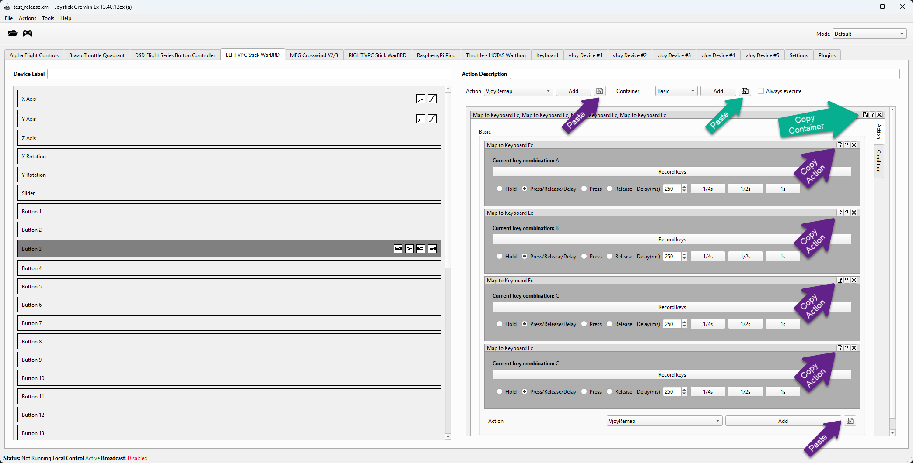

Joystick Gremlin EX
================

## Contents

<!-- TOC start (generated with https://github.com/derlin/bitdowntoc) -->

   * [Changelog](#changelog)
- [There be dragons ahead!  ](#there-be-dragons-ahead)
   * [Support](#support)
   * [History](#history)
- [Installation](#installation)
- [Automatic Input detection](#automatic-input-detection)
      + [Button detect only overrides](#button-detect-only-overrides)
- [Remote control feature](#remote-control-feature)
      + [Master machine setup](#master-machine-setup)
         - [Local mode](#local-mode)
         - [Broadcast mode](#broadcast-mode)
         - [Concurrent mode](#concurrent-mode)
      + [Client machine setup](#client-machine-setup)
   * [Master remote control functions](#master-remote-control-functions)
- [Copy/Paste operations](#copypaste-operations)
- [VJoyRemap action ](#vjoyremap-action)
   * [VJoyRemap button press actions](#vjoyremap-button-press-actions)
   * [VJoyRemap axis mapping actions](#vjoyremap-axis-mapping-actions)
- [Map to mouse EX action](#map-to-mouse-ex-action)
- [Map to keyboard EX action](#map-to-keyboard-ex-action)
      + [Dragons](#dragons)
- [Range container](#range-container)
      + [Ranges](#ranges)
      + [Include/exclude flag](#includeexclude-flag)
      + [Symmetry](#symmetry)
      + [Latching](#latching)
      + [Dragons](#dragons-1)
- [Button Container](#button-container)
      + [Usage tips](#usage-tips)
      + [Pressed block](#pressed-block)
      + [Release block](#release-block)
- [TempoEx Container (tempo with chain)](#tempoex-container-tempo-with-chain)
- [Plugin Script enhancements](#plugin-script-enhancements)
      + [@gremlin.input_devices.gremlin_start](#gremlininput_devicesgremlin_start)
      + [@gremlin.input_devices.gremlin_stop](#gremlininput_devicesgremlin_stop)
      + [@gremlin.input_devices.gremlin_mode](#gremlininput_devicesgremlin_mode)
      + [@gremlin.input_devices.gremlin_state](#gremlininput_devicesgremlin_state)
- [Recipes](#recipes)
   * [One way or two way switch to two way switch / three way switch](#one-way-or-two-way-switch-to-two-way-switch-three-way-switch)
   * [Long/short press - buttons or keyboard](#longshort-press-buttons-or-keyboard)
      + [To setup concurrent button presses (hold the short press while long press is active)](#to-setup-concurrent-button-presses-hold-the-short-press-while-long-press-is-active)
      + [To setup a latched short, then long button press with only one button active](#to-setup-a-latched-short-then-long-button-press-with-only-one-button-active)
   * [Scripting logic](#scripting-logic)
      + [Attaching a function to a hardware event](#attaching-a-function-to-a-hardware-event)
   * [Recommended Resources](#recommended-resources)
         - [VJOY virtual joystick driver ](#vjoy-virtual-joystick-driver)
         - [OSC support in Joystick Gremlin from TouchOSC](#osc-support-in-joystick-gremlin-from-touchosc)
         - [HIDHIDE](#hidhide)
         - [Hexler TouchOSC](#hexler-touchosc)
- [Troubleshooting guide ](#troubleshooting-guide)
   * [HID devices - detection / random disconnects](#hid-devices-detection-random-disconnects)
   * [HID troubleshooting tips ](#hid-troubleshooting-tips)
   * [HIDHide troubleshooting](#hidhide-troubleshooting)
   * [Checking your mappings](#checking-your-mappings)
   * [GremlinEx has been tested with ](#gremlinex-has-been-tested-with)
   * [Sample scripts](#sample-scripts)
   * [OSC (open stage control) info](#osc-open-stage-control-info)
   * [Python dependencies](#python-dependencies)

<!-- TOC end -->

<!-- TOC -->
## Changelog

13.40.14ex

- New MIDI input device - GremlinEx can listen to MIDI events
- New file menu for opening Explorer to the current profile folder
- New file menu for opening the profile XML in a text editor (it will save the profile first)

- New keystroke editor in map to keyboard ex: allows to select keys and sequence using the mouse and adds support for F13 to F24 keys.

- New mouse event drop down selector in map to mouse ex: adds a mouse event selection drop down so mouse actions can be selected by name rather than mouse input only.  

- Action container will now scroll horizontally if the action is too wide to fit based on windows size / UI scaling options.

6/6/24 - 13.40.13ex (h) **potentially breaking change**

- GremlinEx will now more gracefully handle DLL errors and check driver and DLL versions.  If the driver and DLL versions are not at minimum levels expected, an error box will be displayed and will exit the app to avoid further errors due to mismatched versions.

GremlinEx requires vJoy device driver 12.53.21.621 (VJOY release 2.1.9.1 minimum).    The distribution includes the interface DLL for 2.1.9.1, but not the software which by licensing agreement cannot be included in the GremlinEx distribution.  The latest version can be found here:  
  
The vJoy version can be found here: https://sourceforge.net/projects/vjoystick/files/Beta%202.x/2.1.9.1-160719/

The version of HIDHide can be found here: https://github.com/nefarius/HidHide/releases

There are probably more hardening that can be done to validate the environment.

When installing a new version of vJoy or HIDHide, uninstall the old versions first, and reboot between sessions to make sure files are removed and there will not be a conflict on installation.  There are documented issues when failing to reboot after uninstalling either HIDHide or vJoy.  
  
Sequence wise, install vJoy first, then HIDHide.

Updated Device Information dialog to use a table format that is user resizeable.  Right click on any cell to copy its contents to the clipboard.
  
Bug fix for device removal / addition while a profile is running.

If a device is referenced by a script or profile and cannot be found as GremlinEx is running, or if it was added/removed dynamically while GremlinEx is running, this will no longer throw an exception.  The issue will be logged as a warning to the log file and calls using that device will just be ignored.  Plugin scripts should ensure they now check the return value of any proxy call when looking for a device as the call my return null (None) if the device cannot be found.  It is generally discouraged to change hardware configurations while GremlinEx is running, or change device hardware IDs as those are stored in profiles, and will be ignored if the ID is no longer found.  
Missing IDs in profile will be logged to the log file and a message box displayed at load time.

6/2/24 - 13.40.13ex (a) **potentially breaking change**

- Changed default profile folder to *Joystick Gremlin Ex* to use a different folder from the original *Joystick Gremlin* folder to avoid conflicts.  If the new profile folder does not exist, GremlinEx will, for convenience, make copy the original profile folder  to the *Joystick Gremlin Ex* folder.  The path used is %userprofile%\Joystick Gremlin Ex

6/2/24 - 13.40.13ex

- added copy/paste for actions and containers (experimental) - actions can be copied (new button on title bar) and can be pasted via a new button wherever actions can be added).  Containers can also be copied and pasted where containers can be added.  New option to persist clipboard data between sessions.

Because the name "dill" conflicts with the Python module "dill", renamed to "dinput".

5/31/24 - added TempoEx container and resolved a macro call bug

5/27/24 - added Button container and improved handling of automatic switching

4/8/24 - added troubleshooting guide and sample scripts for advanced GremlinEx scripting via plugins

4/12/24 - bug fixes (see release notes on issues resolved)

4/18/24 - adding range container and keyboard mapper EX (wip - may break!)
Introduction

------------

For general Joystick Gremlin documentation - consult https://whitemagic.github.io/JoystickGremlin/

The EX version adds to release 13.3 of Gremlin:

- Update to x64 bit from x32 bit
- Update to Python 12.x (improved execution speed over Python 10)
- Update to QT6 UI framework
- Improved stability when loading a plugin that has an error on load
- Remote data control of another GremlinEx client on the local network (this lets you send input from one box from hardware connected to a different box on the network) with low latency (typically 20ms or so)
- OSC message handling (for touch screen support going to Gremlin via TouchOSC for example) - this lets you implement "game glass" functionality easily while working around Windows' limitation with touch screen control surfaces on the same box
- VjoyRemap plugin for enhanced button/axis Vjoy mapping  
- MapToMouseEx action plugin for enhanced mouse control  
- Range container for mapping axis ranges to actions easily
- MapToKeyboardEx action plugin for enhanced keyboard control with separate make/break and delay functionality
- Button container - provides a direct way perform actions on a raw button press or release, which is helpful for on/off and three-way buttons

I suggest you make VjoyRemap the default action in the options panel as this plugin is what provides many enhancements over the default Remap plugin.  Same for mouse output - MapToMouseEx provides enhanced options for the mouse macro functions.

This said, the default plugins are all functional but they won't be aware of the new features in GremlinEx.

<!-- TOC -->
# There be dragons ahead!  

I updated this code repository for my own purpose as I ran across my hardware cockpit needs for my PC based simulators and thought to myself - hey - would love if this did [that]!  I was quickly confined though to the base functionality and realized soon that some deeper surgery was needed.  I also wanted the code to use current platform tools as there is for example a significant boost in performance just by using a new Python environment.

As such, the code may have some bugs and other things I'm missed in my own testing, so please report issues you encounter as you find them and I'll do my best to fix them.

<!-- TOC -->
## Support

As this is on my free time, support is on a best effort basis.  To help that, please create and/or update an existing GitHub issue and do include screenshots, describe what you're trying to do, any steps to reproduce, and attach an example  profile as that will help a lot.   

 
I am using this tool daily for all my flight sims so I know the parts I'm using are working - but Gremlin's premise is to be very flexible and that will definitely lead to situations I haven't tried yet, or that the code just blows up on because it never came up.  My goal however is to get it fixed.

<!-- TOC -->
## History

The core Gremlin repository was substantially modified in some areas to support remote control, including some new events, adding improved support for user plugin  scripts (so they are aware of state information for example). Some UI elements were also modified a bit to improve the visuals and to simplify certain aspects of Gremlin. For example, all buttons support a release action without going through more complex conditions, as in my book a check box is simpler to setup in this use-case than to go through an additional three screens. This made it much simpler for me to map physical switches on throttles that have a single state to multi-state and do what used to be complex mappings essentially a checkbox affair.

I have attempted to use the base project as much as possible, and I am grateful to WhiteMagic and his excellent ideas and structure as Gremlin is simply the best mapping utility I have ever seen or used in decades of simulation and hardware input mapping to games.  The architecture is also excellent and made my modifications very simple.

I am using this code daily for my simulation needs but that's not a guarantee everything works as expected.  Feedback welcome!  

<!-- TOC -->
# Installation

The release includes a zip file that contains a packaged version of the Joystick Gremlin Ex python scripts as a convenient .EXE.   Place the contents of the zip file in a folder, recommend C:\Joystick Gremlin Ex or other suitable location.  

On first run, starting with 13.40.13x, GremlinEx will create a profile folder called Joystick Gremlin Ex in the %userprofile% folder.   If this folder does not exist, it will be created, and if the original profile folder for Joystick Gremlin is found, a copy of that profile folder will be made to keep the files separate.  GremlinEx may include additional configuration, plugins, actions and scripting commands the original Joystick Gremlin will not understand.

The profile path is *%userprofile%\Joystick Gremlin Ex*

<!-- TOC -->
# Automatic Input detection

GremlinEx can auto-highlight hardware joystick input devices by clicking a button or moving an axis on them.   This eliminates the guesswork on how the hardware maps to buttons or axes.

Automatic detection is only active when a profile is not running.

When in this mode, GremlinEx will attempt to display the correct input - I say attempt because it can get confused sometimes with multiple active concurrent inputs.

The default behavior is it waits for an axis or a button to be activated before displaying anything, so the initial load up UI may not reflect the input until it's touched again.

GremlinEx has a built in protection against multiple inputs, but will display the last detected input if multiple inputs were sent.

There are three options that control this behavior in the GremlinEx options panel:

| Option      | Description |
| ----------- | ----------- |
| Highlight currently used input (axis + button) | Will switch focus to the input device for axis or button changes - this can make it difficult to just pick a button|
| Highlight currently used buttons | Detects button changes only (axis movement is ignored but can be overriden - see below (this is recommended) | 
| Highlight swaps device tabs | Changes input tabs automatically (this is a recommended) |

<!-- TOC -->
### Button detect only overrides

A pair of modifiers can be used to modify how input is detected.  

| Option      | Description |
| ----------- | ----------- |
| Left shift | If you hold the left shift key, GremlinEx will track axes instead of just buttons regardless of the options selected .|
| Left control | If you hold the left control key, GremlinEx will only track axes  regardless of the options selected .|

Recommend that you set the default behavior is to track buttons only as it's very easy to trigger an axis by pressing a button because many hardware devices are very sensitive. Use the  left shift or control key to modify that behavior on the fly.

Note that whatever is first detected will go to that item (axis or button) if nothing is selected.  This is on purpose to pick a starting point.

Holding the left-shift key down when in button detect mode temporarily enables axis detection as well as button detection.  This is the same as the first option in the table above.

Holding the left-shift key and the left-control key when in button detect mode temporarily enables exclusive axis detection and ignores button presses.  This is helpful when you have a hardware axis that also has detents along the way that send button inputs.  In this mode, these buttons will be ignored. 

<!-- TOC -->
# Remote control feature

GremlinEx adds a feature to link multiple GremlinEx instances running on separate computers.  This is helpful to share a single set of controls and a single profile on a master machine to one or more client machines on the local network.

The use-case for this need came up in a couple of scenarios in my own setup:  I wanted to be able to share my hardware panels and input controllers with another machine without having to duplicate them.

Events sent over the network include all GremlinEX output functions:
- VJOY joystick axis events (when an axis is moved)
- VJOY joystick button events
- keyboard output events (press/release keys including extended keys)
- mouse output events (pres/release mice button 1 to 5, mouse wheel events, and mouse motion events)
- Gremlin macro outputs

By output events, we mean that inputs into GremlinEx are not broadcast to clients, only events that GremlinEx outputs are synchronized with clients.  

To use the remote control features, it is intended you use the new plugins VjoyRemap and MapToMouseEx

<!-- TOC -->
### Master machine setup

The master machine is the machine responsible for broadcasting control events to clients on the local network.  Thus it will typically be the primary system with all the physical hardware managed by GremlinEx.

The broadcast machine or master system will have the broadcast option enabled and an available UDP port setup (default 6012).  When the broadcast feature is enabled, GremlinEx will broadcast all output events.

Important: to broadcast, the option must be enabled in the checkbox, and the GremlinEx profile must also have enabled the broadcast functionality on.  This is needed because when GremlinEx first starts, it defauts to local control only.

Profile commands can be mapped via the VjoyRemap plugin to control whether GemlinEx sends outputs to the local (internal) or clients, or both concurrently.

While more than one master machine can broadcast, it's recommended to only have one.  Multiple machines will allow more than one machine to send broadcast commands to clients for unique setup needs.

The enable speech checkbox can be selected for GremlinEx to send a verbal mode change event whenever local/remote mode control is changed in case the GremlinEx window is not visible.

GremlinEx shows what output mode is active in the status bar.

GremlinEx options setup for a broadcast machine:

<!-- TOC -->
#### Local mode

In this mode, GremlinEx sends VJOY, keyboard and mouse events to the local machine.

The status bar displays

<!-- TOC -->
#### Broadcast mode

In this mode, GremlinEx sends VJOY, keyboard and mouse events to clients on the network.    The clients must have the remote control checkbox enabled, match the port number, and have a profile running (empty profile is fine) to respond to the broadcast events.

The status bar displays

<!-- TOC -->
#### Concurrent mode

GremlinEx can send to the local and remote clients at the same time (concurrent mode) by sending the Concurrent command. 

<!-- TOC -->
### Client machine setup

Each GremlinEx client needs to have the remote control option enabled in options to be able to receive events from the master machine.   The master machine must also be setup to broadcast these events.

The client must be in run mode to accept broadcast events, and the profile can be empty.  No profile needs to be loaded on the client when the client is in remote control mode.

Clients will only output to VJOY outputs that match the master.  So if the client has the same setup for VJOY (number of VJOY devices, button counts and hat counts) as the master machine, all VJOY events will be synchronized with the master machine.   This is the recommended setup.   

Clients will ignore events for devices that do not exist on the client (such as an invalid VJOY device number, or an invalid button for that defined device).

GremlinEx options setup for a client:

The enable remote control checkbox is checked, and the port (default 6012) must match the broadcast machine's port.

<!-- TOC -->
## Master remote control functions

Local and broadcast (sending output to remote GremlinEx instances on network machines) control can be enabled or disabled via GremlinEx commands bound to a joystick button (or in script).

Commands are available in the VjoyRemap plugin when bound to a joystick button and available from the drop down of actions for that button.

<!-- TOC -->
# Copy/Paste operations

Starting with GremlinEx 13.40.13ex, copy/paste operations are supported on actions and containers.

To copy an action or container, click the copy button in the title bar.

To paste and action or container, click on the paste button next to the add action or add container.

Pasting is not possible if the container or action is not permitted for the type of input being mapped.

You can persist a copy operation between GremlinEx sessions by checking the option in the options dialog.  This will save the data to the profile folder, and it will be available at the next session.

If the persist option is not checked, GremlinEx will use whatever data is in the Windows clipboard from the last copy operation in GremlinEx.

# Devices

## HID devices

GremlinEx will show all detected game controllers in tabs located at the top of the UI.  These are the raw input devices, either buttons, hats or axes.

## Keyboard device

GremlinEx has a special Keyboard device that allows you to map keyboard combinations.  This functionality is provided for combination keys noting that Gremlin will not stop detected keyboard inputs by the target application.  Rather, it will add functionality to them if the keyboard combination is not used in the target application.

GremlinEx allows you to map function keys F13 to F24 and any QWERTY keyboard layouts (no support for other layouts as of yet).  Localization is on the to-do list.

Unlike hardware devices, keyboard inputs can be added, removed and edited.  If an input is removed, it will remove any associated mappings and display a warning box to this effect.

## MIDI device

This is a feature I wanted for a long time. GremlinEx, as of 13.40.14ex, can map MIDI messages and use those to trigger actions.

Unlike hardware devices, MIDI inputs must be defined and added to tell GremlinEx what to listen to.  Because MIDI can be cryptic, the configuration dialog allows you to listen to MIDI data and automatically program what it "hears" as an input.  Inputs can also be manually setup if needed.

Gremlin categorizes MIDI messages in that it doesn't look at the value data in the MIDI input stream - rather it looks at the port, the channel, the command, and any specific command data, such as the note number or the controller number.

Gremlin will thus, on purpose, not distinguish between two notes if the velocity is the only thing that changes.  Rather, the MIDI value is passed along to the actions as the value parameter, which enables mapping to joystick values easily (see the trigger mode section below)

### MIDI inputs

All MIDI inputs are supported including SysEx messages.  The general process is to add a new input to GremlinEx in the MIDI device tab which will appear on the left.  The input can be configured by click on the cog wheel.

Inputs can be deleted via the trashcan icon, or all inputs cleared via the clear all button.  Use with causion as if you get past the confirmation box, there is no undo and all the container data will be gone unless you previously copied it to the clipboard.  Confirmation boxes only show up if you have a container defined for an input.

### MIDI trigger modes

The input has three trigger modes for each MIDI input that alter how the MIDI data is processed by GremlinEx.

#### Change

In the change mode, anytime the MIDI data is changed for this command, such as velocity, pressure, or control value, the input will trigger.

#### Button

In the button mode, GremlinEx will monitor the MIDI data value for that command if it has one, and will trigger a "pressed event" if the value is in the top half of the range.  This is equivalent to pressing the button.  A "released event" will trigger if the value is the lower half of the range.  The range is typically 0 to 127 for most commands, except for the Pitch wheel which is 0 to 16383.

#### Axis

In the axis trigger mode, GremlinEx will treat the MIDI input as an axis, and will tell actions that the input is an axis. This will let you map an output axis to that input and function like any other input mapped to an axis.  All actions available to an axis mapping become available.   GremlinEx will take the range of values possible for that MIDI commmand, typically 0 to 127, and map that to a -1.0 to +1.0 range, meaning that 63 is the centered position.

The axis mode is typically used to map MIDI faders and rotary knobs to a VJOY axis.

To map an axis via Gremlin using a MIDI input, the VjoyRemap action must be used as the regular remap action is not aware of MIDI, and cannot be changed to avoid breaking old profiles.

### Changing modes

If an input already has mapping containers attached, GremlinEx will prevent switching from an axis mode to a button/change mode and vice versa.  This is because containers and actions, when added to an input, are tailored to the type of input it is, and it's not possible to change it after the fact to avoid mapping problems and odd behaviors.

### MIDI conflicts

MIDI input conflicts are possible and stem from the ability to map MIDI messages via different inputs that map to the same or similar message.   GremlinEx will scan existing mappings to avoid this as much as possible, however it is not foolproof as there are ways to configure MIDI messages in such a way conflicts may not be detected.

### MIDI ports

GremlinEx listens to all MIDI ports concurrently so multiple MIDI ports can be used at the same time.  GremlinEx will scan for available ports.

If a port goes away after you've configured an input on that port, that port becomes invalid and will not be used for output.  GremlinEx will not delete that input however, but GremlinEx will display a warning on each invalid input.

### Network MIDI

While outside of the scope of this document and GremlinEx, you can easily network MIDI events using [rtpMidi](https://www.tobias-erichsen.de/software/rtpmidi.html).  Another utility that is useful is [loopMidi](https://www.tobias-erichsen.de/software/loopmidi.html). These utilities let you map MIDI input from a device attached to another computer via the network and send that data to the GremlinEx machine.   We won't go into details on how to set that up, but the idea is that a MIDI device sends output to a port, and rtpMidi allows that port data to be transferred to the GremlinEx machine.  GremlinEx will be able to use that input to trigger events.

**important**  GremlinEx will not listen to MIDI data via the remote control feature.  The remote control feature is only for output mapping, not for input.  Use the utilities above to network MIDI traffic which is outside the scope of GremlinEx.

### Using MIDI from touch surfaces

The MIDI input feature in GremlinEx is designed to work hand in hand with "glass" input surfaces like Hexler's TouchOSC or OSCPilot, or any software based control surface that sends MIDI data.

In TouchOSC's case, if you use the button mode in Gremlin to map a particular command, GremlinEx will press the button while the "glass" button is pressed, and automatically release it when the "glass" button is released.

Similarly, "glass" faders and rotary controls can be mapped using GremlinEx's MIDI axis mode.  Other modes can of course be used if the idea is to trigger an action if a specific range of values are reached.

### MIDI controllers

GremlinEx will see any MIDI message so long as the controller shows up as a MIDI port on the machine running GremlinEx (which can be a networked virtual port via rtpMidi).  GremlinEx was tested with hardware from MidiPlus, Arturia, and software controllers like Hexler TouchOSC.  It will also work with any software that outputs MIDI data.

### MIDI troubleshooting

The majority of issues will come from messages not being recognized by GremlinEx because the input configuration is causing it to filter (skip) that message.  To this end, Gremlin will tell you what it's listening to.

There are some tools that let you visualize what MIDI messages the computer is receiving such as [MidiOx](http://www.midiox.com/), and older but tried and true MIDI diagnostics tool, or something like [Hexler Protokol](https://hexler.net/protokol).  Both utilities are free.  It's always a good idea to verify the MIDI signaling is functional outside of GremlinEx to verify the machine is seeing messages.  If GremlinEx cannot "listen" to a message via the listen buttons, it cannot see it.

<!-- TOC -->
# VJoyRemap action 

This mapper is an enhancement to the default remap action. The main enhancements are to show a visual representation of all buttons used, support remote control, eliminate the need to setup many conditions, and to support one-click typical mapping needs directly from the UI.

The VjoyRemap commands are:

| Command      | Description |
| ----------- | ----------- |
| Set Remote Control Only      | Enables broadcast mode and disables local output mode.  In this mode, GremlinEx only sends output to network clients.       |
| Set Local Control Only  | Enables local mode and disables broadcast mode.  In this mode, GremlinEx only sends output to the local machine.         |
| Enable Remote Control      | Enables broadcast mode. This activates broadcast mode regardless of the local output setting. |
| Disable Remote Control      | Disables broadcast mode. This disables broadcast mode regardless of the local output setting. |
| Enable Local Control      | Enables local mode. This activates local output mode regardless of the broadcast output setting. |
| Disable Local Control      | Disables local mode. This disables local output mode regardless of the broadcast output setting. |
| Enable Concurrent Local + Remote Control      | Enables both local and broadcast modes. GremlinEx output goes to both local and remote machines at the same time. |
| Toggle Control      | Inverts current output settings for both local and broadcast controls, whatever they are. |

The commands are only available to button bindings at this time.

<!-- TOC -->
## VJoyRemap button press actions

| Command      | Description |
| ----------- | ----------- |
| Button Press     | Outputs a single button to the given VJOY device.  The exec on release option sends the output when the physical button is released.  Start mode sets the output status on profile start.   |
| Button Release | Releases a single button on the given VJOY device.  This is the opposite of press.  This is usually not required but is helpful in some scenarios such as using the tempo container or toggle behaviors.  |
| Pulse     | Outputs a single button to the given VJOY device momentarily.  The default pulse duration is 250 milliseconds, which can be adjusted.  The exec on release option sends the output when the physical button is released.  Start mode sets the output status on profile start.   |
| Toggle     | Toggles (flips) the button output on the given VJOY device. If it was on, it's off, if it was off, it toggles on.  Useful for on/off type activites.    |
| Invert Axis     |  Inverts the specified output axis on the VJOY device.  This flips the direction of output of the axis on the fly by mapping it to a button.  This is specific to games that map the same axis but they are inverted (example in Star Citizen is ship throttle vs vehicle throttle).  When mapped to a physical switch on the throttle, converts from ship mode to vehicle mode for the throttle.  |
| Set Axis Value     | Sets the axis value on the given VJOY axis to a specific value between -1 (min) and +1 (max).  This is useful for detent programming.  |
| Set Axis Range     | Modifies the output range of an axis in VJOY.  The output will be calibrated to the new min/max and has convenience buttons to set half ranges. Use-case: increase sensitivity of physical axis, such as, for landing or roll. |
| Enable remote pairing | When set, the button output locally will also be output remotely regardless of the control mode |
| Disable remote pairing | Turns off remote pairing mode

<!-- TOC -->
## VJoyRemap axis mapping actions

| Command      | Description | |
| ----------- | ----------- | ----------- |
| Axis     | Maps source axis to a VJOY output axis. Options:    | |
| | Reverse | Inverts the output of the axis |
| | Absolute | The value of the output matches the raw input value  |
| | Relative | The value of the output is relative to the raw input value  |
| | Start Value | The default axis position on profile start |
| | Scale | Scaling factor applied to the raw input.  Use case: increase sensitivity. |
| | Min/Max Range | Sets the default output min/max range.  The raw input is calibrated to only output between the two values (scale is computed automatically) |

&nbsp;

| Command      | Description |
| ----------- | ----------- |
| Axis To Button     | Maps a raw input range to a specific button.  While the raw input is in that range, the button will be output.  Combine multiples of those to create more than one trigger.  Use-case: detent programming based on axis position.  | |

<!-- TOC -->
# Map to mouse EX action

This plugin is identical to the Map to Mouse plugin but adds a wiggle function, easy execute on release and button hold functionality. When wiggle is enabled, the mouse will move slightly by itself every 10 to 40 seconds and move back.  It will do that until wiggle mode is turned off.  
  
The purpose of wiggle is to keep an application alive.   Wiggle is turned on/off separately for remote/local clients.

| Command      | Description |
| ----------- | ----------- |
| Mouse Button | Outputs one of the mouse buttons |
| Mouse Axis | Moves the mouse |
| Wiggle Enable (local) | Jolts the mouse every few seconds  |
| Wiggle Disable (local) | Stops the mouse wiggling if it was turned on.  |
| Wiggle Enable (remote) | Jolts the mouse every few seconds on remote clients  |
| Wiggle Disable (remote) | Stops the mouse wiggling if it was turned on for remote clients  |

Mouse commands can forced to be sent to remote hosts only, or to send them concurrently to the remote host regardless of the remote control state.

<!-- TOC -->
# Map to keyboard EX action

This is identical to the base keyboard mapper but adds a few functions I thought would be handy.

The updated keyboard mapper adds separate press (make), release (break) functionality so keys can stay pressed, or just released separately.

It also adds a delay (pulse) function to hold a key down for a preset period of time (default is 250 milliseconds or 1/4 of a second which is the typical game "detect" range as some games cannot detect key presses under 250ms in my experience.

The make/break/pulse behavior applies to all keys in the action, and the keys are released in the reverse order they were pressed.

<!-- TOC -->
### Dragons

This action is an experimental feature.

Make sure that if you use a press action, there is a companion release action somewhere.  If that doesn't happen, you can press the key on your keyboard and it will release the key.

When a key is pulsed, the release will occur regardless of input state or conditions.

<!-- TOC -->
# Range container

The range container is a container designed to break up an axis input ranges into  one or more actions tied to a particular range.  While something like this can be done with conditions, the range container is much easier to setup than using conditions. 

The idea of a range container is to setup a range of axis values that will trigger one or more actions.   As many actions as needed can be added.  An example of this is mapping a flaps axis to distinct keys, or setting up button presses based on the value of an input axis, which is helpful for example, for throttle setups on some flight simulators to setup detents.

The range container has a minimum and a maximum and each boundary and be included or excluded to define the range.

There is a convenience button that will create automatic ranges to an axis: you specify how many axis "brackets" you need, and you can give it a default action.  This will create range containers for the axis automatically and compute the correct bracket values for the count provided.

The Add button adds containers.  The add and replace button replaces all the range containers with the new range value (use with care as it will blitz any prior range containers).

The range container is designed to work with joystick buttons or the enhanced keyboard mapper (map to keyboard ex)

<!-- TOC -->
### Ranges

All joystick axis values in JGex are -1.0 to +1.0 regardless of the device, with 0.0 being the center position.

<!-- TOC -->
### Include/exclude flag

Each bracket can include or exclude the value.  Think of it as greater than, versus greater or equal to.   This is use to include or exclude the boundary value when JGex is determining if the action should trigger or not.

<!-- TOC -->
### Symmetry

The symmetry option applies the opposite bracket as the trigger.  So if the bracket is (0.9 to 1.0), in symmetry mode the bracket (-1, -0.9) will also trigger if the axis is in that range.

<!-- TOC -->
### Latching

The range container is latched - meaning that this special container is aware of other range containers in the execution graph.  The latching is automatic and ensures that when the axis is moved to a different position, prior active ranges reset so can re-trigger when the axis moves into their range again, so the container has to be aware of other ranges.

<!-- TOC -->
### Dragons

This container is an experimental feature.

The range mapper is not designed to work with the default keyboard mapper as that will cause stuck keys, because of how the default keyboard mapper works when conditions are not used.  Use the enhanced keyboard mapper.

The latching feature (awareness of other range containers) may introduce some strange behaviors and applies to all ranges attached to a single axis, so it's not aware of nesting for example.  The latching applies to all ranges in the mapping tree regardless of their level.

<!-- TOC -->
# Button Container

This experimental container simplifies the mapping of actions when an input button is pressed or released.  While this can be done with conditions, this is a simpler and easier way to map a button to a set of actions when a button is pressed or released.

<!-- TOC -->
### Usage tips

This container is best used to handle an on/off function (the input only triggers when in one of two possible positions), or a three way function (the input triggers in two out of three positions - the middle position usually being the one that doesn't trigger)

<!-- TOC -->
### Pressed block

In this section, add the container or actions you want to execute on button press.  Leave blank for no action.

<!-- TOC -->
### Release block

In this section, add the container of actions you want to execute on button release.  Leave blank for no action.

<!-- TOC -->
# TempoEx Container (tempo with chain)

This experimental container combines the Tempo and Chain containers together.  The container has two main sections, a short press action set, and a long press action set.  The delay box indicates how long the (real) button has to be held before selecting either a short or long set.

Each action set contains one or more chain groups.

Each chain group contains one or more actions.  A group will execute all the actions in that group.

Chaining means that at every short press, or long press, the container will sequence through the chain groups for that action set in round robin fashion.

The chaining behavior can be prevented if needed (although that's really the point of the container).

The chain delay is included although it will conflict with long press.  I may remove it later because the value may be limited in most use-cases that would benefit from this container.

Within each action set, the chain group entries can be re-ordered, or can be removed.

<!-- TOC -->
# Plugin Script enhancements
 

GremlinEx adds a few custom Gremlin script decorators to facilitate custom scripting and control from Python.

<!-- TOC -->
### @gremlin.input_devices.gremlin_start

Called when a profile is started - lets a script to initialization when a profile starts to run

<!-- TOC -->
### @gremlin.input_devices.gremlin_stop

Called when a profile is stopped - lets a script cleanup when the profile stops running

<!-- TOC -->
### @gremlin.input_devices.gremlin_mode

Called when the mode is changed (use def mode_change(mode) - mode will be a string) - lets a script get a notification when there is a profile mode change somewhere in GremlinEx.

<!-- TOC -->
### @gremlin.input_devices.gremlin_state

Called when the state information is changed (local, remote or broadcast mode). The event properties is_local, is_remote and is_broadcast are flags that contain the current state of GremlinEx.

<!-- TOC -->
# Recipes

<!-- TOC -->
## One way or two way switch to two way switch / three way switch

Some hardware controllers only have a trigger on one (two) positions out of two (three).  Usually the center doesn't have a button mapped.  

In GremlinEx VjoyRemap a button trigger can easily be output for each position of a switch by adding a release mapping to the hardware positions that do trigger on.  The trigger occurs then when the switch leaves the position and turns off.

One responds to button presses on the raw hardware, the other responds to a button release on the raw hardware.

| Mapping     | Description |
| ----------- | ----------- |
| Send VJOY output   | Sends a button press to VJOY device and button when the position of the button is active.      |
| Send VJOY output (on release)   | Sends a button press to VJOY device and button when the position of the button is no longer active.  The checkbox "execute on release" is selected in this case.  |

The equivalent pulse commands can be send to send a momentary pulse rather than having the button on all the time if that is needed.

<!-- TOC -->
## Long/short press - buttons or keyboard

You'll use the tempo container sets up two action blocks, one for short press, the other for long press.  The tempo container lets you select a long press delay, so if the input is held long enough, the long action is triggered.

The relevant behaviors of the Vjoyremap action are Button Press, Button Release and Toggle.

Note: this applies to keyboard actions as well, and you can just as easily use this for keyboard presses using the enhanced keyboard action's ability to separate out key presses from key releases.

<!-- TOC -->
### To setup concurrent button presses (hold the short press while long press is active)

In this scenario, both outputs will be active if the input button is held long enough to trigger the long press.

The vjoyremap action in the short action block should be set to *button press*.  The vjoyremap action in the long action block should also be set to *button press*.  The resulting behavior is the short and long buttons will both be pressed if the input button is held long enough, and both will release when the input is released.

| Mapping     | Description |
| ----------- | ----------- |
| Short action block   | VjoyRemap set to *button press* and/or MaptoKeyboardEx set to "press" for the output on short hold      |
| Long action block   | VjoyRemap set to *button press* and/or MaptoKeyboardEx set to "press" for the output on long hold |

<!-- TOC -->
### To setup a latched short, then long button press with only one button active

In this scenario, either short or long will be active if the input button is held long enough to trigger the long action.  If you hold the input long enough, the short button will release, and the long button will stay pressed as long as you hold the input.  Only one button will be output at a time.

Add a vjoyremap in the short action block set to *button press*.

Add two vjoyremaps in the long action block.  The first will map to the long press output button and the mode is set to *button press*.

The second vjoyremap will be set to *button release* and map to the same output button in the short action block. 

| Mapping     | Description |
| ----------- | ----------- |
| Short action block   | VjoyRemap set to *button press* and/or MaptoKeyboardEx set to "press" for the output on short hold      |
| Long action block   | VjoyRemap #1 set to *button press* and/or MaptoKeyboardEx set to "press" for the output on long hold |
| Long action block   | VjoyRemap #2 set to *button release* and/or MaptoKeyboardEx set to *release* to release the short press action |

<!-- TOC -->
## Scripting logic

Any logic that depends on reading more than one hardware value is best done as a plugin.  Plugins are Python files "attached" to a GremlinEx profile and the script enhancements make it possible to run a function when a hardware event occurs.

<!-- TOC -->
### Attaching a function to a hardware event

You use a Python decorator to map a function to a hardware event.  The decorator starts with the @ sign and tells GremlinEx what hardware and input you are mapping to.

GremlinEx adds a Script Generator button to the Device Information dialog that copies all current hardware device names, IDs and automatically creates decorators out of them that can be pasted directly into a Python script file.

<!-- TOC -->
## Recommended Resources

<!-- TOC -->
#### VJOY virtual joystick driver 
 
https://github.com/shauleiz/vJoy

Installs one or more virtual programmable HID joysticks on Windows with up to 8 axes, 4 hats and 128 buttons per the DirectInput specification.

<!-- TOC -->
#### OSC support in Joystick Gremlin from TouchOSC

https://github.com/muchimi/TouchOsc

Transforms any touch screen into a game control surface, similar to GameGlass.

<!-- TOC -->
#### HIDHIDE

This tool hides raw hardware only exposing the VJOY devices.  Essential to not confuse games or simulators.

https://github.com/nefarius/HidHide

<!-- TOC -->
#### Hexler TouchOSC

A touch enabled surface designer initially setup for the OSC (open sound control) and MIDI protocols to control musical instruments, DAWs and live performances.  Supports multiple platforms.  Has a free version but the license is well worth the price.  Simple set of controls, but very powerful because of the available LUA based scripting and works on any platform, thus making your phone, tablet or touch-enabled desktop function as an input device.

https://hexler.net/touchosc#_

I also recommend the Protokol tool to diagnose any OSC issues.

<!-- TOC -->
# Troubleshooting guide 

<!-- TOC -->
## HID devices - detection / random disconnects

Random disconnections of HID devices or not detecting devices are typically caused by these root causes in my experience, these are unrelated to GremlinEx:

	(1) total cable is too long or faulty - test a different cable - use a cable 1.5m/ 5' max and match the cable to the device type (blue connectors for USB 3.0, white connectors for USB 2.0).  You can connect a 2.0 device to a 3.0 hub using a 2.0 cable.  Don't use a 2.0 rated cable for a 3.0 controller.
	(2) cable/connection (at either end) - this is usually a connector not plugged in completely, or the connection is worn out or bent.
	(3) insufficient power provided to the USB device - this is frequent especially if using older USB Hubs - use a good quality powered USB hub if you have more than one device, and some cheaper hubs are unable to provide full spec power (5 volt at 0.5A to 0.9A) - half an amp for USB 2.0 devices, 0.9A for USB 3.0 devices, per port.  Do not use un-powered hubs.
	(4) Windows is configured by default to turn off power to USB devices after some time - and it doesn't always detect when a controller is in use. Disable USB power management in Windows (this is usually done via device manager but there are articles online how to do this). NOTE: major Microsoft patches can re-install drivers and reset to default - so you may have to check power settings after some patches.
	(5) machine was not cold started after a USB device was connected/disconnected. The theory is - yes - you can hot-connect or disconnect USB devices - and it "should" work. If you run into an issue - the first thing to do is to reboot the machine after you've made the modification, and to be extra sure on my end, I cold start to make sure all is re-initialized, including the BIOS and the hardware so the next bootup sequence is going to be predictable. I have some older devices (CH was notorious for this) causing all sorts of headaches because the "logic" was not in the hardware but in some software drivers they had. A telltale sign is if your controller comes with driver software to make it work. Rebooting may be an extra step but it can save a lot of headaches. I found the most problem-free joystick/wheel/pedal controllers are those that are detected as generic HID devices without the need to run any software that came with the device and they are visible to windows (when HIDHide is not enabled) to the control panel app joy.cpl
	(6) if using a wireless USB device - make sure the batteries are ok. I don't recommend using wireless devices for anything but a mouse or a headset - neither is going to be used by GremlinEx. Wireless is convenient but can also be a source of headaches for game controllers.
	
	
<!-- TOC -->
## HID troubleshooting tips 

Your HID devices should function without GremlinEx installed and be stable using whatever tools came with them to diagnose/test them. Just make sure that HIDHide is not hiding the devices from these utilities when testing. If the HID devices are not stable in Windows - they won't be in GremlinEx either.

If your HID device starts acting up - use a process of elimination and change one thing at a time until you find the root cause. If you change multiple things, like connection, hub, number of devices, multiple changes will make it more difficut to diagnose the issue.

Some tests you can attempt to see if it makes a difference (and yes, it can be tedious to do but necessary in some cases):

- disconnect other devices so you only have one to test. Add devices progressively to make sure there is no conflict between devices.

- change the wire in case the wire / connections are the issue.

- change the port the hub or device is connected to

- connect direct to the computer or a different hub

- make sure your hub is able to deliver the spec power to each port (some come with power supplies that cannot do this)

- Use a USB 2.0 hub for controllers that are USB 2.0 as I've run into some problems sometimes with USB 3.0 hubs (the older models in particular) - I think there was a chipset issue with a whole series of those that caused translation issues - hence why try a different hub to see if it works - the older the controller the more important that is (like CH products and some older Logitech / Microsoft devices).

- If the device came with firmware (example Virpil. Thrustmaster, VKB, MTG...) - make sure you're running the current firmware.

- With HIDHide disabled (not hiding devices), run a command line (windows key + R), type joy.cpl and make sure your controller is seen by Windows. Don't calibrate - in the test button, your controller axes and buttons should move and respond. This app makes sure that Windows sees the devices correctly - this must happen before GremlinEx can see them.

- If you connect/disconnect controllers like joysticks, wheels, pedals - anything with an axis or button that isn't a keyboard type device - windows will invariably re-order these things. A reboot will usually get you the final order of things, but the order can change whenever you add or remove one of these devices. In general, if you have to constantly connect/disconnect devices, look into using profiles and ways for you not constantly to have to connect/disconnect devices. Doing this can wear out the connectors. Also, it's really asking for trouble because you are effectively making a hardware change every time you do this. Should it work? Absolutely. The question is more about how much you value your sanity and like doing troubleshooting. Avoid disconnecting/reconnecting things if you can, and I get it's not always possible. My experience with HID controllers, especially if you have a lot of them, is set it up once, and then it will work all the time.

<!-- TOC -->
## HIDHide troubleshooting

HIDHide is a key layer that hides the raw hardware that you are mapping to a game to VJOY via GremlinEx.

HIDHide prevents conflicts in games when the raw hardware is visible to the game, at the same time the virtual (vjoy) hardware is. This can cause many different problems - from the game not detecting the right input - to things not being detected at all to very strange behaviors.

HIDHide is very stable in my experience but you need to run it and verify the configuration ***every time you connect or disconnect hardware*** (which is one reason to please figure out a way to not constantly connect/disconnect).

How can you tell HIDHide is working or not? Use joy.cpl - the windows control panel joystick app from 25 years ago, and it should only "see" the devices you can the game to see. If you see all your raw hardware - HIDHide isn't doing its job.

What does it look like when HIDHIde is set up correctly? vjoy.cpl only shows your VJOY devices, all your actual "raw" controllers will not work there.

<!-- TOC -->
## Checking your mappings

Vjoy comes with an excellent Vjoymonitor utility that will display what outputs you have. Test your scripts and Vjoy output before you jump in the game to make sure that all looks good there.  

That will show all your vjoy devices and let you verify the mapping is as expected. I use it constantly to check inversion and button pulse vs hold mappings. If vjoymonitor doesn't show what you expect, it will definitely not work correctly in the game either.

Note: this will not show if the raw hardware is properly hidden.  For this, use joy.cpl as indicated above as that shows what Windows sees (thus what your game will see).

In nearly all cases - what I found usually happens:
- HIDHide isn't hiding the raw devices (run it and check its configuration)
- GremlinEx isn't running the profile
- there's some sort of hardware issue and confusion linked to disconnect/reconnect
- you're using a controller that isn't a DirectInput HID game controller as classified by windows - so a device with axis/button definitions  - this happens a lot with gamepads although most can be setup as a regular (non gamepad) controller.

<!-- TOC -->
## GremlinEx has been tested with 
- Virpil
- Thrustmaster
- MTG
- Logitech
- Honeycomb
- Microsoft
- Arduino (with HID library)
- RasberryPi (with HID library)
- TouchOSC
- StreamDeck (via vjoy plugin and OSC plugin)
- AxisAndOhs

<!-- TOC -->
## Sample scripts

I'm including some of my Python scripts for GremlinEx as reference because these are my primary way to do advanced mapping when the UI elements are limited, including one that handles OSC inputs.  The comments are in the files.

These are provided as-is as an example of advanced scripting you can do in GremlinEx.  I personally find scripting significantly faster than attempting to do this via the UI for complex mappings, especially when I start getting into release behaviors or latched behaviors for complex simulation software.

The example scripts do things like combining axes together, latching (so one button or axis value on one controller impacts the behavior of another), scaling an axis, curving an axis, text to speech, sending keyboard and mouse output from a script, how to access the raw value from a device, do some basic math and state mapping outside of profile modes, handling OSC (Open Sound Control) messages, etc...  

The scripts use specific enhancements to Gremlin so have additional decorators to expose internal events in Gremlin such as profile start/stop so the script can initialize or cleanup.

These won't run as they are in your system because your devices and hardware IDs will be different from mine, but that's all setup in the config.py file.   You can get your hardware IDs by running GremlinEx and viewing the device list which will have the information you need to plugin config.py for your particular config.

This is a very advanced topic, talking about dragons, and assumes you have a good understanding of Python and how GremlinEx works.  The examples are well commented so hopefully self-explanatory.

Scripts are attached to a profile using the scripting tab in GremlinEx.  You do not need to reference config or util - only the main script (dependencies will load).  Make sure all the files are in the same folder as your profile XML files.

Note: because of how Python works, if you change dependencies like config.py or util.py, you have to close down GremlinEx and reload it.  You can change the script .py and start the profile without having to exit as long as the script dependencies don't change.

The sample scripts includes one for Star Citizen, Microsoft Flight Simulator and OSC.

<!-- TOC -->
## OSC (open stage control) info

OSC is a topic by itself, and if you're wondering what this has to do with gaming and controllers, OSC is heavily used in the music industry to drive touch surfaces like a tablet, phone or a touchscreen (connected to a different box from your main gaming machine), and send commands to music software (usually a DAW or VST) or live on-stage equipment including things like stage lights.  

I'm using the same concept to take OSC messages in GremlinEx, which are nothing more but text (string) messages and values, and duplicate functionality found in tools like GameGlass or some other game specific controls using OSC software to send input to games.  OSC is very powerful and customizable, and because OSC knows about faders and buttons and touch surfaces, it becomes easy to map to an axis, buttons, and do sophisticated things like 2D touch surface for shield mapping for example.  Very powerful indeed.

If you use the OSC plugins for StreamDeck or LoupeDeck, it enables these more esoteric devices to be used by GremlinEx, and the networking function means that these devices can be used anywhere on your local network so they don't need to be attached to your local gaming computer.

<!-- TOC -->
## Python dependencies

If you want to run from the source code, you will need the following python packages for the 64 bit version of python your are running (3.11+)

	pyside6
	pywin32
	msgpack
	reportlab
	dill

