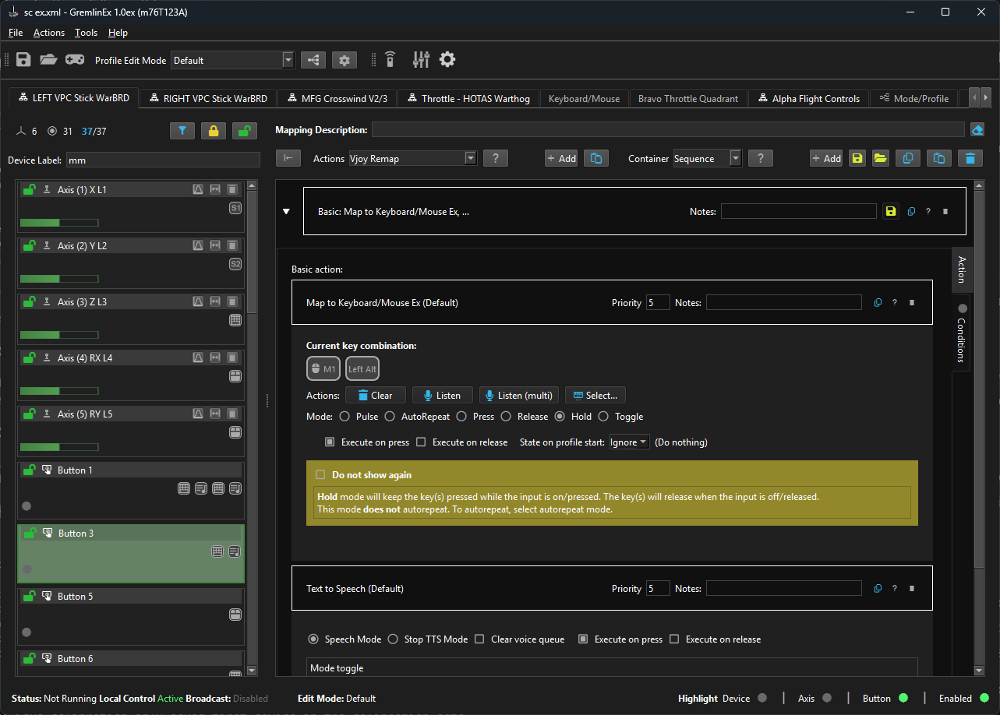
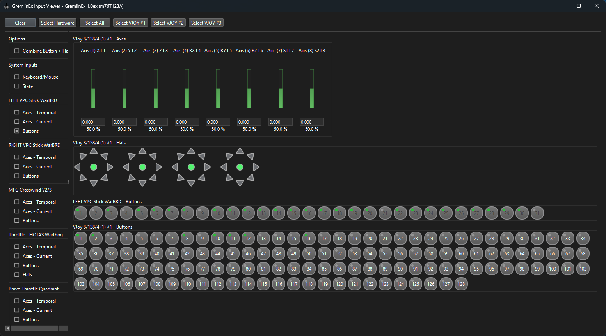

# GremlinEx


GremlinEx (GEX) is a universal controller integrator: it allows you to take input from multiple hardware devices from different manufacturers connected to a local machine, or a remote machine, such as joysticks and HID controllers, OSC (Open Sound Control), MIDI, Keyboard and mouse inputs and map them to virtual outputs like VJOY, or keyboard or mouse output, convert text to speech and play sounds.  It can send output to a game or another process.

With OSC support, GremlinEx can receive input from custom designed glass (touch screen) surfaces, and supports two way communication to any device supported by BitFocus Companion such as the Elgato Streamdeck.  This communication is two-way so GremlinEx can also send data to a glass surface or an external hardware panel.

GremlinEx can be expanded using custom plugins written in Python.  





# Documentation

The documentation for GremlinEx has recently moved to GitHub Pages:  [Documentation](https://muchimi.github.io/JoystickGremlinEx)

# Discord

Please visit the [Discord](https://discord.gg/pNadcReth9) server for discussion, tips and development information.

# Test versions

The most current test releases will contain the latest bug fixes, features and optimizations.  Not all test releases are stable which is why they are not in the release channel, and many are.  Please make a backup of your profiles and enable the versioning option to keep files separate by version just in case, but there is about a year's worth of key updates since the last official release all in the test channel including several stable versions.  

The test versions are available here: https://github.com/muchimi/JoystickGremlinEx/releases/tag/test


# Change log


### (m76T135B)
- Fix: UI: identified an issue on profile reload that would not clear prior UI update event queues.
- Fix: Calibration: calibration icon on calibration reset not updating.
- Fix: Calibration: added a message box to remind to save on calibration data reset.  Save is not automatic because there are two possible places to save the data to.

### (m76T135A)
- Internal build


### (m76T135)
- Fix: Keyboard Device: key identifier mismatch preventing keyboard/mouse input triggers.
- Fix: Events: some keyboard and mouse event set to incorrect override type preventing some actions from triggering, such as map to state.
- Fix: Events: mouse button events could trigger twice.
- Fix: UI: message box refactor (message boxes were changed recently to avoid a QT crash).  This would cause some return values to be ignored.
- UI: Virtual keyboard mouse button tooltips are now more descriptive.

### (m76T134A)
- Fix: ensure callback unhook repeater on profile reload even if QT object has already been garbage collected (this may have been responsible for lag on new profile load for axis repeaters after a profile had previously been loaded).

### (m76T134)

- Optimization: vjoy to vjoy loopback (this is when a vjoy device input is used to output to itself or another vjoy device - or vjoy as input mode). 

Change 1: eliminate the threading model for these loopback events. Over time, this could cause an overall decrease in GEX performance depending on CPU and memory due to the VJOY API latency and too many threads created for waiting events. This is because events can arrive faster than the VJOY API can process them.  These events now use the same queue system as for other inputs (new anti-spam and thread optimized logic introduced in T126).

Change 2: remove a spurious log message entry that could slow things down due to log I/O latency (adjusted verbose mode handling).

Change 3: adjusted the event runner idle loop (on queue empty) to match the updated GEX thread context switch time (1 ms).  This could introduce a 10ms delay on detection of a new event to process.

### (m76T133)
- Changed name of "Trigger" container to "Delayed Trigger" to avoid confusion with the "Trigger" action.
- New: Filter: Ability to save default filters for a device to use for all new profiles.  This saves the default filter settings for a given device for new profiles.  This default can be deleted.  The data is persisted outside the profile.


### (m76T132)
- New: Trigger container (by request).  See below for details.  
- Fix: Exception when using Switch container.  
- Documentation updates: list of containers and actions and general description of what they do.


#### Trigger container   

This container can schedule actions to run at a future time based on a configurable delay in seconds.  Whenever that delay lapses, the contained actions will trigger.  The container also defines optional conditions that will be tested before contained actions trigger.  These conditions determine if the actions should run or not at the time they are scheduled to run.

If the delay is zero, the trigger occurs immediately.
If no conditions are set, the actions are executed.

The container can be triggered on input press or release depending on the options.  Actions always get a "pressed" value and the event received will always be a button.

If the container is re-triggered, the scheduled time is reset.

Note that the trigger conditions are not the same as the container conditions that determine if the container should execute in the first place.  Same for the action conditions if specified.  

The scheduling occurs outside of modes.  If the profile mode changes, the trigger container may no longer be available, but the actions that were scheduled to run in the future will still run in the future.

### (m76T131)
- New: KTTS: general TTS audio generator from a list of entries, one per line.
- New: KTTS: automatic TTS audio file naming using words.
- New: updated documentation for GEX script environment setup and KTTS setup.
- Fix: Map to Keyboard Ex: slight clipping can occur on key display.


### (m76T130)
- New: (experimental) support for AI generated TTS using a local LLM if installed.  If installed, supported via the map to sound.  See documentation on how to setup the local AI LLM.  Note: this model is not supported as a packaged (.exe) setup due to file size and additional setup and licensing requirements.
- Fix: Filter missing right click parameters.
- Fix: Removed invalid sync modes for vjoy remap.

### (m76T129B)
- Fix: check for old tab position being invalid on profile load in case tab is no longer available.

### (m76T129A)
- Fix: unhook exception in state visualizer.

### (m76T129)
- Fix: additional pass on checkbox/button widget updates 
- Updated documentation on custom scripting

### (m76T128A/B)
- Fix: checkbox exception due to widget API change in T128.

### (m76T128)

- Fix: Input Viewer: state and vjoy button input (click) re-enabled (was disabled in T127 as the API was being changed).
- Perf: dispatcher thread pool usage (reduction in dispatching overhead)
- Perf: optimization of core data objects using slots (this generally is aimed at reducing memory and increases data access).
- Perf: set context switching to 1ms (increases overall responsiveness with axis input in particular - axes can generate thousands of events in short order).

### (m76T127)
- Change: additional log detail to validate input viewer update paths from event to update to help diagnose any update issues.
- Fix: potential ignoring of axis inputs in dispatch due to prior filter in place that is no longer needed.
- Fix: exception in UI thread invoker serialization of states.
- Fix: added state data serialization override to force a shallow copy as states are immutable anyway.
- Fix: activated dinput chain when perf mode is on to visualize full processing.  This will probably be re-separated later.
- Fix: added warning box on log viewer dialog to dissuade usage on large log file.
- Tested: This version was tested on gated axis, calibration, state and mode changes and TTS, profile stop/start and new profile to cover all the core bases.

### (m76T126)
- Changed: re-enabled axis input filters.
- New: Perf verbose mode will output filtering applied to axis \[warning - can generate copious log data - use for diagnostics - tweaking only\]
- New: Perf verbose mode will currently output container/condition/action runtime in milliseconds (1/1000 of a second). Note: most actions in GEX that are long running trigger their own threads (example, TTS) so as not to hold up the profile execution. The lapsed time shown in PERF mode reflects how long GEX took to process the request and offload it to an API component like text to speech, it will not include the actual TTS execution time.
- New: Axis spam filter options added to global filter options (can be disabled there if needed).
- Fix: rework of confirm message box for calibration dialog to avoid C++ crash
- Fix: verbose exception in map to state


### (m76T125A)
- Fix: invalid param name in calibration dialog registration.
 
### (m76T125)
- Perf: Refactor of joystick event distribution for visual repeaters to improve performance and shorten repeater event queues (note, this primarily impacts the use of input viewer).
- Change: Input viewer will refresh widgets on profile load which can change the order of widgets.  At some point we'll look at the initial order of repeaters in input viewer so it's more consistent with the reload order.
- New: refactor of Timeline axis repeater to moved to a polling mechanism rather than depend on event sequence.
- Fix: Startup value get button not functional on OSC inputs.
- Fix: Timed label widget C++ exception on calibration dialog close.

### (m76T124)
- New: Global Options: Added info box on repeater calibrated data toggle to explain behavior. 
- New: Global Options: Added option to show repeater values in tooltip (this may slightly degrade repeater update performance which is why it's an option).
- New: UI: resolve split (multi-value) axis repeater display behavior
- Fix: API: Joystick Event queue - persistence of data
- Fix: API: UI thread invoker - persistence of data
- Fix: API: added JSON deserialization error check on non JSON data on clipboard init
- Fix: Input Viewer: QT sync issue when adding/clearing a new visualization (issue introduced in 122)
- Fix: Calibration dialog: implemented a workaround for QT fatal error
- Fix: Input Viewer: QT resource release causing UI various anomalies.
- Fix: Axis Curve Dialog: update axis position when curve applied to input axis (this was broken a while back with API event handling optimization changes).


### (m76T123A)
- Fix: Joystick Listen: harden input selection to handle bad or unexpected API input data (bad data will be noted in the log file and skipped). The cause of the bad data is still under investigation.
- Fix: Remove all uses of QTimer from legacy UI elements to further guard against QT crashes and threading conflict issues.
- Fix: Input Viewer: additional manual UI cleanup to release QT resources.
- Fix: Input Viewer: use updated API to highlight input buttons


### (m76T122A)
- Fix: Save calibration only saves first device in the calibration data.
- Fix: Removed QT timer from slider widget and replaced with regular timer to avoid potential issue with QT threads.

### (m76T122)
- New: Axis calibration data can be saved to a profile or global.  If calibration data is saved for a profile, it is unique to this profile.  If no profile calibration data is found, the global calibration data is used.  Profile calibration data is saved with the same profile name but as a .calib file.
- Fix: Map to Keyboard/Mouse Ex: key no longer update on key selection dialog close.
- Fix: Map to Keyboard/Mouse Ex: multi-key exception.
- Fix: Filter dialog: filtered axes do not trigger a highlight.
- Fix: Filter dialog: mapped only filter exception on devices with non sequential axes.
- Fix: Filter dialog: filtering data sync issue.
- Fix: Calibration Dialog: reset does not update inversion checkbox.
- Fix: Calibration Dialog: added various QT crash workarounds.

- Update: **Python 3.13.10 December 2, 2025** release (note, cannot use 3.14 because QT does not yet support it).  
- Update: **Pyside6 (QT for Python) 6.10.1 November 20, 2025** release (bug fixes)


### (m76T121)
- New: States: State deletion will fail if the state is referenced somewhere in the profile such as a mapping, expression or condition.  This is to avoid removing a state without removing its dependencies.  A design decision was made to not automatically remove the references as that could break profile logic and intended behavior (for example, removing a state from an expression would change the expression).
- Fix: legacy keyboard mapper - key display not updated. While resolving this, also modified the legacy action to output keys in human readable form in the profile XML as with the newer version of this action.
- Fix: profile version converter: resolved an exception if the XML is malformed.
- Fix: profile file name: verify .xml extension is provided when loading for files missing extensions when manual typing of the fine name to load is used.
- Documentation updates.

### (m76T120)
- New: Input filter gains a shift mode - when using a shortcut with a shift key down, the filter will only add to the current selection.
- New: Axis names gain linear (L) index name in input name to be more consistent UI wide.  The L number is the axis number as sequenced by the HID descriptor. The axis number is the axis function reported by the HID descriptor to DINPUT, and is one of 8 possible values. Some devices can report different axes in a non sequential order (some axes are skipped, so linear axis 4 can be input 7) even though there are only 4 axes on the device.
- Tweak: Minor UI tweaks.
- Fix: Input Viewer VJOY button toggle not toggling VJOY button in some situations.  Input Viewer can set VJOY axis, buttons or hats manually if needed.


### (m76T119)
- Tweak: Minor UI tweaks.
- Fix: TempoEx not refreshing UI on button add due to recent model tweaks.

### (m76T118)
- New: Condition Viewer: action name will also include the notes field if populated for the action to differentiate it from similar actions
- New: Map to Keyboard/Ex: exec on press/release options.
- Fix: Mapping details popup on button grid exception due to API changes.
- Fix: Macro Action: layout tweak to force horizontal scroll if window is too narrow
- Fix: Input selection after input filter is applied did not always update the user interface.
- Fix: Map to VJoy: input sync on start not setting button.
- Fix: Input viewer: click on VJoy buttons setting wrong widget visualization.
- Fix: Condition Viewer: not always refreshing on add/remove condition.
- Fix: Translate exception on callback handling.

### (m76T117A)
- New: Map to keyboard Ex: ability to synchronize with input state on profile start.
- Fix: last input selected recall on profile load.


### (m76T117)
- Fix: unpack exception on input filter configuration dialog shortcuts due to data change for T116 non sequential axis issue.
- Fix: list exception in state selector.

### (m76T116A)
- New: Map to Keyboard/Mouse Ex - new mode - toggle.  Toggle the keyboard or mouse button.
- Performance: split UI joystick events from runtime joystick events for performance improvement.
- Fix: Filter - handle unknown device GUID on profile load.
- Documentation updates.

### (m76T116)
- Performance: ensure UI repeaters don't update at runtime to reduce overhead.
- Fix: Calibration dialog: not finding correct device. 
- Fix: Calibration dialog - handle non sequential HID axis - report L number
- Fix: Filter dialog - handle non sequential HID axis (name and highlight)

### (m76T115)
- New: (experimental) Enhanced filters for joystick input devices (see below).
 Fix: Added more manual QT widget life cycle management logic rather than rely on QT's internal management mechanisms prone to memory leaks and synchronization issues between the Python memory manager and the QT C++ memory manager.
- Fix: OSC sorting key error when sorting messages with, or without data
- Fix: axis state module now handles OSC axis inputs properly for OSC linear data

**Input Filtering**

GEX will now filter (limit) the number of inputs shown on each joystick device to a reasonable and more manageable number.  This is directly aimed at performance by reducing the number of entities visible at anyone time.  It is also for convenience and ease of use reasons: until now, a large number of devices and inputs could significantly impact UI performance and memory at profile design time, whether relevant or not.  These could consume thousands of entities that need to be tracked with a noticeable impact on performance and responsiveness.

Starting with this patch, each joystick device can easily hide/show inputs. Only visible inputs are tracked which significantly reduces memory and CPU usage at design time.

Inputs are filtered on a per joystick device basis.  Each joystick device's inputs can be shown or hidden via the new device filter options dialog.  This dialog is accessible from the filter button above the device input list.

The filter settings are per profile and persisted in the profile so the profile must be saved for these settings to persist from one session to another.

A new filter option page is also available in the global options dialog to set these initial default limits. The options page also has global buttons to apply the filter on all joystick devices in the profile, although these are duplicated in the per device filter dialog via control-click on the shortcut.
 
If a legacy profile is loaded with no filtering information, GEX will apply filtering to show mapped inputs only. 

New profiles will used global filtering defaults as set in global options (4 axes, 8 buttons and 1 hat).

"Reasonable" varies with the number of devices, inputs and hardware capabilities. Performance is directly impacted by the number of visible inputs, so it is highly recommended to keep those to a minimum. Inputs can easily be hidden or shown via the filter dialog.  Hiding an input does not delete its mappings.  Mappings however can only be seen if the input is visible.

With this new performance oriented mechanism, the input your are looking for may not be visible depending on how many devices you have mapped and default filtering applied.  Existing profiles with hundreds of mappings may still be visible by default until changed, so may still impact performance negatively until the number of displayed inputs is reduced.

The filtering does not impact profile execution.  Invisible inputs will still run their mappings if the input is mapped.

Filters only apply to joystick devices (physical and virtual) as they usually represent the bulk of input counts.

Please remember to save the profile to have the filters persist as the data is not saved until the profile is saved.

A note on performance:  The filtering mechanism reduces the memory footprint of GEX significantly, and increases UI responsiveness significantly as well on most systems.


### (m76T114)
- Fix: Map to Vjoy: sync on profile start for Invert Axis not synchronizing with input state.
- Fix: Map to Vjoy: sync on profile start for Set Axis Value not synchronizing with input state.
- Fix: Gated Axis: some triggers disabled due to loop check changes.

### (m76T113C)
- ChangeD: Map to Vjoy : merged function: inversion will apply to the primary axis.  A new option is added to invert the merged output.
- Fix: Profile V9 legacy load fix for V9 to V16 (vjoy device section load)
- Fix: Input Viewer: state changed button check for garbage collected button
- Fix: Reverted vjoy device re-check for missing vjoy devices that could cause a race condition in some situations locking up the system.


### (m76T113A/B)
- Fix: General UI: Missing widget reference when info box is hidden (due to changes in T113)

### (m76T113)
- Change: temporarily disabled profile loop checks as the "simple" approach is not yielding the desired result and more research is needed to work in all situations and avoid an impact in performance. The guardrail is off again, so if your profile locks up at runtime, it is most likely because you have a logic loop with the options selected unless there are errors in the log file.  The symptom is an unresponsive UI and need to hard terminate GEX.

- Change: Additional optimizations for UI containers.
- Change: Additional C++ garbage collection hardening and manual handling of UI object lifetimes due to persistent desync of QT C++ objects with Python references.
- Change: Additional call history in the log file if an execution loop is detected in the execution graph. Note: this is a very simple detection to ensure the execution graph does not execute the same node twice for a given trigger. This is very simple to avoid having any impact to profile runtime performance.


### (m76T112D)
- Fix: Map to VJoy: inversion flag on vjoy is functional again if the output value should be inverted using the Invert Axis command.
- Fix: C++ garbage collection check for sync inputs.

### (m76T112C)
- Fix: State functor will return a FAIL if the profile has not started and events get triggered.  A message in the log file will be issued when this happens.

### (m76T112B) hotfix
- Fix: Input Viewer: moved to manual handling of UI elements to address lifecycle and memory. Note: it is published and ""normal" for QT to not release all memory so as you keep on opening windows and closing them - there is no expectation QT releases the resources.  This is a known behavior of QT and is unrelated to GEX.  This version goes to great lengths to remove resources created manually to free them from memory on the Python side.
- Fix: Input Viewer: VJOY quick views hiding keyboard/state.


### (m76T112A) hotfix
- Fix: Execution Graph - functor loop trap on some triggers causes a fault when no loop should exist.

### (m76T112)
- Change: Joystick module: eliminated redundant assertions, consolidated device ID conversions.
- New: Map to VJoy: set axis mode gains a "last value" mode.  This will cause GEX to wiggle that axis output to force the target application to re-read the data.  Some games can reset inputs internally and ignore the prior data sent, this is to quickly reset that to synchronize the output without physically moving the axis, which is the other way of forcing a re-read by the target environment.  The delay between wiggle is 250ms to allow sufficient time.
- New: Map to VJoy: in stepped axis mode and the axis input is set to sync, if the axis is set via another means, it will also synchronize the step index to the nearest current value.  This allows one mapping to "set" the axis to a value, and another mapping using stepped mode to be synchronized.
- Fix: Hardened button, hat and axis get/set code in case the device can no longer be located at profile runtime (this can happen if another process "grabs" the device or if the device somehow disconnects and stops responding to DINPUT).
- Fix: Sound module: ensure mixer default state is initialized in all situations.

### (m76T111)
- New: New playback sound engine.  This engine allows multiple concurrent, non blocking, sound streams.  Translated, it means that multiple sounds can play at once, and playback does not block profile execution.

- New: With the new sound engine, new playback options:

	- loop count: samples can be repeated multiple times on a single trigger.
	- playback time (ms): the sample will stop playing after the specified time has lapsed.  This time includes the loop count.
	- fade-in time (ms): time to full volume on playback.
	- fade-out time (ms): time to fade out on playback.
	- stop previous: if set, all other (non TTS) audio will stop before playing the sample.  
	
[Link to docs](https://muchimi.github.io/JoystickGremlinEx/usage/#play-sound)
	
Note 1: if you are using multiple output sound devices, as only one can be used at a time, all audio playback will stop on other devices.  It is thus recommended to use the ctrl-click feature of the default button or the sync all button to synchronize all your playback actions to the same playback device to avoid inadvertent effects, unless you are ok with this behavior.  This is an unfortunate limitation of the sound engine being used as it is unable to send audio to multiple audio devices at the same time (although it can play multiple audio on the same device concurrently).  
  
Note 2: At some point when TTS libraries work with current versions of Python, I plan to enhance the TTS module as well which will bring these features and voice options to GEX using a local AI model.  There are several options there, however all of them seem stuck with Python versions incompatible with GEX.

### (m76T110B)
- Fix: Input Viewer: State list disappears.
- Fix: Play Sound: device reference.

### (m76T110A)
- Fix: Input Viewer: QT reference checks.

### (m76T110)
- New: Play Sound: ability to select the playback device (defaults to the Windows default device) (feature request)
- New: Play Sound: ctrl-click on the "default" button will reset all audio output devices on all play sound actions in the profile.
- Fix: Input Viewer: restored updates to axes optimized out in 109 (so optimized the feature was inadvertently removed).
- Fix: Input Viewer: blank selection default left panel size maximums.
- Fix: Input Viewer: added workaround for QT C++ garbage collection.
- Fix: Gated Axis: resolved an issue with QT timers and the slider tooltips causing a C++ crash.
- Documentation updates (play sound)


### (m76T109C)
- Fix: Input Viewer: state size change causes an exception due to refactor call missed.
- Fix: Enable input disable option turned off for the time being as it's not implemented.
- Fix: Input Viewer: button inputs functional again.

### (m76T109B)
- Change: Input Viewer: use flow layout for states.
- Fix: Macro: device ID lookup for vjoy macro actions.


### (m76T109A)
- Change: Input Viewer: use flow layout for buttons and hats.
- Fix: Gated Axis: incorrect handling of garbage collected gates in range computation.

### (m76T109)
- New: Input Viewer: option to have buttons and hats show separately.
- New: Input Viewer: buttons track usage for both input devices and for VJOY buttons if mapped via one of the remap actions.  Only tracks buttons.  A green marker indicates used, a gray marker indicates not used.
- Fix: passed parameters to UI thread invoker could be garbage collected before the execution using these parameters executes causing a fatal error.
- Fix: Gated Axis: gate not found error in some situations.
- Fix: Gated Axis: edge gates unable to move in some situations.

### (m76T108)

- New: Some information boxes can be hidden if you find them disruptive. Once hidden the information boxes can be visible again via the "reset hidden visuals" button in the global UI options.  Not all information boxes can be hidden.
- Changed: Input Viewer: button/hat displays will only show if there are buttons/hats to display for the corresponding device.
- Changed: Input Viewer: display selector will only show display options based on device features.  Axis options won't show if the device has no axes for example.
- Changed: Input Viewer: Forced a minimum height on keyboard visual keys to prevent automatic  resizing in some UI configurations.  This will prevent the visuals from being squished/stretched.
- Changed: Keyboard Ex - added new "medium" display scale.
- Fix: invalid call on repeater update in Simconnect module

### (m76T107)
- New: Added a conversion tool to the tools menu. This will convert all legacy remap and keyboard actions in the current profile to the GEX equivalents (vjoy remap and map to keyboard ex).  The conversion tool will create a (numbered) backup file in the same folder as the profile being converted.  The profile gets automatically reloaded if a conversion occurs.  The log file will include stats.

If the current profile does not have any of these legacy actions, nothing happens.

### (m76T106)
- New: Sequence container gains step repeat options. Each step can be repeated, the number of repeats can be randomized, and delay between step repeats and autorelease foe each repeat can also be set or randomized.

New Sequence Step options:

- No repeat - execute the step once (default)
- Repeat (fixed) - execute the step the specified number of times.  Each step is a press/release cycle using the timings specified.
- Repeat (random) - execute the step up to the specified number of times, which includes no execution at all.  Each step is a press/release cycle using the timings specified.

- Fix: enforcing UTF-8 text encoding for the reporting (GraphViz) output to handle non UTF-8 character sets in names, descriptions and comments. GraphViz is not able to handle non UTF-8.  This may require additional work.

### (m76T105A)
- additional instrumentation around sequence container actions.

### (m76T105)
- New: Sequence container gains two new modes.  Mode summary:

	- normal : the sequence will run once
	- toggle: the sequence runs in a loop, and each input trigger toggles the state on/off.
	- loop: the sequence runs in a loop while the input is triggered.  It stops when the input is released.
	- wiggle: the sequence runs in a loop while the input is triggered. Step sequence, step runtime and step spacing timings can all be randomized.
	


### (m76T104C)
- Change: Sequence runner can now resume at the last step is the option is selected.
- Change: Sequence container will keep running while the input is pressed and stop at the step.
- Fix: invalid selection from macro drop down selector for some vjoy devices
- Fix: pulse thread error on pulsed steps if it never started
- Fix: map to vjoy: incorrect handling of bad IDs for filtered axis value

### (m76T104A)
- Fix: added a supplemental check on ui sync call for QT desync
- Changed: re-added missing repeat mode on macros.

### (m76T104)
- New: for joystick inputs, right clicking the filter button will jump to the first mapped input of that device.  Nothing happens is the device is not mapped.
- Change: Gated Axis: Removing a gate from Gated Axis will only prompt if the deleted gate and/or associated ranges have mapped content that could be impacted by the deletion.
- Change: Gated Axis: Added range size to range display.
- Fix: refactor of Gated Axis UI components (widgets). GremlinEx no longer relies on Python for QT tracking widget memory references correctly. This was responsible for random crashes using Gated Axis.

### (m76T103D) hotfix
- Fix: gated axis: record button on gate value widget can cause a crash.
- Fix: gated axis: refactor of legacy call.
- Fix: lock all function on joystick devices
- Fix: QT exception on lock all joystick devices

### (m76T103)
- Changed: locked state is now permitted on inputs that have no mappings
- Fix: workaround for QT clipboard OLE/MIME bug when copying text to the windows clipboard
- Fix: locked state does not persist due to profile save optimization
- Fix: icon lookup not finding some icon files if stored as files.
- New: Trigger (Joystick) action.  This action is a loopback action that allows the mapped input (axis, button or hat) to trigger another input on the same or different device as if the target device triggered it itself.   

Features:

	- the actual input value can be used which lets the trigger stay synchronized with the axis or button or hat.  This lets you map a button from one input and make it look like you pressed the button on another device.  Same for hats or axes.
	- in actual input mode, a button can be used to trigger a hat on the target device, in which case the hat value will be whatever is set in the trigger action, and when the button is released, it will send the hat back to the center position.
	- you can set an axis to a set value
	- you can set a button to a press or release state
	- you can set a hat to a specific position
	- the action can be used in the sequence container and any other container.
	- as with any other loopback mechanism in GremlinEx, do not map the output to self, that would cause an endless loop at runtime. As is typical, this is allowed as there are some situations where you want that (for example, when used with conditions) but it can still be dangerous if you inadvertently create a loop.
	


### (m76T102)
- Change: Added "default" mode hide option to profile mode editor dialog.
- Change: Feature request:  If the "default" mode is hidden, modified the user interface and logic to hide it from the current edit mode list, provided that an alternate mode exists in the profile.  This required some trauma center level one UI surgery so it may lead to more dragons.
- Fix: button state repeater only updates if highlighting for buttons is enabled (highlighting controls selection, the buttons should update if repeaters are visible)
- Fix: when holding the control key on "show button grid" in VJoy Remap, sets all Vjoy Remaps to the same grid visibility value. 
- Fix: Macro joystick virtual output to non programmable devices does not update input viewer.
- Fix: a situation where automatic highlight did not switch to the correct device tab.  

Known issue: In some cases, the last selected input will not come into view in the scrollable input list on profile load.  This is a known QT bug.


### (m76T101)
- New: Tool menu to select which devices are visible (also from device tab context menu).  Some devices can never be hidden, such as mode/profile, settings. Persists to the profile.  This can significantly increase UI performance if you have devices you do not use.
- Change: Reworked some UI events to simplify profile start/stop, and increase performance at runtime by separating out axis and button repeater events.
- Updated: documentation.
- Fix: only one device can be hidden from the profile (see new feature).
- Fix: a situation when a device mapping may not be visible on profile start.
- Fix: adding a condition via the paste button on an action does not update the UI.


### (m76T100)
- Added: Warning box in TempoEx.
- Changed: TempoEx uses timers for auto-release.
- Fix: lock/unlock QT exception.


### (m76T99B)
- New: States gain an auto-release mechanism. The option is available from the state's configuration page.

What it does: when a state's value changes - and the auto-release mode is set, a timer starts that will automatically set the state to either flip (toggle), or turn on or off when the timer lapses. The timer resets whenever the state changes again.  More options may be added later.

Options:

- delay : in seconds, delay until the state resets
- mode: determines what the state is set to upon autorelease (toggle, on or off)
- trigger: determines when autorelease triggers - any value, when the state is flipped on, or when the state is flipped off.  

This function is helpful to:

- reset a state automatically to a known value after time lapses based on what the state was set to in the first place.
- setup a timed condition using the auto-release on a state, and using the state as a condition for another input to either enable or disable that mapping.
- enables map to state for inputs that do not release.


### (m76T99A)
- Change: Keepalive timer down to 60 seconds - changed alive check on VJOY API and improved status readouts in verbose mode.

### (m76T99)
- Change: Tab (device) headers will include a "mapped" icon if the device is mapped. 
- New: Tab (device) headers now include an icon when a device is mapped.
- New: Tab (device) headers gain a color code for devices that are mapped, but not in the current mode.  This is to more easily identify devices that have a mapping in any mode.
- Change: Color scheme for light mode has more contrast.
- Fix: Macro Action - updated legacy mouse step button selection
- Fix: reverted - keep alive model for VJOY


### (m76T98)
- Change: Gated Axis - rework of gate add/remove/set logic
- Change: Gated Axis - rework of UI elements and update logic to minimize QT shenanigans
- Change: Gated Axis - enforcement of 0.001 gate minimum separation gap.
- Change: Gated Axis - enforcement of gate movement boundaries
- Update: Gated Axis - help screen.
- Change: axis highlight "listen" mode hotkey changed to CTRL+SHFT (to avoid conflicts with Windows hotkeys)
- Fix: auto-highlight: auto-device change option not persisted between sessions.
- Fix: Gated Axis: gate index not valid for end values.
- Fix: Gated Axis: not all mapped conditions executed on trigger on a gate/range if more than one mapping is made.


### (m76T97)

- Change: simplified how gates and ranges are tracked in Gated Axis.
- Fix: keyboard device refactor missing a pair of API calls and using legacy no-data widget (this could cause the keyboard device to not update).
- Fix: backslash "\" key duplicate virtual codes. Note: if you mapped backslash ("\") as an input, you will need to edit the input and re-select it to set the correct data.  Same if you used Map to Keyboard or Map to Keyboard Ex to output the backslash.  The correct code is 0x2B/43.
- Fix: keyboard device missing a pair of functions post refactor of device widget in T94.

### (m76T96A) hotfix
- Fix: incorrect assertion on gated axis using the incorrect gate list.

### (m76T96)
- Fix: modified VJoy interface keep alive behavior to a persisted object that will check all vjoy devices.  Default is every 120 seconds.
- Fix: no available gates in gated axis profile loading.  Will auto-add any missing gates if needed until the max of 20, then issue an error message if the profile has too many gates.

### (m76T95A) hotfix
- Fix: SetAxis ignores execution mode and forces relative mode.

### (m76T95)
- New: Input Viewer now allows the manual setting of VJOY axes using either the mouse wheel on the current axis visualizer "bar", or the mouse wheel on the input box, or through manual data input.  This will update VJoy devices "live".  This is the companion function to the feature added in T94 that enables VJoy button/hat interaction via the Input Viewer. The rate of change is controlled by the shift and ctrl keys as follows:
	+ Wheel alone = normal change
	+ Wheel + shift = slow change
	+ Wheel + Ctrl = fast change
	+ Wheel + Shift + Ctrl = very slow change
	+ DoubleClick = reset the axis to 0.0 (center)
- New: Added function to enable remote control at design time so the VJoy events set in Input Viewer propagate to clients on the network.  There is a new toolbar icon (left of Input Viewer) to enable/disable this capability at design time.  This may require a bit more work interaction wise.
- Fix: Gated Axis action paste - possible missing ranges/gates.
- Fix: Paste action for some actions/containers unique ID not generated on paste
- Fix: Device inputs may not show on initial profile load until the tab is cycled due to recent on-demand performance optimization.

Monitoring: Reports of a random hard crash believed to be caused by the QT library (the usual suspect) that takes the Python environment down.  If this happens, please include log file and steps to systematically reproduce the crash if possible.

### (m76T94A)
- Fix: ensure TTS re-starts after profile stop if needed.


### (m76T94)

- New: Map to state gains a "reset to default" option on profile stop.  This will set the state (or states in the case of a hat input) to their defined default values when the profile stops, if the feature is enabled.  If disabled, this will leave the state in whatever state it was.  The default is enabled.
- New: Input Viewer VJoy buttons and hats, when clicked, will toggle the corresponding VJoy button/hat like states to facilitate profile testing at design time or to change VJoy button/hats at runtime.  This feature only applies to Vjoy button/hats and does not apply to Vjoy axes.
- Change: The input viewer toolbar button will toggle the Input Viewer window.  To bring it forward, use ctrl-click.  This is a more standard toolbar button behavior.
- Fix: Map to state sync mode not applied to hat inputs.

### (m76T93)
- Logic: Gated handler event processing moved to a queued system (this decouples gated axis events from input events)
- Logic: Joystick handler event processing moved a queued system (this decouples DINPUT events from internal input events)
- Logic: TTS speech events moved to a queued system (this ensures sequencing of multiple messages regardless of what thread they come from).
- Fix: TTS will stop on profile stop (now captures that event)
- Fix: button state repeaters going dormant in some situations due to UI cleanup/redraw.
- Fix: Removed Gated Axis slider widget potential conflict with QT causing a random hard crash.
- Updated documentation at https://muchimi.github.io/JoystickGremlinEx/

### (m76T92)
- New: added states to the profile visualizer.
- New: added open folder option to profile visualizer.
- New: PDF or SVG files will be named after the profile being visualized - a new indexed file will be created if an older file exists.
- Fix: TTS global setting change didn't find actions mapped to states (new feature in T90).
- Fix: additional gated axis UI hardening for threading/QT garbage collection challenges.  These can cause random Python environment hard crashes.
- Fix: Configuration readers handle mode lookups for actions attached to inputs that have no mode (example, states).  This could cause a profile read exception in some situations.
- Updated documentation at https://muchimi.github.io/JoystickGremlinEx/

### (m76T91)
- New: Temporary Mode Switch gains exec on press/release options.
- New: Feature Request. Temporary Mode Switch gains a feature to name a mode to switch back to after the temporary mode switch.
- New: Feature Request. TTS global options gains a default voice selector.  
- New: TTS global options gains apply buttons for selected voice, volume and playback rate.  The apply button will apply the corresponding default to existing TTS entries in the profile.
- New: Verbose mode gains a TTS mode for TTS log output.
- Fix: further hardening for garbage collection and threading issues with QT C++
- Fix: Profile startup events not using correct override input types, causing actions to ignore the trigger (profile start/stop handling).
- Fix: Profile startup event sequencing changed to allow status flags to update before profile start/stop events are triggered.
- Fix: Mode entry / exit actions gain a press and release event (previously would only fire the press event).  Note: there is no delay between events, they are fired sequentially one after the other.  Mapped actions should account for this behavior.  This will resolve some actions not receiving two events for for actions mapped to mode changes in the mode device tab.

### (m76T90)
- Fix: proposed fix for fatal windows exception (C++ error) in Python linked to the option window.
- Fix: on UI refresh, axis input repeaters (bars) may be throttled (not update regularly)


### (m76T89A) hotfix
- Fix: reset verbosity override for internal debug
- Change: added thread safety checks around more file I/O
- Revert: event handling for all vjoy to filter only if vjoy as input

### (m76T89)
- Fix: autostart mode enabled can cause an exception due to portion of UI not initialized yet.
- Fix: state selector index reverts to default because the state cannot be found.
- As designed: Map to keyboard EX can only be mapped to a momentary input.  If the input reports as being an axis (linear), Map to Keyboard EX will not be available, along with other similar actions with this requirement.  Note: the legacy keyboard mapper IS available on linear axes because it implements a virtual button, which the other actions do not, including Map to Keyboard Ex, as a virtual button would prevent the action from working correctly.  
- Fix: Gate Axis trigger delay not recalled.
- Change: VJOY event filter now always enabled.
- Fix: Missing event release on TempoEx in some cases.
- Fix: map to state not releasing when mapped to a hat. Hat button events now carry data for the hat position prior to the position change so single events can still issue a button release on hat inputs.

### (m76T88A)
- Fix: OSC arg release option in global options causing an exception on save.

### (m76T88)
- Fix: fixed an issue with axis returning 0.0 value for non-zero data.
- Fix: reworked Input Viewer axis input repeaters.
- Fix: handled a threading issue with possible concurrent save of profile mapping configuration data.
- Fix: remote control - restored removed UDP port property.
- Changed: added more properties to state condition log output.
- Changed: minor optimizations.

### (m76T87)
- Minor fixes.

### (m76T86A) hotfix
- Fix: Refactored delay load logic for UI as some device tabs would not populate in some situations.
- Fix: Profile visualization report handles special characters that could cause a graph definition exception when not properly escaped.
- New: added support for Gated Axis, Simconnect, Control, RunProcess, MapToGamepad, IFR1 in PDF output.
- New: Report options dialog


### (m76T86)
- Experimental.  PDF profile visualization adds conditions, and details for most containers/actions. Notable exception: Gated Axis - still on the to-do list.
- Fix: refactor variable change in vjoy remap causing an exception.
- Fix: UI not always loading inputs depending on how the device tab selection occurred.
- Fix: One more QT C++ garbage collection issue in State UI.


### (m76T85)
- Fix: default vjoy device selector resetting when anything other than VJOY 1 is selected on profile reload. Bug introduced recently.  
- Experimental: PDF viewer of profile maps.  This is a proof of concept and requires graphviz to be installed on the machine.  [graphviz](https://graphviz.org/) is an open source popular graphing renderer for complex connection diagrams.  There is a new option in global options that lets you select the location of the GraphViz binaries once installed (the default location is ```C:\Program Files\Graphviz\bin```).  This is extremely barebones right now and most of the actions are missing their information outside of vjoy remap.  More will be added to this feature in the coming days.  This features is entirely in active development and may completely blow up as this is work in progress.  The feature is access from the tools menu PDF Cheatsheet.  The feature currently creates temporary files in the GremlinEx profile folder that will not delete themselves. You can remove them manually for now.

### (m76T84)
- Changed: VJOY devices used as input can be setup in settings for start values.  This is because we now allow VJOY usage as input and output concurrently in GremlinEx.
- Changed: further updates to the axis translation logic from linear axis index to "skipped" axis index for controllers that have non linear axis definitions.
- Changed: For improved clarity, the device list (Tools/Device Information) is now color coded and can optionally show disconnected devices. Device list is also sorted by physical hardware first, then virtual devices, then disconnected devices (if the option to show those is selected).  It can also be refreshed.
- Fix: profile V15 to V16 error in default parameter.

### (m76T83)
- Disabled legacy code for remap to prevent issues.  Use the copy device functionality instead from the context menu of the tab (select the device you want to copy from, right click, select "copy device...", select the destination device, click ok).
- Experimental: Prelim work on the new reporting engine - this is experimental for internal testing at this point to evaluate options.  Do not attempt.
- Added instrumentation on device connect/disconnect.
- Fix: If DINPUT still reports a device after a disconnection - ensure the device does not get added twice.

### (m76T82)
- Fix: enable V16 profile conversions.
- Fix: translate axis ID to DINPUT axis index for data read of axis data.

### (m76T81A)
- New: VJOY REMAP gains an option to show/hide disconnected devices.  Note: if the device is referenced in the profile, it will override this setting and add the disconnected device to the list.
- Fix: Axis names in UI may not pull the correct name/number if the input device has non sequential axis IDs.
- Fix: QT garbage collection desync check in axis repeater


### (m76T81)
- New: OSC - new global option to set default autorelease delay for OSC triggers
- New: OSC - new global option to set autorelease mode on OSC messages with no parameters. This treats messages with no parameters/arguments as a button trigger.
- New: OSC - improved warning messages in the log file when input data is incompatible with the configuration of the OSC input.  Review the log file if nothing happens when you get an OSC message.  Remember to enable OSC verbose mode to see what messages are being received to identify any OSC configuration issues on the network.
- New: MACRO - toggle option added to joystick buttons.  This action will flip the button state.
- New: MACRO - new joystick selection dialog and listen button.
- Improved: MACRO - Macro UI layout.
- Improved: Documentation updates for OSC usage.
- Improved: VJOY reworked tracking of VJOY devices including unavailable/disconnected devices to prevent exceptions if a profile reference a non existing vjoy device or if there are issues with the VJOY configuration.
- Improved: VJOY REMAP: will display disconnected or unavailable VJOY devices referenced in the profile even if the VJOY device is not available. 
- Improved: performance improvement on vjoy device lookup.
- Fix: OSC - QT garbage collection error handling in OSC UI elements.
- Fix: OSC - Invalid key exception on OSC client close (profile stop/exit).
- Fix: OSC - button repeater state incorrect on new OSC entry
- Fix: OSC - button repeater not updating reliably on message receipt.
- Fix: EVENT - serialization of events could fail as Python can't handle some data types.
- Fix: MACRO - action entry does not have a device GUID.
- Fix: VJOY REMAP / legacy REMAP: check for vjoy connected before reading or sending data to runtime exceptions if VJOY config has changed.
- Profile version change 15 -> 16 to account for new button options in macro actions.


### (m76T80A)
- Revised: Force match of VJOY device to DINPUT device and disable VJOY device if not found.  This will be reflected in the log file on startup.
- Changed: rather than checking if the VJOY device is defined, GremlinEx will instead verify it can connect via the API to the VJOY device in case it is disabled at the API level.
- Hardened code to check for missing VJOY device references on profile load.  There may be more work to do here.

### (m76T80)
- Fix: Gated axis not handling gate count over 12 (20 is the max)
- Fix: Gated axis rebased ranged output modes ignored due to updated curve API.
- Fix: Hardened more custom widgets against QT for Python garbage collection issues.
- Fix: Missing rule member on condition evaluation in execution graph - create suitable default as needed/encountered.

### (m76T79A)
- Fix: adding multiple gates via the context menu can eventually cause a range error.
- Fix: execution graph condition constructor exception on virtual inputs

### (m76T79)
- Fix: new TTS actions will use the configured volume and rate setup in TTS options
- New: default volume option for new tts entries.
- Fix: condition ruleset missing for gated axis execution graph nodes causing an internal exception introduced in T77.

### (m76T78A)
- Fix: mouse button listen in macro now uses the updated API.

### (m76T78)
- Change: behavior of numeric input widgets used in several places was not allowing, while editing, values out of range.  The change is any edit is allowed and if the value is out of bounds on focus loss, the widget will clamp the value to whichever value is appropriate (min or max).
- Fix: VJOY API reset while a profile is loaded or on device change can have a NULL VJOY device number causing an exception.

### (m76T77)
- Performance: avoid internal handled exception when applying a used input filter if no inputs are in use. 
- Fix: condition logic on container nodes reworked to directly handle any and all conditions rather than rely on node nesting, as the shortcut evaluation could cause some conditions to not get evaluated in some circumstances. 
- Fix: Config file save thread safety.  Runtime actions that write to the configuration file at runtime could cause an I/O concurrency error which would cause a file reset.  In general no actions should write to the configuration file at runtime, this was a legacy feature predating the new event model that makes this feature a moot point.
- Fix: profile data v15, handles legacy profiles that do not have a mode data block compatible with the optimized profile data format. The conversion ensures a mode block exists to avoid missing profiles in T72+. Mode blocks have existed for a while but they are not present in old profiles before mode blocks were added.

### (m76T76)
- Fix: profile modes not showing up unless a mapping exists in that mode.  Reworked the mode load logic to use the profile mode section instead of the device mode list.
- Fix: QT garbage collection desync in activation conditions UI.

### (m76T75)
- Fix: profile start will ignore (and log) a device reference if the device is not a known device at the time the profile starts rather than throw a hard exception.
- Fix: reverted toggle state changes
- Fix: exception related to a verbose log item referencing a NULL value in some situations.


### (m76T74D)
- Fix: more QT shenanigans with garbage collection.

### (m76T74C)
- Fix: fix issue with device tab reorder if a device is referenced in the profile but cannot be found because it is not currently detected by GremlinEx (multiple reasons).

### (m76T74B)
- Change: Sequence container will always succeed to avoid a FAIL code when executing that could impact conditions.

### (m76T74A) hotfix
- Fix: Switch Mode action is now aware of when it is being pasted to avoid the runtime integrity checks.
- Fix: Sequence container not properly recalling execution trigger mode.
- Fix: vjoy as input profile load scanner not handling devices it cannot find.  Updated behavior is to output a warning if a device referenced in a saved profile is no longer found along with the offending line number in the profile.

### (m76T74)
- Fix: state in toggle mode does not trigger a state change when input is released
- Fix: duplicate event filtering when using VJOY as both input and output (could compare wrong datatypes depending on which API fired the event first resulting in double triggers)
- Test: disabled time component from filtering (for now)
- Improved: added scrolling pages to global options dialog.

### (m76T73)
- Improved: Sequence container delay validation (so if values are not accepted it will explain why).
- New: Sequence container gains execute on press/release options.
- New: Sequence container gains a randomize step option for wiggle mode. When active, the next executed step while wiggling will be picked at random instead of being sequential.
- New: Exposed two parameters for VJOY loopback handling in a new exec page in global options. The first enables time to be used as a factor to filter vjoy loopback events, the other is the delay in milliseconds. Explanation: Loopback is a new mode designed to work with vjoy behavior when used concurrently as input and output.  Depending on timing, vjoy may fire a direct input event to the owning process, and (most of the time) it doesn't. Vjoy is not meant to be used as input/output by the same process concurrently (and also why this was disabled in the original Joystick Gremlin). GremlinEx allows this and uses a monitoring service to watch vjoy related events, and suppresses any duplicates it finds to avoid re-triggers (or no triggers). The catch is GremlinEx also allows for VJOY to be used by another process while it's used by GremlinEx as output, which means it needs to handle both situations - triggers due to GremlinEx output, and external triggers.  The service filters received VJOY events if it sent them, the ability to factor time into the filtering may help in some situations.  Recommended value: 250ms so duplicate inputs received in a quarter second will be ignored if they are the "same" event (so, setting a button twice, moving an axis to the same spot, etc...).  Filtering is only active when using vjoy both as input and output in the same profile.
- Changed: validation logic in delay and int editor widgets and added a custom validator to avoid QT shenanigans with the built-in validator.  This could cause issues with manual data entry not being accepted.
- Fix: bug in sequence delay validation and execution in some situations.
- Fix: icon update logic on device mapping change disconnected
- Fix: Options dialog - removed scrollbar as it is causing a hard crash in QT in some situations. This will get another pass later - the goal was to eliminate the QT hard crash for now. As a result, some visuals may clip if the options window is too small - this is a known issue.

 

### (m76T72)
- Fix: description field not persisted / not displayed for some input types and exception on edit.
- Improved: further optimization of profile xml data.
- Fix: description action not adding data to log file unless in verbose mode.

### (m76T71B) hotfix
- Fix: release from hold mode in vjoyremap does not trigger a release (broken by new exec on release mode in m70)

### (m76T71A) hotfix
- Fix: missing volume in TTS
- Fix: missing master mode in profile

### (m76T71)
- Improved: general UI optimization pass (on demand load).
- Improved: profile xml optimization pass (removal of empty nodes).
- Improved: documentation updates.
- New Feature: Joystick device inputs gain a filter button appearing next to the lock/unlock toolbar. This setting does not persist between sessions / profile loads and defaults to unfiltered. Click the filter button to toggle viewing all inputs or mapped inputs only. 
- New feature: added scale (centered) and scale half (centered) to merge axis operations (old scale options will map to these automatically).  The existing scale/scale half options now output a full axis range -1 to +1.  This should cover all possible scaling scenarios.
- Fix: Vjoy as input device tab could persist in some situations from one profile to even when not used as input.
- profile version change: V13->V14 (conversion of merge data to new equivalent modes)

### (m76T70)
- New: TTS gains a mode to abort current speech. When triggered, this will stop any active speech in the queue or in progress.
- New: TTS gains a general option to suppress the speech to avoid repeating text.  This auto-clears on profile start.
- New: Vjoy Remap, TTS, Description and Play actions gains execute on press/release options when the input type is a button.  Default is trigger on input press.
- Fix: TTS default volume and rate input widgets not always set to profile values.  
- Fix: TTS thread safety
- Fix: UI sync on mode change (left hand panel could be stale) - ui and device list will not completely reload on mode change to ensure proper input state.  This may be revisited later for performance optimization as right now the entire device UI is updated when modes are changed to ensure UI is in sync with the new mode.
- Fix: (another) OSC: exception when handling UI events if OSC is not enabled/used.

### (m76T69)
- Fix: vjoy remap inversion flag ignored/not persisted in merge axis mode
- New: vjoy remap Merge axis centered trim mode (this is the same as trim but expects the trimming axis to be centered)
- New: vjoy remap Merge axis has individual curves for the merged axes.  This allows you to modify the response of each merged component in addition to the final merged result.
- Fix: State definition default value change throws an exception.  
- Fix: OSC: exception when handling UI events if OSC is not enabled/used.
- Fix: vjoy loopback mode: fixed an issue where a button event from dinput was not converting to the correct data type for buttons.

### (m76T68A)
- hotfix for mode condition not loading the prior mode on UI load.
- New: enabled wiggle feature in Sequence container.

### (m76T68)
- Modified: drop down autosize behavior (this should prevent drop down boxes to be overly large for their input).
- New: Mode condition.  This new condition tests the current execution mode for inputs that exist across all modes such as states.
- New: vjoy loopback mode.  This is an internal routing feature that enables a vjoy device to be used more reliably as an output and input at the same time.  This enables GremlinEx to output to a vjoy device, and that same vjoy device can have mapped inputs as well.  Warning: this mechanism makes loops possible, so as with states, you can setup a loop, or a recursion, where the output triggers the input that triggers the same output. This will cause an endless loop. Detecting such loops are too expensive to do code wise to maintain performance goals, so are not implemented by design.
- Fix: Condition status icon on UI should update more reliably on condition load/add/remove.

### (m76T67)
- Fix: vjoy remap button display sync was refactored for a bug fix and optimized with far fewer calls and uses the new event model that didn't exist a while back. This works with profile wide usage based on mappings to buttons of VJoy Remap or legacy remap (note legacy remap only contributes to usage but cannot display the button grid).
- Fix: vjoy remap: re-added missing quick set buttons for axis to button mode.
- Fix: vjoy remap: range controls visible again in set axis range mode.
- New: fail override for execution graph build at profile start in options.  If set this option will allow the execution graph to build even if a container returned a failed validation step.  This could be ok in some situations.
- Fix: TempoEx container will always succeed when checked for validation even if it's missing some actions/entries.  These should be caught at runtime by the execution logic.  

Known issues: there may be issues with TempoEx container with some settings and selected actions that don't work in a timed setting. Not all actions work with TempoEx, and there is no current guardrail in place against potentially problematic actions in TempoEx.

### (m76T66A)
- Fix: exception when device tab ordering data is missing
- Changed: additional instrumentation on state init/sync on profile start.  

### (m76T66)
- Fix: joystick hat drop down condition QT exception in some situations
- Fix: joystick hat condition always failing
- Fix: condition UI QT exception in some situations.


### (m76T65/A)
- Fix: UI sync for mode/profile device on mode change. When the mode was changed while in the Mode/Profile device, the UI could display stale data.
- Fix: More hardening against QT Python dragons.
- Fix: Mode switch: no longer select the current mode as the default action mode.
- Fix: hotfix for return parameter error in T65

### (m76T64)
- Changed: Startup sync for state and vjoy remap actions: A sync mode is now an option to decide how profile start syncing occurs. 
The choices are: 
	+ ignore = do nothing (do not sync) - this is the default
	+ default = use a fixed, set value you define to apply on profile start.
	+ input = use the current input value. This is the recommended sync mode so ensure inputs are synchronized with the inputs on profile start.
	+ last or default = use the last value set by the profile from the last run in the current GremlinEx session, or use the default value if the output was never triggered.  This is to have continuity between the "last" known value.  This is usually not a good idea.
	+ last or input = use the last value set by the profile from the last run in the current GremlinEx session, or use the current input value. This is usually not a good idea.

If you multi-map the same output (have multiple actions that update the same output), it is recommended that only one of these actions synchronize inputs.

### (m76T63A) hotfix
- New feature: filter for state input viewer dissociated from filter for state device.d
- New feature: Switch mode and Map to State actions both gain an execute on press / release option.  Both can be active at the same time for special use-cases.  Default is execute on press.  
- New Feature: Option to display parent mode in mode drop downs.

- Fix: QT garbage collection shenanigans in cycle mode action.
- Fix: Tab device scrolling using the mouse wheel did not "select" the tab causing a UI desync.
- Fix: Mode enter actions not triggered on profile start if the mode has actions on start and the mode is already active on start.
- Fix: Switch mode changed to default mode on profile load disabling mode changes unless the action was edited again.  Added additional asserts to switch mode if problems persist.


### (m76T63)
- New: Action priority is exposed and can be changed.  Actions in a container with a higher priority will executed first at runtime.  Priorities are 0 to 1000. This was previously an internal priority however there are some use-cases where the priority should be manually set, if actions change the input value that goes into another action.   Mode switch actions should always execute last, as any action after the mode switch will be discarded.  

- Fix: Mode Switch not remembering the correct mode due to an API change and saving blank modes to the profile.

### (m76T62C) hotfix
- Fix: Map to mouse Ex has axes enabled again.  Logic for axes also changed.
- Fix: Device GUID comparison failing in gated axis breaking it.

### (m76T62B) hotfix
- New: Hide default mode option in "UI" options.  
  Behavior: This option will make the "Default" profile disappear from the mode selection boxes provided that (1) Another root level mode exists (2) the Default mode has no mappings in it.  If neither are true, the mode will show even if the option to hide it is enabled for obvious reasons.  The mode is still visible in the profile mode configuration list for obvious reasons.  This really has no functionality outside of hiding the "Default" mode if it is an annoyance. This option is off by default.

- Fix: GUID format errors or missing devices. New V13 profile version, converts old style GUIDs (various formats) to new style GUIDs for consistency across the board.  This will bump profile versions to version 13. GUIDs in M76T62 are unified.  The string representation will be lowercase hexadecimal without brackets or hyphens when a string is needed.  
- 
- Fix: cycle mode action selector updated to use new display method.

- UI: more code hardening for additional thread safety

### (m76T62A) hotfix
- Fix: State not changing to the commanded state in map to state depending on how the state change was triggered.
- Fix: Height of the bar axis repeater in Input Viewer could drop to zero making the bar visuals invisible in some situations.  
- Fix: Virtual devices like VIGEM, OSC and VJOY did not register their axis states if not used as input, causing a data read fail when queried in the new API.  
- Fix: blank window sometimes visible while saving a profile.
- Fix: vjoy remap no longer shows momentary button options when mapped to a linear input.


### (m76T62)
- API: axis input and computation of calibrated and curve data was refactored and centralized.  This indirectly impacts processing of other items and removed some dragons along the way.
- New: axis repeaters support multiple data channels. If the axis value has transforms, each will be displayed as an additional channels (bars). If the input is both calibrated and curved, the repeater will display three bars, output, calibrated and curved.  GremlinEx applies calibration first, followed by curves.  This was added to better visualize axis data and the impact of transforms at design time.
- Changed: Input viewer Y up to match the usual orientation of the Cartesian coordinate system and the visualization of vertical repeaters.
- Improved: Input viewer graph shows axis names / usage as reported by DirectInput instead of numbers that don't always mean much because axis numbers are not always sequential depending on how axes report back to DINPUT.  Some controllers "skip" axes (looking at you throttles). 
- Improved: vjoy remap design time event handling performance
- Improved: highlighting of concurrent inputs. Hotkeys shift (button) and ctrl (axis) keys will now disable the other mode while held.  This is helpful when you have an axis that also triggers buttons as it moves, thus triggering two (or more) highlights in quick succession (one for the axis, the others for the buttons).   Holding the ctrl key will only highlight the axis, while holding the shft key will only highlight the button.  Use this when you have an input that does this.
- Improved: Sync button to synchronize the right panel with the left when the input gets out of sync. There's a bug with QT right now where it will not reliably make visible a selected input in the list while the UI is loading. For devices with a large number of inputs, the list can easily be scrolled so the sync button will bring the selected input being mapped back into view in the left panel.
- Improved: design time event handling now uses an event throttle to prevent spamming of UI updates - some inputs can fire tens if not hundreds of updates a second.
- Fix: highlight hotkeys not functional unless the corresponding button or axis mode is also enabled.
- Fix: Mode switch action could select the incorrect mode (or no mode) at runtime due to an internal mode tracking bug.
- Fix: hat to button container refactored for Gremlinex. Note: if you were using this broken container before, old data is unlikely to load so it will need to be reconfigured.  Note 2: this is not the hat to button feature in vjoy remap.
- Fix: profile start sequence could bypass functor startup sequence which could lead to unexpected runtime behaviors across the board by not initializing or re-initializing container and action state data when a profile starts or stops.  What is a functor?  A functor is what processes actions and containers when a profile is running.  Each action and container has one.  This code is responsible for the runtime logic of any mapping.


### (m76T61A)
- Added: curve verbose mode to provide information on curve processing in the log file.
- Updated: refactored input and output devices to filter out unwanted directinput data.


### (m76T61)
- New: profile version V12 with V11 to V12 converter for state data changes.
- New: (experimental) copy device mappings - this is available on the context menu for device and lets you copy a device to another.  Right now there are no smarts and no guardrails if devices are mismatched.  This is meant primarily for GUID changes to copy mappings between the old device and the new device.  This feature may not be stable, use at your own risk while this is being tested.
- Fix: force profile reload if profile updated during load due to conversions.
- Fix: device swap exception.
- Modified: missing states will be created for older profiles without a state entry in them.

### (m76T60)
- New: state name changes propagate to expression references
- New: sort state input buttons (sorts by name)
- Fix: settings or plugins page blank content on general device refresh
- Fix: code runner does not fully disconnect hooks on profile stop
- Fix: some state selectors do not update on state name changes
- Fix: condition widget exception for containers that do not support conditions.
- Fix: range container exception on save when empty.
- Fix: calibration exception due to new event model threading.  
- Fix: TempoEx collapse does not collapse tab headers in the container.
  
  Still in research: possible drift of vjoy output in some situations.

### (m76T59)
- Added: direct HID device read/write API support.
- Added: API filter mechanism for "ignore" hardware devices
- Added: (experimental) direct support for Octavi IFR1 hardware. If you have an Octavi IFR1 connected, it wil show up in GremlinEx as "Octavi IFR1" and provide access to all 24 buttons (the last four are the knob rotations inner and outer).
- Added: (experimental) map to IFR1 - lets you set the LEDs on the IRF1.
- Fix: old property in state diagnostics message for invalid data set on a state.
- Fix: state editing was not persisting the default value of the state if changed.
- Fix: added workaround for QT splitter position bug (negative position) causing part of the UI to become invisible because it was shifted.


### (m76T58)
- Fix: Input Viewer does not always update VJOY output data (axis or buttons) because API calls do not trigger an input event into GremlinEx.  Reworked internal messaging to capture these more reliably.
- Fix: Input Viewer does not always remember device selections between sessions.
- Fix: Input Viewer visuals updated to handle non UI thread events.
- Fix: TempoEx does not always update the conditions tab on action add/remove
- Fix: more QT C++ garbage collection shenanigans checks
- Added: Input Viewer quick VJOY select buttons for the first three VJOY devices.
- Added: Hourglass on action/container add.
- Added: VjoyRemap: Multiply and Trim axis merge modes added to merge function
- Added: VjoyRemap: re-enabled design time axis repeater for axis and merge outputs. Limitation: any applied curves may not reliably reflect at design time because the execution graph does not exist at design time so all runtime computations are not in effect.

#### Known issues
- Condition status button may not turn off in some situations when conditions are removed if they were previously added.  This is cosmetic and will be fixed eventually.


### (m76T57)
- Added additional instrumentation to TempoEx to output configuration and logic flow to the log file (requires container verbose mode).
- Added additional instrumentation to Vjoy Remap to output more data to the log file (requires vjoy or joystick verbose mode).
- Fix: double tap tempoEx executing short press nodes
- Fix: tempoEx not displaying sub-condition for actions preventing conditions from being set on individual actions
- Fix: automatic select device input on start if no device is found will now log the issue and ignore the request rather than causing a general exception
- Fix: macro state actions shows correct action instead of the deprecated data
- Fix: hourglass not on UI thread in some cases with the new non QT event model
- Fix: hat auto input select UI could confuse the UI
- Fix: more QT C++ garbage collection shenanigans checks


### (m76T56)
- Fix: log message invalid property on some execution nodes
- Fix: state name appearing as ellispis (...) in macro step if container IDs are hidden
- Fix: state duplication exception when a state is duplicated in a macro
- Rework: profile load/unload state object optimizations
- New: collapsible containers - containers (right panel) can be collapsed or expanded and should remember the last state if the profile is saved.  There is an arrow next to the container title bar to toggle the collapsed/expanded state.  Defaults to expanded.


### Hotfix (m76T55C)
- Fix: rework profile start/stop logic to ensure functors connect/disconnect from profile events when profile starts/stops
- Fix: check for vjoy ID initialized before attempting a reset on keep awake

### Hotfix (m76T55B)
- Fix: macro profile load error
- Fix: tempoEx action set data revamp (could cause an issue on new profile or older profile load)

### (m76T55)
- Fix: macro state save state
- New: toggle action added to macro set state

### (m76T54)
- Fix: More work on legacy tempo container for older profiles/execution method including hardening for unexpected values.
- Fix: UI width in options not scaling horizontally to dialog width
- Fix: View input tree updated for updated structure
- Fix: PDF disabled for now as that doesn't understand the new structure at all at this point.  Not ideal but prevents a hard crash until I have time to update this part of the older code.


### (m76T53A)
- Fix: merge data could be blank
- Fix: hardened handling of unexpected data in code runner and device type detection

### (m76T53)
- Fix: temporary mode switch display and mode selection
- Fix: mode switch could store incorrect initial mode

### (m76T52)
- Fix: state value change triggers a change event twice.
- Fix: some empty containers would not show "blank" if no actions.
- New: Control action enabled by default.
- New: added control actions:
	- Stop TTS: stops current TTS speech and clears current queue.
	- Enable remote control (remote output off)
	- Disable remote control (remote output on)
	- Enable local control (local output on)
	- Disable local control (local output off)
	- Toggle remote (toggles remote control)
	- Stop Profile

### (m76T51)
- Improved: added option to map to TTS to clear any prior queued TTS messages when executed.  This won't stop TTS in progress but will remove queued TTS items when enabled. TTS takes time to "speak", so inbound TTS requests get stored in a queue.  This can cause significant lag by some actions as many triggers may have occurred while the TTS was speaking.
- Improved: added hints to container and actions. Clicking on these help buttons will display information about the action or the container does.
- Improved: TempoEx gains a new double tap mode.  TempoEx will thus have three modes:
	+ short button trigger (input held a short time)
	+ long button trigger (input held a long time)
	+ double tap button trigger (input double tapped in a short time)
	Behavior change: TempoEx can only trigger items on release.  The reason is it cannot distinguish between single, double or long hold until the input is released.  Warning: delays need to make sense, so double click should be shorter than long.
- Fix: SmartToggle container exception on profile start.
- Fix: additional hardening for QT C++ garbage collection sync issues with dynamic UI elements in GatedAxis
- Fix: blank entries in chain and tempoEx containers


### (m76T50)
- Fix: OSC parameterized output to SimConnect calculated value expressions (see MSFS channel for setup instructions).  This resolves an issue where the parameter was ignored due to GremlinEx API changes.  
- Fix: Resolved a C++ garbage collection exception  
- Fix: Resolved use of a deprecated icon in QTAwesome

### (m76T49)
- Improved: OSC will not start the server on options exit or just start.  This should alleviate prompts for firewall rules when not actively using OSC.
- Improved: new option to enable or disable SimConnect in the simconnect page.  OFF by default.
- Fix: Resolved a C++ garbage collection exception in Conditions UI refresh
- Fix: condition enabled status icon

### (m76T48)
- Fix: PrintScreen key virtual code now resolves to VK_SNAPSHOT
- Fix: Container API failing parameter type validation causing container exceptions when added to a profile.
- Fix: recompiled the PyInstaller bootloaders in MSVC under Windows 11 as a suggested potential workaround solution for false-positives with some AV solution. 

### (m76T47)
- New: ability to lock inputs to prevent inadvertent changes. Locked inputs don't allow changes to the mappings. A lock status is now on every input. Devices also have a lock/unlock buttons at the top that apply to all mapped items.  Inputs that have no maps cannot be locked.


### (m76T46)
- Fix: simconnect autorepeat refactor for calc code + pulse API
- Fix: state profile load derive mode

### (m76T45)
- Fix: mapping template import no longer add sub-containers as root containers.
- New: multi-container templates.  A new save button is added to a general container set to enable saving a template containing all the containers in the current mapping.  The template can then be applied to another profile or input.
- Improved: gated axis: added context menus on right click to ranges and gates.


### (m76T44)
- dialog dynamic positioning is now aware of multiple monitors
- Fix: state add / delete and UI/filter sync - this was impacting a number of visual issues in the UI.
- Fix: category/state data structure reset on profile change.
- Fix: exception when defining a new process map in profile options (ui threading)
- Fix: exception when automatically changing profiles on process change (ui threading)
- Added: instrumentation on vjoy remap for default button settings.


### (m76T43)
- Fix: resolves more QT garbage collection desync exceptions
- Fix: sequence container not triggering on input release.

### (m76T42)
- Fix: modified curve logic in vjoy remap to only apply self curve if input is already curved.
- Simconnect (MSFS):
	- continued stabilization of UI with MSFS state (aircraft changes and sim exit)
	- added current aircraft in status bar
- Documentation update on installation
- Improved: Force numlock on option added to profile options.  This will force a numlock key on on profile (re)start provided that it does not conflict with the force off settings.

### (m76T41)
- Improved: removed QT timers and QT SingleShot calls where possible (was determined to cause random QT issues). Replaced with internal calls for similar functionality.
- Simconnect (MSFS):
	- reworked: detect aircraft change while profile is running
	- reworked: view/assign profile mode direct from simconnect options dialog for current aircraft
	- new options page for simconnect in Gremlin global options
	- new optional toolbar button for simconnect options dialog
	- check for MSFS process running before attempting connection
	- improved: detected aircraft loads will flip profile mode
	- new: if no profile mode is associated with the aircraft, GremlinEx will prompt for the mode to use while the profile is running.
	- note: MSFS SDK continues to be unreliable to obtain aircraft by ICAO model preventing grouping of liveries from working reliably. Consequently, profile mode associations are through the title reported by the sim. While the data is pretty consistent with MSFS delivered aircraft, it is highly inconsistent with add-ons, so utterly unreliable to determine aircraft groups that differ only by livery.
- UI: split toolbars, which changes appearance a bit.


 
	
### (m76T40 patch)
- Fix: state clear button only deletes filtered states (A)
- Fix: master mode not added to older profiles in all situations (B)
- Fix: master mode not added on "new profile" (B)
- Fix: conversion of profile v10 to v11 node parenting in some setups (C)
- Fix: exception on response curve widget (D)
- Fix: curve value modified by separate response curve unused in vjoy remap (D)

### (m76T40)
- Improved: UI interactions related to state editing / state category editing
- New: confirm prompts on delete actions for key, OSC, MIDI and state inputs.
- API: new internal master mode for profile wide mapping operations (used for profile start/stop and state operations).  This mode is internal only.
- Profile V10 to V11 conversion (for any profiles that added start/stop mappings in T39)

### (m76T39A)
- Improved: UI interactions related to state editing / state category editing
- New:  OSC: added default pad option in OSC options.  This will add a default argument of 1.0 to a command with no arguments as some target platforms like Bitfocus' OSC module requires an argument even if no arguments are expected. The option is enabled by default.  The option can be turned off, in which case arguments will need to be manually specified in map to Osc / Ex.  
- New: OSC: Map actions for OSC will remember the last used IP / Port if different from the defaults in global options.


### (m76T38)
- Changed: MODE device renamed to Mode/profile.
- New: Mode/profile device gains two new mapping entries to enable triggers on profile start/stop.
	+ Profile start
	+ Profile stop
	
	These are sent as virtual button press/release with a delay of 250ms between triggers whenever the profile starts or stops.  Profile start/stop are mode agnostic and will send the default profile mode for mappings that check modes.
- New: OSC Map Ex gains three options to help with profile synchronization on other OSC devices.  The behavior is cumulative, meaning, the OSC commands is also sent on input triggers.
	+ Execute on profile load - this will send the OSC command when the profile is loaded.
	+ Execute on profile start - this will send the OSC command when the profile starts.
	+ Execute on profile stop - this will send the OSC command when the profile stops.
- Fix: category add button stays disabled on valid input.


### (m76T37)
- Improved: state name validation and validation UI
- Fix: vjoy remap: hat to button mode not understanding certain hat values due to event model value changes.
- Fix: add state button
- Documentation update for OSC configuration


### (m76T36/A)
- New: OSC and State inputs can be searched and filtered.  It is now possible to filter the inputs by partial name (command message or state name), and to locate a specific item.  The find function will find the first matching item.
- Change: prevent category dialog from editing or deleting the default category
- Fix: resolved an issue with gated axis slider marker.
- Fix: resolved an issue with remap changes not updating action icons.
- Fix: resolved three issues with state category UI interactions.
- Fix: map to simconnect: incorrect value repeater when using fixed value mode.
- Fix: map to simconnect: set value by percentage does not always update.


### (m76T35)
- New: OSC internal bridge - when sending OSC data to the built-in OSC server (ip and port), the OSC packet will route internally to the server. In this mode, there is no transmission over UDP so a protocol listener will not see these packets. OSC messages routed this way will still appear in the log file if OSC verbose mode is enabled for diagnostic purposes.
- New: OSC button trigger mode in input.  This new mode will trigger a press on receiving an OSC message.  Any parameters is ignored.  When in this mode, the delay determines the release action.  This mode was added as not all OSC output surfaces support a parameter, nor is a parameter needed.  To control press and release from OSC messages separately, one parameter must be provided.  If the parameter is non-zero, the input triggers a press.  If the parameter is 0, it triggers a release. In non trigger mode, two messages must be received by GremlinEx, one to press, one to release.
- Fix: When a mapping is removed from an input, the input action icon list did not consistently update to reflect the deletion.
- Fix: Gated Axis: gate data numeric value display and interactions updated to new event model.
- Fix: OSC exception due to new event model.
- Improved: Floating point input box now validates on focus loss to avoid spamming .
- Fix: Simconnect configuration: adding new aircraft to aircraft list to assign it a profile mode did not show in list until restart.
- Fix: map to Simconnect: updated to use new UI event model.
- Improved: map to Simconnect: data entry, decimals display, and computed data repeater computation update.
- Change: log file is limited to 2 Mb and will recycle if this maximum size is exceeded. This is to avoid gigabyte files when too many verbose options are enabled.
- Fix: State categories.

### (m76T34)
- New feature: VJoy start value sync and initial value on profile start:
	- In the profile settings tab, it is now possible to set both axis and button start values for any VJOY device on profile start, regardless of mappings.  These will be applied on profile start (or restart), and before any mappings are applied.
	- VJoy Remap gains a new "sync on start" option, which defaults to on.  This will cause vjoy to synchronize with the input buttons/axis on profile start. The sync only executes if the remap action is mapped to the profile startup mode. If multiple mappings to the same vjoy output exist in the start mode and the mapping is a different input, the last one loaded will take precedence. Since the load order is indeterminate and varies with devices and configurations, the sync is also indeterminate. It's recommended only one action does the sync in this (uncommon) scenario.
- Fix: UI sync issue when the selected input has duplicated IDs on the same device  (this is common with joystick hardware).  The prior refactor on UI sync was overly optimized.
- Improved: further optimization to the UI layout of inputs.
- Fix: virtual keyboard keys can be selected again by clicking on them.
- Fix: state inputs missing edit/trash button in header.
- Fix: Vjoy Remap pulse ON wrong parameters sent
- Fix: various miscellaneous fixes.
- Known issue: In simconnect options, when a new aicraft is found, search fails even if the list of valid aircraft is refreshed (current workaround restart GremlinEx).

### (m76T33)
- Improved: UI look and feel, UI element layouts and consistency.
- Improved: API low level mouse handling behavior change.
- Improved: Listen box (multi) displays last selected keyboard or mouse input
- Fix: OSC UDP server ignores reset requests
- Fix: general UI interaction/navigation fixes
- Fix: macro action serialization issue impacting copy/paste


### (m76T32)
- Fix: input viewer keyboard/state selector synchronization with other actions
- Fix: keyboard/mouse listener closes on keyboard input (broken with the last update)
- Change: input viewer must have the mouse events enabled to activate mouse input.  When activated, mouse buttons will always reflect pressed/release states.  Mouse wheel events, because they only have a "on" or "break" trigger, will automatically turn off after half a second.  There is no concept for mouse wheel events of press/release at the operating system level.  
- Change: map to keyboard EX supports two listen modes.  The first (default) mode capture the first key or mouse event detected.  The second mode is a multi input recorder where a sequence of inputs will be captured until the ok button is pressed.  Click on the ok button to accept, cancel to exit.  Button mouse 1 (left) click will not register as an input by design.  To capture that event, click somewhere other than the buttons, then click the ok button, or use the virtual keyboard selection.
- Change: legacy map to keyboard action can now only record a single key (this is a band-aid to make it work - this action is deprecated although will still function).  If you intend to use keyboard/mouse input, please use the updated map to keyboard ex action.
- Fix: macro profile load.  For older profile that don't have state IDs defined, undefined id variable exception.  
- Fix: internal log window viewer causes a QT crash with the updated event model

### (m76T31)
- Improved: handling of unexpected characters in HID hardware device names - some hardware devices - especially custom ones - may have have invalid binary encoded string data as reported to HID, and this would cause an exception when decoding.  The new behavior will gracefully handle these invalid names and call out the issue rather than throwing a critical exception.
- Improved: Input Viewer and Options window will remember size/position
- Changed: Keyboard device renamed to Keyboard/Mouse as the keyboard device can also handle mouse mapping inputs (and this wasn't entirely evident).
- Fix: profile using map to simconnect does not always abort if MSFS simconnect is not available (this only impacts GremlinEx if using it for MSFS control).
- Fix: mapping actions excluded from keyboard/mouse input due to unset override mapping type

### (m76T30)

- Fix: mouse button translation mixing up middle, right and double right click.
- Fix: keyboard listen dialog closing on event release without a capture performed.
- Fix: system tray (toast) messages will only trigger if the information has changed (if such messages are enabled).
- Fix: design time mouse wheel detect logic bypasses runtime logic (depending on timing, would ignore mouse wheel input if within the press/release window) - this is because wheel events only have a "make" and no "break" so we have to fake a "break" at runtime.
- Fix: input viewer manual state toggle (by clicking on a non-expression state)
- Fix: input viewer add/remove joystick inputs hides keyboard/state widgets
- Fix: input viewer keyboard repeater mouse event continue to show even after being disabled again.

### (m76T29)
- Fix: Resolved an exception when editing some expressions.
- Fix: Resolved an issue where show container IDs would not update the UI until restart.
- Improved: UI related to state editing now has a checkbox to tell GremlinEx the state should be an expression.  This is in case an invalid expression is encountered.
- Update: updated state usage information to the documentation.

### (m76T28A)
- Fix: Resolved another QT object garbage collection issue with AxisStateWidget causing a runtime exception on profile stop in some situations.
- Change: disabled the ability to enable the UI at runtime.  This option was off by default for a long time, and it harkens back to the legacy execution model that made it possible to change some parameters while the profile was running.  This feature is deprecated with the updated processing model (which precompiles the information for performance and thus cannot change dynamically at runtime), and it is also the source of performance issues as the focus at runtime should be on the control aspects, and not the UI aspects.  This does not impact the input viewer.

### (m76T28)
- Improved: revamped options dialog to declutter, group and clarify.

### (m76T27)
- Fix: OSC IP address change override ignores saved value.
- Fix: UI for MIDI inputs updates for the new event model
- New: Cancel button on MIDI listen box

### (m76T26)
- Fix: OSC listen dialog UI thread issue.
- Fix: OSC host IP configuration box no longer allows invalid IPs to be typed in (IPs come from the host machine and can be selected if multiple adapters are present but not arbitrarily so).
- New: added cancel button on OSC listen dialog (box can be closed on Esc or clicking the button)
- Improved: instructions on OSC configuration.

### (m76T25)
- Fix: device change exception due to UI threading change (there may yet be others undiscovered yet - thanks for your patience and do report those as you see them).
- Fix: changed behavior when loading devices and the device / input is no longer valid (for whatever reason - usually - ID changed or disconnected).
- Fix: if the last selected device cannot be selected for whatever reason (usually disconnected or ID change), a default that exists will be selected.  If no default can be selected, the request will be ignored instead of causing an exception.
- Fix: device connection state not always updating on device connection change.
- New: a message box will now be displayed on device changes to specifically point out a device was changed if in design mode.

### (m76T24A)
- Fix: consistent clipboard icons
- Changed: pass on log messages  
- Fix: auto-refactor referencing deprecated files.

### (m76T24)
- Fix: left and right wheel mouse not recognized
- Fix: persistence of option: TTS on mode switch
- Changed: curve input tracker decoupled from input repeater visibility (will now always be visible)
- Fix: Handling of non-existing profiles or empty profile files.  
- Changed: inability to get a lock of VJOY will only create a soft error rather than a hard application exit.  Note: this situation is definitely not normal an indicates more than one application is concurrently using VJOY likely in exclusive mode.  Ensure no other application/process is using VJOY in exclusive mode, or concurrently.

### (m76T23/A)
- Fix: Application not always remembering size and position (note: this will restore defaults the first time T23 runs)
- Fix: Merge data visible on vjoy remap when not in merge mode.
- Fix: vjoyremap icons defaulting to generic for known buttons.
- Changed: button input repeaters using new event logic.
- Fix: curve widgets using new event logic on incorrect thread.
- New: virtual keyboard listen dialog traps mouse inputs
- Fix: keyboard mouse inputs not triggering for mouse events
- Fix: Fixed a QT thread issue with the new event system.

### (m76T22)
- Added: option to disable joystick/button input repeaters while Input Viewer is visible to help with performance on some systems.
- Added: Multiple merge axis to vjoy remap.  The effect is cumulative and the value is computed top to bottom.
- Added: Scale option to merge axis so one of the merge axes can scale the output value.  For now the scale is only based on the position, so two modes are provided:  full axis and half axis (for centered axes).  
- Fix: Fixed a QT issue with the new event system.

### (m76T21)
- Major change: event model largely switched from QT to psygnal for performance and behavior reasons.
- Added: psygnal library dependency to the project
- Added: multiple checks for PySide/QT RUDE (rapid unexpected deleted element) behaviors linked to not using QT for events in general.
- Fix: cloning event extra data could result in a pickle exception on some types.
- Fix: State input has limited mapping options.

 

### (m76T20/A)
- Changed: different method to update input viewer due to reported slowdown over time.
- Changed: added event filter for axis inputs on input viewer to reduce updates for insignificant changes and/or noisy inputs.
- Fix: legacy state input XML data read - exception.  

### (m76T19)
- Changed: States in macros now track by state ID, not state name.  This is to avoid situations where a state name is edited which would create a whole new state and potentially causing issues with synchronization with macros.
- Changed: additional diagnostics data output for states (if container IDs are displayed), and additional diagnostics data for input viewer to validate widgets are being added/cleared as they should.  
- Misc. updates.

### (m76T18/D)
- Fix: Mode device not tracking profile mode correctly.
- Fix: Filtering of available mode actions linked to recent API changes.
- New: Profile start will synchronize OSC axis data if Vjoy Remap is tied to an axis OSC input and a start value is set in Vjoy Remap.
- Fix: Vjoy Remap set axis value option only visible in relative mode.
- Fix: Vjoy data will clamp to -1,+1 to account for rounding errors in stored floating point values.
- Fix: Blank state names no longer accepted when adding a new state.
- Fix: Device header color changes when mappings are added/removed based on context.
- Fix: Gated Axis UI missing a class reference due to module import reorg.
- Fix: Small update on device tab highlight on all mapping changes.
- Fix: Small update on InputViewer


### (m76T17)
- New: Remote verbose mode
- New: Option to disable TTS on mode change only

### (m76T16/A)
- Input selection tweak
- Fix: TempoEx delay input value incorrect scale

### (m76T16)
- Fix: Packaging error (macro module not included in distribution).  
- Fix: Button grid visibility behavior
- New: Vjoy Remap has a new relative axis mode behavior when adjusting an axis with another axis. In relative mode, it is now possible to adjust the output dynamically based on the deviation of the input.  This is setup specifically for thumbsticks.  The mode adds two parameters: offset (a value 0 to 1), and repeat delay (ms).
	+ The offset is the max relative value added or removed from the output axis.
	+ The offset is added if the input axis is positive.  The offset is substracted if the input is negative.
	+ The reverse option flips this direction if needed.
	+ The applied offset is scaled based on the input's deviation from center.  This is a linear scale 0 to 1, with 0 being no deviation, and 1 being the maximum deviation.  So with small deviations, the offset is very small, up to the full value at full deviation.
	+ The delay is the delay in milliseconds between pulses.  While the input is deviated (so not zero), the offset will be applied continuously based on that delay. 
	+ Different effects can be achieved by varying the delay and the offset.  It's recommended for most setups to use a small offset (0.05) with a small delay such as 100 ms.
	+ This mode is very useful for thumbsticks, because of the small travel it can be difficult to achieve precision.  In this mode, a high level of precision can be achieved using the thumbstick to control the output and the effect is dynamic.
	+ The mode requires the input to be an axis, the output to be an axis, the mode must be set to axis, and the relative checkbox has to be checked.
	
- Other: continued work to add instrumentation and threading checks to ensure internal calls don't run into Pyside6/QT gotchas.

### (m76T15/A)
- Fix: VJoyRemap runtime inversion applied twice in some situations.
- Fix: calibration data primary key not normalized preventing data load due to format mismatch.
- Fix: axis curves applied twice in some situations.
- General UI tweaks


### (m76T14)
- Fix: Desync of UI device/input/mapped content in some situations - usually on profile load or import.  This caused mappings or inputs to not correspond to the selected tab or input.  
- Fix: Tempo/TempoEx exception in some situations.
- New: Device tabs headers will be dimmed if they have no mappings.  This is to quickly see in the UI which devices are mapped, and which are not.
- New: Initial vjoy axis values have a new enabled flag on the settings page.  Only enabled axes will be set.
- New: VjoyRemap will synchronize vjoy axes and buttons with physical joystick state on start, unless the profile defines a default start value for that axis.
- Upgrade to pyinstaller 6.14.1


### (m76T13/B)
- Fix: duplicated joystick event triggers in some situations due to changes in T12.  
- Fix: Minor UI fixes.
- Fix: Invalid reference due to API change on paste action.

### (m76T13)
- New: Button container has autorelease option.  This container lets you trigger a series of actions on press or release.  The auto-release just means that the contained actions will get a "press" and a "release" after the delay has lapsed.
- New: Map to state hat input support (similar to VjoyRemap hat to button mode)
- New: Map to state uses new pulsing API and gains repeat mode for pulse.
- Fix: UI Floating point input should now always trigger on typed entry if the entry is valid (this would prevent a data update when the value was changed in some situations).
- Fix: Hat to button modes press/release behaviors.  
- New: VjoyRemap now defaults to Button (not ButtonPress)


### (m76T12/A)
- Fix: resolved multiple UI issues due to recent API changes.
- Fix: resolved an issue with invert setting on vjoyremap not observed due to API change.
- Fix: Action and container list incompatible with current input no longer displayed (this was suspended a while back as new devices that can change their input types were introduced)  
- Improved: OSC inputs functional with Vjoyremap repeaters.  
- New: TTS engine enable/disable option
- Fix: TTS thread wait


### (m76T11B)
- Fix: (WIP) import remap would load empty devices if more than one mapping was selected due to empty nodes duplicated in the XML profile data.
- Fix: After a remap, UI would show disconnected device as connected.  
- Fix: Load error in some cases due to API change and forcing defaults to be provided on all XML inputs to guard against bad data.

### (m76T11)
- New: Keyboard/Mouse output gains support for Windows media keys and double-click
	* Play/Stop, Pause, Previous Track, Next Track
	* Volume mute toggle, Volume up, Volume down
	* Double click of left, right and middle buttons
+ New: media keys and double click support for virtual keyboard.
- API: Keyboard EX uses new pulse API for pulse and auto-repeat modes:
	* pulse mode always releases, as do double clicks
	* this is particularly useful for mouse wheel
	* aborts on release regardless of intervals specified
- Improved: handling of hat to button mode in VjoyRemap:
	* added center button triggers
	* reworked tracking logic which eliminates the "sticky" option
	* hat state will be read on profile start
- Fix: issue with VJOY keepalive thread
- Fix: issue with DInput device count reporting partial count on DInput API initialization. DInput API initially reported a lower device count (apparently not fully loaded yet). GremlinEx now has a new HID interface and queries the device count using HID to flag a discrepancy in counts. This is a likely cause of random missing devices.
- Fix: Broken in T10, selection of devices/inputs not always showing the correct UI.

### (m76T10)
- Fix: Highlight axis mode auto-switch not selecting axis input in some situations (this may yet require some more work especially with noisy inputs).
- Fix: resolved a second issue with multiple prompts on older profile import.
- Improved: UI refactor of VjoyRemap action for clarity, use of updated APIs, new features and various fixes:
	* Fix: VjoyRemap axis to button range not using correct range - note: please revisit any mappings that use this mode to make sure the ranges are correct if you previously scaled the axis.
	* Improved: Hide unused UI components based on current Vjoyremap options and input type and reorganize UI for clarity.
	* Improved: Add repeater to Vjoyremap for axis output.
	* Improved: Add range repeater to Vjoyremap when using axis to button mode, will show if the current position is in range or not.
	* Improved: Add grab value buttons for min/max range in axis to button mode as with Gated Axis.
	* Fix: VjoyRemap merged axis behavior not functioning in some situations.
	* New: VjoyRemap pulse repeat option using new pulse API.  When enabled, the pulse behavior will pulse the output while the input is triggered.  The interval can be changed.
	* New: VjoyRemap "listen" button for merged axis input selection.
	* New: VjoyRemap "axis to button" additional output modes:

		* Hold: this is the same behavior as before, the button is on while the axis in in the range, and turns off when the axis exits the range.
		* Pulse: the button will pulse when the range is entered (turn on, delay, turn off).  Pulses can now also repeat.
		* Press: the button will remain pressed if the range was entered, and exited.
		* Release: the button will remain not pressed if the range was entered, and exited.
		* NoOp: does nothing (this is provided for some niche scenarios and testing)
	* API: New generic pulse object able to handle complex pulse scenarios.
### (m76T9)
- Fix: Obtain aircraft title from SimConnect SDK is now more reliable when the sim changes aircraft or when GremlinEx queries the current aircraft.
- Fix: remove multiple prompts on import if internal reloads are needed.
- Fix: Error in XML API output introduced in last patch
- WIP: HID device interface now available as an API (not currently used)


### (m76T8/A)
- Fix: Mode not populated in some profiles causing an exeption on some profile loads (usually manifests itself with a blank UI on profile load).
- New: Button conditions (Joystick, Vjoy and State) have a new option to disable the condition check on an input release event.  When enabled, the condition will only be checked when the input triggers, and will always succeed/pass if the input is released, even if the condition isn't met anymore.

When to use: use for scenarios when you only want to apply the condition if the input being filtered is pressed/on, but do not want the filter to apply when the input is released/off.  
  
The effect only applies to a given condition (will not cascade to other conditions).

Example:

I have a condition on button 1 of an input joystick that should only trigger an output, vjoy button 5) when button 2 of the input joystick is also pressed.  I thus added a condition on the mapping for input 1 to check for input button 2 to be pressed as well. The result is while button 2 is held, button 1 on the input will trigger the vjoy button 5 output on and off. 
When I let go of button 2, and then release button 1, there is no release on the button 5 output because the condition prevents the execution (fails because button 2 is no longer pressed).

If that's not the behavior I want, I can now enable the checkbox "Apply condition on press only" in the condition for button 2.

So what happens now is when I release input 1, it no longer checks for button 2 also being pressed because it's a release action on input 1.   
 
Summary:

Use this option is useful whenever you have a situation where the condition should only impact the input on press, but not on release.

Why is this needed?

This is needed because GremlinEx uses a different approach to condition evaluation and execution from the legacy Joystick Gremlin, so the behavior for this is a bit different with release triggers, because some release triggers are now also subject to conditions (it depends on the specific wiring).

- New: VjoyRemap has three new modes for hat mapping on top of hold and pulse.  The new modes are "Press", "Release" and "NoOp".  "NoOp" disables the output for that the given hat position.  "Press" sets the output on on hat trigger, "Release" sets the output off on hat trigger.  This brings the feature set to par with non-hat capabilities for VjoyRemap when it's used with a button input.

### (m76T7)
- Fix: API - missing cleanup check could cause an exception.
- Fix: VJOY Remap UI called older API for input type determination.

### (m76T6)
- Fix: minimize on start behavior and show/hide in the system tray (related to prior fix to avoid "Flashing" on start)

### (m76T5)
- API: added additional instrumentation for log output for troubleshooting (enabled with UI verbose mode) - warning - this can output a lot of data
- Fix: automatic input select on button highlight mode sometimes ignored.

### (m76T4)
- API: Update to Pyside 6.9.1/Shiboken 6.9.1 for bug fixes.
- API: Event includes extra data dictionary to pass to functors.  Will be merged with any other data if provided.  Allows events to pass additional data to execution graph or functors.
- API: OSC button events send a no auto-release request because OSC sends a release separately.
- API: more complex UI elements perform manual cleanup ahead of garbage collection  to disconnect events and release references.
- API: code hardening: clamp values sent to QSliderWidget to values within range.
- API: Custom widgets: general optimization to avoid firing unnecessary events.
- Fix: OSC button highlight not selecting in some situations.

### (m76T3)
- fix: modified initial show parameter to avoid flashing white background
- API: refactor of gated axis gate and range widgets to be tracked internally by QT rather than Python.


### (m76T2)
- API: modified UI construction to mitigate garbage collection issues with the underlying QT library.  Work in progress.


### (m76T1)
- New: Joystick devices will show axis, button and hat count in the top left.
- Fix: Keyboard Ex did not always send to remote clients if remote enabled.
- API: Gated Axis: store floating point numbers for range with full precision.
- API: forcibly unhook joystick events on UI updates.
- New: OSC commands can now be sorted alphabetically by message. Save the profile after sort to persist.
- New: If disconnected devices are listed in a profile, the import dialog box contains a checkbox "do not show again". This will disable further prompts (noting the profile will import if the ok button is selected).  The options also has a checkbox to re-enable the feature.
- Fix: OSC highlight will select the correct input if the received message matches.
- API: changed the wiring of actions and gated axis specifically to remove event handling that may get caught up in QT garbage collection, causing a QT crash.
- Fix: description field appearing at the wrong location on some input definitions.
- Fix: fix for mode graph nodes not necessarily being in nesting order.
- Fix: remove empty modes created by import or convert process on profile conversions
- Fix: Unfold recursive profile loader on profile import to avoid UI confusion  
- Fix: Remove disconnected VJOY devices from device tabs (this could create some challenges with profile imports that include vjoy as input references - this will require more research).  The log file, if device verbose mode is enabled, will show any devices GremlinEx is looking for but cannot find, both physical and virtual.  
- Fix: Changed a pair of icon references that no longer exist for the plugin UI in dark mode - these were missed in a prior pass on icons.
- Device connection/disconnection logs an entry to the log file as detected by DirectInput
- Improved: Calibration data no longer stores uncalibrated data and XML includes device information as a comment
- Fix: calibration changes update UI icons
- Fix: check for data folder to exist and file permissions. Display error message if configuration file cannot be saved for whatever reason.  
- Modified: Temporary mode switch and button release mechanisms.
- Fix: Keyboard EX special mouse keys no output.
- Fix: Macro API not understanding special mouse keys.
- Fix: Resolved an issue with the execution graph build process. This would cause some virtual button conditions to be ignored in some situations due to incorrect dependency nesting levels (bug introduced in a recent update).
- Fix: UI - Macro action toolbar should display all buttons regardless of other UI content. 
- New: States have optional categories. A category can be assigned to a state, and the category can then be used to filter the state device list, or the input viewer to make management of states simpler for profiles that define numerous states. A category can be added to a state within the state configuration dialog. Profiles states that don't have a category defined will get assigned the default category.
- New: States on input viewer now support multiple sizes.
- New: States on input viewer can be filtered by category.
- New: State on state device can be filtered by category.
- New: Macro - new restart behavior.  When enabled, will terminate a running macro on re-trigger if it was running (so resets the macro to step 1 on re-trigger). NOTE: macro pause actions cannot currently be terminated mid-pause so the termination will occur at the next step after the pause.
- New: Macro - new stop behavior. When enabled, will abort a running macro on trigger release if it was running. NOTE: macro pause actions cannot currently be terminated mid-pause so the termination will occur at the next step after the pause.
- API: Macros have a new property - owner - to track which action owns them.
- API: Macros have a new property - state - to track idle, scheduled, running and abort states.
- Improved: added a delete button to macro toolbar (bottom) - will delete all selected entries
- New: Tools menu has a "reload devices" entry to ask GremlinEx to rescan available inputs in case something wasn't detected because a device change didn't trigger a DirectInput event.  This avoids having to restart GremlinEx to do the scan.
- New: Find state button in state tab to help locate states if you have a lot of them.  Enter the name of the state and it will "jump" to it.
- Update: state names are no longer case sensitive to improve performance. State names may not contain a whitespace (space or tab) nor reserved keywords (and, or, not and xor).
- Improved: error messages when creating states or when an expression references states that do not exist.  The error message will be more descriptive.

### (m75t9)
- Improved: added a delete button to macro toolbar (bottom) - will delete all selected entries
- New: Tools menu has a "reload devices" entrie to ask GremlinEx to rescan available inputs in case something wasn't detected because a device change didn't trigger a DirectInput event.  This avoids having to restart GremlinEx to do the scan.

### (m75t8)
- Fix: Resolved an issue with some containers with multiple action sets reporting no actions to execute to the execution graph.

### (m75t7)
- New: Find state button in state tab to help locate states if you have a lot of them.  Enter the name of the state and it will "jump" to it.
- Update: state names are no longer case sensitive to improve performance. State names may not contain whitespace nor match reserved keywords (and, or, not and xor).
- Improved: error messages when creating states or when an expression references states that do not exist.  The error message will be more descriptive.


### (m75t6)
- Fix: Resolved an issue with vjoy remap stepped axis mode loosing track of the current step between latched and primary inputs. Note: don't copy/paste latched axis to another input if you intend them to be latched.  This will cause a desync between steps if both manage the same axis: each mapping has its own stepping data/tracking so duplicating the mapping will in effect create two data sets tracked differently.  If you intend for the up/down control of a stepped axis, use the latching option and use a single mapping.
- Fix: Resolved an issue with vjoy remap axis input values being incorrect in some situations.
- Fix: Resolved an issue with vjoy remap built-in range filter not processing the input value correctly, exhibited as no output at all, or always on output.  This is due to a recent API change in how axis input values are handled.  
- Fix: Exception in Range Container.
- Fix: Resolved an issue with duplicate execution paths when deriving the entry points in the execution graph.  Only one will be executed (the container, which is the primary).


### (m75t5)
- Fix: Cycle mode display model not updating in some situations.
- Fix: Resolved an issue when a gated axis in a child mode would skip execution
- Fix: Resolved an issue when pasting containers/actions causing duplicate IDs when building the execution graph.
- Fix: Resolved an issue with an abort received during profile start not resetting the toolbar status.
- Fix: Resolved an issue with the state widget disappearing in Input Viewer in some situations.
- Fix: Resolved an issue with the state widget not being clickable in Input Viewer.
- New: States can be defined as a boolean expression.

### (m75t4 A/B)
- Fix: Gated Axis runtime would fail mode match test in some situations (especially if the gated data was imported or pasted) - mode is now tied to the input mode the action belongs to regardless of what was saved.
- Fix: Gated Axis not always re-initializing on profile restart causing random issues at runtime.
- Fix: Gated Axis: event data sent by a trigger could send the wrong data to additional triggers part of the same input trigger group preventing their containers/actions from behaving correctly.
- Fix: Gated Axis: gate delay value no longer gets reset when pasting
- Fix: missing OSC icon for dark mode
- Fix: Floating point value input widget not always converting to a properly formatted representation on some inputs.
- New: (experimental) Map to OSC EX (enhanced OSC output for advanced parameter mapping) (patch B adds axis latching)  
- Fix: OSC client sends duplicate messages on repeated profile starts.


### (m75t3)
- New: VJoy buttons and hats can be set from the input viewer by clicking on them either in edit mode or at runtime.
- New: VJoy axes can be set from the input viewer by using the data entry box, or using the mouse wheel on the axis display either in edit mode or at runtime.

Both features are designed to assist with testing profile and code behaviors without having to rely on a mapping or third party app.

- Modified: The input viewer toolbar icon will activate when the input viewer window is visible/active.  A click on the toolbar if already active will pop the input viewer window to the front.  The toolbar icon will deactivate when the input viewer window is closed.


### (m75t2)
- New: states on input repeater
- Fix: Hat container not triggering contents

### (m75t1)
- New: state machine
- Fix: various UI improvements

### (m74t6)

- Changed: if the option to store data by version number is enabled, the complete data folder will be versioned. This will, in effect, reset all data, including configuration, for every new version, which may or may not be desirable, but will keep a clean slate between versions.  Restart required when changing the option as it will only take effect when the application is restarted.


### (m74t5)
- Fix: blank input on GremlinEx start at first run on joystick devices with inputs.
- Experimental: added option to store configurations attached to version numbers..  While this may have some advantages, it is also turns off the ability to make a change in one version and see it after an update.  For this reason this is a user selectable in option and turned off by default. 

### (m74t4)
- Fix: on start, blank input shown on start in some cases, usually at first run.
- Improved: added option to store configurations by version number.  While this may have some advantages, it is also turns off the ability to make a change in one version and see it after an update.  For this reason this is a user selectable in option and turned off by default

### (m74t3)
- Added precision decimals to range computations globally via options.  The default decimal is 3 (0.001) when comparing if a floating point value is in range or not.  This is used when an axis value is compared against two range values as some tests may fail due to Python's internal floating point data representation and comparison logic, when the values are in fact close enough for axis comparison purposes.
- Fix: OSC inbound message exception in some cases (discovered through work with Open Stage Control)
- Fix: some labels inheriting incorrect background color


### (m74t2)

- Improved: Added VJOY verbose mode to instrument vjoy data writes in the log file.  This will add a line whenever GremlinEx does anything with VJOY at runtime to clarify what it's doing and help with general troubleshooting.


### (m74t1)

- Improved: New configuration option to display container/action IDs - this data is to help troubleshoot logic/conditions as the IDs will match the items in the log file.


### (m74)

- Fix: linkage with virtual input condition without another condition - caused missing container node
- Fix: tempo Ex container node search returning condition node.
- Doc updates


### (m73)
- Due to significant core changes, changed versioning scheme to drop original Gremlin version and restart at 1.0 as this is now a different product.  
- EXE: name change to GremlinEx to distinguish it from the original gremlin (note, HIDHide update needed to add the EXE)
- New graph based execution logic (WIP)
    + Graph structure represents complete profile
    + Graph nodes include conditions and actions
    + Execution can start at any node
    + Shortcut evaluation with PASS/FAIL nodes during execution
    + Graph nodes support group/any/all hiearchical evaluations
- Improved handling of profile start errors (inability to connect for example)
- Added notes field for all containers (eliminates the need for the description action in most cases)
- New: disconnected devices (devices that are not found) will load and show up as disconnected in the device tabs.  This allows copy/paste of components for disconnected devices or for devices that no longer exist, or opening someone else's profile.  
- Improved: most recent profile list will be sorted by the most recently loaded profile
- Improved (experimental): Remap dialog to remap devices to another device (this is also known as the GUID remap or changing devices - used for transferring containers to a new device.).
- Improved: Remap function loads to a new, unsaved profile to preserve the original data.  This profile must be saved to be persisted.
- Changed version number from base Gremlin to reflect the product is now significantly different to 16ex
- VjoyRemap: startup axis value optional, will read raw hardware on start if not set.  
- VjoyRemap: range and scale correctly applied to output
- Fix: UI theme fixes for components and icons.
- Fix: context menu on devices functioning again.
- Fix: complex recursive condition evaluation (via the new graph execution logic)
- Fix: virtual button on legacy remap
T22  
- Fix: keyboard widget hover and selection state clicked/hovered stylesheets
- Fix: mode rename not renaming all modes
- Fix: actions added to Mode device not recognizing the special input as a joystick button
- Improved: default icon pixmap created if the icon cannot be found to provide a suitable default on a missing file (whatever the reason).
- Fix: axis repeater visualization issues (custom widget refactor)
- New: calibration result will be visualized on an axis repeater if calibration data is enabled on that axis
- New: option to enable visualization of raw and calibrated data on repeaters
T24
- Fix: some container functors not called causing some containers to fail (like TempoEx, Chain, Sequence, etc)  
- API: container functors should return False by default to stop further processing of container contents.  Previous logic would call for them to return True.  The reason for this is the containers are now part of an execution group so the return value means something different now - do not automatically process subcomponents.
T25
- Improved: QOL macro multi-selection - ability to select one or more entries concurrently - settings only show if a single selection is made - multi-select is for delete/duplicate operations.
- Improved: QOL new macro duplicate button in toolbar (will duplicate current multi-selection as new entries)
- Improved: macro dark theme icons and visuals
- Improved: macro delete applies to multi-selection with confirm prompt
- Improved: macro can now execute on input press, input release, or both when mapped to a momentary type input (will not show on linear inputs)
- Fix: virtual buttons/hats use the new execution graph and execution logic
- Fix: mode switch and temporary mode switch actions selectors now default to the incorrect entry on load (was broken by flipped return values in the API)
- Fix: default container condition set to "always" to default to trigger on press/release by default.  This setting is also defined for each container/action default_button_activation() member.
T26
- Improved: Popup dialogs will move to a more centered UI location
- Fix: Vjoy devices used as input will be forcibly released when their input state is toggled or when the profile start so they trigger DirectInput events.
- Fix: some actions not executing in containers that contain multiple actions
- Fix: added missing dark theme icons to the macro toolbar
- Fix: SmartToggle container updated to use current event logic to detect press/release events - this would prevent it from detecting the correct input state.
- Fix: Settings UI if selected on start will not display as blank in some cases.
T27
- Improved: OSC: new dialog to select IP if host has multiple network interfaces
- Improved: execution graph runtime evaluation speed increase
- Fix: SmartToggle now behaves like the original [now that I understand how the original was supposed to work (thanks @Speed)]
- Fix: Execution order respects priority and sequence
- Fix: Individual actions no longer fail whole container if one fails executing 
- API: action base class implements default priority for all actions
T28
- Improved: Tempo/TempoEx containers now have a separate delay for the autorelease delay instead of being hardcoded - that autorelease is the time between short press/release
- Improved: SmartToggle has two modes that flips the behavior between short press/long press based on user preferences (defaults to the legacy mode if not set)
- Improved: declutter option for execution graph debug information to make it easier to read on large profiles (new verbose option execDetails)
- Improved: Macro editor right panel width no longer jumps all over the place depending on the options selected
- Fix: Macro editor delete works again
- Fix: JoystickCondition and VJoyCondition axis range comparisons failing when they should succeed due to Python FP precision variance when matching exact FP values
- Fix: Tempo container uses the updated API to detect presses
T29
- Improved: paste of container data is now enabled for action paste: actions defined in a copied container will be extracted and pasted as individual actions.
- Fix: copy/paste of containers/actions functional again after the update to ensure unique IDs
- Fix: Mouse input (via the keyboard tab, selecting the special virtual mouse keys) now triggers containers/actions.
- Fix: Stepped axis mode on vjoy remap index not persisted on correct object between calls resulting in incorrect output values.
- Fix: Latched functors (extra inputs for merge axis, stepped axis and others) could include duplicate calls resulting in incorrect behavior.
- Improved: input viewer will update VJOY based on internal values sent to VJOY even if the device is not setup as an input device to keep things synchronized.
T30
- Improved: low level mouse wheel handling refactored: wheel release no longer triggers while wheel motion detected before a timeout. New option added to set the timeout in options.  The timeout value determines the wait time in milliseconds for a wheel release event after the last detected wheel motion for that direction.  Default is 500ms (half a second).  
- New feature: Stepped axis mode of vjoy remap can disable the "down" component latching. If disabled, the "down" action will not be latched.
- New feature: Stepped axis mode of vjoy remap can change the step direction via the new direction option.  When checked, the step direction will be reversed, so up is down, and down is up.
- Fix: event callback cache now always resets before a new profile start to clear prior cached data.  This will reset any prior cached execution data if the profile is changed, and run again.
T31
- New: Add copy/paste functionality to all conditions (may have a few dragons)
- New: Add listen widget to VJoy conditions
- New: Add listen widget to keyboard conditions
- Improved: Further pass on UI for look and feel and consistency including use of icons
- Fix: ensure action icons on the input selectors are updated on action CRUD (create/read/update/delete) operations in the various permutations allowed by the UI (may still need more work).
T32
- Fix: Button repeater disappeared in T30
- Fix: Resolved an issue where some actions would not execute because of shortcut logic.  This should resolve several reported condition issues.
T33
- Fix: Refactored gated axis execution graph build and evaluation logic to resolve a few more complex condition evaluations.
- Fix: Added virtual button condition (legacy virtual button) to execution graph for both axis and hat input.  This resolves a number of issues when virtual buttons are used and deprecates the legacy callback mechanisms.
- API: execution graph: when the trigger entry point in the execution graph is a container trigger (which is a default state), the logic will check to see if the container is parented to a condition node and switch to that node as the entry point if needed. 
- Fix: when the legacy remap action is attached to an axis or a hat and outputs a button, the virtual button tab will appear in the UI without having to reload. Note:  This doesn't apply to other actions like vjoy remap because that has a built-in ability to handle that. This resolves issues with older profiles relying on this functionality working in m73.
- Fix: virtual button UI in dark mode not showing information.
T34
- New: Upgrade to Python 3.13.3 April 2025 release  
- New: Upgrade to Pyside6 6.9
- Fix: MSFS interface will unload the SimConnect DLL on profile stop.  This ensures any DLL settings are not persisted across sessions.
- API: increased time to get buffer data from MSFS to 100 ms per attempt as some requests would fail.  
T35
- API: new SelfTriggerFunctor base class to handle containers that do their own execution switching.  These container functors can have multiple action groups that execute based on container options and input values.
- API: Container node callback checks for condition parent by default.
- Fix: refactored to use new API to Chain, Sequence, Range, SmartToggle, Switch, Tempo, Button, TempoEx and Tick containers.  This fix is intended to resolve multiple potential execution issues with the new execution graph model for complex containers and their associated conditions.
T36
- OSC: fix send and receive (was using old API)
- Fix: some IDs were not saving properly
- Fix: some actions not executing at all in some situations.  
- API: added check for well formed IP address
T37
- OSC: re-added external event for custom plugins to trigger on VJOY output changes  
- Improved: new checkboxes on Map to OSC to enable/disable value send on press/release

## 13.40.16ex (pre-release)
### (m72)
- Improvements: new "outputs" verbose mode to track outputs (warning, very verbose, will slow things down considerably)  
- New: XY pads (or multidimensional data) for OSC inputs allow to specify which argument is used.  The UI was also modified to allow duplicate OSC inputs provided that they use different source parameters.  When the action is listened to, the UI will automatically determine how many parameters were sent.  That also means that manual entries will default to 1 parameter for now (I'll see if I can improve that).
- API: Events now have an override input type (optional).
- Fix: syslog consolidated to eliminate 476 calls.
- Fix: macro keyboard output using correct API call for remote control.
- Fix: mode switch action entries reverting to default settings in certain conditions.
- Improvement: performance optimization related to logging.  
- Fix: non vjoy virtual devices (such as OSC) formally added to known device lists so API calls are aware of these devices instead of reporting them as unknown.
- Fix: double release on joystick button press if an auto-release was already registered
### (m71)
- New: Tick container.  The tick container is a container that triggers actions at regular ticks on an axis.  The actions can be different based on the tick crossing direction.  
- New: Stepped Axis mode in Vjoy Remap.  When attached to a button, this mode allows the action to set a VJOY axis value based on configurable ticks.  The mapped button is the tick "up" (increase).  The latched button defined in the action is the tick "down" (decrease) button.  The ticks are configurable to any position on the axis.  Use this mode to easily set axis values based on an up/down scheme.  
- Improved: Settings tab has new preset buttons to setup default startup VJOY axis values at profile start.
- Fixed: Gated axis will now send a button event on range enter/exit triggers instead of axis triggers.  This was confusing actions added to these triggers because they were never seeing a button input, so ignore the trigger completely.
- Improved: Gated axis ranges now also have a delay entry for the triggers that are momentary (exit/enter).  The delay, as with normal gates, is the time between a press and a release.
- Fixed: Simconnect connection start/stop behavior not reconnecting, causing errors if MSFS is not ready/running, or getting in some cases in a race condition with the WASM bridge module.  Tested with MSFS 24 beta patch.
- Fixed: Simconnect WASM (c++) - alive ping no longer sends the LVARs.
- Fixed: various UI fixes and exceptions.


### (m70)
- Improved: Options button added to main toolbar.
- Improved: Options dialog has dedicated tabs for various options
- Improved: Options performance improvements on close.
- Improved: Simconnect: configuration button available in all action modes
- Improved: Macro: additional diagnostics data output in macro verbose mode 
- Improved: Switch mode and Temporary Switch mode not longer show current mode as a choice.
- Fix: mode name change may not be updated in the profile
- Fix: Macro: do not reschedule an existing macro if already scheduled
- Fix: Simconnect: RPN calculator text will now paste MIME types as plain text
- Fix: Simconnect: RPN UI elements are only displayed in the RPN/calculator mode
- Fix: Simconnect: stop intercepting mode changes in monitor thread.
- Fix: OSC: Changing OSC port and IP options will reconfigure internal OSC client/server live so listen behavior uses the current configured port.


### (m69a)
- Fix: device sorting (sort menu)
- Fix: input type exception when attempting to derive at type from an input that no longer exists, such as, the device is removed/disconnects.
- Fix: references to deprecated highlighting tracking system

### (m69)
- Improved: Keyboard macro bring up the unified keyboard list for enhanced keys.
- Improved: Keyboard macro has quick add shortcut buttons for add a press, or add a release.
- Improved: Input Viewer will synchronize with current input state on start.
- Fix: more reliable profile auto-start behaviors across different options (profiles associated with processes)
- Fix: TTS rate now uses word per minute rather and the older offset method.
- Fix: XML sometimes saving integers as floating point and unable to read the data back.
- Fix: Unified highlighting - suspends on all input listening

### (m68)
- Fix: TTS enabled at design time to allow for playback at design time (this was broken when TTS was moved to a queueing system to help with spamming messages that could hang the system)
- Improved: TTS message on mode change will now trigger (if enabled) on profile start (to remind you what mode the profile is starting in), will also not trigger if the mode changes within 2 seconds to avoid TTS spamming.   The windows TTS API is not very kind to rapid fire TTS.  TTS messages generated by GremlinEx are currently hard coded to play at 150 words per minute to also make the message less intrusive.  You can always turn the feature off if you do not want automated TTS messages on mode change and provide your own through actions.
- Improved: Simconnect WASM module has a ping/pong mechanism to validate the GremlinEx bridge is connected and communicating before sending commands.  This also verifies the proper installation/configuration of the WASM module in MSFS to avoid errors in Gremlin Ex.
- Fix: Simconnect quit (profile stop) may not restart the connection at next profile start.
- Improved: Input viewer added to master toolbar for convenience.
- Improved: Highlight on/off added to bottom right status bar for convenience.  
- Improved: Options window revamped with scrolling to ease navigation with various scaling and resolutions.

### (m67)
Pre-release stabilization: 
- Fix: Resolve an exception when selecting a tab without any prior input selected.
- Fix: Gated Axis UI rework to address some gate add/remove and movement issues.
- New: Barebones undo for gated axis.  Ctrl-Z hotkey will undo last gated action such as adding a gate or moving a gate.  This is very rudimentary at this point and doesn't handle adding or removing actions to gates/ranges at this time.
- Improved: swap device UI has now has an ok/cancel button pair to exit out of the dialog.
- Fix: 1:1 mapping forces an update of action icons
- Fix: Using VJOY as input in settings does not update device list

### (m66)
Pre-release stabilization: 
- New: "use calibrated input" on axis conditions.  When checked, the condition will use the calibrated data on the input, when unchecked, will use the raw (uncalibrated) data.  If the input is not calibrated, this setting doesn't matter.
- Fix: Non-centered calibration scales properly based on deadzone extremities.
- Fix: conditions deemed "invalid" weren't persisted.  Conditions are now saved regardless of validity.  Note: this also means that it's possible to save mutually exclusive conditions.  The verbose mode "condition" will output to the log file the execution tree and the result of any conditions tested, in the order of testing.
- Fix: condition default mode was not always defaulted causing the condition to fail all the time.
- Fix: some condition types could not be applied to some actions
- Fix: issue pasting vjoy remap action if changing input type from axis to buttons
- Fix: Simconnect action not populating description and range data when selecting a command in non calculator mode.
- Fix: Center zero preset was ignored in calibration window.
- Fix: latched functors not responding to event triggers due to the change in event processing in m58 (this was in particular impacting the axis merge functionality in vjoy remap)
- Improved: Integer and Floating point input boxes now have a custom input validator that is a bit more forgiving for inputs than the default validator.  The default validator would prevent valid data entry due to a stricter set of rules.
- Fix: UI disables consistently regardless of how a profile is started.

### (m65)
- New: Macro verbose option to handle verbose diagnostics mode for macros specifically
- Fix: Keyboard Mapper Ex wasn't sending "press" events in certain option combinations with the new "direct" mode
### (m64)
- New: Run Process action: allows GremlinEx to execute an arbitrary process based on an input press or release.  Note: The ability for GremlinEx to spawn processes depends on the permissions given to GremlinEx.
- Fix: Virtual button enabled user setting (Virtual Button Tab) now loads the correct saved option.
- New: Open GremlinEx folder option in file menu
- Fix: Additional logic to track modes associated with specific processes and profiles so that when a process is given focus, the profile and the mode last associated with the process is restored.  This is still a work in progress.

### (m63)
- Improved: Input Viewer remembers last selection
- Fix: Input viewer has correct axis number for non-sequential inputs
### (m62)
- Improved: hat button repeater enabled - now shows the direction of the hat "live".
- Fix: OSC output port value will update the correct port.
- Fix: Joystick conditions will now correctly skip axes (the dropdown previously assumed axes were sequential - depends on the hardware).
### (m61)
m61 is a **general stabilization** patch focused on cleaning up remaining issues linked to new features introduced and module refactors in this version.

- Fix: input listener not detecting some axis changes
- Improved: Joystick condition UI now has manual device input selectors so select the hardware latching condition latching.
- Improved: range selectors in conditions include a repeater that shows current input values and in line with the gated axis, includes record buttons to set the values from the live input.
- Fix: multiple references to older properties of the removed tab widget impacting UI functions such as 1:1, device substitution causing exeptions
- Fix: calibration icon not showing correct state
- Fix: some containers are missing their action condition entries for each action in the container
- Fix: condition counts in the condition tab does not always update as conditions are added or removed
- Fix: map to vjoy merged value repeater not updating correctly
- Fix: virtual button on axis input not triggering action (note: if a virtual button condition is used, any other joystick condition is ignored)
- Fix: UI not disabling at runtime with the option selected to prevent inadvertent interactions/changes.
- New: Virtual button condition is now user controllable via a checkbox on the virtual button tab. This was added because virtual buttons override any other conditions, which is not always the desired behavior for some use-cases.  The enabled state is also visible on the virtual button tab.


### (m59/m60)
- Fix: Special mode device not always creating entries for a new mode causing a key exception.
- Improved: hourglass now more consistently displayed for operations that can take a while to refresh.
- Fix: triggering an OSC or MIDI input was not selecting the input when pressed and highlight is enabled.
- Fix: Occasional QT C++ reference exception on button or axis repeaters.
### (m58)
- Fix: Simconnect dll detection in packaged version could lead to a DLL not found error which caused a connection failure.  Updated to the latest SDK version of SimConnect as well for MSFS 2024.
- Fix: Autorelease of callback registrations not handling the new event callback key system (prior fix was for button release actions).  This impacted the temporary mode switch and any functor using the callback autorelease functionality.
- Fix: GremlinEx triggers not functional due to event serialization changes to support the auto-release functionality on more complex inputs introduced in m57.  The serialization changes would cause the logic to miss the events because they are coded differently to allow serialization, so there are now two keys, one for serialization, and one for triggers.
- Fix: More UI work to keep device and modes in sync with the display with the new UI logic and replacement of the problematic UI component introduced in m50.  This caused issues with blank screens on mode changes and general display of information not always in sync with UI navigation. This continues to be a bit of whack-a-mole as the navigation logic is quite complex as some inputs are fixed, some are user-defined, and others are application driven.  To this end, much of the legacy device logic was redone to be consistent for all input types so all devices respond similarly to UI actions and thus can refresh/update more appropriately. There is probably more work here to be done and this gets us closer to the resolution of this issue.  I knew yanking a core component out of the UI would be complicated and painful - not disappointed - however the choices were continued random race condition and crashes or a gut/replace of the UI management system.
- New: Map to VJOY has a new option to do automatic button releases on Keyboard, OSC and MIDI inputs. This was not possible before due to the serialization issues on complex inputs.  This means keyboard inputs, when mapped to a VJOY button, will release when that button is released (it will remain "on" if not selected which is the prior behavior).
### (m56/m57)
- Fix: GremlinEx will no longer attempt to connect to SimConnect if no SimConnect action is detected (side effect of some features added to m53/m54).
- New: Experimental - Simconnect Action includes an auto-repeat feature to send RPN expressions to MSFS while the input is pressed (similar to Keyboard auto-repeat).  This is added because some expressions in RPN don't have the notion of "do while...".
- New: Experimental - Simconnect Action issue an optional RPN expression on release which is different from the RPN expression on press.  This is helpful for toggle type situations, or to for "while pressed" situations without having to code another separate action on release.
### (m55)
- Fix: Highlighting for OSC/MIDI inputs if highlighting is enabled while in edit mode.
### (m54)
- Fix: disabling MIDI or OSC device in options was not necessarily updating the device tabs correctly.
- Fix: UI not updating correctly on some refresh functions (new profile, options window).
- Fix: OSC entries showing up under MIDI in the profile data if MIDI is disabled.
- Fix: resolved one issue with curve function getting confused with no center deadzone values if the curve doesn't have a center deadzone. Deadzone will now provide suitable defaults.
- Fix: device state not always initialized in some edge cases.  State data will now initialize to default state for the device and input if queried.
- New: Experimental.  The UI is not finished and this is still very much in active development, but functional enough to make it available because of the significant functionality gain. GremlinEx now has a new custom WASM module written in C++ for MSFS to help it interface with the simulator.  This lets GremlinEx access LVARS and run expressions againts the simulator to change state based on GremlinEx triggers. WASM is needed as the Simconnect SDK does not easily expose some functionality in MSFS that can only be read or set via an internal WASM module.  Barebones to test, functional with MSFS 2024 and will save the information. The WASM module is in the "msfs wasm module" folder.  The gremlinex-module folder should be copied as-is to the MSFS Community folder.  Currently GremlinEx does not check for this module to be installed (yet) so using these features will do nothing if the WASM module is not there.  New features introduced:  
-- GremlinEx can pull a list of internal variables used by the simulator defined by add-ons
-- GremlinEx can send RPN expressions to the simulator on a trigger actions - this lets GremlinEx control complex add-on aicraft that have their own state variables defined.  For a curated list of commands, see https://hubhop.mobiflight.com/
-- Functionality requires the GremlinEx WASM module to be copied to the Community folder (zip is in the distribution).  Copy the contents of gremlinex-module to the Community folder and restart the simulator.

### (m53)
- Fix: For profiles using Simconnect, a failure to connect on profile start (such as, simulator is not running or not "ready") is now handled more gracefully.  The profile will automatically stop when this happens and display a message box on connection  failures.  A profile using Simconnect should only start when the simulator is fully loaded and available, which can take significant time.  The rule of thumb is Simconnect is available when the Simulator's user interface becomes available.
- Fix: Toolbar icon updates when GremlinEx is activated via the system tray menu.
- Fix: Settings and Plugins tabs no longer cause an assertion when selected (introduced in m50)

### (m52)
- Fix: tab reorder and selecting tabs not always updating the display to show the correct device.
- Fix: hat input in some situations not detected


### (m51)
- Fix: Centering presets visible on non-centered curves causing an exception.
- Improved: All curves can now force a centering mode for deadzone purposes (new "centered" option) regardless of curve type.  This option may not make any sense on certain curve shapes but is there nonetheless if you need to force a centered deadzone on the input depending on your use-case.
- Fix: TempoEx container conditions does not show its actions because it uses non-standard action groupings.
- New: Vjoy Remap has a new relative option for the Set Axis mode that applies the value relatively to the current axis.
- Fix: duplicate device list and a very confused UI when devices are connected/disconnected while GremlinEx is running.  This was not handled correctly in m50.

### (m50)
- Improved: This patch includes a significant rework of the UI (user interface) "wiring" logic to improve performance and resolve issues with highlighting options and in particular it eliminates a problematic QT behavior that was causing numerous headaches and bugs (QT is the library under the hood that renders the UI). The UI is significantly more responsive across the board.
- Improved: The inputs panel (left) are more compact and use less vertical space, so less scrolling.
- Improved: The interface to Microsoft Flight Simulator has been reworked and tested with MSFS 2024. The Simconnect feature to automatically switch profile modes based on the current player aircraft now has a mode locking option to freeze the mode to a specific aircraft.  This is necessary because GremlinEx has potentially conflicting options to change modes that work well with other application but cause a loss of control if profile modes are associated with aircraft. The lock feature only impacts profiles using Simconnect and when automatic profile switching is enabled.  The idea of automatic profile mode switching is each aircraft can have its own mode, with unique and inherited mappings, control curves and gated components.

The documentation has been updated to explain the MSFS connectivity and how profile modes can be used to create mappings to multiple aircraft.  GremlinEx has been tested with MSFS 2024 with built-in aicraft and third party commercial add-ons (such as the FenixSim Airbus series). While the GremlinEx Simconnect interface is completely bi-directional, however the Map to Simconnect action is send only for obvious reasons.  Note to plugin users: the API and calls have changed in this version due to changes in threading to maintain a high response rate with the sim, so the code may need to be tweaked.

The Simconnect features are still in development.

- New: GremlinEx will now make automatic backups of profiles when saving a profile.  The number of backups kept is determined by a new option in the profiles options dialog.  If the count is zero, backups will be disabled. GremlinEx will store numerically named backups named based on the profile name. If the total count of per profile backups is exceeded, the oldest one is removed.  The backups are saved to a folder named after the version of GremlinEx so it is easier to undo changes made by a new version if this becomes necessary.  The log file will contain the backup file name whenever a profile is saved.  Profiles are saved in the profile folder (%userprofile%\Joystick Gremlin Ex).


### (m49)
- New: OSC and MIDI live input status. At edit time, GremlinEx will listen for OSC or MIDI events to real-time update the inputs as their hardware input counterparts can. OSC and MIDI inputs can behave either as linear (axis) or momentary (button) inputs. For OSC, a value of 1.0 indicates the button is pressed, and 0.0 indicates the button is released (other values are ignored).  For MIDI, a value of 0-63 indicates the button is released, and 64 to 127 indicates the button is pressed.
- API: OSC clients are now pooled per server/port.
- API: MIDI and OSC input models refactored to use the updated event model (this fixes a number of recent issues with OSC and MIDI inputs)
- Improved: It is now possible to use the Keyboard Ex mapper in auto-repeat mode with containers that do not auto-release with a caveat that you need a way to turn that off.  To cancel auto-repeat, you can setup a Keyboard Ex action with no keys set to release mode.  When triggered, that action will stop the auto-repeat function globally and release any pressed keys. This enables using auto-repeat in containers that do not auto-release automatically (by design). One such use-case for this is to autorepeat keystrokes while the input is in a gated axis range (trigger autorepeat on range enter), and another key entry set to stop the autorepeat can be triggered when the range exits. A typical scenario would be using an axis input for a rotary input, and is particularly useful with OSC rotary inputs on glass input surfaces that send an axis value corresponding to the position of the knob.
- API: The macro manager now has a clear queue function that can clear scheduled actions that haven't executed yet, in effect stopping macro executions.
- Fix: MIDI not triggering actions due to API rework in a prior m release.
### (m48)
- New: OSC send action.  This allows GremlinEx to send OSC commands outbound.  For now it's a single IP address and port specified in the options menu.  OSC commands start with a forward slash (improperly formatted commands will not send), and it has two optional parameters per the OSC protocol which can be integer or floating point.
- Improved: profile runtime determination startup logic consolidated and simplified. The change primarily impacts profiles attached to processes for automatic load/execution if those options are enabled for automatic profile execution/swaps.
- Improved: UI will now display mode hierarchies as folders in the actions that change profiles to make it easier to visualize mode nesting.  This is a visual change only and does not change the mode names in any way.
- API: UDP ports keep alive now event based (this is for the OSC and remote control capability).
- API: Execution tree is built before a profile is started. This is available through the new ExecutionContext.
- Fix: scale value not loading correctly from profile on restart for VjoyRemap and legacy remap not allowing scales > 1.0.  
- Fix: UI exception when not using joystick input repeaters


### (m47)
- API: in general, the code makes more use of internal events to start/stop and record changes and simplify the logic, which results in performance gains.
- API: in general, more detailed diagnostics logging if the appropriate log option is enabled.  Warning: log entries can have a performance hit on GremlinEx when executing profiles.
- Improved: Keyboard, OSC and MIDI input now support mappings via mode hierarchy and match the behavior of regular axis, button and hat inputs: If a mapping is not found for a keyboard/OSC/MIDI defined in the current mode, and a mapping exists for that input in a parent mode, the parent mode mapping will trigger.  This behavior was missing in prior releases pending improvements to the execution tree, which exists as of m42 which now make this possible.
- Improved: The execution graph will abort on profile stop at the next step which should interrupt large container executions and return to edit mode much faster.
- Improved: The macro scheduler will now abort on profile stop at the next step if a stop request occurs while the macro executes.  Before this, a macro usually had to completely execute before stopping.
- New (experimental): Sequence container - similar to macros but as a container. This container executes all actions sequentially once triggered.
- Improved: Pause action now functions as a delay as well as a callback pause (mode selectable).  The delay is selectable and entered in milliseconds.
- Improved: Filter box added to the process picker dialog.
- Improved: MIDI and OSC listening interfaces won't automatically start if there are no MIDI or OSC inputs defined in the profile.
- Improved: Simconnect
    - scan speed for aircraft folder data - the community folder scan will now only look for folders that contain player flyable aircraft and do its best to ignore the rest (the MSFS folder structure is convoluted so there is only so much that can be done here...)
    - config will pull the current aircraft (if one is loaded in the sim)
    - Simconnect action has a trigger on release option if mapped to a momentary input (button or hat)
    - Simconnect aicraft profile mode is now saved with mode data (if defined).  This mode is auto-selected when an aicraft is detected if the option is selected.
    - Many missing simvars added
    - Simconnect action data can now be entered as normalized (-1 to +1) or MSFS range and displays percentages
    - simconnect_lvars.xml can be user edited to define L: variables that will be loaded by GremlinEx.  LVars are custom defined by aircraft and thus user customizable.  There is currently no interface to edit LVARs - that has to be manually done currently.  A sample file is created if it doesn't exist.
- New: clickable highlight button repeaters on the status bar (bottom right). Click to change auto-highlight status without going to options.  

Fixes:
- Fix: Restore last mode on profile to process mapping wasn't saving correctly.
- Fix: Restore last mode on profile activation does not restore the last profile that was selected (this is related to the prior fix). There may be more work needed on this as process to profile mapping and auto-loading is rather convoluted with all the options available.
- Fix: auto activate profile error or noop when option is enabled and a suitable process is selected and the action is on.
- Fix: closing GremlinEx when a profile is active no longer leaves the process running (bug introduced with recent process monitoring logic changes)
- Fix: unknown "hardware_device_guid" member found in profile class introduced in m44
- Fix: Some paste of actions causing an exception post refactor to require a secondary parameter introduced in m45.
- Fix: Input selection on profile load may have selected the incorrect item.
- Fix: Relative scaling in vjoy remap now supports value 0 to 1000 (previously was limited at 1)

### (m46)
- Improved logic and event handling around automatic process activation based on the active (foreground) process.

### (m45)
- New (experimental): Mode tab. The mode tab provides two new virtual buttons that trigger assigned actions whenever a mode is entered (activated) or exited (deactivated). See the mode tab in the documentation [here](#profile-modes)
- Fix: changing modes will restore the last selected device at edit time
- Fix: since m31, vjoyremap (Map to Vjoy) ignores conditions set on companion curves
- Improved: GremlinEx now remembers up to 15 profiles


### (m44)  
- Improved: The legacy calibration method has been deprecated. Legacy data will be loaded if it exists the first time GremlinEx runs from an older version. The calibration tool is removed, and calibration options are moved to individual input via a configuration button for each that brings up a dialog specific to that input. The new features include new visualization of live data, inversion, and deadzone settings applied at the input level without needing a curve. The calibration applies to the input before further processing by GremlinEx, including before any curve is applied.  By default all axes are setup as "centered" and no calibration is applied so no changes are needed unless calibration should be applied.  Calibration data is now saved to a separate XML datafile in the user profile folder where profiles are kept and includes the new flags/options in it.
- Experimental: ability to disable certain inputs and manage input enabled state at profile runtime via the new control action.  The control action can only be mapped to a momentary input and can control the enabled state on any known input.  The idea of this feature is to (1) enable/disable inputs without having to connect/disconnect them which can cause problems or conflicts or re-ordering (2) for advanced setups where multiple inputs may be mapped to the same output and this is not desirable due to conflict in certain scenarios. 
- Improved: individual input enable button now available on any input to enable or disable it from the profile.  By default, all inputs are enabled when a profile starts.  The buttons can be enabled via an option.
- Improved: Most dialogs will remember position and size.
- Fix: Invalid input type in legacy remap
- Fix: curve in vjoyremap not applied to final output starting with m43
- New: documentation on calibration


### (m43)
- Improved: curve dialog window on input has scrollbars for lower resolution displays.
- Fix: Simconnect functor exception with new API tree feature


### (m42)
- API: Refactored the execution graph to also create a new execution tree data structure.  This makes it much easier to navigate the execution graph at runtime from any point of the execution, output diagnostics and derive latched actions.
- Improved: The API improvement simplifies curve computations and resolves merged axis curve application in map to vjoy.
- Fix: last runtime profile restore on profile start non longer throws an exception if option is enabled
- Fix: automatic profile load based on mapped process if option is enabled


### (m41)
- Improved: Keyboard mapper Ex enhanced display of selected keys.
- Improved: Simconnect (MSFS) supports two-way communication via OSC (see osc_msfs.py as the demo of the parking brakes).  The demo OSC/Pilot and user plugin module to support two way comms is in the demo msfs zip file.  Note: this is not OSC/Pilot specific - just provided as a demo here.  The concept is similar with other OSC surface control software  although it may have to be tweaked based on that software's capabilities.
- Improved: Added autorelease option for OSC commands that do not issue a release (example, StreamDeck OSC plugin). This enables a release to be issued on an OSC message receipt to trigger the missing release after a user selectable delay (default 250ms)
- Fix: Containers not always telling actions what container type they are when the container type overrides the input type.
- Fix: Gated Axis triggers on a single condition gate crossings ignoring the others  
- Fix: C++ reference error on gated axis after stopping a profile and moving the associated input device
<!-- TOC --><a name="m40"></a>
### (m40)
- Fix: small update for mouse ex not releasing mouse button (thanks for reporting!)

### (m39)
- Improved: OSC output can send to any IP address (set IP and port in options).  The prior implementation was sending to the local server only.


### (m38)
- Fix: removed redundant "force numlock off" check box in profile to process mapping as that option is superfluous.  Each profile can set its own option in the profile config window, or it can be set globally in options.  Those two methods are sufficient to achieve the desired behavior.  
- Fix: Curves applied to input axes not always loaded post converting to the new curve editor.
- New: Conditions have their own verbose mode for log output for troubleshooting conditions in the log.  When this is enabled, the execution plan and the outcome of tested conditions will be output to the log to help diagnose issues around conditions.  Conditions and execution plans are very complicated (warning, when enabled, as with most verbose modes, this can generate a lot of log data and consequently slows GremlinEx down significantly).
- Fix: Docktab for mappings generating an internal Python exception because the C++ reference was garbage collected before the Python reference.


### (m37)
- Fix: exception on mode change with certain curve setups  


### (m36)
- Improved: Added OSC send capability
- Improved: Added VJOY output events  
- New: GremlinEx to OSC vjoy output script user plugin demo


### (m35)
- Improved: Condition processing for containers and actions are now cumulative, meaning that each container has a set of conditions for the whole container, and another concurrent set for each action in the container to toggle each one individually.  If a condition on a container fails, the whole container is disabled, regardless of the individual conditions on actions.
- Improved: Condition logic
- New: Global numlock off startup state option.  This option, when set, overrides the per profile numlock setting.  In most cases, this option should be on to avoid problems with keyboard output using numlock. 
- Fix: Keyboard input: Arrows keys no longer get translated to Numpad arrow keys
- API: reworked the container and actions conditions API.


### (m34)
- Unreleased test version


### (m33)
- New: Map to vjoy, hat to button mode has a new sticky option.  When enabled and the position mapping is in the hold mode, any pressed hat positions will "stick" until the hat is returned to center, and when disabled, only the current hat position is pressed.   This mode is only relevant when in hold mode, it has no meaning in the pulse mode for obvious reasons.
- Fix: Tempo/TempoEx/Chain/Switch/Button did not support hats as input
- Fix: When in symmetry mode, curve editor did not mirror the center point bezier handle
- Fix: Map to Vjoy in axis to button mode, change in triggering logic.


### (m32)
- Improved: cross-reference data returned by Vjoy API with data returned by DirectInput and more detailed log data for what was detected.  This can help with troubleshooting.
- Fix: typo in tempo/tempoEx in variable name
- Fix: possible tray icon exception when the application exits and the tray icon has already been discarded.

### (m31)
- Improved: support for Simconnect for MSFS2024.  This is a work in progress and does not include all planned features, such as, a facility to add custom simvars from add-on products.  The barebones module is functional with MSFS 2024 released Tuesday, November 10th, 2024.
- Improved: Map to vjoy adds a new hat to button mode to map up to 8 hat positions directly to buttons.  The buttons can be pulsed or held.
- Fix: Tempo and TempoEx now handle hat inputs (as usual using tempo with a hat is best done with a pulse option because of how Tempo works)
- Fix: Remap to Vjoy does not reload saved set target value
- Fix: conditions do not work with hat input or hat conditions
- Known issue: condition marker does not always update in all use cases (this does not impact functionality)
- Known issue: conditions if also mapped for their own actions may cause some conflicts because they fire at the same time.


### (m30)
- Fix for condition tab error when adding a condition that applies to the container - related to the addition of the status flag in m27 


### (m29)
- Fix for m28 vjoy mapper ignoring curve data on load due to a tag change in m28
- Fix for missing panel in vjoy mapper for some other button modes (m28 fixed the axis to button but missed a few others that had the same issue when mapping to a button input)


### (m28)
- Improved: GremlinEx can automatically convert legacy Remap and Response Curve to their GremlinEx version provided that options are enabled from the Profile page in the options.  Converting is recommended and will occur when a profile is loaded.  When the convert option is selected, the legacy mappers will no longer be visible from the action drop down either to encourage the use of the new actions.
- Improved: Added option to toggle the display of button grids in the GremlinEx options panel.  This is the same as holding the control key down when toggling the "show button grid" in the Map to Vjoy mapper.
- Fix: Missing button options panel when in Axis to Button mapping mode of Map to Vjoy
- Fix: Response curve Ex saving to profile as a legacy response curve action.
- Fix: Response curve text inputs not always updating the UI correctly
- Fix: Floating point and integer text input wheel events are no longer propagated (that could cause random unexpected scrolling of a parent containers)


### (m27)
- Fix: Input or output axis curves: setting deadzone via buttons not saving values. 
- Improved: [experimental] Condition tab will show a marker when one or more conditions are defined (I've set it up to pickup any condition however I am not a heavy user of conditions so it's completely possible this will trip up somewhere)
- Fix: VJOY used button state now takes into account axis to button mappings.
- Fix: VJoy Remap typo in diagnostics code to handle invalid VJOY IDs


### (m26)
- Improved: Complete input mappings for an input (all containers) can now be copied and pasted all at once from the clipboard as a set.  This makes is easier to copy/paste multiple container mappings between inputs. Note: when pasting multiple containers, only valid containers in the clipboard will be pasted so if you are missing a container, it's because it wasn't valid for the input.  This comes into play when copying containers for an axis and pasting it to a button input, and vice versa.  (new container toolbar button).
- Improved: It is now possible to clear all mappings from an input.  A confirmation box will be presented (new container toolbar button).
- API: added axis flag to containers if the container is only for axis inputs as the type of the input can change so containers need to know if the current input is configured as an axis - previously was relying on input type alone
- Fix: Input axis flag was not always set correctly in input items in the API
- Fix: OSC range min value for axis not updating correct property
- Fix: Paste action didn't recognize XML ObjectEncoder data
- Improved: Vjoy Remap will validate the VJOY device ID and gracefully provide an error message with the offending ID rather than causing an exception if it cannot be found in the active VJOY device list.  The action will also check at profile load if an ID is not valid, for example an older profile referencing an ID that no longer exists.  IDs are assigned by the VJOY Configurator.


### (m25)
- Fix: Curve controller now checks for duplicated points when fitting a curve


### (m24)
- Improved: The range container now supports directional triggers based on a relative input axis position change. The container can now trigger its actions based on an input increase or decrease, or both, provided that the input change (delta) exceeds the percentage or range set (default 10% deviation).  The use case for this is to trigger a button or key based on a slider input going up or down.  Note: if mapping a button or key, use the pulse feature as the container is only an "on" container - in trigger on change mode, it does not issue a release so the action must self release if that is the desired behavior.
- Improved: Import profile function UI improvements
- Improved: Import profile "no map" option for mappings
- Improved: Import profile automated mapping behavior (unused, stop, round-robin) added
- Improved: file search will skip folders marked hidden (starting with a ".")
- Improved: file search will cache previously found items to improves UI responsiveness associated with locating icons in particular
- Improved: Map to Mouse Ex can now send double-clicks
- Fix: Input load skips loading vjoy inputs that do not exist anymore whatever the reason and will output a warning log entry if it cannot find something 


### (m23)
- Improved: 1:1 mapping now has a configuration dialog box to select target and mapping mode.
- Fix: 1:1 usable mode accounts for vjoy mappings by both vjoy mappers
- Fix: Input selection can throw a missing argument exception in m22 patch


### (m22)
- Improved: axis repeater bar no longer causes a small window to flash temporarily on the UI
- Improved: vjoy remap show/hide button grid checkbox can now change the state for all vjoy remap actions in the profile if the state is changed while a control key is held
- Improved: 1:1 mapping uses Vjoy Remap as the default mapper instead of the legacy remap (1:1 mapper may need some more work)
- Improved: vjoy remap button grid color icon click shows where that button mapping is used across entire profile including those of legacy remap action
- Fix: 1:1 mapper displays an hourglass while processing
- Fix: right mapping panel was not always updating on input selection or state changes
- Fix: left input panel icons were not always updating on global profile actions
- Fix: switch container caused an exception when adding a new switch position


### (m21)
- Fix: Legacy remap displays blank (or incorrect) value on reload for certain input choices
- Fix: TempoEx container condition UI invalid index exception when setting conditions based on actions
- Improved: Refactored button usage tracking


### (m20)
- Fix: display details in MIDI inputs would hide details on other entries
- Fix: MIDI configuration update was not not updating input description consistently
- Fix: input display fails to update for keyboard entries in m19  


### (m19)
- Improved: legacy remap and map to vjoy actions now synchronize the used data.
- Improved: action list for button mappings now updates when queried to ensure the usage data is up to date across the entire profile.


### (m18)
- Improved: Axis names.  GremlinEx will attempt to derive the axis usage name (X, Y, Z, RX, RY, RZ, SL1, SL2) for inputs and VJOY output as reported and mapped by DirectInput. While many device report as expected, some (non VJOY) devices do not report a usage for an axis.  When this happens, the name of the axis will be its axis sequence number (1 to 8). If a usage is defined and can be derived, the specified usage name will be used and displayed in GremlinEx. Names are informational only and GremlinEx will always use the hardware device and input IDs for mapping.
- Improved: GremlinEx considers axis names when a VJOY definition has skipped axes
- API: VJOYSelector is now based on data instead of naming conventions which fixes the legacy mapper (remap to vjoy does not use this).


### (m17)
- Fix: action icon not always updating when adding, changing or removing an action/container.
- Fix: usage icons on map to vjoy button grid update on profile load
- Fix: usage icons on map to vjoy button grid show other mappings when clicked


### (m16)
- Fix: missing raw value in curve  


### (m15)
- Fix: enabled/disabled state of MIDI and OSC inputs did not impact UI such as sort and device visibility.  They now do.


### (m14)
- Fix: Gated Axis delete gate does not update range data.
- Fix: Gated Axis add/remove container or actions in range or gate action could disable input tracking and cause the Gated Axis action to become unresponsive.


### (m13)
- Fix: Merge Axis action creating invalid axis reference for second device upon initialization if the first device was the last axis on the particular input device selected.
- Fix: Merge Axis action not marked as a singleton action.
- Fix: Merge Axis action not showing output value at design time in some situations.
- Improved: Map to Vjoy action in an action container will display the correct design time axis output when nested or no data if the parent action does not support it.


### (m12)
- Fix: With a new, unsaved profile, removing a container for a gate or range in the Gated Axis action results also removes the container on the parent action (this was a visual item, upon saving it would load correctly the next time).  This is resolved in m12.  
- Improved: Singleton actions (actions that can only apply once per input) will generate a message box error if added more than once, or if nested.
- API: Actions can now be marked as singleton at the plugin level to indicate they must be unique per input mapping.
- Improved: Detail button in profile import will show the capabilities of the source and target for mapping purposes.
- Fix: debug mode left on in m11 would call up XML profile in the default text editor if they differed.


### (m11)
- Fix: for midi and osc enabled options not saving properly after changes to the validation logic for these two services introduced in m6.


### (m10)
- Improved: profiles no longer save empty entries (entries with no mappings and entries that use defaults) - this reduces the size of the saved profile and improves loading/save time.
- Improved: detection of profile changes when loading a new profile (will now ignore default entries or entries with no mappings)
- Fix: window title doesn't always get updated when loading a profile from the menu


### (m9)
- New: left and right panels can be resized via a splitter
- Fix: Gated Axis add/remove gate manually throws an exception when manually setting the gate count


### (m7/8)
- Fix: saving calibration throws an exception (bad reference)
- Fix: add gate via the add button throws an exception (bad reference)
- WIP: profile import - added re-import button on device imports for automatic remap when device changes and axis/button/hat counts changed.


### (m6)
- Improved: still a WIP: import of profiles now includes un-mapped modes, deselecting a mode in one mapping deselects all, and input descriptions carry over.
- Fix: curve input causing a recursive exception when moving control points.


### (m6)
- Fix: Updated logic used to determine if changes are made to a profile to avoid excessive prompting to save on profile load if an existing profile is already loaded: the updated check does away with hash values, ignores comments, internal IDs, file encodings and other non-relevant changes as these would trigger a save change prompt, even when there were none on a substantive basis.
- Improved: still a WIP: improved handling of profile import logic and mapping to devices with fewer axes/buttons/hats. Fix for keyboard, MIDI and OSC inputs that cannot have a remap change - they import as they are since the input is fixed.
- Fix: Update selection on tab change recalls correct input description
- Fix: Curve option buttons sometimes appeared on non joystick inputs
- Fix: Clicking on a curve or calling up a curve could cause a cast exception
- Fix: Selecting a new mode does not select an active input in the UI
- Improved: New profiles will show as "untitled" in the main window title bar


### (m4)

- Added descriptive error message on DirectInput interface load errors if UAC (user access control) prevents it from loading depending on the permissions of the logged in account.  If a DLL load error occurs at startup, running the process in administrator mode usually solves the load issue.
- Added check for MIDI ports to be available before offering the MIDI device tab.  If you get an exception when changing to the MIDI or OSC devices, please create a GitHub issue and attach the screenshot of the exception.


### (m3)
- Refactored behavior of *cycle mode* and *temporary mode* switch actions to handle gremlinEx backend changes
- Bug fix: deleting a mode from a profile did not remove all references or mappings from actions


### (m2)
- Added option to show or hide the button grid in vjoy remap


### (m1)

- Ensure mode names ignore leading/trailing spaces
- Add log entry if action reports invalid (to the log file) thus disabling the container at profile runtime
- Reworked priority of Cycle Modes action to match other mode actions (to execute last)
- Improved handling of mode mapping in profile import (still not ideal but workable)
- New switch container (experimental).  The switch container is designed to map a switch with multiple positions to make it easier to map a set of input buttons to actions.  The container is not essential but can be used to map two-way, three-way and rotary buttons more easily, and the functionality is not new - the only "new" aspect is to do this in a single container rather than multiple buttons.


<!-- TOC --><a name="134015ex"></a>
## 13.40.15ex 


<!-- TOC --><a name="m54-hotfix"></a>
### (m5.4) hotfix
- Allow vjoy devices setup as wheel that then misreport direct input data to function in GremlinEx (the hack causes the devices to report fewer axes than they actually have causing a mismatch).  GremlinEx will use the misreported information as "correct".

<!-- TOC --><a name="m53-hotfix"></a>
### (m5.3) hotfix
- The range container now supports press and release actions automatically an mimic a button mapping being "pressed" while in the range and "released" when the axis value exits the range.
- API: containers and actions now have the concept of an "override" input type and input id for containers that change the behavior of the input to something else so the actions configure themselves correctly (example, containers that split up an axis range)
- TTS is threaded by default now to avoid text to speech from delaying the execution of containers/actions. This is experimental. All speech will now run in parallel to the rest of the execution graph so the actions will run while the speech executes.  This could lead to unexpected consequences but in general avoids TTS from being such a terrible impact on the timely execution of other commands.

<!-- TOC --><a name="m52-hotfix"></a>
### (m5.2) hotfix

- Bug fix: joystick hat incorrect output
- Bug fix: Joystick axis value not functional with legacy "Remap" mapper in m5
- Added invert flag to Map to Mouse Ex for motion output

<!-- TOC --><a name="m5"></a>
### (m5)

- New feature (experimental): It is now possible to assign a response curve directly to the input axis.  This directly impacts the value passed to a container/action. The curve can be edited directly on an axis input and removed as needed.
- API: joystick event has a new member, curve_value that contains any curved data.  
- bug fix: merge axis option on vjoy remap now shows the output axis in the drop down again.
- bug fix: input icons now appear for the tempo ex container.

<!-- TOC --><a name="m410-hotfix"></a>
### (m4.10) hotfix
- Slight rework of curve editor UI (added repeater)
- Output display is now clamped in case the computed axis value is out of bounds due to the curve settings
- Bug fix: an extra point at the center is no longer created when loading control points, and fix for a log error when saving gated axis data.

<!-- TOC --><a name="m48-hotfix"></a>
### (m4.8) hotfix
- Added a latched functor ability to register extra functor callbacks to trigger on defined inputs.  This enables a functor to register additional triggers on inputs other than the one it is attached to.  This is much cleaner than hooking inputs directly in the functor and follows the GremlinEx "wiring" model.
- Fixed vjoy remap's computation of merged data and enabled the latched functor feature for that action when input is merged.
- Fixed hat input causing an unknown input exception in callbacks

<!-- TOC --><a name="m46-hotfix"></a>
### (m4.6) hotfix
- Fix for paste of some actions or containers failing
- Fix for output values of vjoy remap in certain modes not having display axes
- Fix for loading certain vjoy remap modes not updating some UI fields correctly
- Additional verbose logging if certain TTS voice cannot be loaded or executed with fall-back to default voice if possible.
- Fix for restore last input feature not consistently restoring the correct last input

<!-- TOC --><a name="m45-hotfix"></a>
### (m4.5) hotfix
- Added remap curve ex additional functionality to traverse and edit control and handle coordinates


<!-- TOC --><a name="m42-hotfix"></a>
### (m4.2) hotfix
- removed button timer on auto input highlighting causing some buttons inputs from being ignored
- allowed shift/control overrides to also change devices for auto input highlighting
- response curve - adjusted opacity on input marker to make it easier to see behind it

<!-- TOC --><a name="m41-hotfix"></a>
### (m4.1) hotfix
- added additional log output for device and plugin load
- added additional log output on device naming mapping

<!-- TOC --><a name="m4-1"></a>
### (m4)

- Updated plugin - Response Curve EX - uses revamped internal curve mapper
- Updated response curve mapper (standalone in Response Curve EX) and built-in to Map to Vjoy (VjoyRemap):
    + ability to store and load curve presets - presets are stored as XML files
    + snap to grid of control points (and handles) including 0, 45 and 90 degree snap
    + use shift for fine grid, control for coarse grid
    + updated look
    + help guide


<!-- TOC --><a name="m3-1"></a>
### (m3)

- VjoyRemap plugin now supports curved output directly in the action without having to add a response curve.  The curve can be added or removed.  The curve dialog now has a number of bezier curve presets.  The curve is applied after all the other transforms, including merging.

<!-- TOC --><a name="m2-1"></a>
### (m2)
- First attempt with multiple code refactors and bug fixes detailed below.
- Added cleanup events for action plugins so they can release resources via _cleanup() \[AbstractAction] and _cleanup_ui() \[AbstractActionWidget] - the methods are virtual so are optional but will be called when an action is deleted or unloaded.  This helps with releasing references that could cause problems with the automatic garbage collection and hooks into various events.
- **Cut/Paste refactor** for Containers and Actions - this eliminates keeping a reference to the source binary object that can cause problems with garbage collection. The refactor now only stores XML configuration data in the internal clipboard and is thus much smaller memory wise.
- Many UI objects are now persisted rather than being recreated on UI refresh (performance and memory optimization)
- Refactored **Gated Axis with custom control** to avoid QT internal critical crash involving QT sliders.
- **Gated Axis** now supports concurrent mappings for range and gate condition (they stack)
- Added a **new axis merge** capability direct into the "**map to vjoy**" plugin.  This avoids the need to use the separate merged axis functionality. The base iteration lets you merge another input concurrently via the "Merge Axis" mode and select add, average and center mode, optional inversion, and output scaling.  The merged output data will be sent to the mapped containers/actions. 
- Fixed a minor icon sizing issue for action icons - they are now all consistent.
- For newer users using legacy profiles, legacy keyboard, mouse and remap plugins now indicate there are replacements plugins in GremlinEx.
- GremlinEx now has separate preferences kept with each profile (will have a .json extension)
- One such preference is remembering the last selection per device per profile that will be restored on subsequent profile load if the device/input still exists.
- Fixed an issue with automated description entries being saved to a profile overriding the manually entered description for an input.
- Fixed an issue with OSC and MIDI UI due to prior UI refactors
- Further refactor of **ComboBoxes** to only display up to 20 items before scrolling
- Update to QT 6.7.3
- Refinement of device highlight to clarify options.  If highlighting is enabled, button highlighting can be enabled by holding shift down, and axis highlighting can be enabled temporary by holding the control key.

<!-- TOC --><a name="m1-1"></a>
### (m1)
- **Gamepad support** JGEX supports up to four (4) virtual XBox 360 gamepads via VIGEM.  See gamepad section.  Gamepads can be mapped via the new **map to gamepad** action.
- Improved device mapping output.
- **Profile Import** JGEX can import mappings from another profile into the current profile optionally changing the destination, mode and mappings.  This feature is experimental and still in development and is not feature complete at this time.  
A new menu option "import profile" in the file menu, or the context menu on a device tab brings up the option.    
Current features are:  
    - import to another device  
    - import to the same mode or a different mode (that exists)
    - selectively select imports from a device. mode, input or container (four levels)
    - import is currently additive (imported items are added to the current input in the current profile)  
    + import to another input (button or axis)
    + supports importing mappings for joystick, keyboard, MIDI and OSC
- QOL feature: most drop downs limited to 20 items before they start scrolling
- bug fixes


<!-- TOC --><a name="134014ex-m22"></a>
## 13.40.14ex (m22)

This release adds major new features, including some minor changes in UI functionality, and a few more QOL (quality of life) enhancements.

- **VJoy device name enhancement** VJoy devices are now displayed including the axis/button/hat count in the name to make them easier to distinguish.  This works because VJoy requires each defined virtual joystick to be different either in the number of axes, buttons or hats defined so they are unique.
- **New Merge Axis action** The merge axis action is similar to the merge-axis profile feature (from the menu) option except that it can be attached to any joystick axis input (any device will do) in a profile as a regular action.  The merge action, as with the gated axis action, allows the action itself to define sub-containers and sub-actions by clicking on the configuration button.  The output of the merged axis action will be sent to these sub-actions for processing, which can include response curve and any other action applicable to axis input data.  Note: output from this action is not going to be sent to other actions defined alongside it, only the sub-containers the action defines itself.
- **New device reorder** It is now possible to re-order the hardware device tabs.  The order is persisted from one session to the next.  Right click on the tab to sort the input back to default.  This is only a visual feature - the hardware order of the devices cannot be changed as it's determined by the operating system.    
- **New device substitution** It is now possible to replace one or more device hardware IDs with another so long as the id is not duplicated.  This is a requested feature if your hardware IDs change frequently (a rare condition). This is a QOL feature to do an edit to the profile that had to be done in the XML directly until now.  The dialog shows the profile devices in the top drop down, and the detected hardware devices with the new IDs in the bottom.  The old profile is backed up for you just in case and the updated profile is reloaded for you if a replace occurred.

- **New virtual keyboard** dialog to simplify key and mouse button selection. The updated editor supports hidden keys such as F13 to F24 and enables mouse buttons to be used as any "key" input to simplify mapping. (QOL)
- Revamped keyboard input device and UI with virtual keyboard with mouse input support with multiple key latching.  Profiles using the old style should convert automatically to the new style.  Inputs can be added, edited and removed.  Latching (concurrent keys pressed) allows for complex and unusual keyboard input combinations to trigger actions including latching with mouse button and mouse wheel inputs.
- Revamped keyboard conditions on actions or containers:  a keyboard condition now uses the new virtual keyboard editor and allows for multiple latched keys and mouse button triggers. (QOL)
- **New MIDI input device** - GremlinEx can now map MIDI events to GremlinEx actions. The new MIDI inputs can be added, edited and removed in the MIDI device tab. 
- **New OSC (Open Sound Control) input device** - GremlinEx can now map OSC events to GremlinEx actions. The new OSC inputs can be added, edited and removed from the OSC device tab.
- **New Gated Axis action** functionality for some actions (SimConnect axis mapping as well as VJoy axis mapping - new axis mode).  Gates axes have the notion of "gates", or points along an axis that can be used to trigger one or more sub-actions and modify the axis value output behavior.  Data and triggers for this action will be sent to the sub-containers and sub-actions it defines on each gate or range based on conditions as defined.  Note: output from this action is not going to be sent to other actions defined alongside it, only the sub-containers the action defines itself.
- **New Input Map dialog** - in the tools menu, "view input map" tool displays a dialog containing the current profile mappings as a tree, can be exported to the clipboard.
- Improved icon reload speed (speeds up the UI load/refresh/update)
- New file menu for opening Explorer to the current profile folder (QOL)
- New file menu for opening the profile XML in a text editor (it will save the profile first) (QOL)
- New mouse event drop down selector in map to mouse ex: adds a mouse event selection drop down so mouse actions can be selected by name rather than mouse input only.  
- Action container will now scroll horizontally if the action is too wide to fit based on windows size / UI scaling options. (QOL)
- Profiles can be saved even if one or more actions are not configured (QOL)
- Updated profile to application (process) mapping in the options dialog (QOL)
- Options dialog remembers which tab it was last in (QOL)
- Options dialog has a close button (QOL)
- Options dialog saves profile mapping information on close (QOL)
- Pressing F5 in the UI will activate the current profile (QOL)
- New configuration dialog for the loaded profile, separate from the global options (QOL).  This lets you quickly set profile activation options.
- New option to force numlock off when a profile starts to help with the more complex latching that use numpad keys.
- Added joystick input value display on axis inputs - shows an axis bar with the current axis value in the input (QOL) - can be toggled in options.
- Update to Python 3.12.5
- Profile mode change is now disabled when the profile runs to avoid conflicts.  Use the new profile startup profile option to pick a profile when the profile is loaded if the profile mode needs to be changed when the profile runs.
- User plugins that use plugin variables now support partial save.  This can be enabled or disabled in options.  When enabled, plugin instance configurations setup in user-plugin tab will save in-progress work at edit time to the profile when the profile is saved.  Instances that are not fully configured will not be active at profile runtime and a log entry will be issued as a warning to skip the instance load.  This is on a per instance basis.
- The JGEX UI and configuration options are mostly disabled when a profile runs so edits to an active profile are only permitted when a profile is not active.  The change has to do with changes in behaviors in the core system and the potential for conflicting events impacting profile state while a profile runs.  
- When changing modes, the hourglass will be displayed during the UI update operation (this can be time consuming because each device is reloaded on mode change for the current mode)
- Play sound action now has a play button to test play the sound file while in edit mode.
- Curve editor now remembers the symmetry setting.
- Curve editor now displays current input if input visualization is enabled.
- New clear map tool - removes all mappings from the selected device and mode
- Improved device change behavior - new option to ignore device changes at runtime to avoid profile runtime disruptions especially if the connect or disconnect is momentary (due to sleep mode for example).  See section on device change.

6/6/24 - 13.40.13ex (h) **potentially breaking change**

- GremlinEx will now more gracefully handle DLL errors and check driver and DLL versions.  If the driver and DLL versions are not at minimum levels expected, an error box will be displayed and will exit the app to avoid further errors due to mismatched versions.

GremlinEx requires vJoy device driver 12.53.21.621 (VJOY release 2.1.9.1 minimum).    The distribution includes the interface DLL for 2.1.9.1, but not the software which by licensing agreement cannot be included in the GremlinEx distribution.  The latest version can be found here:

The vJoy version can be found here: https://sourceforge.net/projects/vjoystick/files/Beta%202.x/2.1.9.1-160719/

The version of HIDHide can be found here: https://github.com/nefarius/HidHide/releases

There are probably more hardening that can be done to validate the environment.


When installing a new version of vJoy or HIDHide, uninstall the old versions first, and reboot between sessions to make sure files are removed and there will not be a conflict on installation.  There are documented issues when failing to reboot after uninstalling either HIDHide or vJoy.
 
Sequence wise, install vJoy first, then HIDHide.

Updated Device Information dialog to use a table format that is user resizeable.  Right click on any cell to copy its contents to the clipboard.

Bug fix for device removal / addition while a profile is running.

If a device is referenced by a script or profile and cannot be found as GremlinEx is running, or if it was added/removed dynamically while GremlinEx is running, this will no longer throw an exception.  The issue will be logged as a warning to the log file and calls using that device will just be ignored.  Plugin scripts should ensure they now check the return value of any proxy call when looking for a device as the call my return null (None) if the device cannot be found.  It is generally discouraged to change hardware configurations while GremlinEx is running, or change device hardware IDs as those are stored in profiles, and will be ignored if the ID is no longer found.  
Missing IDs in profile will be logged to the log file and a message box displayed at load time.


6/2/24 - 13.40.13ex (a) **potentially breaking change**

- Changed default profile folder to *Joystick Gremlin Ex* to use a different folder from the original *Joystick Gremlin* folder to avoid conflicts.  If the new profile folder does not exist, GremlinEx will, for convenience, make copy the original profile folder  to the *Joystick Gremlin Ex* folder.  The path used is %userprofile%\Joystick Gremlin Ex

6/2/24 - 13.40.13ex

- added copy/paste for actions and containers (experimental) - actions can be copied (new button on title bar) and can be pasted via a new button wherever actions can be added).  Containers can also be copied and pasted where containers can be added.  New option to persist clipboard data between sessions.

Because the name "dill" conflicts with the Python module "dill", renamed to "dinput".

5/31/24 - added TempoEx container and resolved a macro call bug

5/27/24 - added Button container and improved handling of automatic switching

4/8/24 - added troubleshooting guide and sample scripts for advanced GremlinEx scripting via plugins

4/12/24 - bug fixes (see release notes on issues resolved)

4/18/24 - adding range container and keyboard mapper EX (wip - may break!)
Introduction
