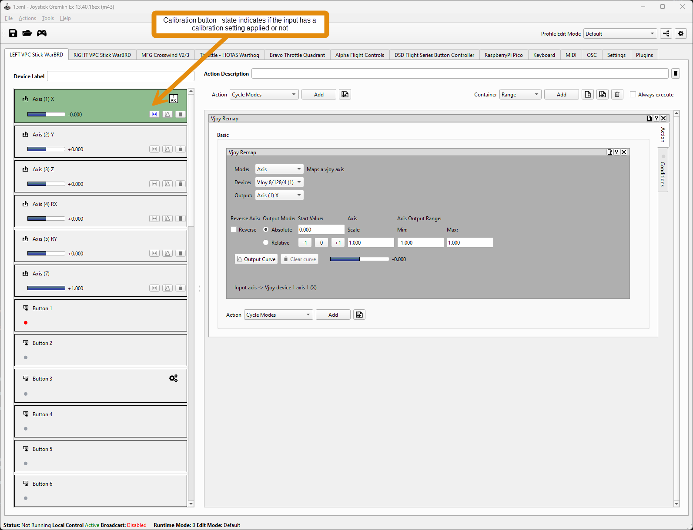
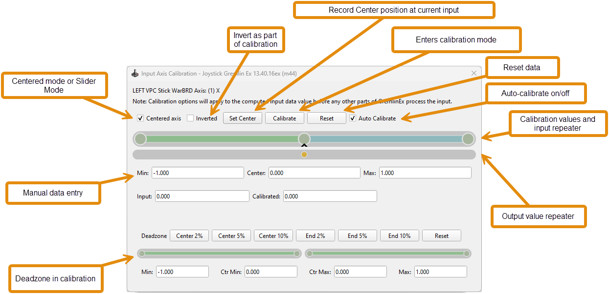

Joystick Gremlin EX
================

## Contents

<!-- TOC start (generated with https://github.com/derlin/bitdowntoc) -->

- [Changelog](#changelog)
   * [13.40.16ex (pre-release)](#134016ex-pre-release)
      + [(patches)](#patches)
   * [13.40.15ex ](#134015ex)
      + [(m5.4) hotfix](#m54-hotfix)
      + [(m5.3) hotfix](#m53-hotfix)
      + [(m5.2) hotfix](#m52-hotfix)
      + [(m5)](#m5)
      + [(m4.10) hotfix](#m410-hotfix)
      + [(m4.8) hotfix](#m48-hotfix)
      + [(m4.6) hotfix](#m46-hotfix)
      + [(m4.5) hotfix](#m45-hotfix)
      + [(m4.2) hotfix](#m42-hotfix)
      + [(m4.1) hotfix](#m41-hotfix)
      + [(m4)](#m4-1)
      + [(m3)](#m3-1)
      + [(m2)](#m2-1)
      + [(m1)](#m1-1)
   * [13.40.14ex (m22)](#134014ex-m22)
- [Virus false-positives](#virus-false-positives)
- [Releases](#releases)
- [General](#general)
- [Compatibility](#compatibility)
- [There be dragons ahead!  ](#there-be-dragons-ahead)
   * [Support](#support)
   * [History](#history)
- [Installation](#installation)
- [Automatic Input detection](#automatic-input-detection)
      + [Button detect only overrides](#button-detect-only-overrides)
- [Remote control feature](#remote-control-feature)
      + [Master machine setup](#master-machine-setup)
         - [Local mode](#local-mode)
         - [Broadcast mode](#broadcast-mode)
         - [Concurrent mode](#concurrent-mode)
      + [Client machine setup](#client-machine-setup)
   * [Master remote control functions](#master-remote-control-functions)
- [Profile mapping](#profile-mapping)
   * [Automatic activation](#automatic-activation)
   * [Keep profile active when focus is lost](#keep-profile-active-when-focus-is-lost)
   * [Mode selection](#mode-selection)
- [Profile device substitution and input order](#profile-device-substitution-and-input-order)
   * [Substitution](#substitution)
   * [Caveats with profile automation](#caveats-with-profile-automation)
   * [Caveats with loading to the prior mode](#caveats-with-loading-to-the-prior-mode)
- [Copy/Paste operations](#copypaste-operations)
- [Devices](#devices)
   * [HID devices](#hid-devices)
   * [Device change detection](#device-change-detection)
      + [Avoiding device detection and sleep issues](#avoiding-device-detection-and-sleep-issues)
         - [Make sure all devices are awake and visible at profile start](#make-sure-all-devices-are-awake-and-visible-at-profile-start)
         - [Sleeping devices after startup](#sleeping-devices-after-startup)
         - [Undetected devices may not be available after startup](#undetected-devices-may-not-be-available-after-startup)
         - [Runtime device changes create a dragon rich environment](#runtime-device-changes-create-a-dragon-rich-environment)
   * [Joystick (axis) device](#joystick-axis-device)
      + [Calibration](#calibration)
         - [Global scope](#global-scope)
         - [Range and accuracy](#range-and-accuracy)
         - [Live feedback](#live-feedback)
         - [Centering](#centering)
         - [Inversion](#inversion)
         - [Calibration limits](#calibration-limits)
         - [Calibration center](#calibration-center)
         - [Reset](#reset)
         - [Deadzones](#deadzones)
      + [Calibration Tips](#calibration-tips)
      + [Curve Editor](#curve-editor)
      + [Curve types](#curve-types)
         - [Coordinate system](#coordinate-system)
         - [Control Points](#control-points)
         - [Live input](#live-input)
         - [Curve presets](#curve-presets)
         - [Curve copy/paste](#curve-copypaste)
         - [Symmetry mode](#symmetry-mode)
         - [Inversion](#inversion-1)
         - [Deadzones](#deadzones-1)
         - [Curve processing order](#curve-processing-order)
   * [Keyboard (+Mouse) device](#keyboard-mouse-device)
         - [Keyboard inputs](#keyboard-inputs)
         - [Scan Codes](#scan-codes)
      + [Numlock state](#numlock-state)
      + [Virtual Keyboard](#virtual-keyboard)
         - [Selecting a key](#selecting-a-key)
         - [Shift state](#shift-state)
         - [Select single](#select-single)
         - [Selected keys](#selected-keys)
         - [Listen button](#listen-button)
         - [Pass-through](#pass-through)
      + [Special considerations](#special-considerations)
   * [MIDI device](#midi-device)
      + [MIDI inputs](#midi-inputs)
      + [MIDI trigger modes](#midi-trigger-modes)
      + [Changing modes](#changing-modes)
      + [MIDI conflicts](#midi-conflicts)
      + [MIDI ports](#midi-ports)
      + [Network MIDI](#network-midi)
      + [Using MIDI from touch surfaces](#using-midi-from-touch-surfaces)
      + [MIDI controllers](#midi-controllers)
      + [MIDI troubleshooting](#midi-troubleshooting)
   * [OSC device (Open Sound Control)](#osc-device-open-sound-control)
      + [OSC port](#osc-port)
      + [OSC inputs](#osc-inputs)
         - [OSC Trigger modes](#osc-trigger-modes)
      + [Changing modes](#changing-modes-1)
   * [Gamepad (X-Box controller)](#gamepad-x-box-controller)
      + [Requirements](#requirements)
      + [HIDHide interaction](#hidhide-interaction)
      + [Number of devices and device lifecycle](#number-of-devices-and-device-lifecycle)
      + [Mapping to a gamepad device](#mapping-to-a-gamepad-device)
      + [Gamepad input](#gamepad-input)
- [Profile](#profile)
   * [Profile association](#profile-association)
   * [Profile modes](#profile-modes)
      + [Mode background](#mode-background)
      + [Default mode](#default-mode)
      + [Nesting modes](#nesting-modes)
      + [Mode addition/removal](#mode-additionremoval)
      + [Mode device](#mode-device)
      + [Mode enter / exit use-cases](#mode-enter-exit-use-cases)
   * [General mapping process](#general-mapping-process)
- [User plugins](#user-plugins)
- [Containers](#containers)
- [Actions](#actions)
   * [Action priorities](#action-priorities)
   * [General Action Types](#general-action-types)
   * [Profile edit time vs runtime behavior](#profile-edit-time-vs-runtime-behavior)
      + [Edit time](#edit-time)
      + [Run time](#run-time)
   * [Profile map visualization](#profile-map-visualization)
- [VJoyRemap action ](#vjoyremap-action)
   * [VJoyRemap button press actions](#vjoyremap-button-press-actions)
   * [VJoyRemap axis mapping actions](#vjoyremap-axis-mapping-actions)
- [Gated axis action](#gated-axis-action)
   * [Gates](#gates)
   * [Gate mappings](#gate-mappings)
      + [Gate Delay](#gate-delay)
   * [Ranges](#ranges)
   * [Default range](#default-range)
   * [Range mapping](#range-mapping)
   * [Range output mode](#range-output-mode)
      + [Default range](#default-range-1)
   * [Use-cases and scenarios](#use-cases-and-scenarios)
- [Map to mouse EX action](#map-to-mouse-ex-action)
- [Map to keyboard EX action](#map-to-keyboard-ex-action)
   * [Output modes](#output-modes)
   * [Latching](#latching)
   * [Numlock behavior](#numlock-behavior)
      + [Dragons](#dragons)
- [Merged Axis action](#merged-axis-action)
   * [Lower and upper inputs](#lower-and-upper-inputs)
   * [Operations](#operations)
   * [Invert](#invert)
   * [Output](#output)
   * [Action configuration](#action-configuration)
- [Simconnect (MSFS)](#simconnect-msfs)
- [Range container](#range-container)
      + [Ranges](#ranges-1)
      + [Include/exclude flag](#includeexclude-flag)
      + [Symmetry](#symmetry)
      + [Latching](#latching-1)
      + [Dragons](#dragons-1)
- [Button Container](#button-container)
      + [Usage tips](#usage-tips)
      + [Pressed block](#pressed-block)
      + [Release block](#release-block)
- [TempoEx Container (tempo with chain)](#tempoex-container-tempo-with-chain)
- [Sequence Container](#sequence-container)
- [Plugin Script enhancements](#plugin-script-enhancements)
      + [@gremlin.input_devices.gremlin_start](#gremlininput_devicesgremlin_start)
      + [@gremlin.input_devices.gremlin_stop](#gremlininput_devicesgremlin_stop)
      + [@gremlin.input_devices.gremlin_mode](#gremlininput_devicesgremlin_mode)
      + [@gremlin.input_devices.gremlin_state](#gremlininput_devicesgremlin_state)
- [Recipes](#recipes)
   * [One way or two way switch to two way switch / three way switch](#one-way-or-two-way-switch-to-two-way-switch-three-way-switch)
   * [Long/short press - buttons or keyboard](#longshort-press-buttons-or-keyboard)
      + [To setup concurrent button presses (hold the short press while long press is active)](#to-setup-concurrent-button-presses-hold-the-short-press-while-long-press-is-active)
      + [To setup a latched short, then long button press with only one button active](#to-setup-a-latched-short-then-long-button-press-with-only-one-button-active)
   * [Scripting logic](#scripting-logic)
      + [Attaching a function to a hardware event](#attaching-a-function-to-a-hardware-event)
   * [Recommended Resources](#recommended-resources)
         - [VJOY virtual joystick driver ](#vjoy-virtual-joystick-driver)
         - [OSC support in Joystick Gremlin from TouchOSC](#osc-support-in-joystick-gremlin-from-touchosc)
         - [HIDHIDE](#hidhide)
         - [Hexler TouchOSC](#hexler-touchosc)
- [Troubleshooting guide ](#troubleshooting-guide)
   * [HID devices - detection / random disconnects](#hid-devices-detection-random-disconnects)
   * [HID troubleshooting tips ](#hid-troubleshooting-tips)
   * [HIDHide troubleshooting](#hidhide-troubleshooting)
   * [Checking your mappings](#checking-your-mappings)
   * [GremlinEx has been tested with ](#gremlinex-has-been-tested-with)
   * [Sample scripts](#sample-scripts)
   * [OSC (open stage control) info](#osc-open-stage-control-info)
   * [Python dependencies](#python-dependencies)
   * [Credits](#credits)

<!-- TOC end -->

<!-- TOC -->
# Changelog

<!-- TOC -->
## 13.40.16ex (pre-release)

### (m50)
- Improved: This patch includes a significant rework of the UI (user interface) "wiring" logic to improve performance and resolve issues with highlighting options, and in particular it eliminates a problematic QT behavior that was causing numerous headaches and bugs (QT is the library under the hood that renders the UI). The UI is significantly more responsive across the board.
- Improved: The inputs panel (left) are more compact and use less vertical space, so less scrolling.
- Improved: The interface to Microsoft Flight Simulator has been reworked and tested with MSFS 2024. The Simconnect feature to automatically switch profile modes based on the current player aircraft now has a mode locking option to freeze the mode to a specific aircraft.  This is necessary because GremlinEx has potentially conflicting options to change modes that work well with other application but cause a loss of control if profile modes are associated with aircraft. The lock feature only impacts profiles using Simconnect and when automatic profile switching is enabled.  The idea of automatic profile mode switching is each aircraft can have its own mode, with unique and inherited mappings, control curves and gated components.

The documentation has been updated to explain the MSFS connectivity and how profile modes can be used to create mappings to multiple aircraft.  GremlinEx has been tested with MSFS 2024 with built-in aicraft and third party commercial add-ons (such as the FenixSim Airbus series). While the GremlinEx Simconnect interface is completely bi-directional, however the Map to Simconnect action is send only for obvious reasons.  Note to plugin users: the API and calls have changed in this version due to changes in threading to maintain a high response rate with the sim, so the code may need to be tweaked.

The Simconnect features are still in development.

- New: GremlinEx will now make automatic backups of profiles when saving a profile.  The number of backups kept is determined by a new option in the profiles options dialog.  If the count is zero, backups will be disabled. GremlinEx will store numerically named backups named based on the profile name. If the total count of per profile backups is exceeded, the oldest one is removed.  The backups are saved to a folder named after the version of GremlinEx so it is easier to undo changes made by a new version if this becomes necessary.  The log file will contain the backup file name whenever a profile is saved.  Profiles are saved in the profile folder (%userprofile%\Joystick Gremlin Ex).

### (m49)
- New: OSC and MIDI live input status. At edit time, GremlinEx will listen for OSC or MIDI events to real-time update the inputs as their hardware input counterparts can. OSC and MIDI inputs can behave either as linear (axis) or momentary (button) inputs. For OSC, a value of 1.0 indicates the button is pressed, and 0.0 indicates the button is released (other values are ignored).  For MIDI, a value of 0-63 indicates the button is released, and 64 to 127 indicates the button is pressed.
- API: OSC clients are now pooled per server/port.
- API: MIDI and OSC input models refactored to use the updated event model (this fixes a number of recent issues with OSC and MIDI inputs)
- Improved: It is now possible to use the Keyboard Ex mapper in auto-repeat mode with containers that do not auto-release with a caveat that you need a way to turn that off.  To cancel auto-repeat, you can setup a Keyboard Ex action with no keys set to release mode.  When triggered, that action will stop the auto-repeat function globally and release any pressed keys. This enables using auto-repeat in containers that do not auto-release automatically (by design). One such use-case for this is to autorepeat keystrokes while the input is in a gated axis range (trigger autorepeat on range enter), and another key entry set to stop the autorepeat can be triggered when the range exits. A typical scenario would be using an axis input for a rotary input, and is particularly useful with OSC rotary inputs on glass input surfaces that send an axis value corresponding to the position of the knob.
- API: The macro manager now has a clear queue function that can clear scheduled actions that haven't executed yet, in effect stopping macro executions.
- Fix: MIDI not triggering actions due to API rework in a prior m release.
### (m48)
- New: OSC send action.  This allows GremlinEx to send OSC commands outbound.  For now it's a single IP address and port specified in the options menu.  OSC commands start with a forward slash (improperly formatted commands will not send), and it has two optional parameters per the OSC protocol which can be integer or floating point.
- Improved: profile runtime determination startup logic consolidated and simplified. The change primarily impacts profiles attached to processes for automatic load/execution if those options are enabled for automatic profile execution/swaps.
- Improved: UI will now display mode hierarchies as folders in the actions that change profiles to make it easier to visualize mode nesting.  This is a visual change only and does not change the mode names in any way.
- API: UDP ports keep alive now event based (this is for the OSC and remote control capability).
- API: Execution tree is built before a profile is started. This is available through the new ExecutionContext.
- Fix: scale value not loading correctly from profile on restart for VjoyRemap and legacy remap not allowing scales > 1.0.  
- Fix: UI exception when not using joystick input repeaters

### (m47)
- API: in general, the code makes more use of internal events to start/stop and record changes and simplify the logic, which results in performance gains.
- API: in general, more detailed diagnostics logging if the appropriate log option is enabled.  Warning: log entries can have a performance hit on GremlinEx when executing profiles.
- Improved: Keyboard, OSC and MIDI input now support mappings via mode hierarchy and match the behavior of regular axis, button and hat inputs: If a mapping is not found for a keyboard/OSC/MIDI defined in the current mode, and a mapping exists for that input in a parent mode, the parent mode mapping will trigger.  This behavior was missing in prior releases pending improvements to the execution tree, which exists as of m42 which now make this possible.
- Improved: The execution graph will abort on profile stop at the next step which should interrupt large container executions and return to edit mode much faster.
- Improved: The macro scheduler will now abort on profile stop at the next step if a stop request occurs while the macro executes.  Before this, a macro usually had to completely execute before stopping.
- New (experimental): Sequence container - similar to macros but as a container. This container executes all actions sequentially once triggered.
- Improved: Pause action now functions as a delay as well as a callback pause (mode selectable).  The delay is selectable and entered in milliseconds.
- Improved: Filter box added to the process picker dialog.
- Improved: MIDI and OSC listening interfaces won't automatically start if there are no MIDI or OSC inputs defined in the profile.
- Improved: Simconnect
	- scan speed for aircraft folder data - the community folder scan will now only look for folders that contain player flyable aircraft and do its best to ignore the rest (the MSFS folder structure is convoluted so there is only so much that can be done here...)
	- config will pull the current aircraft (if one is loaded in the sim)
	- Simconnect action has a trigger on release option if mapped to a momentary input (button or hat)
	- Simconnect aicraft profile mode is now saved with mode data (if defined).  This mode is auto-selected when an aicraft is detected if the option is selected.
	- Many missing simvars added
	- Simconnect action data can now be entered as normalized (-1 to +1) or MSFS range and displays percentages
	- simconnect_lvars.xml can be user edited to define L: variables that will be loaded by GremlinEx.  LVars are custom defined by aircraft and thus user customizable.  There is currently no interface to edit LVARs - that has to be manually done currently.  A sample file is created if it doesn't exist.
- New: clickable highlight button repeaters on the status bar (bottom right). Click to change auto-highlight status without going to options.  

Fixes:
- Fix: Restore last mode on profile to process mapping wasn't saving correctly.
- Fix: Restore last mode on profile activation does not restore the last profile that was selected (this is related to the prior fix). There may be more work needed on this as process to profile mapping and auto-loading is rather convoluted with all the options available.
- Fix: auto activate profile error or noop when option is enabled and a suitable process is selected and the action is on.
- Fix: closing GremlinEx when a profile is active no longer leaves the process running (bug introduced with recent process monitoring logic changes)
- Fix: unknown "hardware_device_guid" member found in profile class introduced in m44
- Fix: Some paste of actions causing an exception post refactor to require a secondary parameter introduced in m45.
- Fix: Input selection on profile load may have selected the incorrect item.
- Fix: Relative scaling in vjoy remap now supports value 0 to 1000 (previously was limited at 1)

### (m46)
- Improved logic and event handling around automatic process activation based on the active (foreground) process.

### (m45)
- New (experimental): Mode tab. The mode tab provides two new virtual buttons that trigger assigned actions whenever a mode is entered (activated) or exited (deactivated). See the mode tab in the documentation [here](#profile-modes)
- Fix: changing modes will restore the last selected device at edit time
- Fix: since m31, vjoyremap (Map to Vjoy) ignores conditions set on companion curves
- Improved: GremlinEx now remembers up to 15 profiles

### (m44)  
- Improved: The legacy calibration method has been deprecated. Legacy data will be loaded if it exists the first time GremlinEx runs from an older version. The calibration tool is removed, and calibration options are moved to individual input via a configuration button for each that brings up a dialog specific to that input. The new features include new visualization of live data, inversion, and deadzone settings applied at the input level without needing a curve. The calibration applies to the input before further processing by GremlinEx, including before any curve is applied.  By default all axes are setup as "centered" and no calibration is applied so no changes are needed unless calibration should be applied.  Calibration data is now saved to a separate XML datafile in the user profile folder where profiles are kept and includes the new flags/options in it.
- Experimental: ability to disable certain inputs and manage input enabled state at profile runtime via the new control action.  The control action can only be mapped to a momentary input and can control the enabled state on any known input.  The idea of this feature is to (1) enable/disable inputs without having to connect/disconnect them which can cause problems or conflicts or re-ordering (2) for advanced setups where multiple inputs may be mapped to the same output and this is not desirable due to conflict in certain scenarios. 
- Improved: individual input enable button now available on any input to enable or disable it from the profile.  By default, all inputs are enabled when a profile starts.  The buttons can be enabled via an option.
- Improved: Most dialogs will remember position and size.
- Fix: Invalid input type in legacy remap
- Fix: curve in vjoyremap not applied to final output starting with m43
- New: documentation on calibration

### (m43)
- Improved: curve dialog window on input has scrollbars for lower resolution displays.
- Fix: Simconnect functor exception with new API tree feature

### (m42)
- API: Refactored the execution graph to also create a new execution tree data structure.  This makes it much easier to navigate the execution graph at runtime from any point of the execution, output diagnostics and derive latched actions.
- Improved: The API improvement simplifies curve computations and resolves merged axis curve application in map to vjoy.
- Fix: last runtime profile restore on profile start non longer throws an exception if option is enabled
- Fix: automatic profile load based on mapped process if option is enabled

### (m41)
- Improved: Keyboard mapper Ex enhanced display of selected keys.
- Improved: Simconnect (MSFS) supports two-way communication via OSC (see osc_msfs.py as the demo of the parking brakes).  The demo OSC/Pilot and user plugin module to support two way comms is in the demo msfs zip file.  Note: this is not OSC/Pilot specific - just provided as a demo here.  The concept is similar with other OSC surface control software  although it may have to be tweaked based on that software's capabilities.
- Improved: Added autorelease option for OSC commands that do not issue a release (example, StreamDeck OSC plugin). This enables a release to be issued on an OSC message receipt to trigger the missing release after a user selectable delay (default 250ms)
- Fix: Containers not always telling actions what container type they are when the container type overrides the input type.
- Fix: Gated Axis triggers on a single condition gate crossings ignoring the others  
- Fix: C++ reference error on gated axis after stopping a profile and moving the associated input device
<!-- TOC -->
### (m40)
- Fix: small update for mouse ex not releasing mouse button (thanks for reporting!)

### (m39)
- Improved: OSC output can send to any IP address (set IP and port in options).  The prior implementation was sending to the local server only.

### (m38)
- Fix: removed redundant "force numlock off" check box in profile to process mapping as that option is superfluous.  Each profile can set its own option in the profile config window, or it can be set globally in options.  Those two methods are sufficient to achieve the desired behavior.  
- Fix: Curves applied to input axes not always loaded post converting to the new curve editor.
- New: Conditions have their own verbose mode for log output for troubleshooting conditions in the log.  When this is enabled, the execution plan and the outcome of tested conditions will be output to the log to help diagnose issues around conditions.  Conditions and execution plans are very complicated (warning, when enabled, as with most verbose modes, this can generate a lot of log data and consequently slows GremlinEx down significantly).
- Fix: Docktab for mappings generating an internal Python exception because the C++ reference was garbage collected before the Python reference.

### (m37)
- Fix: exception on mode change with certain curve setups  

### (m36)
- Improved: Added OSC send capability
- Improved: Added VJOY output events  
- New: GremlinEx to OSC vjoy output script user plugin demo

### (m35)
- Improved: Condition processing for containers and actions are now cumulative, meaning that each container has a set of conditions for the whole container, and another concurrent set for each action in the container to toggle each one individually.  If a condition on a container fails, the whole container is disabled, regardless of the individual conditions on actions.
- Improved: Condition logic
- New: Global numlock off startup state option.  This option, when set, overrides the per profile numlock setting.  In most cases, this option should be on to avoid problems with keyboard output using numlock. 
- Fix: Keyboard input: Arrows keys no longer get translated to Numpad arrow keys
- API: reworked the container and actions conditions API.

### (m34)
- Unreleased test version

### (m33)
- New: Map to vjoy, hat to button mode has a new sticky option.  When enabled and the position mapping is in the hold mode, any pressed hat positions will "stick" until the hat is returned to center, and when disabled, only the current hat position is pressed.   This mode is only relevant when in hold mode, it has no meaning in the pulse mode for obvious reasons.
- Fix: Tempo/TempoEx/Chain/Switch/Button did not support hats as input
- Fix: When in symmetry mode, curve editor did not mirror the center point bezier handle
- Fix: Map to Vjoy in axis to button mode, change in triggering logic.

### (m32)
- Improved: cross-reference data returned by Vjoy API with data returned by DirectInput and more detailed log data for what was detected.  This can help with troubleshooting.
- Fix: typo in tempo/tempoEx in variable name
- Fix: possible tray icon exception when the application exits and the tray icon has already been discarded.

### (m31)
- Improved: support for Simconnect for MSFS2024.  This is a work in progress and does not include all planned features, such as, a facility to add custom simvars from add-on products.  The barebones module is functional with MSFS 2024 released Tuesday, November 10th, 2024.
- Improved: Map to vjoy adds a new hat to button mode to map up to 8 hat positions directly to buttons.  The buttons can be pulsed or held.
- Fix: Tempo and TempoEx now handle hat inputs (as usual using tempo with a hat is best done with a pulse option because of how Tempo works)
- Fix: Remap to Vjoy does not reload saved set target value
- Fix: conditions do not work with hat input or hat conditions
- Known issue: condition marker does not always update in all use cases (this does not impact functionality)
- Known issue: conditions if also mapped for their own actions may cause some conflicts because they fire at the same time.

### (m30)
- Fix for condition tab error when adding a condition that applies to the container - related to the addition of the status flag in m27 

### (m29)
- Fix for m28 vjoy mapper ignoring curve data on load due to a tag change in m28
- Fix for missing panel in vjoy mapper for some other button modes (m28 fixed the axis to button but missed a few others that had the same issue when mapping to a button input)

### (m28)
- Improved: GremlinEx can automatically convert legacy Remap and Response Curve to their GremlinEx version provided that options are enabled from the Profile page in the options.  Converting is recommended and will occur when a profile is loaded.  When the convert option is selected, the legacy mappers will no longer be visible from the action drop down either to encourage the use of the new actions.
- Improved: Added option to toggle the display of button grids in the GremlinEx options panel.  This is the same as holding the control key down when toggling the "show button grid" in the Map to Vjoy mapper.
- Fix: Missing button options panel when in Axis to Button mapping mode of Map to Vjoy
- Fix: Response curve Ex saving to profile as a legacy response curve action.
- Fix: Response curve text inputs not always updating the UI correctly
- Fix: Floating point and integer text input wheel events are no longer propagated (that could cause random unexpected scrolling of a parent containers)

### (m27)
- Fix: Input or output axis curves: setting deadzone via buttons not saving values. 
- Improved: [experimental] Condition tab will show a marker when one or more conditions are defined (I've set it up to pickup any condition however I am not a heavy user of conditions so it's completely possible this will trip up somewhere)
- Fix: VJOY used button state now takes into account axis to button mappings.
- Fix: VJoy Remap typo in diagnostics code to handle invalid VJOY IDs

### (m26)
- Improved: Complete input mappings for an input (all containers) can now be copied and pasted all at once from the clipboard as a set.  This makes is easier to copy/paste multiple container mappings between inputs. Note: when pasting multiple containers, only valid containers in the clipboard will be pasted so if you are missing a container, it's because it wasn't valid for the input.  This comes into play when copying containers for an axis and pasting it to a button input, and vice versa.  (new container toolbar button).
- Improved: It is now possible to clear all mappings from an input.  A confirmation box will be presented (new container toolbar button).
- API: added axis flag to containers if the container is only for axis inputs as the type of the input can change so containers need to know if the current input is configured as an axis - previously was relying on input type alone
- Fix: Input axis flag was not always set correctly in input items in the API
- Fix: OSC range min value for axis not updating correct property
- Fix: Paste action didn't recognize XML ObjectEncoder data
- Improved: Vjoy Remap will validate the VJOY device ID and gracefully provide an error message with the offending ID rather than causing an exception if it cannot be found in the active VJOY device list.  The action will also check at profile load if an ID is not valid, for example an older profile referencing an ID that no longer exists.  IDs are assigned by the VJOY Configurator.

### (m25)
- Fix: Curve controller now checks for duplicated points when fitting a curve

### (m24)
- Improved: The range container now supports directional triggers based on a relative input axis position change. The container can now trigger its actions based on an input increase or decrease, or both, provided that the input change (delta) exceeds the percentage or range set (default 10% deviation).  The use case for this is to trigger a button or key based on a slider input going up or down.  Note: if mapping a button or key, use the pulse feature as the container is only an "on" container - in trigger on change mode, it does not issue a release so the action must self release if that is the desired behavior.
- Improved: Import profile function UI improvements
- Improved: Import profile "no map" option for mappings
- Improved: Import profile automated mapping behavior (unused, stop, round-robin) added
- Improved: file search will skip folders marked hidden (starting with a ".")
- Improved: file search will cache previously found items to improves UI responsiveness associated with locating icons in particular
- Improved: Map to Mouse Ex can now send double-clicks
- Fix: Input load skips loading vjoy inputs that do not exist anymore whatever the reason and will output a warning log entry if it cannot find something 

### (m23)
- Improved: 1:1 mapping now has a configuration dialog box to select target and mapping mode.
- Fix: 1:1 usable mode accounts for vjoy mappings by both vjoy mappers
- Fix: Input selection can throw a missing argument exception in m22 patch

### (m22)
- Improved: axis repeater bar no longer causes a small window to flash temporarily on the UI
- Improved: vjoy remap show/hide button grid checkbox can now change the state for all vjoy remap actions in the profile if the state is changed while a control key is held
- Improved: 1:1 mapping uses Vjoy Remap as the default mapper instead of the legacy remap (1:1 mapper may need some more work)
- Improved: vjoy remap button grid color icon click shows where that button mapping is used across entire profile including those of legacy remap action
- Fix: 1:1 mapper displays an hourglass while processing
- Fix: right mapping panel was not always updating on input selection or state changes
- Fix: left input panel icons were not always updating on global profile actions
- Fix: switch container caused an exception when adding a new switch position

### (m21)
- Fix: Legacy remap displays blank (or incorrect) value on reload for certain input choices
- Fix: TempoEx container condition UI invalid index exception when setting conditions based on actions
- Improved: Refactored button usage tracking

### (m20)
- Fix: display details in MIDI inputs would hide details on other entries
- Fix: MIDI configuration update was not not updating input description consistently
- Fix: input display fails to update for keyboard entries in m19  

### (m19)
- Improved: legacy remap and map to vjoy actions now synchronize the used data.
- Improved: action list for button mappings now updates when queried to ensure the usage data is up to date across the entire profile.

### (m18)
- Improved: Axis names.  GremlinEx will attempt to derive the axis usage name (X, Y, Z, RX, RY, RZ, SL1, SL2) for inputs and VJOY output as reported and mapped by DirectInput. While many device report as expected, some (non VJOY) devices do not report a usage for an axis.  When this happens, the name of the axis will be its axis sequence number (1 to 8). If a usage is defined and can be derived, the specified usage name will be used and displayed in GremlinEx. Names are informational only and GremlinEx will always use the hardware device and input IDs for mapping.
- Improved: GremlinEx considers axis names when a VJOY definition has skipped axes
- API: VJOYSelector is now based on data instead of naming conventions which fixes the legacy mapper (remap to vjoy does not use this).

### (m17)
- Fix: action icon not always updating when adding, changing or removing an action/container.
- Fix: usage icons on map to vjoy button grid update on profile load
- Fix: usage icons on map to vjoy button grid show other mappings when clicked

### (m16)
- Fix: missing raw value in curve  

### (m15)
- Fix: enabled/disabled state of MIDI and OSC inputs did not impact UI such as sort and device visibility.  They now do.

### (m14)
- Fix: Gated Axis delete gate does not update range data.
- Fix: Gated Axis add/remove container or actions in range or gate action could disable input tracking and cause the Gated Axis action to become unresponsive.

### (m13)
- Fix: Merge Axis action creating invalid axis reference for second device upon initialization if the first device was the last axis on the particular input device selected.
- Fix: Merge Axis action not marked as a singleton action.
- Fix: Merge Axis action not showing output value at design time in some situations.
- Improved: Map to Vjoy action in an action container will display the correct design time axis output when nested or no data if the parent action does not support it.

### (m12)
- Fix: With a new, unsaved profile, removing a container for a gate or range in the Gated Axis action results also removes the container on the parent action (this was a visual item, upon saving it would load correctly the next time).  This is resolved in m12.  
- Improved: Singleton actions (actions that can only apply once per input) will generate a message box error if added more than once, or if nested.
- API: Actions can now be marked as singleton at the plugin level to indicate they must be unique per input mapping.
- Improved: Detail button in profile import will show the capabilities of the source and target for mapping purposes.
- Fix: debug mode left on in m11 would call up XML profile in the default text editor if they differed.

### (m11)
- Fix: for midi and osc enabled options not saving properly after changes to the validation logic for these two services introduced in m6.

### (m10)
- Improved: profiles no longer save empty entries (entries with no mappings and entries that use defaults) - this reduces the size of the saved profile and improves loading/save time.
- Improved: detection of profile changes when loading a new profile (will now ignore default entries or entries with no mappings)
- Fix: window title doesn't always get updated when loading a profile from the menu

### (m9)
- New: left and right panels can be resized via a splitter
- Fix: Gated Axis add/remove gate manually throws an exception when manually setting the gate count

### (m7/8)
- Fix: saving calibration throws an exception (bad reference)
- Fix: add gate via the add button throws an exception (bad reference)
- WIP: profile import - added re-import button on device imports for automatic remap when device changes and axis/button/hat counts changed.

### (m6)
- Improved: still a WIP: import of profiles now includes un-mapped modes, deselecting a mode in one mapping deselects all, and input descriptions carry over.
- Fix: curve input causing a recursive exception when moving control points.

### (m6)
- Fix: Updated logic used to determine if changes are made to a profile to avoid excessive prompting to save on profile load if an existing profile is already loaded: the updated check does away with hash values, ignores comments, internal IDs, file encodings and other non-relevant changes as these would trigger a save change prompt, even when there were none on a substantive basis.
- Improved: still a WIP: improved handling of profile import logic and mapping to devices with fewer axes/buttons/hats. Fix for keyboard, MIDI and OSC inputs that cannot have a remap change - they import as they are since the input is fixed.
- Fix: Update selection on tab change recalls correct input description
- Fix: Curve option buttons sometimes appeared on non joystick inputs
- Fix: Clicking on a curve or calling up a curve could cause a cast exception
- Fix: Selecting a new mode does not select an active input in the UI
- Improved: New profiles will show as "untitled" in the main window title bar

### (m4)

- Added descriptive error message on DirectInput interface load errors if UAC (user access control) prevents it from loading depending on the permissions of the logged in account.  If a DLL load error occurs at startup, running the process in administrator mode usually solves the load issue.
- Added check for MIDI ports to be available before offering the MIDI device tab.  If you get an exception when changing to the MIDI or OSC devices, please create a GitHub issue and attach the screenshot of the exception.

### (m3)
- Refactored behavior of *cycle mode* and *temporary mode* switch actions to handle gremlinEx backend changes
- Bug fix: deleting a mode from a profile did not remove all references or mappings from actions

### (m2)
- Added option to show or hide the button grid in vjoy remap

### (m1)

- Ensure mode names ignore leading/trailing spaces
- Add log entry if action reports invalid (to the log file) thus disabling the container at profile runtime
- Reworked priority of Cycle Modes action to match other mode actions (to execute last)
- Improved handling of mode mapping in profile import (still not ideal but workable)
- New switch container (experimental).  The switch container is designed to map a switch with multiple positions to make it easier to map a set of input buttons to actions.  The container is not essential but can be used to map two-way, three-way and rotary buttons more easily, and the functionality is not new - the only "new" aspect is to do this in a single container rather than multiple buttons.

<!-- TOC -->
## 13.40.15ex 

<!-- TOC -->
### (m5.4) hotfix
- Allow vjoy devices setup as wheel that then misreport direct input data to function in GremlinEx (the hack causes the devices to report fewer axes than they actually have causing a mismatch).  GremlinEx will use the misreported information as "correct".

<!-- TOC -->
### (m5.3) hotfix
- The range container now supports press and release actions automatically an mimic a button mapping being "pressed" while in the range and "released" when the axis value exits the range.
- API: containers and actions now have the concept of an "override" input type and input id for containers that change the behavior of the input to something else so the actions configure themselves correctly (example, containers that split up an axis range)
- TTS is threaded by default now to avoid text to speech from delaying the execution of containers/actions. This is experimental. All speech will now run in parallel to the rest of the execution graph so the actions will run while the speech executes.  This could lead to unexpected consequences but in general avoids TTS from being such a terrible impact on the timely execution of other commands.

<!-- TOC -->
### (m5.2) hotfix

- Bug fix: joystick hat incorrect output
- Bug fix: Joystick axis value not functional with legacy "Remap" mapper in m5
- Added invert flag to Map to Mouse Ex for motion output

<!-- TOC -->
### (m5)

- New feature (experimental): It is now possible to assign a response curve directly to the input axis.  This directly impacts the value passed to a container/action. The curve can be edited directly on an axis input and removed as needed.
- API: joystick event has a new member, curve_value that contains any curved data.  
- bug fix: merge axis option on vjoy remap now shows the output axis in the drop down again.
- bug fix: input icons now appear for the tempo ex container.

<!-- TOC -->
### (m4.10) hotfix
- Slight rework of curve editor UI (added repeater)
- Output display is now clamped in case the computed axis value is out of bounds due to the curve settings
- Bug fix: an extra point at the center is no longer created when loading control points, and fix for a log error when saving gated axis data.

<!-- TOC -->
### (m4.8) hotfix
- Added a latched functor ability to register extra functor callbacks to trigger on defined inputs.  This enables a functor to register additional triggers on inputs other than the one it is attached to.  This is much cleaner than hooking inputs directly in the functor and follows the GremlinEx "wiring" model.
- Fixed vjoy remap's computation of merged data and enabled the latched functor feature for that action when input is merged.
- Fixed hat input causing an unknown input exception in callbacks

<!-- TOC -->
### (m4.6) hotfix
- Fix for paste of some actions or containers failing
- Fix for output values of vjoy remap in certain modes not having display axes
- Fix for loading certain vjoy remap modes not updating some UI fields correctly
- Additional verbose logging if certain TTS voice cannot be loaded or executed with fall-back to default voice if possible.
- Fix for restore last input feature not consistently restoring the correct last input

<!-- TOC -->
### (m4.5) hotfix
- Added remap curve ex additional functionality to traverse and edit control and handle coordinates

<!-- TOC -->
### (m4.2) hotfix
- removed button timer on auto input highlighting causing some buttons inputs from being ignored
- allowed shift/control overrides to also change devices for auto input highlighting
- response curve - adjusted opacity on input marker to make it easier to see behind it

<!-- TOC -->
### (m4.1) hotfix
- added additional log output for device and plugin load
- added additional log output on device naming mapping

<!-- TOC -->
### (m4)

- Updated plugin - Response Curve EX - uses revamped internal curve mapper
- Updated response curve mapper (standalone in Response Curve EX) and built-in to Map to Vjoy (VjoyRemap):
	+ ability to store and load curve presets - presets are stored as XML files
	+ snap to grid of control points (and handles) including 0, 45 and 90 degree snap
	+ use shift for fine grid, control for coarse grid
	+ updated look
	+ help guide

<!-- TOC -->
### (m3)

- VjoyRemap plugin now supports curved output directly in the action without having to add a response curve.  The curve can be added or removed.  The curve dialog now has a number of bezier curve presets.  The curve is applied after all the other transforms, including merging.

<!-- TOC -->
### (m2)
- First attempt with multiple code refactors and bug fixes detailed below.
- Added cleanup events for action plugins so they can release resources via _cleanup() \[AbstractAction] and _cleanup_ui() \[AbstractActionWidget] - the methods are virtual so are optional but will be called when an action is deleted or unloaded.  This helps with releasing references that could cause problems with the automatic garbage collection and hooks into various events.
- **Cut/Paste refactor** for Containers and Actions - this eliminates keeping a reference to the source binary object that can cause problems with garbage collection. The refactor now only stores XML configuration data in the internal clipboard and is thus much smaller memory wise.
- Many UI objects are now persisted rather than being recreated on UI refresh (performance and memory optimization)
- Refactored **Gated Axis with custom control** to avoid QT internal critical crash involving QT sliders.
- **Gated Axis** now supports concurrent mappings for range and gate condition (they stack)
- Added a **new axis merge** capability direct into the "**map to vjoy**" plugin.  This avoids the need to use the separate merged axis functionality. The base iteration lets you merge another input concurrently via the "Merge Axis" mode and select add, average and center mode, optional inversion, and output scaling.  The merged output data will be sent to the mapped containers/actions. 
- Fixed a minor icon sizing issue for action icons - they are now all consistent.
- For newer users using legacy profiles, legacy keyboard, mouse and remap plugins now indicate there are replacements plugins in GremlinEx.
- GremlinEx now has separate preferences kept with each profile (will have a .json extension)
- One such preference is remembering the last selection per device per profile that will be restored on subsequent profile load if the device/input still exists.
- Fixed an issue with automated description entries being saved to a profile overriding the manually entered description for an input.
- Fixed an issue with OSC and MIDI UI due to prior UI refactors
- Further refactor of **ComboBoxes** to only display up to 20 items before scrolling
- Update to QT 6.7.3
- Refinement of device highlight to clarify options.  If highlighting is enabled, button highlighting can be enabled by holding shift down, and axis highlighting can be enabled temporary by holding the control key.

<!-- TOC -->
### (m1)
- **Gamepad support** JGEX supports up to four (4) virtual XBox 360 gamepads via VIGEM.  See gamepad section.  Gamepads can be mapped via the new **map to gamepad** action.
- Improved device mapping output.
- **Profile Import** JGEX can import mappings from another profile into the current profile optionally changing the destination, mode and mappings.  This feature is experimental and still in development and is not feature complete at this time.  
A new menu option "import profile" in the file menu, or the context menu on a device tab brings up the option.    
Current features are:  
	- import to another device  
	- import to the same mode or a different mode (that exists)
	- selectively select imports from a device. mode, input or container (four levels)
	- import is currently additive (imported items are added to the current input in the current profile)  
	+ import to another input (button or axis)
	+ supports importing mappings for joystick, keyboard, MIDI and OSC
- QOL feature: most drop downs limited to 20 items before they start scrolling
- bug fixes

<!-- TOC -->
## 13.40.14ex (m22)

This release adds major new features, including some minor changes in UI functionality, and a few more QOL (quality of life) enhancements.

- **VJoy device name enhancement** VJoy devices are now displayed including the axis/button/hat count in the name to make them easier to distinguish.  This works because VJoy requires each defined virtual joystick to be different either in the number of axes, buttons or hats defined so they are unique.
- **New Merge Axis action** The merge axis action is similar to the merge-axis profile feature (from the menu) option except that it can be attached to any joystick axis input (any device will do) in a profile as a regular action.  The merge action, as with the gated axis action, allows the action itself to define sub-containers and sub-actions by clicking on the configuration button.  The output of the merged axis action will be sent to these sub-actions for processing, which can include response curve and any other action applicable to axis input data.  Note: output from this action is not going to be sent to other actions defined alongside it, only the sub-containers the action defines itself.
- **New device reorder** It is now possible to re-order the hardware device tabs.  The order is persisted from one session to the next.  Right click on the tab to sort the input back to default.  This is only a visual feature - the hardware order of the devices cannot be changed as it's determined by the operating system.    
- **New device substitution** It is now possible to replace one or more device hardware IDs with another so long as the id is not duplicated.  This is a requested feature if your hardware IDs change frequently (a rare condition). This is a QOL feature to do an edit to the profile that had to be done in the XML directly until now.  The dialog shows the profile devices in the top drop down, and the detected hardware devices with the new IDs in the bottom.  The old profile is backed up for you just in case and the updated profile is reloaded for you if a replace occurred.

- **New virtual keyboard** dialog to simplify key and mouse button selection. The updated editor supports hidden keys such as F13 to F24 and enables mouse buttons to be used as any "key" input to simplify mapping. (QOL)
- Revamped keyboard input device and UI with virtual keyboard with mouse input support with multiple key latching.  Profiles using the old style should convert automatically to the new style.  Inputs can be added, edited and removed.  Latching (concurrent keys pressed) allows for complex and unusual keyboard input combinations to trigger actions including latching with mouse button and mouse wheel inputs.
- Revamped keyboard conditions on actions or containers:  a keyboard condition now uses the new virtual keyboard editor and allows for multiple latched keys and mouse button triggers. (QOL)
- **New MIDI input device** - GremlinEx can now map MIDI events to GremlinEx actions. The new MIDI inputs can be added, edited and removed in the MIDI device tab. 
- **New OSC (Open Sound Control) input device** - GremlinEx can now map OSC events to GremlinEx actions. The new OSC inputs can be added, edited and removed from the OSC device tab.
- **New Gated Axis action** functionality for some actions (SimConnect axis mapping as well as VJoy axis mapping - new axis mode).  Gates axes have the notion of "gates", or points along an axis that can be used to trigger one or more sub-actions and modify the axis value output behavior.  Data and triggers for this action will be sent to the sub-containers and sub-actions it defines on each gate or range based on conditions as defined.  Note: output from this action is not going to be sent to other actions defined alongside it, only the sub-containers the action defines itself.
- **New Input Map dialog** - in the tools menu, "view input map" tool displays a dialog containing the current profile mappings as a tree, can be exported to the clipboard.
- Improved icon reload speed (speeds up the UI load/refresh/update)
- New file menu for opening Explorer to the current profile folder (QOL)
- New file menu for opening the profile XML in a text editor (it will save the profile first) (QOL)
- New mouse event drop down selector in map to mouse ex: adds a mouse event selection drop down so mouse actions can be selected by name rather than mouse input only.  
- Action container will now scroll horizontally if the action is too wide to fit based on windows size / UI scaling options. (QOL)
- Profiles can be saved even if one or more actions are not configured (QOL)
- Updated profile to application (process) mapping in the options dialog (QOL)
- Options dialog remembers which tab it was last in (QOL)
- Options dialog has a close button (QOL)
- Options dialog saves profile mapping information on close (QOL)
- Pressing F5 in the UI will activate the current profile (QOL)
- New configuration dialog for the loaded profile, separate from the global options (QOL).  This lets you quickly set profile activation options.
- New option to force numlock off when a profile starts to help with the more complex latching that use numpad keys.
- Added joystick input value display on axis inputs - shows an axis bar with the current axis value in the input (QOL) - can be toggled in options.
- Update to Python 3.12.5
- Profile mode change is now disabled when the profile runs to avoid conflicts.  Use the new profile startup profile option to pick a profile when the profile is loaded if the profile mode needs to be changed when the profile runs.
- User plugins that use plugin variables now support partial save.  This can be enabled or disabled in options.  When enabled, plugin instance configurations setup in user-plugin tab will save in-progress work at edit time to the profile when the profile is saved.  Instances that are not fully configured will not be active at profile runtime and a log entry will be issued as a warning to skip the instance load.  This is on a per instance basis.
- The JGEX UI and configuration options are mostly disabled when a profile runs so edits to an active profile are only permitted when a profile is not active.  The change has to do with changes in behaviors in the core system and the potential for conflicting events impacting profile state while a profile runs.  
- When changing modes, the hourglass will be displayed during the UI update operation (this can be time consuming because each device is reloaded on mode change for the current mode)
- Play sound action now has a play button to test play the sound file while in edit mode.
- Curve editor now remembers the symmetry setting.
- Curve editor now displays current input if input visualization is enabled.
- New clear map tool - removes all mappings from the selected device and mode
- Improved device change behavior - new option to ignore device changes at runtime to avoid profile runtime disruptions especially if the connect or disconnect is momentary (due to sleep mode for example).  See section on device change.

6/6/24 - 13.40.13ex (h) **potentially breaking change**

- GremlinEx will now more gracefully handle DLL errors and check driver and DLL versions.  If the driver and DLL versions are not at minimum levels expected, an error box will be displayed and will exit the app to avoid further errors due to mismatched versions.

GremlinEx requires vJoy device driver 12.53.21.621 (VJOY release 2.1.9.1 minimum).    The distribution includes the interface DLL for 2.1.9.1, but not the software which by licensing agreement cannot be included in the GremlinEx distribution.  The latest version can be found here:

The vJoy version can be found here: https://sourceforge.net/projects/vjoystick/files/Beta%202.x/2.1.9.1-160719/

The version of HIDHide can be found here: https://github.com/nefarius/HidHide/releases

There are probably more hardening that can be done to validate the environment.

When installing a new version of vJoy or HIDHide, uninstall the old versions first, and reboot between sessions to make sure files are removed and there will not be a conflict on installation.  There are documented issues when failing to reboot after uninstalling either HIDHide or vJoy.
 
Sequence wise, install vJoy first, then HIDHide.

Updated Device Information dialog to use a table format that is user resizeable.  Right click on any cell to copy its contents to the clipboard.

Bug fix for device removal / addition while a profile is running.

If a device is referenced by a script or profile and cannot be found as GremlinEx is running, or if it was added/removed dynamically while GremlinEx is running, this will no longer throw an exception.  The issue will be logged as a warning to the log file and calls using that device will just be ignored.  Plugin scripts should ensure they now check the return value of any proxy call when looking for a device as the call my return null (None) if the device cannot be found.  It is generally discouraged to change hardware configurations while GremlinEx is running, or change device hardware IDs as those are stored in profiles, and will be ignored if the ID is no longer found.  
Missing IDs in profile will be logged to the log file and a message box displayed at load time.

6/2/24 - 13.40.13ex (a) **potentially breaking change**

- Changed default profile folder to *Joystick Gremlin Ex* to use a different folder from the original *Joystick Gremlin* folder to avoid conflicts.  If the new profile folder does not exist, GremlinEx will, for convenience, make copy the original profile folder  to the *Joystick Gremlin Ex* folder.  The path used is %userprofile%\Joystick Gremlin Ex

6/2/24 - 13.40.13ex

- added copy/paste for actions and containers (experimental) - actions can be copied (new button on title bar) and can be pasted via a new button wherever actions can be added).  Containers can also be copied and pasted where containers can be added.  New option to persist clipboard data between sessions.

Because the name "dill" conflicts with the Python module "dill", renamed to "dinput".

5/31/24 - added TempoEx container and resolved a macro call bug

5/27/24 - added Button container and improved handling of automatic switching

4/8/24 - added troubleshooting guide and sample scripts for advanced GremlinEx scripting via plugins

4/12/24 - bug fixes (see release notes on issues resolved)

4/18/24 - adding range container and keyboard mapper EX (wip - may break!)
Introduction

------------

<!-- TOC -->
# Virus false-positives

GremlinEx uses a common tool called PyInstaller as its packaging option.  Pyinstaller is unfortunately known to create false-positives with some malware detection tools, because of how it works and this is unfortunately not an issue I can solve easily while it concerns me greatly.  The good news is, it happens rarely.

There is no known solution as the false positive, if it occurs, is unfortunate yet common to python solutions using PyInstaller (Google it) and must be fixed by the scanning software provider. I can make a few suggestions however: 

If you don't trust the software, you can run it through www.virustotal.com and it will tell you how many malware solutions detect the false positive.  You will see that very few, if any, detect this issue.

You can run the code from source, in which case you will need to make sure you have the Python environment installed and its dependencies.  You can run the joystick_gremlin.py file by itself using python joystick_gremlin.py at the command line.  The dependencies are listed in requirements.txt.

You can build the executable yourself using the deploy.bat file in the source folder which is the mechanism I use to build the EXE from source. Unfortunately this doesn't seem to fix the issue for many people even if you are the one building on your own computer.

If the false-positive is reported by your scanning solution, you can make an exception in your A/V solution and mark the .exe as an exception to the scanning, until your A/V solution corrects the false-positive detection.  This appears to be the usual recourse for python projects packaged to .exe using PyInstaller from my research to date.

Some have suggested the code should be signed, however I point out this utility is free, its packaging is provided as a convenience, the work is the product of hundreds of development hours, and I am not currently in a position to incur a recurring expense for a free tool to sign the code in the hope it bypasses the rare false-positive detection, given the options that are provided and the rarity of the detection, which itself is due to misreporting by the scanning software.

I will continue to monitor this issue but please use one of the above workarounds if this happens.

<!-- TOC -->
# Releases

Releases, including pre-releases can be found [here on GitHub](https://github.com/muchimi/JoystickGremlinEx/releases).  Be aware the release version may not be the most up to date as GitHub hides pre-releases by default.

Pre-releases are mostly (proposed) bug fixes but also can contain work-in-progress items and

<!-- TOC -->
# General

GremlinEx started as a fork of the excellent original Gremlin project by WhiteMagic.  For general original Joystick Gremlin documentation - consult https://whitemagic.github.io/JoystickGremlin/

Gremlin EX adds a number of features to the original, including some bug fixes or quality of life enhancements I wanted to see, or were suggested to me.  Many parts of the original were rewritten although the core design and mechanics have remained the same, a good thing.  The major changes are below.

- Update to x64 bit from x32 bit
- Update to Python 12.x (improved execution speed over Python 10)
- Update to QT6 UI framework
- Improved stability when loading a plugin that has an error on load
- Remote data control of another GremlinEx client on the local network (this lets you send input from one box from hardware connected to a different box on the network) with low latency (typically 20ms or so)
- OSC message handling (for touch screen support going to Gremlin via TouchOSC for example) - this lets you implement "game glass" functionality easily while working around Windows' limitation with touch screen control surfaces on the same box
- VjoyRemap plugin for enhanced button/axis Vjoy mapping  
- MapToMouseEx action plugin for enhanced mouse control  
- Range container for mapping axis ranges to actions easily
- MapToKeyboardEx action plugin for enhanced keyboard control with separate make/break and delay functionality
- Button container - provides a direct way perform actions on a raw button press or release, which is helpful for on/off and three-way buttons
- MIDI input mapping - GremlinEx can listen to MIDI messages and trigger actions based on those.
- Copy/Paste containers and actions between inputs.
- Save profiles in progress for which actions are not necessarily all configured.
- Use of more icons and tooltips to make GremlinEx more intuitive to navigate.

I suggest you make VjoyRemap the default action in the options panel as this plugin is what provides many enhancements over the default Remap plugin.  Same for mouse output - MapToMouseEx provides enhanced options for the mouse macro functions.

This said, the default plugins are all functional but they won't be aware of the new features in GremlinEx.

<!-- TOC -->
# Compatibility

GremlinEx will load original Gremlin profiles and copy them to a new profile folder called *Joystick Gremlin Ex*.  Profiles saved with GremlinEx may however not be compatible with the original.

While the core functionality looks similar, GremlinEx adds new container types, new input types and in some cases processes things differently.

Original plugins have not been touched unless core GremlinEx code and behavior changes broke them.  Updated versions will typically be marked Ex - these actions will have similar functionality but may add a few more features.

User scripts for GremlinEx also gain a few new functions and decorators to help with script management and state awareness in particular.

<!-- TOC -->
# There be dragons ahead!  

I updated this code repository for my own purpose as I ran across my hardware cockpit needs for my PC based simulators and thought to myself - hey - would love if this did [that]!  I was quickly confined though to the base functionality and realized soon that some deeper surgery was needed.  I also wanted the code to use current platform tools as there is for example a significant boost in performance just by using a new Python environment.

As such, the code may have some bugs and other things I'm missed in my own testing, so please report issues you encounter as you find them and I'll do my best to fix them.

<!-- TOC -->
## Support

As this is on my free time, support is on a best effort basis.  To help that, please create and/or update an existing GitHub issue and do include screenshots, describe what you're trying to do, any steps to reproduce, and attach an example  profile as that will help a lot.   

 
I am using this tool daily for all my flight sims so I know the parts I'm using are working - but Gremlin's premise is to be very flexible and that will definitely lead to situations I haven't tried yet, or that the code just blows up on because it never came up.  My goal however is to get it fixed.

<!-- TOC -->
## History

The core Gremlin repository was substantially modified in some areas to support remote control, including some new events, adding improved support for user plugin  scripts (so they are aware of state information for example). Some UI elements were also modified a bit to improve the visuals and to simplify certain aspects of Gremlin. For example, all buttons support a release action without going through more complex conditions, as in my book a check box is simpler to setup in this use-case than to go through an additional three screens. This made it much simpler for me to map physical switches on throttles that have a single state to multi-state and do what used to be complex mappings essentially a checkbox affair.

I have attempted to use the base project as much as possible, and I am grateful to WhiteMagic and his excellent ideas and structure as Gremlin is simply the best mapping utility I have ever seen or used in decades of simulation and hardware input mapping to games.  The architecture is also excellent and made my modifications very simple.

I am using this code daily for my simulation needs but that's not a guarantee everything works as expected.  Feedback welcome!  

<!-- TOC -->
# Installation

The release includes a zip file that contains a packaged version of the Joystick Gremlin Ex python scripts as a convenient .EXE.   Place the contents of the zip file in a folder, recommend C:\Joystick Gremlin Ex or other suitable location.  

On first run, starting with 13.40.13x, GremlinEx will create a profile folder called Joystick Gremlin Ex in the %userprofile% folder.   If this folder does not exist, it will be created, and if the original profile folder for Joystick Gremlin is found, a copy of that profile folder will be made to keep the files separate.  GremlinEx may include additional configuration, plugins, actions and scripting commands the original Joystick Gremlin will not understand.

The profile path is *%userprofile%\Joystick Gremlin Ex*

<!-- TOC -->
# Automatic Input detection

GremlinEx can auto-highlight hardware joystick input devices by clicking a button or moving an axis on them.   This eliminates the guesswork on how the hardware maps to buttons or axes.

Automatic detection is only active when a profile is not running.

When in this mode, GremlinEx will attempt to display the correct input - I say attempt because it can get confused sometimes with multiple active concurrent inputs.

The default behavior is it waits for an axis or a button to be activated before displaying anything, so the initial load up UI may not reflect the input until it's touched again.

GremlinEx has a built in protection against multiple inputs, but will display the last detected input if multiple inputs were sent.

There are three options that control this behavior in the GremlinEx options panel:

| Option      | Description |
| ----------- | ----------- |
| Highlight currently used input (axis + button) | Will switch focus to the input device for axis or button changes - this can make it difficult to just pick a button|
| Highlight currently used buttons | Detects button changes only (axis movement is ignored but can be overriden - see below (this is recommended) | 
| Highlight swaps device tabs | Changes input tabs automatically (this is a recommended) |

As of 13.40.14ex, GremlinEx also has an option to display input repeaters as well for all joystick hardware inputs showing live axis position as well as button state.

<!-- TOC -->
### Button detect only overrides

A pair of modifiers can be used to modify how input is detected.  

| Option      | Description |
| ----------- | ----------- |
| Left shift | If you hold the left shift key, GremlinEx will track axes instead of just buttons regardless of the options selected .|
| Left control | If you hold the left control key, GremlinEx will only track axes  regardless of the options selected .|

Recommend that you set the default behavior is to track buttons only as it's very easy to trigger an axis by pressing a button because many hardware devices are very sensitive. Use the  left shift or control key to modify that behavior on the fly.

Note that whatever is first detected will go to that item (axis or button) if nothing is selected.  This is on purpose to pick a starting point.

Holding the left-shift key down when in button detect mode temporarily enables axis detection as well as button detection.  This is the same as the first option in the table above.

Holding the left-shift key and the left-control key when in button detect mode temporarily enables exclusive axis detection and ignores button presses.  This is helpful when you have a hardware axis that also has detents along the way that send button inputs.  In this mode, these buttons will be ignored. 

<!-- TOC -->
# Remote control feature

GremlinEx adds a feature to link multiple GremlinEx instances running on separate computers.  This is helpful to share a single set of controls and a single profile on a master machine to one or more client machines on the local network.

The use-case for this need came up in a couple of scenarios in my own setup:  I wanted to be able to share my hardware panels and input controllers with another machine without having to duplicate them.

Events sent over the network include all GremlinEX output functions:
- VJOY joystick axis events (when an axis is moved)
- VJOY joystick button events
- keyboard output events (press/release keys including extended keys)
- mouse output events (pres/release mice button 1 to 5, mouse wheel events, and mouse motion events)
- Gremlin macro outputs

By output events, we mean that inputs into GremlinEx are not broadcast to clients, only events that GremlinEx outputs are synchronized with clients.  

To use the remote control features, it is intended you use the new plugins VjoyRemap and MapToMouseEx

<!-- TOC -->
### Master machine setup

The master machine is the machine responsible for broadcasting control events to clients on the local network.  Thus it will typically be the primary system with all the physical hardware managed by GremlinEx.

The broadcast machine or master system will have the broadcast option enabled and an available UDP port setup (default 6012).  When the broadcast feature is enabled, GremlinEx will broadcast all output events.

Important: to broadcast, the option must be enabled in the checkbox, and the GremlinEx profile must also have enabled the broadcast functionality on.  This is needed because when GremlinEx first starts, it defauts to local control only.

Profile commands can be mapped via the VjoyRemap plugin to control whether GemlinEx sends outputs to the local (internal) or clients, or both concurrently.

While more than one master machine can broadcast, it's recommended to only have one.  Multiple machines will allow more than one machine to send broadcast commands to clients for unique setup needs.

The enable speech checkbox can be selected for GremlinEx to send a verbal mode change event whenever local/remote mode control is changed in case the GremlinEx window is not visible.

GremlinEx shows what output mode is active in the status bar.

GremlinEx options setup for a broadcast machine:

<!-- TOC -->
#### Local mode

In this mode, GremlinEx sends VJOY, keyboard and mouse events to the local machine.

The status bar displays

<!-- TOC -->
#### Broadcast mode

In this mode, GremlinEx sends VJOY, keyboard and mouse events to clients on the network.    The clients must have the remote control checkbox enabled, match the port number, and have a profile running (empty profile is fine) to respond to the broadcast events.

The status bar displays

<!-- TOC -->
#### Concurrent mode

GremlinEx can send to the local and remote clients at the same time (concurrent mode) by sending the Concurrent command. 

<!-- TOC -->
### Client machine setup

Each GremlinEx client needs to have the remote control option enabled in options to be able to receive events from the master machine.   The master machine must also be setup to broadcast these events.

The client must be in run mode to accept broadcast events, and the profile can be empty.  No profile needs to be loaded on the client when the client is in remote control mode.

Clients will only output to VJOY outputs that match the master.  So if the client has the same setup for VJOY (number of VJOY devices, button counts and hat counts) as the master machine, all VJOY events will be synchronized with the master machine.   This is the recommended setup.   

Clients will ignore events for devices that do not exist on the client (such as an invalid VJOY device number, or an invalid button for that defined device).

GremlinEx options setup for a client:

The enable remote control checkbox is checked, and the port (default 6012) must match the broadcast machine's port.

<!-- TOC -->
## Master remote control functions

Local and broadcast (sending output to remote GremlinEx instances on network machines) control can be enabled or disabled via GremlinEx commands bound to a joystick button (or in script).

Commands are available in the VjoyRemap plugin when bound to a joystick button and available from the drop down of actions for that button.

<!-- TOC -->
# Profile mapping

GremlinEx has multiple options to automate the loading and activation of profiles based on what process has the current focus (meaning, the active window).

<!-- TOC -->
## Automatic activation

If a process (.exe) is mapped to a specific profile (.xml), GremlinEx can automatically load this profile when the process has the focus at runtime.  This only works when a GremlinEx is in "run" mode - so a profile was loaded and activated.

If configured, GremlinEx will load the mapped profile corresponding to the process (.exe) automatically in the background.  Depending on the complexity of the profile, GremlinEx may take a few seconds to become active as it loads the process and activates it.

The automatic load occurs whenever GremlinEx detects a process focus change.

<!-- TOC -->
## Keep profile active when focus is lost

This mode is used to ensure GremlinEx keeps the profile running even if the process it is mapped to no longer has the primary focus.   This happens, for example when you alt-tab, or when you activate another window.  The recommendation is to leave this option enabled.

<!-- TOC -->
## Mode selection

When automatic profile load is enabled, GremlinEx has the option to override the default "startup" mode of a profile.  This is by default, the top level mode.  There are two options of interest:

- Activate a default mode when the profile is activated (this is the normal mode)
- Activate the last mode used when the profile was last activated (this is the alternate mode).  If this is enabled, the default mode setting is ignored.  The first mode used will be the default mode if the mode has not been changed before.

In addition to this, the profile itself provides actions that can switch modes.

<!-- TOC -->
# Profile device substitution and input order

Windows is notorious for changing the order of gaming controllers and to this end, GremlinEx does not use the sequence of controllers.  GremlinEx tracks input controllers by their hardware ID, a "guid" or globally unique identifier that includes the manufacturer hardware code, and unique to a device.   This approach avoids the device re-order issue, but walks right into, what happens when the hardware ID changes?

The hardware ID is saved with a profile, and mappings are tied to that hardware ID.

On occasion, hardware IDs for HID devices can change as reported by Windows.  This can happen when:

- the input is programmable and lets you change the hardware ID (example, Arduino, Rasberry Pi custom hardware controllers)
- the manufacturer provides a firmware update changing the input ID
- the input is wireless and the ID resets on device reconnect
- two inputs have the same ID (example, plugging in two identical joysticks), and the hardware driver assigns a new ID - which is usually a sequence.

<!-- TOC -->
## Substitution

To help with situations where the hardware ID must be changed, while it's always possible to manually edit the profile XML with a text editor such as Notepad++, GremlinEx as of 13.40.14ex includes a small substitution dialog that lets you swap out device IDs.  This is accessible by right-clicking on a device tab and selecting device substitutions, or from the tools menu.

<!-- TOC -->
## Caveats with profile automation

GremlinEx only has information about which process has the focus from the operating system, and the configuration options. As such, it is completely possible that you will experience conflicts if you have programmed these in, or constant loading/reloading, frequently changing process and otherwise attempting to break the detection logic.  One reason for this is large profiles take a while to load and if the target process is changed while a load is in motion, it may trigger a delay and GremlinEx may not immediately respond to changes

Recommended configurations to avoid:

- have two (or more) processes running concurrently with each associated with an automatic load profile and constantly changing focus between them rapidly. This will cause a profile reload/reset and new mode activation whenever the focus changes.  Some optimizations were made to the profile load - caching is planned for a future release to avoid load delays.

- attach a profile to a non-game process, such as a background process.

The recommended approach is to only execute one mapped process at a time, and to ensure the profile remains active when the process loses focus, such as when alt-tab or switch to another window on multi-monitor setups.  Automatic profile loading is also not recommended while you are designing a profile.  Only automate profiles that are not being actively edited/modified to avoid Gremlin activating the profile while you are editing it.

<!-- TOC -->
## Caveats with loading to the prior mode

Loading the prior mode may not necessarily be expected, as it will vary with the last known used mode.   This can be confusing and unexpected, but it can be helped by ensuring that you tell GremlinEx to say what mode it's in whenever a profile starts.

<!-- TOC -->
# Copy/Paste operations

Starting with GremlinEx 13.40.13ex, copy/paste operations are supported on actions and containers.

To copy an action or container, click the copy button in the title bar.

To paste and action or container, click on the paste button next to the add action or add container.

Pasting is not possible if the container or action is not permitted for the type of input being mapped.

You can persist a copy operation between GremlinEx sessions by checking the option in the options dialog.  This will save the data to the profile folder, and it will be available at the next session.

If the persist option is not checked, GremlinEx will use whatever data is in the Windows clipboard from the last copy operation in GremlinEx.

<!-- TOC -->
# Devices

<!-- TOC -->
## HID devices

GremlinEx will show all detected game controllers in tabs located at the top of the UI.  These are the raw input devices, either buttons, hats or axes.

<!-- TOC -->
## Device change detection

(New as of 13.40.14ex as of m22)

GremlinEx will detect a connect/disconnect of direct input devices (devices the DirectInput API monitors).

A device connect/disconnect by default forces a profile restart, unless the "ignore device change at runtime" option is selected (enabled by default).

If the option is enabled, a device change will be ignored if a profile is active to avoid distrupting the profile.  Disconnected devices will no longer provide input.  In this mode, if the device reconnects, the reconnect will also be ignored except that GremlinEx will start processing the direct input events again, so long as the device previously disconnected is the same (and has the same hardware ID) of the reconnected device.  This feature is designed to help with devices that go to sleep (disconnect) and then wake up (reconnect). If a device change is detected while a profile is running, the UI will only update/refresh with the new device when the profile stops.  A profile change at runtime (based on options) will load the detected device list at the time it was loaded.  This also means, since changes are ignored, that if a device is not visible at the time the profile loads, the device will never be visible while the profile is running in this mode.  **Devices must be visible at profile start to be enabled**.  If they connect later, they will not be usable.

If the option is disabled, a device change will force a profile stop (or restart depending of options).  This is typically not the desired behavior but is provided as an option.

When a profile is not running, the UI will always update when a device change is detected and the device tabs will update.

<!-- TOC -->
### Avoiding device detection and sleep issues

<!-- TOC -->
#### Make sure all devices are awake and visible at profile start
The best practice to avoid device issues is to make sure that all the devices you intend to use in a profile are all awake and connected (thus detectable) before the profile starts.

<!-- TOC -->
#### Sleeping devices after startup
While it's okay for a device to disconnect/sleep and then reconnect/wake up if it has been previously detected at startup time, and the "ignore device change at runtime" option is enabled.

<!-- TOC -->
#### Undetected devices may not be available after startup

A device that is not detected when a profile starts will typically not be usable unless the profile is reloaded, so ensure the devices are visible and active at startup time.

<!-- TOC -->
#### Runtime device changes create a dragon rich environment

In general it is not recommended for devices to change while a profile or game is running as that tends to create a dragon rich environment that is best avoided whenever possible.

There are always going to be a edge cases because all hardware and configurations are different.  GremlinEx will do its best to handle dynamic changes but there is only so much safeguarding and edge case handling that is a reasonable expectation.

<!-- TOC -->
## Joystick (axis) device

GremlinEx can map detected joystick devices to actions.  New with 13.40.15ex is the ability to apply a response curve the input directly before the value is processed by a mapping action.

If no curve is provided, the input is used as is, matching the behavior of prior releases for GremlinEx.  

If a curve is provided, the input value will be modified based on the provided curve before being sent to a mapping action.

Curves are mode specific so each mode can have its own input response curve.

The curve button is used to add, or edit an existing curve.  It will show blue if a curve is already defined.

The delete curve button is used to remove a curve.  A confirmation box will be displayed.

<!-- TOC -->
### Calibration

The purpose of calibration is to filter and re-scale input data before it is further processed by GremlinEx by curves or action.  The available filters enable you to:

- Tell GremlinEx if the axis has a center detent or not.  Center detents means the input axis usually is held at a center position in normal use.  This is different from a slider axis which is typically only linear and has a minimum/maximum only.
- Tell GremlinEx if the input should be inverted (reversed).  This feature flips the direction of travel and is hardware dependent. Note that if you need to invert an axis only for a specific profile specific, use the inversion setting with a curve input or response curve setting, or at the action level in Map to Vjoy as the inversion setting in the calibration dialog is global, thus applies to all profiles.
- If you have a noisy (usually potentiometer based) input, ability to set input deadzones.  Deadzone identify areas of flutter, or noisy input, where the input sends data even if it's not moving, or sends a range of data that varies at the extremity of travel or while in the center position. Inputs that use optical or hall effect sensors to detect motion usually do not need this.

Starting with JGEX 13.40.16, calibration is done individually for each input axis as needed.

The calibration button shows in the input axis toolbar for axis devices only as indicated below.

The calibration button brings up a dialog to setup calibration for that specific input, which will be listed at the top of the dialog.

When you exit the dialog, the settings are automatically saved and applied. Internally, GremlinEx saves the calibration data to an XML file located in the user profile folder.

If you had a prior calibration profile setup for an input, GremlinEx will attempt to load that data into the dialog, however you should always check the data as imported and to set other options as well.

If GremlinEx detects calibration data for an input that is different from the default (unfiltered) state, the button will be blue indicating a filter is being applied.

<!-- TOC -->
#### Global scope

Any calibration options apply to the input globally across all profiles.  GremlinEx provides alternative ways, at the profile level, to setup deadzones and inversion and response curve that are profile specific.  The global calibration makes particular sense with noisy inputs so that can be setup once for each hardware input without having to repeat the configuration for each profile.

Understanding the processing order is important to diagnose unexpected behaviors, or to craft the profile in a way to achieve the desired behavior. 

The GremlinEx processing order is listed here in the order of execution:

- Global scope
	- Raw input (as provided via the DirectX layer)
	- Calibration (if any)
- Profile scope
	- Input curve (if any)
	- Containers (most are pass-through)
		- Actions
			+ Curved response 
			+ Individual actions
		- Output

Each stage of processing is optional and only applies if present/setup. Understanding the order of processing is important.
	
Every stage of processing applies to the steps below it.  So an inversion setting in calibration will apply to all downstream processing steps, but an inversion setting in an action will only apply to that action and will be stored as a profile setting.

<!-- TOC -->
#### Range and accuracy

The range of all inputs is normalized -1.0 to +1.0 throughout GremlinEx regardless of the hardware's input range.

The DirectX standard provides 65,536 values (16 bit) for any input, which are normalized to -1.0 to +1.0.

Internally GremlinEx use floating point numbers that far exceed the 16 bit resolution, although it will display three decimal points by default which is usually sufficient for simulation, game or music purposes.  The displayed value is lower resolution than the internal value so no data loss will be experienced.

<!-- TOC -->
#### Live feedback

As you setup calibration data and change options, the changes you make will be reflected live when you move the input so you can instantly see the impact of your calibration to make sure it provides the expected behavior.

The output visualization is below the main calibration bar, and a numeric value repeater is also provided for the exact numerical value computed by the calibration logic.

<!-- TOC -->
#### Centering

By default, all inputs are considered centered.  GremlinEx does not know if the input is centered or not, so you need to tell it.  This is because hardware comes with different capabilities and the notion of "centered" is really up to you. It is true that some hardware does report the type, however in my experience, it's up to you to determine how you want to use that input, as it is context specific.  You can have a centered slider if that is what you need for your particular context, and you can remove the center position from a centered input if that is your use-case.

<!-- TOC -->
#### Inversion

The inversion setting is a global setting that inverts the input.  This is helpful in some scenarios and is really hardware and context dependent.  For example you may have a control panel that you have mounted upside down, or the hardware naturally reports feedback inverted and you need it to always be reversed.  Inversion does not scale input, it only flips the direction of travel.

<!-- TOC -->
#### Calibration limits

The two extremities, left and right in the dialog, determine the maximum (minimum) absolute travel direction of the input axis.  This primarily applies to potentiometer based input axis that may report a range of different values when the input travels to its stops.   The calibrate button resets the left and right nodes to the center position and you can then move the input to its maxium and minimum position to set the limits automatically.  All inputs in GremlinEx are normalized to -1.0 to 1.0 so the limits will appear as a floating point value.

If you have an input that is inconsistent, set the limit to a value that will filter out this inconsistency so you end up with a reliable signal.

You do not need to press the calibrate button to set the limits, they will always move to the minimum/maximum but they will not move "back", meaning that if the values change, it will take the smaller value (minimum side) or larger value (maximum side) so the calibration button just resets the values to 0.0 for convenience.

The minimum and maximum can be set manually via the input boxes.

Once set, the calibration minimum/maximum will scale the input value to -1.0 and +1.0 based on what you have set.  The calibrated value that is computed will be displayed in the output repeater below the calibration bar, and also in the calibrated value repeater for the numeric value output.

<!-- TOC -->
#### Calibration center

This only applies to centered axis input.  The option will not be visible if the axis is not setup as centered.

The calibration center is provided to set the middle point in the input range that corresponds to the normal center position of the input.  For some devices, this is not necessarily the midpoint value, which is why this is provided in case the hardware is offset.  This happens mostly with non optical or magnetic (hall effect) sensors.

In most cases, this center calibration value should be 0.0, the midpoint between -1.0 and +1.0.

As with the rest of the calibration dialog, the setting is global and will apply to all profiles

You can set the value by pressing the Set Center button while the physical input is in the center position.  It doesn't have to be exact as usually if you need to change the center position, you also need to provide a center deadzone range as it's unlikely the input will always return to that exact position if you need an offset in the first place.

As with the range calibration, you can also manually set this value in the input box.

<!-- TOC -->
#### Reset

The reset button resets calibration values to default as a convenience. It will not reset deadzones or the centering setting.

<!-- TOC -->
#### Deadzones

Deadzones setup in the calibration window are global, and apply to all profiles regardless of any other deadzones setup down the line via curves or mapped actions.

GremlinEx currently provides three (3) deadzones.  There is one for each extremity of travel.  The third is for centered inputs (it has no meaning if the input is not centered, or continuous).

The purpose of the deadzone is to filter out noisy input towards the extremities or the center.  While the input is in the range specified by the deadzone, it will always report a single value, -1, 0, or +1, for minimum, center and maximum.

The bottom of the dialog is used to define the deadzones.

The values can be set by dragging the knobs or setting an input value.

If the input is centered, the deadzone for the center will not be displayed in the dialog.

The center deadzone has two values, for the low end of the center and the high end of the center.

Extremities only have one value.

The live repeater will instantly display the impact of the applied deadzone so you can visualize the value and tweak the deadzone as desired without having to run a profile.

<!-- TOC -->
### Calibration Tips

Calibration is global, so lets you define setting that apply to all profiles at once.  The main one there will probably be the inversion setting.

Calibration and deadzones usually only apply to devices that tend to have noisy inputs, but you can also use the calibration data to "scale" the input globally.

For example, by shifting the center point to an offset, you can scale the response of an input's lower and upper half easily.  A use case for this may be a throttle input for a space game, or for reversers:  You may want a more sensitive upper range value than you want for the lower range so you have more forward resolution than you do going back.  

You can also match the center position to the physical detent position of your input if it has one, as those may not be the exact center as the input reports.

<!-- TOC -->
### Curve Editor

The curve editor dialog is used to add or edit a curve when applied to an input, the VJoy Remap action, or the standalone Response Curve Ex action.   The legacy curve mapper does not use this new editor to maintain compatibility with earlier profiles.

Remember to save the profile after closing the dialog to preserve the data into  a profile.

As with other data items in GremlinEx, curves are applied to a specific mode, so each mode can have its own set of response curves, or no response curves.

<!-- TOC -->
### Curve types

GremlinEx supports two types of curves.  The cubic spline curve is a typical cubic response curve, and the bezier curve is similar but uses control handles to determine the shape of the curve going through each control point.

<!-- TOC -->
#### Coordinate system

A curve in GremlinEx takes the input along the X axis, and converts it to the output along the Y axis.

The coordinate space is -1.0 to +1.0 in both X and Y, which matches the GremlinEx axis range, and the VJOY axis range.  Note that this range is different from the DirectInput range.   All actions and plugins will use the -1.0 to +1.0 range if the input is an axis regardless of type.

The center of the graph corresponds to 0,0.

<!-- TOC -->
#### Control Points

A curve must have at least two control points for input positions -1.0 and +1.0.  These points cannot be removed.  However their Y value can be changed.

You can add a control point by double clicking anywhere on the curve.

You can move a control point by selecting it with the mouse, or with the control point selector buttons.  The control point will be shown in red.

 and left-dragging it with the mouse, or by changing the selected control point's coordinates in the input boxes for very precise positioning.   The coordinates can also be changed when the mouse hovers over the input using the wheel, and if shift is held while the wheel is moved, this toggles between coarse/fine modes.

A control point can be deleted by selecting it, then clicking the delete button.  Again the points at -1.0 and +1.0 in X (input) cannot be deleted.

In general you should use the least number of control points that yield the desired result. 

<!-- TOC -->
#### Live input

The curve dialog will show a tracker where the current input is located, and will move along the curve based on the live position of the input axis.  The tracker is only visible if trackers are enabled in options to show live inputs in the UI.

When live input is enabled, the dialog editor also shows the current value, and the computed output value live.

<!-- TOC -->
#### Curve presets

GremlinEx has pre-defined presets for common types of bezier curves, and also has the ability to save any curve as a preset in its own file.  The file is saved as an XML file in the same folder as the profiles.

The save preset button saves the current curve configuration to a preset file.  The load preset button loads a previously saved preset into the curve editor.  This method is helpful to save favorite curve profiles so they can easily be used across different profiles.

<!-- TOC -->
#### Curve copy/paste

GremlinEx lets you copy the current curve data to the clipboard, and paste it to a curve editor later.

<!-- TOC -->
#### Symmetry mode

GremlinEx can use symmetry mode in which case points left of center will be mirrored to the right of center.  In this mode, a center point is added to the curve if it doesn't exist.

<!-- TOC -->
#### Inversion

The invert button reverses the curve in the Y axis.

<!-- TOC -->
#### Deadzones

Deadzones control if output is generated based on the input value.  This is helpful if you have a noisy input (such as an older style potentiometer based input) or to prevent a response within a range (usually this is used with rudder pedals towards the center).

Newer input devices have made this feature a bit obsolete because HAL effect sensors typically do not produce noisy inputs, and it really depends on the type of device as well - rudder pedals are probably the most prone to this and thus where deadzones apply the most.

Deadzones can also be used to suppress a portion of an input altogether, such as a half axis if such a functionality is needed.

The two sliders at the bottom of the dialog control three deadzones:

	-1.0 deadzone (from the low end of the range)
	+1.0 deadzone (from the high end of the range)
	-0.0 deadzone (left of center)
	+0.0 deadzone (right of center)
	
A deadzone defines a part of the curve in the center or extremities that will not respond to inputs while the input is in that deadzone range.

A number of convenience deadzone preset buttons are at the bottom of the dialog to set various typical deazones.  The reset button removes all deadzones.

<!-- TOC -->
#### Curve processing order

Curves can be applied to input joystick axes, to the vjoy mapper action, and the standalone response curve ex action.    The legacy response curve can also be used but will not have all the features in the updated curve editor.

Curves stack, meaning that if more than one curve is defined on an input, the value will be cumulative, which may not be completely helpful but can be in some use-cases.

The curve on the input axis is applied first, followed by the curve dedicated plugins (in the order in which they appear but before other actions), and finally the curves defined in the actual action itself.

<!-- TOC -->
## Keyboard (+Mouse) device

GremlinEx has an updated special Keyboard device that allows you to map keyboard and mouse button as inputs to trigger actions and containers. 

GremlinEx allows you to map unusual function keys F13 to F24 and any QWERTY keyboard layouts (no support for other layouts as of yet), as well as mouse input buttons including mouse wheel actions. 

<!-- TOC -->
#### Keyboard inputs

Keyboard inputs, as with joystick inputs are shown on the left panel in GremlinEx in the keyboard tab.  Inputs can be added, removed and edited (configured).  If an input is removed, it will remove any associated mappings.  A confirmation box will pop up if an input with content will be deleted.

Use the action and container copy/paste feature to duplicate actions between inputs.

<!-- TOC -->
#### Scan Codes

Gremlin Ex has an option to display keyboard scan codes that will be heard by GremlinEx to help troubleshoot the more complex key latching use cases.  The scan codes are the keyboard scan codes in hexadecimal that will be listened to to trigger this action.  The "_EX" means the scan code is extended.  This list is important because GremlinEx will only be able to trigger the actions if it "hears" these scan codes in pressed state at the same time.  

Many keys are special - such as the Right Alt key or the numpad keys. For example, the numpad numbers change scan codes based on the state of the numlock key and shift states.

<!-- TOC -->
### Numlock state

The keyboard's numlock state alters the hardware codes sent by the numeric keypad (numpad) keys and can in fact caused the keyboard to return the same low level key presses for different physical keys. This happens for example with arrow keys. When this happens, there is no current way in the low level API used to tell which key was pressed because the codes are the same at the hardware level. Because this is usually enabled by the numlock state, Gremlin Ex offers an option as of 13.40.14ex to turn off numlock if it was on when a profile starts.

This does not eliminate the problem entirely as there are still certain key combinations that will report duplicated keys at the hardware level, without GremlinEx able to tell the difference between keys.

If a key combination is not detected, you can use a keyboard scanner to see if the key windows sees is different from what you expect.  There is an option in GremlinEx to display the key scan codes corresponding to a particular key combination, and the keyboard must be able to produce these codes for GremlinEx to act on them.

A free utility to view keyboard scan codes is available [here](https://dennisbabkin.com/kbdkeyinfo)

<!-- TOC -->
### Virtual Keyboard

For input simplicity, GremlinEx now uses a virtual keyboard to show which keys are used for the input selected.  It is still possible to listen to keys using the listen button (currently this will only capture keys, mouse buttons will be ignored).

Currently only US layout (QWERTY) is supported for visualization. GremlinEx uses scan-codes (physical keys) on the keyboard so what the key actually says doesn't matter and is only for visualization purposes. I do plan to add localization in a future release so the keys show the correct key name for the current keyboard layout in use.

<!-- TOC -->
#### Selecting a key

Click on a key to select it.  More than one key can be selected in most modes. When configuring an input and more than one key is selected, GremlinEx will only trigger the container/actions if all the keys are pressed concurrently.

<!-- TOC -->
#### Shift state

If you hold the shift key, keys that can be shifted will show their character.

<!-- TOC -->
#### Select single

You can select a single key by holding the control key down.  This will clear any other selection.

<!-- TOC -->
#### Selected keys

Each selected key shows highlighted in the virtual keyboard.

<!-- TOC -->
#### Listen button

The listen button allows you to type the keys you'd like to select.  This has a limitation in that it will only "hear" the keys that can be pressed.  Listen mode replaces the current selection.

<!-- TOC -->
#### Pass-through

Keys uses as inputs into GremlinEx are not captured, meaning that all applications will receive the same keys that GremlinEx sees.

There are no guardrails provided - and GremlinEx does not prevent the output application from seeing the keys and buttons pressed to trigger a GremlinEx action.  When mapping to a game use care to employ key combinations that make sense and do not conflict with one another.

<!-- TOC -->
### Special considerations

Some actions, like mouse wheel presses, do not have a release associated with them (there is no event fired to "stop" the mouse wheel).  When mapping to an output, be aware that the output should be pulsed or otherwise handled if you expect such triggers to be momentary.  For example, if mapping a wheel event to a joystick button, use the pulse mode unless you want the button to stay pressed.

Another potential gotcha is to create a loop, wherein the output of an action creates a trigger for an output.

There are no guardrails to encourage flexibility however it is imperative to use this capability with care to avoid odd behaviors.

<!-- TOC -->
## MIDI device

GremlinEx, as of 13.40.14ex, can map MIDI messages and use those to trigger actions.

MIDI is a music oriented protocol to facilitate the exchange of music information between MIDI devices.  These devices can be hardware or software devices.

Unlike hardware devices, MIDI inputs must be user defined and added to tell GremlinEx what to listen to.  Because MIDI can be cryptic, the configuration dialog allows you to listen to MIDI data and automatically program what it "hears" as an input using the listen buttons.  Inputs can also be manually setup if needed.

Gremlin categorizes MIDI messages in that it doesn't look at the value data in the MIDI input stream - rather it looks at the port, the channel, the command, and any specific command data, such as the note number or the controller number.

Gremlin will thus, on purpose, not distinguish between two notes if the velocity is the only thing that changes.  Rather, the MIDI value is passed along to the actions as the value parameter, which enables mapping to joystick values easily (see the trigger mode section below)

<!-- TOC -->
### MIDI inputs

All MIDI inputs are supported including SysEx messages.  The general process is to add a new input to GremlinEx in the MIDI device tab which will appear on the left.  The input can be configured by click on the cog wheel.

Inputs can be deleted via the trashcan icon, or all inputs cleared via the clear all button.  Use with causion as if you get past the confirmation box, there is no undo and all the container data will be gone unless you previously copied it to the clipboard.  Confirmation boxes only show up if you have a container defined for an input.

<!-- TOC -->
### MIDI trigger modes

The input has three trigger modes for each MIDI input that alter how the MIDI data is processed by GremlinEx.

| Mode      | Description |
| ----------- | ----------- |
| Change      | Triggers whenever the MIDI value for the current command changes |
| Button      | Triggers a press event if the first argument is in the top half of the MIDI command range, usually 63 to 127.  The trigger value will be shown.   |
| Axis        | The input is placed in axis mode, which enables the vjoy-remap container in axis input mode. The range of the MIDI command value is used, so velocity for a note, value for a CC, etc... |

<!-- TOC -->
### Changing modes

If an input already has mapping containers attached, GremlinEx will prevent switching from an axis mode to a button/change mode and vice versa.  This is because containers and actions, when added to an input, are tailored to the type of input it is, and it's not possible to change it after the fact to avoid mapping problems and odd behaviors.

<!-- TOC -->
### MIDI conflicts

MIDI input conflicts are possible and stem from the ability to map MIDI messages via different inputs that map to the same or similar message.   GremlinEx will scan existing mappings to avoid this as much as possible, however it is not foolproof as there are ways to configure MIDI messages in such a way conflicts may not be detected.

<!-- TOC -->
### MIDI ports

GremlinEx listens to all MIDI ports concurrently so multiple MIDI ports can be used at the same time.  GremlinEx will scan for available ports.

If a port goes away after you've configured an input on that port, that port becomes invalid and will not be used for output.  GremlinEx will not delete that input however, but GremlinEx will display a warning on each invalid input.

<!-- TOC -->
### Network MIDI

While outside of the scope of this document and GremlinEx, you can easily network MIDI events using [rtpMidi](https://www.tobias-erichsen.de/software/rtpmidi.html).  Another utility that is useful is [loopMidi](https://www.tobias-erichsen.de/software/loopmidi.html). These utilities let you map MIDI input from a device attached to another computer via the network and send that data to the GremlinEx machine.   We won't go into details on how to set that up, but the idea is that a MIDI device sends output to a port, and rtpMidi allows that port data to be transferred to the GremlinEx machine.  GremlinEx will be able to use that input to trigger events.

**important**  GremlinEx will not listen to MIDI data via the remote control feature.  The remote control feature is only for output mapping, not for input.  Use the utilities above to network MIDI traffic which is outside the scope of GremlinEx.

<!-- TOC -->
### Using MIDI from touch surfaces

The MIDI input feature in GremlinEx is designed to work hand in hand with "glass" input surfaces like Hexler's TouchOSC or OSCPilot, or any software based control surface that sends MIDI data.

In TouchOSC's case, if you use the button mode in Gremlin to map a particular command, GremlinEx will press the button while the "glass" button is pressed, and automatically release it when the "glass" button is released.

Similarly, "glass" faders and rotary controls can be mapped using GremlinEx's MIDI axis mode.  Other modes can of course be used if the idea is to trigger an action if a specific range of values are reached.

<!-- TOC -->
### MIDI controllers

GremlinEx will see any MIDI message so long as the controller shows up as a MIDI port on the machine running GremlinEx (which can be a networked virtual port via rtpMidi).  GremlinEx was tested with hardware from MidiPlus, Arturia, and software controllers like Hexler TouchOSC.  It will also work with any software that outputs MIDI data.

<!-- TOC -->
### MIDI troubleshooting

The majority of issues will come from messages not being recognized by GremlinEx because the input configuration is causing it to filter (skip) that message.  To this end, Gremlin will tell you what it's listening to.

There are some tools that let you visualize what MIDI messages the computer is receiving such as [MidiOx](http://www.midiox.com/), and older but tried and true MIDI diagnostics tool, or something like [Hexler Protokol](https://hexler.net/protokol).  Both utilities are free.  It's always a good idea to verify the MIDI signaling is functional outside of GremlinEx to verify the machine is seeing messages.  If GremlinEx cannot "listen" to a message via the listen buttons, it cannot see it.

<!-- TOC -->
## OSC device (Open Sound Control)

GremlinEx, as of 13.40.14ex, can map OSC messages as input and use those to trigger actions.  OSC is generally much easier to setup and program than MIDI.  For more information on the open sound control protocol, visit [OpenSoundControl.org](https://OpenSoundControl.org).

As of 13.40.16ex, GremlinEx can also send OSC messages.

Unlike hardware devices, OSC inputs must be user defined and added to tell GremlinEx what to listen to. GremlinEx supports any OSC message, although in the current version, limits are imposed on parameter types for ease of processing/mapping to a VJOY device:

OSC messages must consist of a text part, example  /this_is_my_test_fader followed by a numeric value (float or int).   Extra parameters are currently ignored, but can be provided without error.

Important: all OSC commands must start with a forward slash or they will be ignored.  OSC commands also accept one or two numeric parameters, floating point or integer.  It is customary for faders and axes to use a value of 0.0 to 1.0 for a range of values, and for momentary buttons to use a value of 1.0 when pressed, and 0.0 when released.

<!-- TOC -->
### OSC port

OSC uses a UDP port to listen on the network for OSC messages.  The default port is 8000 for receiving, and 8001 for sending.   The port can be configured by your OSC utility, just make sure GremlinEx listens on the correct port for messages.  The output port is not used by GremlinEx currently except to configure the OSC client. The output port is always 1 above the input port, so 8001 if the default 8000 input port is used. If you are using a firewall, make sure the port is configured to receive.

The port is configured in options.

The host is auto-configured to the current IP of the machine. Currently, that IP cannot be localhost (127.0.0.1).  This makes sense because any OSC input device will typically run on a separate host, and thus the GremlinEx machine needs to have network connectivity.

<!-- TOC -->
### OSC inputs

All OSC inputs must be unique or a warning will be triggered in the UI.  An input maps to a specific message type.  In the current release, OSC inputs support the following input modes:

<!-- TOC -->
#### OSC Trigger modes

| Mode      | Description |
| ----------- | ----------- |
| Change      | Triggers whenever the value changes |
| Button      | Triggers a press event if the first argument is non-zero, and a released event when the first argument is zero  |
| Axis        | The input is placed in axis mode, which enables the vjoy-remap container in axis input mode. A range value can be provided that tells GremlinEx the input range, it can map it to the VJOY range of -1 to +1.  The default is 0 to 1. |

| Command Mode      | Description |
| ----------- | ----------- |
| Message      | The input uses the message (string) part of the OSC message as the input identifier  |

| Message + Data     | The input uses the complete message as the input identifier, including any arguments.    |

The recommendation is to keep it to Message mode as it makes OSC programming much simpler.

A typical OSC command will thus be /my_command_1, number  where number is:

| Value of first argument    | Description |
| ----------- | ----------- |
| range min to range max (usually 0 to 1)    | Axis mapping -1 to +1 |
| zero    | Button release |
| non-zero    | Button press |

<!-- TOC -->
### Changing modes

If an input already has mapping containers attached, GremlinEx will prevent switching from an axis mode to a button/change mode and vice versa.  This is because containers and actions, when added to an input, are tailored to the type of input it is, and it's not possible to change it after the fact to avoid mapping problems and odd behaviors.

<!-- TOC -->
## Gamepad (X-Box controller)

As of 13.40.15ex, GremlinEx supports the VIGEM virtual X-Box 360 controller output.  Up to four (4) devices can be configured for output.

| Output | Description |
| ----------- | ----------- |
| Left stick X | (axis) outputs left stick, X axis |
| Left stick Y | (axis) outputs left stick, Y axis |
| Right stick X | (axis) outputs right stick, X axis |
| Right stick Y | (axis) outputs right stick, Y axis |
| Left trigger | (slider) outputs left trigger slider |
| Right trigger | (slider) outputs right trigger slider |
| Left thumb | (button) outputs the left thumb button (usually left stick push)  |
| Right thumb | (button) outputs left thumb button (usually left stick push)  |
| A,B,X,Y | (button) outputs the A/B/X/Y buttons |
| Left/Right shoulder | (button) outputs the left and right bump buttons |
| Guide/Start/Back | (button) outputs the guide, start and back buttons |

<!-- TOC -->
### Requirements

The VIGEM Bus must be installed - this is what provides the virtual gamepad controllers similar to what VJoy does, but for game controllers.

VIGEM bus can be found at https://github.com/nefarius/ViGEmBus. While the driver is no longer updated, it is a signed driver under 64 bit Windows 10 and 11.  The driver, once installed, will show under Device Manager/System Devices as "Nefarius Virtual Gamepad Emulation Bus".

Once installed, JGEX will automatically detect the VIGEM Bus driver, and will create a single device to start (unless this was previously changed in options).  The necessary DLL is included with JGEX and loaded automatically, no additional Python library is needed.  To detect the new virtual gamepad support, JGEX will need to be restarted.

IMPORTANT: no device will show in control panel or HIDHide until JGEX runs, as JGEX creates the device at runtime.  GremlinEX creates the devices when it starts, and removes them when it exists, regardless of what profile is running or not.

<!-- TOC -->
### HIDHide interaction

There is nothing special to do with HIDHide.  Because JGEX creates the virtual gamepad devices at runtime, they are visible to the game automatically by default, even if other devices are hidden.   

The devices will go away when JGEX is not running.

<!-- TOC -->
### Number of devices and device lifecycle

GremlinEX supports up to four virtual X-box controllers. The number of devices created  is configured in the options dialog, which can be set from 0 to 4.  0 means no device output. 

GremlinEx will create the devices when it runs (no profile needs to be active).  The devices will go away when GremlinEx exits.

VIGEM devices will not show in GremlinEx's device bar because there are no configuration items to set so while the devices exist, they are not displayed.

<!-- TOC -->
### Mapping to a gamepad device

Mapping to a gamepad is via the **map to gamepad** action.  The action is no different from mapping to Vjoy and functions the same way.

The action supports either joystick, hat, or any momentary input.  The action will only show mappings suitable for the input selected, so it will show gamepad axes if the input is a linear input, and button type mappings if not.

It is possible to curve an axis input into the gamepad and reverse its input via the response curve action if needed.

<!-- TOC -->
### Gamepad input

Unlike VJOY, GremlinEx does not currently support a virtual gamepad used as input.  However a hardware gamepad (such as an X-Box One controller for example) will show up in JGEX as a regular joystick input in the device tabs and can be mapped like any other Joystick controller.

<!-- TOC -->
# Profile

A profile holds a mapping of inputs to action. 

<!-- TOC -->
## Profile association

A profile can be associated with an executable in options, and GremlinEx can automatically switch to that profile when the associated process receives the focus.  By default this is not enabled as loading processes automatically can create a bit of lag while the process is loaded, especially if a large / complex profile, but the feature is available.   The other recommendation is to not automate this while setting up or tweaking a profile to simplify the editing process especially if you constantly switch focus between processes.

<!-- TOC -->
## Profile modes

A profile can have multiple modes.  A mode is a set of unique mappings, specific to that mode.   The default mode being called "Default" and is the starting mode.  Modes are not necessary.  They are provided for more complex mapping scenarios.

<!-- TOC -->
### Mode background

It's important to understand what modes do as it will impact mapping behaviors.  Every mapping (container/action) is attached to a specific input (device and input within that device) as well as its mode.

If the mode changes, a new mappings set is activated and replaces the mapping set from a different mode.

If an action starts in one mode, results in a mode change, any other callbacks by this action may not execute correctly as the mapping has changed while executing.

<!-- TOC -->
### Default mode

Every blank profile starts with the default mode, named "Default".  The name of the profile can be changed if needed.

Every profile must have at least one mode.

Additional modes are optional.

<!-- TOC -->
### Nesting modes

Modes can be nested, meaning that a mode can itself contain other modes.  A child node inherits actions from a parent mode if the child mode does not define these inputs.  This means that the actions mapped to the parent mode (or its parent and so one) cascade into a sub mode if that device/input is not mapped.  GremlinEx will walk the chain up to find the first mapped action for that input, and execute it if it finds it.

If this behavior is not desired, the mode can also be a mode without a parent, in which case it will be a standalone mode without inheritance.

<!-- TOC -->
### Mode addition/removal

Modes can be added or deleted.  Deletions can cause a loss of data as mappings are attached not only to an input, but a specific mode, so avoid deleting modes.

The last mode cannot be deleted.  A profile must have at least one mode defined.

<!-- TOC -->
### Mode device

A special mode device, appearing as the "Mode" tab defines a pair of virtual buttons triggered by GremlinEx on mode change.

One triggers when the mode is entered.  The other triggers when the mode is exited (meaning, the before the new mode that was selected is activated).

Both inputs function as buttons, so containers and actions that support buttons can be mapped to these special inputs.

The mode enter and mode exit virtual buttons are unique to each mode, so each can have a different set (or none).

The mode enter trigger will also trigger on profile start for the mode selected as the default startup mode.  The trigger will happen after any settings on the settings options are applied.

<!-- TOC -->
### Mode enter / exit use-cases

Examples of how mode entry/exit mapping can help solve common mapping problems, because they always execute regardless of physical input state.

- every mode can initialize a known setup as actions like Map to Vjoy can set specific values on axes or activate/deactivate buttons.  If the device enabling is turned on in options, the Control action can also enable/disable specific inputs.
- Text to speech will correctly execute on mode change.  Note however that the special variable ${current_mode} will reflect the current mode, which may not be the mode the trigger is defined in because of how the wiring works.  
- Mode exit can be used to "clean up" or reset a state when the mode changes to a different mode, or execute actions to re-enable a device for example.

<!-- TOC -->
## General mapping process

GremlinEx shows near the top of the UI a tabbed list of all detected HID hardware, including non-hardware input items like MIDI and OSC which also function as inputs.

For complex profiles, the first order of business is typically to setup the modes for the profile if you have complex mappings to do, typically if you need to have multiple mappings for the same inputs - this can be for example a "flight" vs a "walking" mode, or a "turret" mode vs a "cockpit" mode.  You create modes in the mode configuration dialog.   There is however no requirement to do modes first as modes can be added later if need be.

Select the editing mode at the top right of the UI from the drop down which will select the profile mode being edited.  All mappings will be attached to this mapping.  

Mappings for another mode will not be displayed from another mode.

The general idea is you will select one of the input tabs, selecting the hardware or virtual input device.  GremlinEx will show the detected inputs for the selected device.  If the device is a keyboard or MIDI or OSC, the input will also need to be defined.  Joystick inputs will show detected axes and buttons and hats for that input as they are reported by the hardware.

VJOY devices can also be used as input devices if so configured in the settings tab. VJOY devices cannot be used in GremlinEx concurrently for input and output.  

Once you have selected the input (or created one) on the left side of the UI, you can add one or more containers to that input.  

Remember to save changes via the save button as profile changes are not saved automatically.   The profile is saved to an XML file in the default Gremlin Ex user folder.  The folder can be opened directly in Windows Explorer from the file menu so it's easier to locate.

It's possible to manually edit the XML file if you'd like, however if you do, make a backup of the original XML file in case an error occurs.

<!-- TOC -->
# User plugins

User plugins are Python files that can be attached to a profile via the settings tab.  Python programming opens the door to very complex scenarios not easily achievable via the built-in container and action types, and recommended for advanced users only.  However user plugins are often the fastest and easiest way (depending on your perspective) to achieve very complex logical mappings in GremlinEx.

Note: plugins are reloaded every time a profile starts which allows for fast bug fixing.  Exceptions will be output to the dialog.   However if the plugin references other modules, these may not be reloaded until GremlinEx is completely reloaded due to the way Python bindings work.   GremlinEx has no control over this.

<!-- TOC -->
# Containers

Containers contain actions.  Containers are attached to an input selected on the left of the UI

<!-- TOC -->
# Actions

Actions are added to containers for each input type. In GremlinEx, some actions are compound actions, meaning, they create their own inputs based on the input they receive, so these actions can have their own containers.  An example of this is the Gated Axis action - which can trigger additional actions based on the position of an input axis.

Actions are aware of the type of input they are being attached to, and not all actions support all input types.  Some actions work only with joystick axis input (example, Gated Axis) while others only work with button or keyboard inputs (example, mode switch).

<!-- TOC -->
## Action priorities

Some actions are special - meaning - they need to occur after other prior actions in the execution sequence for a given input.   The priority is currently hardcoded in each action plugin which will be fine for all the provided actions.  For example, a joystick axis mapping action must occur after a response curve action (that changes the input to a new value), and a mode switch action occurs after all other actions.

<!-- TOC -->
## General Action Types

The default set of actions for GremlinEx grows all the time but includes in general:

- Map to VJOY Joystick (Ex version recommended)
- Map to Keyboard (Ex version recommended) - the EX version does both keyboard and mouse combination (complex input trigger like holding 4 keys down concurrently to trigger) mappings and supports special output keys like F13 to F24)
- Map to Mouse (EX version recommended)
- Text to speech (converts text to speech)
- Play sound (plays a sound clip)
- Change profile mode
- Change profile mode temporarily (while input is pressed)
- Cycle profile mode (advance in sequence)
- Gated Axis (lets you defined arbitrary action points based on input position
- Response curve (curves the input axis so it's not linear)
- SimConnect (for MSFS output)
- Macro (combination of various actions)
- Pause/resume profile actions

<!-- TOC -->
## Profile edit time vs runtime behavior

When the profile is activated (either manually or automatically by process for example) changes the behavior of GremlinEx.

<!-- TOC -->
### Edit time

GremlinEx, as of 13.40.14ex includes a hardware repeater directly into the UI to visualize the input state at design time.  This is true for axes and buttons (not hats presently).

<!-- TOC -->
### Run time

When a profile runs, GremlinEx will stop updating the majority of the UI for performance reasons, especially for things like mode changes and repeating input. It is thus completely possible for the run time mode to not be displayed in the UI when a profile is running - this is normal.  

However the status bar (bottom left) will always reflect the active run modes of GremlinEx including the remote/local state and active run time profile mode and the toolbar (top left) will always reflect the run mode (green when active).

<!-- TOC -->
## Profile map visualization

GremlinEx has a dialog visualizer to show, in text form, the current mappings and modes for the profile.  This text can be copied to the clipboard and pasted as plain text.

<!-- TOC -->
# VJoyRemap action 

This mapper is an enhancement to the default remap action. The main enhancements are to show a visual representation of all buttons used, support remote control, eliminate the need to setup many conditions, and to support one-click typical mapping needs directly from the UI.

The VjoyRemap commands are:

| Command      | Description |
| ----------- | ----------- |
| Set Remote Control Only      | Enables broadcast mode and disables local output mode.  In this mode, GremlinEx only sends output to network clients.       |
| Set Local Control Only  | Enables local mode and disables broadcast mode.  In this mode, GremlinEx only sends output to the local machine.         |
| Enable Remote Control      | Enables broadcast mode. This activates broadcast mode regardless of the local output setting. |
| Disable Remote Control      | Disables broadcast mode. This disables broadcast mode regardless of the local output setting. |
| Enable Local Control      | Enables local mode. This activates local output mode regardless of the broadcast output setting. |
| Disable Local Control      | Disables local mode. This disables local output mode regardless of the broadcast output setting. |
| Enable Concurrent Local + Remote Control      | Enables both local and broadcast modes. GremlinEx output goes to both local and remote machines at the same time. |
| Toggle Control      | Inverts current output settings for both local and broadcast controls, whatever they are. |

The commands are only available to button bindings at this time.

<!-- TOC -->
## VJoyRemap button press actions

| Command      | Description |
| ----------- | ----------- |
| Button Press     | Outputs a single button to the given VJOY device.  The exec on release option sends the output when the physical button is released.  Start mode sets the output status on profile start.   |
| Button Release | Releases a single button on the given VJOY device.  This is the opposite of press.  This is usually not required but is helpful in some scenarios such as using the tempo container or toggle behaviors.  |
| Pulse     | Outputs a single button to the given VJOY device momentarily.  The default pulse duration is 250 milliseconds, which can be adjusted.  The exec on release option sends the output when the physical button is released.  Start mode sets the output status on profile start.   |
| Toggle     | Toggles (flips) the button output on the given VJOY device. If it was on, it's off, if it was off, it toggles on.  Useful for on/off type activites.    |
| Invert Axis     |  Inverts the specified output axis on the VJOY device.  This flips the direction of output of the axis on the fly by mapping it to a button.  This is specific to games that map the same axis but they are inverted (example in Star Citizen is ship throttle vs vehicle throttle).  When mapped to a physical switch on the throttle, converts from ship mode to vehicle mode for the throttle.  |
| Set Axis Value     | Sets the axis value on the given VJOY axis to a specific value between -1 (min) and +1 (max).  This is useful for detent programming.  |
| Set Axis Range     | Modifies the output range of an axis in VJOY.  The output will be calibrated to the new min/max and has convenience buttons to set half ranges. Use-case: increase sensitivity of physical axis, such as, for landing or roll. |
| Enable remote pairing | When set, the button output locally will also be output remotely regardless of the control mode |
| Disable remote pairing | Turns off remote pairing mode

<!-- TOC -->
## VJoyRemap axis mapping actions

| Command      | Description | |
| ----------- | ----------- | ----------- |
| Axis     | Maps source axis to a VJOY output axis. Options:    | |
| | Reverse | Inverts the output of the axis |
| | Absolute | The value of the output matches the raw input value  |
| | Relative | The value of the output is relative to the raw input value  |
| | Start Value | The default axis position on profile start |
| | Scale | Scaling factor applied to the raw input.  Use case: increase sensitivity. |
| | Min/Max Range | Sets the default output min/max range.  The raw input is calibrated to only output between the two values (scale is computed automatically) |

&nbsp;

| Command      | Description |
| ----------- | ----------- |
| Axis To Button     | Maps a raw input range to a specific button.  While the raw input is in that range, the button will be output.  Combine multiples of those to create more than one trigger.  Use-case: detent programming based on axis position.  | |

<!-- TOC -->
# Gated axis action

This plugin is an experimental axis input filtering plugin.  It splits an input axis into ranges.  A range is separated by two gates, and the number of gates that are defined determines how many ranges are created.

The inspiration for this action comes from the need to more easily map complex gated axis inputs to outputs, and very specifically to tackle space sims, commercial airliner, turboprop and helicopter throttle mappings in simulators. 

The default action is configured with two gates at min/max and a single range in the middle.

The gated axis allows you to map one or more actions when the input value crosses a gate - a specific point on the axis.  The gates axis also allows you to map one or more actions when the input enters, exits or is within a range.

The gated axis action can only be associated with an axis hardware input and cannot be associated with buttons or hats.  It expects a linear input.

<!-- TOC -->
## Gates

A gate is a point along the input axis with a specific floating point value in the range -1 to +1.  

Up to 20 gates can be defined.

A gate can be added to the action by right clicking anywhere on a range, or adding a gate manually.

Gates can be moved by the mouse, or by clicking the record button which will move the gate to the live input position (the black marker on the display), or the value can be manually input.  The mouse wheel over the gate position number will also increment or decrement the gate's position.

<!-- TOC -->
## Gate mappings

The gate mapping configuration window is access by clicking on the gate's configure button, or right clicking a gate.

Each gate condition has its own set of mappings.   Mappings will see the gate as a momentary (button) input so only actions suitable for a button will be available for selection.

| Condition      | Description |
| ----------- | ----------- |
| Cross | The gate will trigger whenever the input crosses the gate |
| Cross (inc) | The gate will trigger if the gate is crossed from left to right, or in increasing value |
| Cross (dec) | The gate will trigger if the gate is crossed from right to left, or decreasing value |

<!-- TOC -->
### Gate Delay

The delay is a value in milliseconds that determines how much time elapses between a press and release action.  Internally a gate will mimic a button press, so will send two specific events to sub-actions on a gate, a press action, followed by a release action.  Setting this to zero means the two are instant.  The default value is 250 milliseconds (1/4 second) which is enough time for most games to capture the input, either a keyboard press or a button press.

<!-- TOC -->
## Ranges

A range is defined by two gates.  The number of available ranges depends on the number of gates, and the size of each range depends on the position of the two gates representing the lower and upper end of the range.   Ranges are automatically computed based on gates, and adjust whenever a gate is moved.

Ranges cannot overlap.

<!-- TOC -->
## Default range

If individual range mappings are not needed, a default range corresponding to the entire input axis is defined.  A checkbox toggles this mode on/off.

<!-- TOC -->
## Range mapping

A range lets you map actions whenever the input enters a range, exits a range, or is within a range.  Each as its own set of mappings.

Actions mapped to a range will see it as a joystick axis input.

| Condition      | Description |
| ----------- | ----------- |
| Enter Range | This will trigger whenever the input value enters the range.  This triggers once every time the input enters the range.  |
| Exit Range | This will trigger whenever the input value exits the range. If the range is a boundary range (at minimum or maximum of the input range), it will still trigger.  This triggers once every time the input exits the range. |
| In Range | This will trigger whenever the input changes within the range.  This is useful to send axis data out based on the position inside a range.  This triggers on any input change. |
| Outsie of Range | This will trigger whenever the input changes and is not in this range. This triggers on any input change. |

<!-- TOC -->
## Range output mode

Ranges have multiple output modes that affect the output value sent to mappings.

| Mode      | Description |
| ----------- | ----------- |
| Normal | The value is output as is (this is the default) - this is also known as the pass-through mode.  |
| Output Fixed Value | Mappings get a fixed value whenever the range condition is triggered. This is helpful to freeze the output to a fixed value.  |
| Ranged | The value is scaled to the range's defined minimum and maximum. By default the minimum and maximum match the bounding gate positions, but this can be changed to any valid value to scale the output.  |
| Filtered (no output) | No value is output in this mode. Use this to suppress output when the input is in a given range. |
| Rebased | This is similar to ranged mode, and the bounds are set to -1 to +1 so each range acts as a full output axis. |

Whenever you add or remove gates, ranges are added or removed as well.  It is recommended you don't configure ranges until you have the number of gates finalized to avoid inadvertently loosing configured actions because a range was deleted as you removed a gate.  JGEX will confirm deletions.

<!-- TOC -->
### Default range

The default range is a special range that is used for how the gated output should behave when the input is not in configured range.   A configured range is a range that has actions and modes defined. The default range is used when a range exists, but is not configured to do something special.

You can use the default range to your advantage by only configuring special ranges in the input axis - and let the default range handle what happens when the input is not in the special ranges you've defined.

<!-- TOC -->
## Use-cases and scenarios

The gated axis plugin can be useful for a number of scenarios where more sophistication is needed on input axis data.

The plugin can be used for complex axis to button mapping, for establishing complex setups for latched output, for scaling purposes, to suppress output for some input values, allows for stepped throttle settings, and allow for different scale and sensitivity (curves) based on input positions.

Examples for ranges include mapping beta-range for turbo props simulations, trigger fuel cutoff at the bottom of a range, thrust reverser toggle, introduce dead zones along the axis, or split a single axis into multiple axes.

Examples for gates include triggering a mode or setting up a state based on how a gate is crossed (directional) as well as bi-directional.

<!-- TOC -->
# Map to mouse EX action

This plugin is identical to the Map to Mouse plugin but adds a wiggle function, easy execute on release and button hold functionality. When wiggle is enabled, the mouse will move slightly by itself every 10 to 40 seconds and move back.  It will do that until wiggle mode is turned off.  
  
The purpose of wiggle is to keep an application alive.   Wiggle is turned on/off separately for remote/local clients.

| Command      | Description |
| ----------- | ----------- |
| Mouse Button | Outputs one of the mouse buttons |
| Mouse Axis | Moves the mouse |
| Wiggle Enable (local) | Jolts the mouse every few seconds  |
| Wiggle Disable (local) | Stops the mouse wiggling if it was turned on.  |
| Wiggle Enable (remote) | Jolts the mouse every few seconds on remote clients  |
| Wiggle Disable (remote) | Stops the mouse wiggling if it was turned on for remote clients  |

Mouse commands can forced to be sent to remote hosts only, or to send them concurrently to the remote host regardless of the remote control state.

<!-- TOC -->
# Map to keyboard EX action

This is identical to the base keyboard mapper but adds a few functions I thought would be handy.

The updated keyboard mapper adds separate press (make), release (break) functionality so keys can stay pressed, or just released separately.

It also adds a delay (pulse) function to hold a key down for a preset period of time (default is 250 milliseconds or 1/4 of a second which is the typical game "detect" range as some games cannot detect key presses under 250ms in my experience.

The make/break/pulse behavior applies to all keys in the action, and the keys are released in the reverse order they were pressed.

<!-- TOC -->
## Output modes

| Mode     | Description |
| ----------- | ----------- |
| Hold | Keys will be pressed while the input is active, and released when the input is not.  The meaning of active depends on the input type.  For example, keys will be pressed while a joystick button is held down and will release when the button is released.  The input does not auto-repeat in this mode - only one make/break is sent for each latched key. |
| Pulse | This mode triggers a press action, waits the pulse delay, and releases the keys.  This happens regardless of the input state.  If the input is pressed again while the pulse delay has not elapsed, the pulse is restarted.  In this mode, the keys are always released after the pulse delay.   Keep the pulse delay at or above 200ms as most game loops will fail to capture key presses under 200ms. |
| Auto Repeat | This mode is similar to pulse mode, except the pulse will repeat while the input is held.  The interval specifies the time between pulses.  Set to 0 for no delay, keeping again in mind that most game loops will not detect key presses if they occur within 200ms of each other.|
| Press | This mode triggers a press only (a "make" in keyboard hardware parlance).  This mode does not release the keys so it's expected at some point, the profile will release the keys.  Dragons: when used to send mouse clicks - it will keep the mouse pressed until the release which can cause behavior issues in the operating system.  Use with caution and only paired with a release mapping somewhere in the profile. Usually you can manually press the keys or the mouse to "undo" a press, provided that input is available (example F13 would not be).|
| Release | Ths mode triggers a release only (a "break" in keyboard hardware parlance).  This is the companion action to the press mode. |

<!-- TOC -->
## Latching

This action can send very complex and unusual keys and mouse buttons, including keys that are not typically available on a regular keyboard like the F13 to F24 function keys.   The action can also combine unusual "latched" sequences such as pressing more than multiple keys and mouse buttons at once.

<!-- TOC -->
## Numlock behavior

The keyboard behavior is hard-coded in the hardware to send duplicative scan codes depending on the state of the numlock key.  To avoid issues, GremlinEx automatically turns off numlock (if it was on) while the profile is running to ensure that the keyboard sends the correct and predictable scan codes.  This can be a challenge in some situations but was necessary to ensure the keyboard mapper sends consistent keystrokes and mouse buttons when the hardware, depending on the state of numlock, sends duplicate scan codes based on its mode.   This ensures that numeric keypad keystrokes all show up as numeric keypad.

<!-- TOC -->
### Dragons

This action is an experimental feature.

Make sure that if you use a press action, there is a companion release action somewhere.  If that doesn't happen, you can press the key on your keyboard and it will release the key.

When a key is pulsed, the release will occur regardless of input state or conditions.

<!-- TOC -->
# Merged Axis action

This action is similar to the profile wide merged-axis functionality via the menu, with some key differences:

- the action can be added to any joystick axis input
- the action only sends its output to sub-actions it defines
- the action includes an option to invert the output

<!-- TOC -->
## Lower and upper inputs

The action lets you select two input operators from the list of axis input (physical or virtual) to participate in the merge operation.  While the same operator can be selected for both upper and lower entries, in this case nothing will happen but it does let you define sub-actions unique for that input if needed, which can be of use in some use-cases.

The inputs can be associated with the hardware input mapping this action, however this is not a requirement.   The hardware input in this case is used as a placeholder to add a merge action to the profile, the only requirement is the action has to be added to an axis input.  The input of that hardware is not used in the merge operation unless the input specified in the action happens to be the same as the hardware input the action is mapped to.

<!-- TOC -->
## Operations

| Operation      | Description |
| ----------- | ----------- |
| Sum | The two axis inputs are added and clamped to -1.0 to +1.0 range |
| Minimum | The smallest of the two inputs is output |
| Maximum | The largest of the two inputs is output |
| Average | The average value is used as the output - this is typically used to combine two axes into one for brake pedals for example  |

<!-- TOC -->
## Invert

The checkbox inverts the computed output.

<!-- TOC -->
## Output

The output helps visualize the computed output while the profile is not running the computed output based on the live input.  When the profile starts, the updates are disabled.  The updates will resume when the profile is stopped.

<!-- TOC -->
## Action configuration

The button opens a dialog showing the list of sub-containers and sub-actions that will receive the merged axis information and process it for mapping.

The actions defined in this dialog are only executed for this action and will not be visible to other actions defined in the profile.

Each merge axis action contains its own sets of sub-containers/sub-actions.

<!-- TOC -->
# Simconnect (MSFS)

GremlinEx uses Simconnect to interface with Microsoft Flight Simulator(R) 2020 and 2024.  Simconnect is the API provided by Microsoft/Asobo to interact with the simulator. GremlinEx implements a two-way interface to Simconnect, and provides one action that can be used to map a hardware input to a simulator control or axis via Simconnect.  The two-way functionality is accessible via user plugins if needed, and internally used to detect the active aircraft to handle profile mode changes based on the aicraft type.

## Concept

The GremlinEx concept for working with MSFS is to setup a (single) profile for MSFS that contains as the default mode all generic mappings for controls that are commmon to every aircraft aircraft (example, a gear handle, pause/unpause, lights).  The profile can then have a submode for each mapping specific to an aicraft (example, throttles or condition levers).  This allows a single profile to be used for all aircraft and have different configurations for each, such as curves, gates, and simvars specific to the aircraft being flown.

GremlinEx provides an automatic mechanism to switch profile modes for each aircraft based on what it has detected is the active aircraft.  This is dynamic so when a new aicraft is loaded, the mode, if defined in options, will be activated if it exists in the profile.

As of this version, GremlinEx must run on the same computer running MSFS.  This is a MSFS requirement.

## Configuration

The Simconnect configuration is accessible via the tools menu, or via the configuration button on the action itself.

The configuration dialog can automatically scan the community folder for the list of locally installed aircraft (add-ons).  With MSFS 2024, some aicraft can be streamed and they are stored encrypted locally on the computer so GremlinEx.  Those will need to be manually entered in the configuration dialog as GremlinEx cannot detect those automatically.

If you would like to use the mode mapping feature, you will need to make sure there is an entry for each aircraft variant as reported by the sim to a profile mode.  If no entry exist, the default mode will be used.

The configuration, if MSFS is running, can show you the active aircraft detected at the top of the window.

## Map to Simconnect Action

The map to simconnect action lets you map a simvar or event to the simulator. GremlinEx supports simple triggers (send a command to the simulator), send a fixed value (usually for events that require an on or off status, or a specific value), and a ranged output, usually for throttles, flaps, condition levers (any axis type).

GremlinEx uses a normalized axis range of -1 to +1 for the input, and this gets mapped to the range used by the simvar.

Important: Simconnect can have numerous entries for the same function (example, throttles), and not all aircraft respond to these entries.  Consult the documentation of the specific aircraft, especially third party add-ons, for the specific Simconnect variables they use as input.

## General flow and connectivity

It's recommended that you run MSFS first before you activate a GremlinEx profile: GremlinEx will immediately attempt to connect to MSFS via Simconnect when the profile starts, or when in the configuration window.   GremlinEx will enter a retry mode if it cannot connect, and eventually give up. To re-attempt the connection, you will need to stop the profile, and start it again, or close the configuration dialog and open it again.

Attempts can time-out and fail for many reasons, first and foremost is that Simconnect is not available immediately when MSFS runs.  It can take several minutes after the simulator is started before Simconnect is available.  A rule of thumb is that Simconnect is only available when the simulator's interface is available and loading has completed. MSFS can take a very long time to load.

For the automatic mode switching to happen, two requirements must be met: 
(1) an entry (case insensitive) must exist in the configuration dialog that maps the specific aircraft variant to a mode you wish to use.  The aircraft variant name is unique across all aircraft in the simulator and is specified by the add-on's configuration and is unique for each variant.  That name can be very cryptic.
(2) a corresponding mode must exist in the profile.   The mode can be anything you want, and indeed, can be re-used by multiple aircraft where it makes sense.

In the GremlinEx configuration options, you can enable verbose Simconnect mode that will add detailed entries in the log file of the interactions with Simconnect - including status, what aircraft is detected and when it is detected, and data GremlinEx is sending via Simconnect.

## Tips

The log file (with verbose Simconnect mode enabled) will record detailed entries of any problems or errors, such as connectivity errors and data sent/received.

The main issue is usually that the profile is activated and Simconnect is not available.  This can be easily fixed by stopping the profile, waiting for MSFS's user interface to be active, and then start the profile.

The other issue is that the data sent to MSFS isn't used by the aircraft being flown, or the data is out of range/invalid.

The mode lock features in GremlinEx's Simconnect options will freeze the mode to a specific mapping and will disable any mode change (switch mode, cycle mode) in GremlinEx to prevent inadvertent mode changes.

<!-- TOC -->
# Range container

The range container is a container designed to break up an axis input ranges into  one or more actions tied to a particular range.  While something like this can be done with conditions, the range container is much easier to setup than using conditions. 

The idea of a range container is to setup a range of axis values that will trigger one or more actions.   As many actions as needed can be added.  An example of this is mapping a flaps axis to distinct keys, or setting up button presses based on the value of an input axis, which is helpful for example, for throttle setups on some flight simulators to setup detents.

The range container has a minimum and a maximum and each boundary and be included or excluded to define the range.

There is a convenience button that will create automatic ranges to an axis: you specify how many axis "brackets" you need, and you can give it a default action.  This will create range containers for the axis automatically and compute the correct bracket values for the count provided.

The Add button adds containers.  The add and replace button replaces all the range containers with the new range value (use with care as it will blitz any prior range containers).

The range container is designed to work with joystick buttons or the enhanced keyboard mapper (map to keyboard ex)

<!-- TOC -->
### Ranges

All joystick axis values in JGex are -1.0 to +1.0 regardless of the device, with 0.0 being the center position.

<!-- TOC -->
### Include/exclude flag

Each bracket can include or exclude the value.  Think of it as greater than, versus greater or equal to.   This is use to include or exclude the boundary value when JGex is determining if the action should trigger or not.

<!-- TOC -->
### Symmetry

The symmetry option applies the opposite bracket as the trigger.  So if the bracket is (0.9 to 1.0), in symmetry mode the bracket (-1, -0.9) will also trigger if the axis is in that range.

<!-- TOC -->
### Latching

The range container is latched - meaning that this special container is aware of other range containers in the execution graph.  The latching is automatic and ensures that when the axis is moved to a different position, prior active ranges reset so can re-trigger when the axis moves into their range again, so the container has to be aware of other ranges.

<!-- TOC -->
### Dragons

This container is an experimental feature.

The range mapper is not designed to work with the default keyboard mapper as that will cause stuck keys, because of how the default keyboard mapper works when conditions are not used.  Use the enhanced keyboard mapper.

The latching feature (awareness of other range containers) may introduce some strange behaviors and applies to all ranges attached to a single axis, so it's not aware of nesting for example.  The latching applies to all ranges in the mapping tree regardless of their level.

<!-- TOC -->
# Button Container

This experimental container simplifies the mapping of actions when an input button is pressed or released.  While this can be done with conditions, this is a simpler and easier way to map a button to a set of actions when a button is pressed or released.

<!-- TOC -->
### Usage tips

This container is best used to handle an on/off function (the input only triggers when in one of two possible positions), or a three way function (the input triggers in two out of three positions - the middle position usually being the one that doesn't trigger)

<!-- TOC -->
### Pressed block

In this section, add the container or actions you want to execute on button press.  Leave blank for no action.

<!-- TOC -->
### Release block

In this section, add the container of actions you want to execute on button release.  Leave blank for no action.

<!-- TOC -->
# TempoEx Container (tempo with chain)

This experimental container combines the Tempo and Chain containers together.  The container has two main sections, a short press action set, and a long press action set.  The delay box indicates how long the (real) button has to be held before selecting either a short or long set.

Each action set contains one or more chain groups.

Each chain group contains one or more actions.  A group will execute all the actions in that group.

Chaining means that at every short press, or long press, the container will sequence through the chain groups for that action set in round robin fashion.

The chaining behavior can be prevented if needed (although that's really the point of the container).

The chain delay is included although it will conflict with long press.  I may remove it later because the value may be limited in most use-cases that would benefit from this container.

Within each action set, the chain group entries can be re-ordered, or can be removed.

<!-- TOC -->
# Sequence Container 

This experimental container executes all contained actions in sequence, similar to a macro.  The difference between this container and others is the order of execution is guaranteed and each action runs in sequence rather than in parallel.

Actions execute in the order they are listed and they can be re-ordered if needed.

The purpose of this container is to add macro-like functionality using mappings instead of the macro action itself.

<!-- TOC -->
# Plugin Script enhancements
 

GremlinEx adds a few custom Gremlin script decorators to facilitate custom scripting and control from Python.

<!-- TOC -->
### @gremlin.input_devices.gremlin_start

Called when a profile is started - lets a script to initialization when a profile starts to run

<!-- TOC -->
### @gremlin.input_devices.gremlin_stop

Called when a profile is stopped - lets a script cleanup when the profile stops running

<!-- TOC -->
### @gremlin.input_devices.gremlin_mode

Called when the mode is changed (use def mode_change(mode) - mode will be a string) - lets a script get a notification when there is a profile mode change somewhere in GremlinEx.

<!-- TOC -->
### @gremlin.input_devices.gremlin_state

Called when the state information is changed (local, remote or broadcast mode). The event properties is_local, is_remote and is_broadcast are flags that contain the current state of GremlinEx.

<!-- TOC -->
# Recipes

<!-- TOC -->
## One way or two way switch to two way switch / three way switch

Some hardware controllers only have a trigger on one (two) positions out of two (three).  Usually the center doesn't have a button mapped.  

In GremlinEx VjoyRemap a button trigger can easily be output for each position of a switch by adding a release mapping to the hardware positions that do trigger on.  The trigger occurs then when the switch leaves the position and turns off.

One responds to button presses on the raw hardware, the other responds to a button release on the raw hardware.

| Mapping     | Description |
| ----------- | ----------- |
| Send VJOY output   | Sends a button press to VJOY device and button when the position of the button is active.      |
| Send VJOY output (on release)   | Sends a button press to VJOY device and button when the position of the button is no longer active.  The checkbox "execute on release" is selected in this case.  |

The equivalent pulse commands can be send to send a momentary pulse rather than having the button on all the time if that is needed.

<!-- TOC -->
## Long/short press - buttons or keyboard

You'll use the tempo container sets up two action blocks, one for short press, the other for long press.  The tempo container lets you select a long press delay, so if the input is held long enough, the long action is triggered.

The relevant behaviors of the Vjoyremap action are Button Press, Button Release and Toggle.

Note: this applies to keyboard actions as well, and you can just as easily use this for keyboard presses using the enhanced keyboard action's ability to separate out key presses from key releases.

<!-- TOC -->
### To setup concurrent button presses (hold the short press while long press is active)

In this scenario, both outputs will be active if the input button is held long enough to trigger the long press.

The vjoyremap action in the short action block should be set to *button press*.  The vjoyremap action in the long action block should also be set to *button press*.  The resulting behavior is the short and long buttons will both be pressed if the input button is held long enough, and both will release when the input is released.

| Mapping     | Description |
| ----------- | ----------- |
| Short action block   | VjoyRemap set to *button press* and/or MaptoKeyboardEx set to "press" for the output on short hold      |
| Long action block   | VjoyRemap set to *button press* and/or MaptoKeyboardEx set to "press" for the output on long hold |

<!-- TOC -->
### To setup a latched short, then long button press with only one button active

In this scenario, either short or long will be active if the input button is held long enough to trigger the long action.  If you hold the input long enough, the short button will release, and the long button will stay pressed as long as you hold the input.  Only one button will be output at a time.

Add a vjoyremap in the short action block set to *button press*.

Add two vjoyremaps in the long action block.  The first will map to the long press output button and the mode is set to *button press*.

The second vjoyremap will be set to *button release* and map to the same output button in the short action block. 

| Mapping     | Description |
| ----------- | ----------- |
| Short action block   | VjoyRemap set to *button press* and/or MaptoKeyboardEx set to "press" for the output on short hold      |
| Long action block   | VjoyRemap #1 set to *button press* and/or MaptoKeyboardEx set to "press" for the output on long hold |
| Long action block   | VjoyRemap #2 set to *button release* and/or MaptoKeyboardEx set to *release* to release the short press action |

<!-- TOC -->
## Scripting logic

Any logic that depends on reading more than one hardware value is best done as a plugin.  Plugins are Python files "attached" to a GremlinEx profile and the script enhancements make it possible to run a function when a hardware event occurs.

<!-- TOC -->
### Attaching a function to a hardware event

You use a Python decorator to map a function to a hardware event.  The decorator starts with the @ sign and tells GremlinEx what hardware and input you are mapping to.

GremlinEx adds a Script Generator button to the Device Information dialog that copies all current hardware device names, IDs and automatically creates decorators out of them that can be pasted directly into a Python script file.

<!-- TOC -->
## Recommended Resources

<!-- TOC -->
#### VJOY virtual joystick driver 
 
https://github.com/shauleiz/vJoy (original)

Recommended version 2.1.9.1 for Windows 10 (works with 11)

https://github.com/jshafer817/vJoy/releases

Installs one or more virtual programmable HID joysticks on Windows with up to 8 axes, 4 hats and 128 buttons per the DirectInput specification.

<!-- TOC -->
#### OSC support in Joystick Gremlin from TouchOSC

https://github.com/muchimi/TouchOsc

Transforms any touch screen into a game control surface, similar to GameGlass.

<!-- TOC -->
#### HIDHIDE

This tool hides raw hardware only exposing the VJOY devices.  Essential to not confuse games or simulators.

https://github.com/nefarius/HidHide

<!-- TOC -->
#### Hexler TouchOSC

A touch enabled surface designer initially setup for the OSC (open sound control) and MIDI protocols to control musical instruments, DAWs and live performances.  Supports multiple platforms.  Has a free version but the license is well worth the price.  Simple set of controls, but very powerful because of the available LUA based scripting and works on any platform, thus making your phone, tablet or touch-enabled desktop function as an input device.

https://hexler.net/touchosc#_

I also recommend the Protokol tool to diagnose any OSC issues.

<!-- TOC -->
# Troubleshooting guide 

<!-- TOC -->
## HID devices - detection / random disconnects

Random disconnections of HID devices or not detecting devices are typically caused by these root causes in my experience, these are unrelated to GremlinEx:

	(1) total cable is too long or faulty - test a different cable - use a cable 1.5m/ 5' max and match the cable to the device type (blue connectors for USB 3.0, white connectors for USB 2.0).  You can connect a 2.0 device to a 3.0 hub using a 2.0 cable.  Don't use a 2.0 rated cable for a 3.0 controller.
	(2) cable/connection (at either end) - this is usually a connector not plugged in completely, or the connection is worn out or bent.
	(3) insufficient power provided to the USB device - this is frequent especially if using older USB Hubs - use a good quality powered USB hub if you have more than one device, and some cheaper hubs are unable to provide full spec power (5 volt at 0.5A to 0.9A) - half an amp for USB 2.0 devices, 0.9A for USB 3.0 devices, per port.  Do not use un-powered hubs.
	(4) Windows is configured by default to turn off power to USB devices after some time - and it doesn't always detect when a controller is in use. Disable USB power management in Windows (this is usually done via device manager but there are articles online how to do this). NOTE: major Microsoft patches can re-install drivers and reset to default - so you may have to check power settings after some patches.
	(5) machine was not cold started after a USB device was connected/disconnected. The theory is - yes - you can hot-connect or disconnect USB devices - and it "should" work. If you run into an issue - the first thing to do is to reboot the machine after you've made the modification, and to be extra sure on my end, I cold start to make sure all is re-initialized, including the BIOS and the hardware so the next bootup sequence is going to be predictable. I have some older devices (CH was notorious for this) causing all sorts of headaches because the "logic" was not in the hardware but in some software drivers they had. A telltale sign is if your controller comes with driver software to make it work. Rebooting may be an extra step but it can save a lot of headaches. I found the most problem-free joystick/wheel/pedal controllers are those that are detected as generic HID devices without the need to run any software that came with the device and they are visible to windows (when HIDHide is not enabled) to the control panel app joy.cpl
	(6) if using a wireless USB device - make sure the batteries are ok. I don't recommend using wireless devices for anything but a mouse or a headset - neither is going to be used by GremlinEx. Wireless is convenient but can also be a source of headaches for game controllers.
	
	
<!-- TOC -->
## HID troubleshooting tips 

Your HID devices should function without GremlinEx installed and be stable using whatever tools came with them to diagnose/test them. Just make sure that HIDHide is not hiding the devices from these utilities when testing. If the HID devices are not stable in Windows - they won't be in GremlinEx either.

If your HID device starts acting up - use a process of elimination and change one thing at a time until you find the root cause. If you change multiple things, like connection, hub, number of devices, multiple changes will make it more difficut to diagnose the issue.

Some tests you can attempt to see if it makes a difference (and yes, it can be tedious to do but necessary in some cases):

- disconnect other devices so you only have one to test. Add devices progressively to make sure there is no conflict between devices.

- change the wire in case the wire / connections are the issue.

- change the port the hub or device is connected to

- connect direct to the computer or a different hub

- make sure your hub is able to deliver the spec power to each port (some come with power supplies that cannot do this)

- Use a USB 2.0 hub for controllers that are USB 2.0 as I've run into some problems sometimes with USB 3.0 hubs (the older models in particular) - I think there was a chipset issue with a whole series of those that caused translation issues - hence why try a different hub to see if it works - the older the controller the more important that is (like CH products and some older Logitech / Microsoft devices).

- If the device came with firmware (example Virpil. Thrustmaster, VKB, MTG...) - make sure you're running the current firmware.

- With HIDHide disabled (not hiding devices), run a command line (windows key + R), type joy.cpl and make sure your controller is seen by Windows. Don't calibrate - in the test button, your controller axes and buttons should move and respond. This app makes sure that Windows sees the devices correctly - this must happen before GremlinEx can see them.

- If you connect/disconnect controllers like joysticks, wheels, pedals - anything with an axis or button that isn't a keyboard type device - windows will invariably re-order these things. A reboot will usually get you the final order of things, but the order can change whenever you add or remove one of these devices. In general, if you have to constantly connect/disconnect devices, look into using profiles and ways for you not constantly to have to connect/disconnect devices. Doing this can wear out the connectors. Also, it's really asking for trouble because you are effectively making a hardware change every time you do this. Should it work? Absolutely. The question is more about how much you value your sanity and like doing troubleshooting. Avoid disconnecting/reconnecting things if you can, and I get it's not always possible. My experience with HID controllers, especially if you have a lot of them, is set it up once, and then it will work all the time.

<!-- TOC -->
## HIDHide troubleshooting

HIDHide is a key layer that hides the raw hardware that you are mapping to a game to VJOY via GremlinEx.

HIDHide prevents conflicts in games when the raw hardware is visible to the game, at the same time the virtual (vjoy) hardware is. This can cause many different problems - from the game not detecting the right input - to things not being detected at all to very strange behaviors.

HIDHide is very stable in my experience but you need to run it and verify the configuration ***every time you connect or disconnect hardware*** (which is one reason to please figure out a way to not constantly connect/disconnect).

How can you tell HIDHide is working or not? Use joy.cpl - the windows control panel joystick app from 25 years ago, and it should only "see" the devices you can the game to see. If you see all your raw hardware - HIDHide isn't doing its job.

What does it look like when HIDHIde is set up correctly? vjoy.cpl only shows your VJOY devices, all your actual "raw" controllers will not work there.

<!-- TOC -->
## Checking your mappings

Vjoy comes with an excellent Vjoymonitor utility that will display what outputs you have. Test your scripts and Vjoy output before you jump in the game to make sure that all looks good there.  

That will show all your vjoy devices and let you verify the mapping is as expected. I use it constantly to check inversion and button pulse vs hold mappings. If vjoymonitor doesn't show what you expect, it will definitely not work correctly in the game either.

Note: this will not show if the raw hardware is properly hidden.  For this, use joy.cpl as indicated above as that shows what Windows sees (thus what your game will see).

In nearly all cases - what I found usually happens:
- HIDHide isn't hiding the raw devices (run it and check its configuration)
- GremlinEx isn't running the profile
- there's some sort of hardware issue and confusion linked to disconnect/reconnect
- you're using a controller that isn't a DirectInput HID game controller as classified by windows - so a device with axis/button definitions  - this happens a lot with gamepads although most can be setup as a regular (non gamepad) controller.

<!-- TOC -->
## GremlinEx has been tested with 
- Virpil (sticks)
- Thrustmaster
- MTG
- Logitech
- Honeycomb
- Microsoft X-Box One gamepad controller
- Arduino (with HID library)
- RasberryPi (with HID library)
- TouchOSC
- AxisAndOhs
- Elgato Streamdeck (in MIDI, OSC and VJOY mode)
- LoupeDeck Live (in MIDI mode)
- Derek Spears Designs panels

Notable test titles:
- Microsoft MSFS 2020 (Simconnect)
- Cloud Imperium Games Star Citizen
- DCS

<!-- TOC -->
## Sample scripts

I'm including some of my Python scripts for GremlinEx as reference because these are my primary way to do advanced mapping when the UI elements are limited, including one that handles OSC inputs.  The comments are in the files.

These are provided as-is as an example of advanced scripting you can do in GremlinEx.  I personally find scripting significantly faster than attempting to do this via the UI for complex mappings, especially when I start getting into release behaviors or latched behaviors for complex simulation software.

The example scripts do things like combining axes together, latching (so one button or axis value on one controller impacts the behavior of another), scaling an axis, curving an axis, text to speech, sending keyboard and mouse output from a script, how to access the raw value from a device, do some basic math and state mapping outside of profile modes, handling OSC (Open Sound Control) messages, etc...  

The scripts use specific enhancements to Gremlin so have additional decorators to expose internal events in Gremlin such as profile start/stop so the script can initialize or cleanup.

These won't run as they are in your system because your devices and hardware IDs will be different from mine, but that's all setup in the config.py file.   You can get your hardware IDs by running GremlinEx and viewing the device list which will have the information you need to plugin config.py for your particular config.

This is a very advanced topic, talking about dragons, and assumes you have a good understanding of Python and how GremlinEx works.  The examples are well commented so hopefully self-explanatory.

Scripts are attached to a profile using the scripting tab in GremlinEx.  You do not need to reference config or util - only the main script (dependencies will load).  Make sure all the files are in the same folder as your profile XML files.

Note: because of how Python works, if you change dependencies like config.py or util.py, you have to close down GremlinEx and reload it.  You can change the script .py and start the profile without having to exit as long as the script dependencies don't change.

The sample scripts includes one for Star Citizen, Microsoft Flight Simulator and OSC.

<!-- TOC -->
## OSC (open stage control) info

OSC is a topic by itself, and if you're wondering what this has to do with gaming and controllers, OSC is heavily used in the music industry to drive touch surfaces like a tablet, phone or a touchscreen (connected to a different box from your main gaming machine), and send commands to music software (usually a DAW or VST) or live on-stage equipment including things like stage lights.  

I'm using the same concept to take OSC messages in GremlinEx, which are nothing more but text (string) messages and values, and duplicate functionality found in tools like GameGlass or some other game specific controls using OSC software to send input to games.  OSC is very powerful and customizable, and because OSC knows about faders and buttons and touch surfaces, it becomes easy to map to an axis, buttons, and do sophisticated things like 2D touch surface for shield mapping for example.  Very powerful indeed.

If you use the OSC plugins for StreamDeck or LoupeDeck, it enables these more esoteric devices to be used by GremlinEx, and the networking function means that these devices can be used anywhere on your local network so they don't need to be attached to your local gaming computer.

<!-- TOC -->
## Python dependencies

If you want to run from the source code, you will need the following python packages for the 64 bit version of python your are running (3.11+)

	pyside6
	pywin32
	msgpack
	reportlab
	dill
	mido
	python-rtmidi
	lxml
	pyttsx3
	qtawesome

<!-- TOC -->
## Credits

There are lots of credits to go around and I'm sure I'm missing quite a few - apologies.

Credits go to Whitemagic for the amazing original Gremlin that to this day amazes me with its brilliant and elegant design.

To ShaulIz for VJoy - the virtual joystick support that makes this all work - if this didn't exist - none of this would either.

To Nefarius for work on HIDHide to remove game confusion with real inputs mixing up with virtual ones, and make tools like Gremlin and JGEX feasible, and of course VIGEM Bus for virtual gamepad support.

To Yann Boutellier for his sample code on the Python integration with VIGEM Bus, the underlying code JGEX used a lot of with a few tweaks to support gamepads in JGEX.

To testers and contributors to this project - in particular Lolo_350, Zer0_Kelvin who got into the weed of regression testings and calling out in great detail what's working, what needs help and what was totally broken.  Lots of what JGEX does is because of "hey, can it do this?"

To my wife for dealing with me and the long hours in the basement figuring this stuff out.

