# Actions

## What is an action?

An action in GremlinEx is the actual mapping mechanism to take input data, such as an axis movement, a button press, a state value change or OSC input, and convert this into an output, VJoy, Keyboard, or mouse.  Some actions also can send commands, like for Microsoft Simconnect for Flight Simulator, and can send OSC messages as well to update panels.

Actions are contained in [containers](containers.md#containers).

## Available actions

| Action | Description | Typical Use-Case |
| ----------- | ----------- | ----------- |
| Control | Modifies GremlinEx runtime options  | Enable or disable remote control, pause a profile, etc... |
| Cycle Modes | Changes profile modes as a sequence | Each trigger of the input advances to the next mode in the list |
| Description | Adds a descriptive note to actions in a container, optionally placing an output to the log file | Used in sequence or chain containers to document/add a comment to profile logic |
| Gated Axis | This action is an advanced linear axis mapper and executes actions based on axis movement, such as crossing a particular point on an axis, entering or exiting a range between two points. | Use for advanced axis mapping if you need something to happen at specific points on an axis, or specific ranges.  The action can also scale, remap or split up an axis into multiple outputs |
| Macro | This action defines simple steps to execute such as pressing or releasing a key, setting an axis value or a state | Use this for simple macro situations.  For more advanced features, look at the sequence container |
| Map to Gamepad | This action lets you map to a console game controller output via VIGEM | Use this if your target application only understands game controllers |
| Map to Keyboard (legacy) | This action is a legacy action to create keyboard output, included here to be compatible with original Joystick Gremlin profiles |
| Map to Keyboard/Mouse Ex | This action lets you output keyboard, and mouse button or mouse wheel to the output.  Supports advanced options for auto-repeat, hold, latching and various other controls.  Support multimedia key output such as volume control. | Use this when you need to send keyboard / mouse output to the target application |
| Map to Mouse | This action is a legacy action to create mouse output.  Supports button and axis (mouse movement) actions.  | Use this to send mouse movement to the target application.  For mouse button, look at Map to Keyboard/Mouse Ex instead as it has more features. |
| Map to Mouse Ex | More advanced version of the legacy action to create mouse output. Ability to trigger a mouse button, mouse motion, or set the mouse to a set position. |Use this to send mouse movement to the target application.  For mouse button, look at Map to Keyboard/Mouse Ex instead as it has more features. |
| Map to Octavi IFR1 | Allows you to change/set LEDs on the IFR1 device | Use this to manage modes and LEDs on the Octavi IFR1 hardware panel |
| Map to OSC | Send OSC messages to send data to hardware panels or glass surfaces to modify their appearance/modes. | This is the original GremlinEx OSC mapper |
| Map to OSC Ex | Send OSC messages to send data to hardware panels or glass surfaces to modify their appearance/modes. | This is a more advanced version of the GremlinEx OSC mapper.  This is often used to change states on Bitfocus controlled devices such as the ELgato Streamdeck, LoupeDeck or OSC glass surfaces like Open Stage Control or TouchOSC - this enables two way communication between GremlinEx and these hardware panels or control surfaces via the OSC protocol over the network. |
| Map to Simconnect | Sends commands and inputs to Microsoft Flight Simulator using the Simconnect SDK.  Works with the GremlinEx WASM module for MSFS to process internal calculator code, which mostly lets you control add-on software for MSFS not exposed via the usual SDK.  This lets you use GremlinEx to completely bypass the MSFS internal mapper. |
| Map to State | This action modifies states at runtime.  This action lets you toggle a state on/off, pulse, repeat or set a state and otherwise modify the state based on the input. | Use this to set states used as a condition or a mode replacement, to track input status such as mechanical switch positions. This can also be used to enable or disable containers via the State Container, and perform sophisticated profile logic actions when used on conjunction with expression based states (states that are based on other states using boolean logic). |
| Map to trigger | This action sends a virtual trigger to the profile as if the input hardware was triggered.  This can send any joystick event such as a button, hat or axis change, and looks to the profile as if the actual hardware was touched. | Use this to trigger other parts of the profile that are already mapped. This enables one input to trigger other inputs. |
| Map to Vjoy (Vjoy Remap) | This action lets you do advanced mapping to VJOY devices, including applying curves or merging axes. | Use this when you need to map to a vjoy device. |
| Noop | This action is a placeholder action if a container requires an action and you want nothing to happen yet while using the other functionality from the container. | Use this to fill required action slots you want ignored. |
| Pause | This action adds a delay or pauses profile execution.  | Use this as a pause/delay in sequence or chained containers.  See the Resume action to re-enable a suspended profile if used in that mode. |
| Play Sound | This action plays an audio file.  Optionally let you play a random audio file from a folder at every trigger for variety.  Supports audio output to multiple concurrent audio devices, and supports concurrent audio on the same device.  Supports faders to manage clip duration, ramp up and ramp down, volume, and pitch corrected playback rate. | Use this to play WAV or MP3 audio (WAV recommended for low latency). |
| Previous Mode | Returns the profile to the last mode before the most recent mode switch.  | Use this to revert to a prior mode. |
| Remap (legacy) | This is the legacy remap for VJOY from the original Joystick Gremlin (with minor modifications) to maintain compatibility with older profiles | Use the Map to VJoy action instead. |
| Response Curve | This is a legacy action to add a curve to an input to maintain compatibility with older profiles. | Use the curve mapper on the input device directly, or use the Map to VJOY action to curve the output to VJOY instead. |
| Response Curve Ex | This is a more advanced legacy action added early on to GremlinEx. | Use the curve mapper on the input device directly, or use the Map to VJOY action to curve the output to VJOY instead. |
| Resume | Resumes profile execution paused with the Pause action | Use this to resume a profile after it has been paused |
| Run Process | This action will execute a command line. | Use this to launch another process from within a profile.  Be aware that UAC may prevent on some systems the execution if the account used to run GremlinEx has insufficient rights. |
| Split Axis | This is a legacy action to split up an axis into multiple ranges. This action is to be compatible with older profiles.  | Use the Gated Axis action instead.| 
| Switch Mode | This action lets you change the profile mode at runtime. | Use this to change modes. |
| Temporary Mode Switch | This action temporarily changes the mode while the input is pressed, and changes back to the previous mode when released. | Use to temporarily switch modes. |
| Text to Speech (TTS) | This action converts text to speech using the internal operating system TTS synthesis.  Voices available depend on what voice packs are installed on the system.  The output is limited to the default audio device. | While you can use this for TTS, the recommendation is to use an online AI TTS converter that lets you save a WAV file (or MP3 you can convert to WAV via Audacity for example), and use the Play Sound action instead as it is both faster and less resource intensive, and allows multiple sounds at the same time unlike TTS. |
| Toggle Pause | Toggles the profile on/off at runtime | Use this to suspend profile execution temporarily |
| Vjoy Remap | see Map to Vjoy | |
| OS Action | Operating system actions. Currently only one option is available, change process focus to a new window.  Optionally starts the process if it's not running. | |

## Implementation

All actions in GremlinEx are plugins written in Python.

## VJoy Remap (map to vjoy) Action

This action is takes a linear or momentary input and maps it to a VJOY virtual joystick device.  It replaces the legacy "remap" action from the original Joystick Gremlin.

### Vjoy Remap modes

| Mode | Description | Typical Use-Case |
| ----------- | ----------- | ----------- |
| Button | Maps to a VJoy button.  The button's state matches the input state, so pressed if the input is pressed, released if the input is released. | This is the most commmon mapping of a button input to a VJoy button. |
| Button (inverted) | Maps to a VJoy button.  The button's state inverts the input state, so the output button is released when the button is pressed, and pressed when the input is released.  | This is used to invert the output button and used typically in physical three way hardware switch scenarios. |
| Button Press | Maps to a VJoy button.  The button is pressed when the input is triggered. | This is used to set a vjoy button to on, and to stay on. |
| Button Release | Maps to a VJoy button.  The button is released when the input is triggered. | This is used to set a vjoy button to off, and to stay off. |
| Pulse Button | Maps to a VJoy button.  The button is pulsed on/off with an optional repeat function. | This is used to pulse a button on/off either once, or at regular intervals while the input is held pressed. |
| Toggle Button | Maps to a VJoy button.  This button is toggled, so if it was off, will be on, and if it was on, it will be be off. | This is used in toggle scenarios. |
| Invert Axis | Maps to a VJoy axis.  This will invert the input axis. | This is used to easily invert an input axis and map it to the output VJoy axis. |
| Set Axis Value | Maps to a VJoy axis.  This mode sets the output VJoy axis to a fixed floating point value. | Use this to set a specific value on an output axis. |
| Set Axis Range | Maps to a VJoy axis.  This changes the output scale of a Vjoy axis and impacts subsequent output. |
| Merge Axis | Maps to a VJoy axis.  Combines the input with one ore more other axis inputs (could be from different devices), applying a numberic transformation to the prior step.  Each merge step is cummulative to the prior step, and the merge is applied to the prior merge value.  The output can be curved if needed. | This replaces the legacy Joystick Gremlin merge feature.  Use this to combine multiple axes into one.  This mode can be used to merge toe-brakes on rudder pedals to a single linear axis, to scale one axis with another, or to use an axis to trim another axis in a flight simulation setting. |
| Control modes (multiple) | This is a legacy feature of an earlier version of GremlinEx, and is used to manage GremlineEx various remote control modes.|
| Axis to Button | Maps an input axis range to output buttons. | This is used to set an output button based on the position on an axis. This is largely replaced by the more capable Gated Axis Action but is simpler to setup/use for simple range setups. |
| Axis | Maps to a VJoy axis. | This is the basic map to axis functionality.  The output can be curved as an option. |
| Stepped/Linear Axis Value | Maps a VJoy axis to at least one, optionally two, inputs to increase or decrease (by fixed step or over time if in linear mode) the VJoy axis value.  The stepping is based on a user entered value table called "ticks" when in stepped mode.  In linear mode, velocity (rate of axis change) and acceleration (rate of velocity change) change the value of the output axis based on how long the input has been pressed.  In linear mode, there is no set value as it depends on time pressed, and the velocity and acceleration values.  In stepped (tick) mode,  the step table can be prepopulated using shortcut buttons to set the number of ticks, normalize spacing, use a geometric progression, or manual enter step data. | This mode is typically attached to the increase input button, and latches the optional decrease button so stepping can occur up and down.  This is used with a momentary input for stepped increases/decreases of an output axis based on a value table, also known as a bump table. |

### Ouput Curve

Vjoy Remap can apply an output curve to the output axis.  This allows GremlinEx to be able to, via multiple Vjoy Remaps and modes/conditions, to output multiple curves easily to a given output axis.  This is the preferred method over using a curve action.

There is only one curve per Vjoy Remap, however multiple remap actions can be added and enabled/disabled using conditions or modes (or both).

### Axis merging

Vjoy Remap can merge multiple axes from different inputs together to form a single output axis.  The first axis is the axis being mapped.  Additional merge steps can be added each with its own calculation.

For all computations, all axis data is normalized to a floating point value of -1 to +1.

| Merge computation | Description | Typical Use-Case |
| ----------- | ----------- | ----------- |
| Add | A + B.  The value of the merge axis B is added to the prior step A. |
| Average | (A + B) / 2.  The value of the merge axis B is averaged with the prior step A. |
| Center | (A - B) / 2.  The value of the merge axis B is substracted, then averaged with the prior step A. | This mode is usually used to merge toe-brakes on hardware rudders. |
| Minimum | min(A, B).  The smallest value of the merge axis B and prior step A is the output. |
| Maximum | max(A, B).  The largest value of the merge axis B and prior step A is the output. |
| Scale | A * B.  The merge axis B is multiplied with the prior step A. | Use this to scale throttles and other non-centered axis data |
| Scale (centered) | A * B.  The merge axis B is multiplied with the prior step A. | Use this to scale centered axis data (the scaling is offset from the middle value 0).  Use case: scaled straffe axis. |
| Scale (half) | A * B.  The scale is applied to the half input only. |
| Trim | A * B.  The scaling axis B is normalized 0 to 1 and applies a trim offset to the prior step. | Use to modify a centered axis with trim values.  Use case: very precise trim on aircraft rudder, ailerons and pitch. |
| Trim (centered) | A * B.  The scaling axis B is normalized 0 to 1 and applies a trim offset to the prior step offset to the center. | Use to modify a centered axis with trim values.  Use case: very precise trim on aircraft rudder, ailerons and pitch. |

Each merge step can be inverted if needed.

There is no limit to the number of steps that can be added, so "combo" effects can be applied.  Note that not all combinations necessarily yield a useful result.

GremlinEx will show the computed value on the UI as a preview.

### Inversion / Reverse

The output axis can be inverted by checking this box.

### Relative mode

In relative mode when the input is also an axis, the value of the offset depends on the deviation of the input.  An input of 0 (center) means no deviation.
The offset applied is scaled based on the deviation, so maximum deviation of the input is the full offset value.

## Gated Axis Action

This action is an advanced joystick axis mapper/filter.   The premise of Gated Axis is to solve common axis splitting or triggering mapping challenges and consolidates into a single action various advanced mapping features, including scaling or re-ranging of an axis. The inspiration for this action comes from the need to more easily map an axis to an output for what has been usually complex from a mapping perspective gated axis inputs to outputs.  Very specifically, gated axis can easily tackle space sims, commercial airliner, turboprop and helicopter throttle mappings in simulators, creating internal deadzones, triggers, and split one axis into several.

### What is a gate?

A gate is a fixed point along the axis, with a normalized floating point value between -1 and +1.  Two gates are always defined, representing the extremities of an axis.  

### What is a range?

The space between two gates is called a range.  It is a linear space between two specific points on an axis.  There is always at least one range defined, because there is a minimum of two gates.

Unlike gates, ranges have two conditions that output linear values with optional scaling/rebasing or even output supression to create deadzones on a given axis.  

### Available triggers

At runtime, when the input axis is moved, Gated Axis will trigger different actions depending on gate crossings and range movement and what is mapped.  These can be used in any combination and are all cummulative.

| Trigger | Description | Typical Use-Case |
| ----------- | ----------- | ----------- |
| Gate crossed | Triggers when the axis movement passes the gate value on the axis.  This trigger is momentary and looks to actions as a button press and release. | Use to trigger a set of actions whenever a specific point is crossed. |
| Gate crossed (increasing) | Triggers when the input axis passes gate as it travels "up".  This trigger is momentary and looks to actions as a button press and release.| Use to trigger a set of actions whenever a specific point is crossed in the up direction |
| Gate crossed (decreasing) | Triggers when the input axis passes gate as it travels "down".  This trigger is momentary and looks to actions as a button press and release. | Use to trigger a set of actions whenever a specific point is crossed in the down direction |
| Range entered | Triggers when the input enters a range.  This trigger is momentary and looks to actions as a button press and release. | Use this to detect the input has entered a specific range on the input axis. |
| Range exit | Triggers when the input exits a range.  This trigger is momentary and looks to actions as a button press and release. | Use this to detect the input has entered a specific range on the input axis. |
| In range | Triggers when the input enters a range.  This trigger is linear and looks to actions as an axis input, which can be rebased and scaled (min/max values changed). | Use this to create a sub-axis or change the output value, or suppress the output value altogether to create a deadzone. |
| Out of range | Triggers when the input is outside the range range.  This trigger is linear and looks to actions as an axis input, which can be rebased and scaled (min/max values changed). | This is not usually used as the mapping is usually more meaningful in-range. |
| Range Hold | Triggers a press when the input enters the range and a release when the input exits the range. This trigger is momentary and looks to actions as a button press and release. | This is used to mimic a key/button/state press while the axis is in a given range, and avoids having to set triggers on range entry / exit separately.  Particularly useful to set a state whenever an axis is in a given range, which can be used in turn for conditions.  Also useful to hold a button or key down while the input is in a given range. |

Some of the triggers are duplicative: a range exit could be also triggered via a gate crossing.  The option is provided for flexibility and there is no right or wrong way.

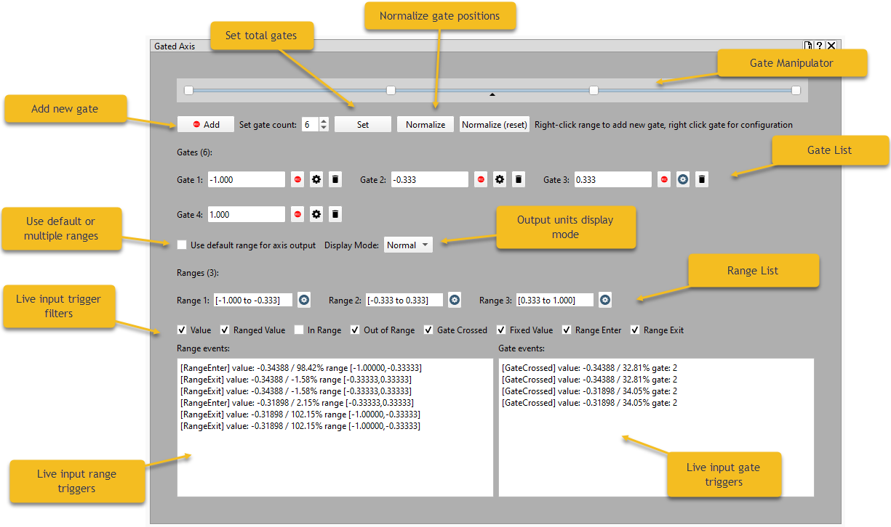

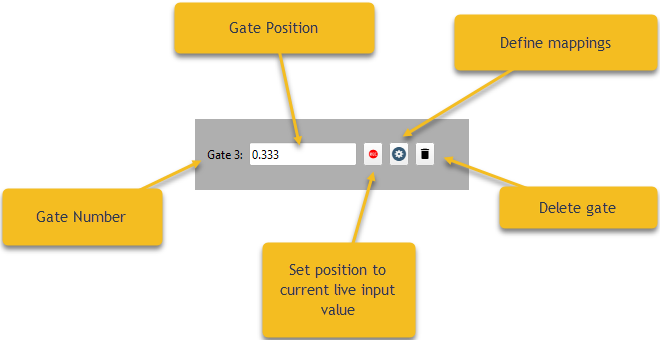

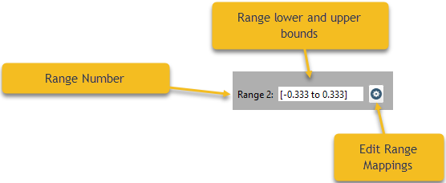

### Gates

A gate is a point along the input axis with a specific floating point value in the range -1 to +1.  

Up to 20 gates can be defined.

A gate can be added to the action by right clicking anywhere on a range, or adding a gate manually.

Gates can be moved by the mouse, or by clicking the record button which will move the gate to the live input position (the black marker on the display), or the value can be manually input.  The mouse wheel over the gate position number will also increment or decrement the gate's position.

### Gate mappings

The gate mapping configuration window is access by clicking on the gate's configure button, or right clicking a gate.

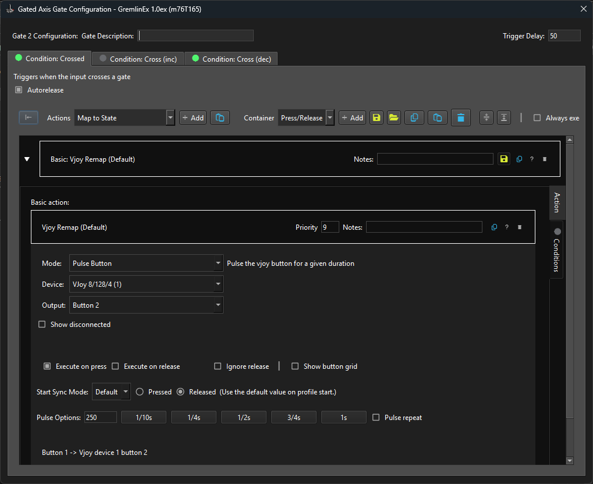

Each gate condition has its own set of mappings.   Mappings will see the gate as a momentary (button) input so only actions suitable for a button will be available for selection.

| Condition      | Description |
| ----------- | ----------- |
| Cross | The gate will trigger whenever the input crosses the gate |
| Cross (inc) | The gate will trigger if the gate is crossed from left to right, or in increasing value |
| Cross (dec) | The gate will trigger if the gate is crossed from right to left, or decreasing value |

### Gate Delay

The delay is a value in milliseconds that determines how much time elapses between a press and release action.  Internally a gate will mimic a button press, so will send two specific events to sub-actions on a gate, a press action, followed by a release action.  Setting this to zero means the two are instant.  The default value is 250 milliseconds (1/4 second) which is enough time for most games to capture the input, either a keyboard press or a button press.

### Ranges

A range is defined by two gates.  The number of available ranges depends on the number of gates, and the size of each range depends on the position of the two gates representing the lower and upper end of the range.   Ranges are automatically computed based on gates, and adjust whenever a gate is moved.

Ranges cannot overlap.

### Default range

If individual range mappings are not needed, a default range corresponding to the entire input axis is defined.  A checkbox toggles this mode on/off.

### Range mapping

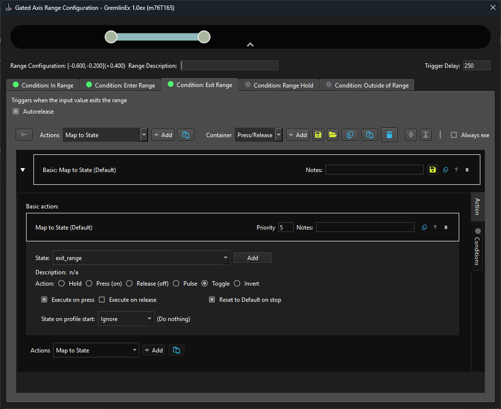

A range lets you map actions whenever the input enters a range, exits a range, or is within a range.  Each as its own set of mappings.

Actions mapped to a range will see it as a joystick axis input.

| Range Trigger  | Description |
| ----------- | ----------- |
| Enter Range | This will trigger whenever the input value enters the range.  This triggers once every time the input enters the range.  |
| Exit Range | This will trigger whenever the input value exits the range. If the range is a boundary range (at minimum or maximum of the input range), it will still trigger.  This triggers once every time the input exits the range. |
| In Range | This will trigger whenever the input changes within the range.  This is useful to send axis data out based on the position inside a range.  This triggers on any input change. |
| Outside of Range | This will trigger whenever the input changes and is not in this range. This triggers on any input change. |
| Range Hold | Sends a press to mapped actions when the input enters the range, sends a release when the input exits the range. |

### Range output mode

Ranges have multiple output modes that affect the output value sent to mappings.

| Mode      | Description |
| ----------- | ----------- |
| Normal | The value is output as is (this is the default) - this is also known as the pass-through mode.  |
| Output Fixed Value | Mappings get a fixed value whenever the range condition is triggered. This is helpful to freeze the output to a fixed value.  |
| Ranged | The value is scaled to the range's defined minimum and maximum. By default the minimum and maximum match the bounding gate positions, but this can be changed to any valid value to scale the output.  |
| Filtered (no output) | No value is output in this mode. Use this to suppress output when the input is in a given range. |
| Rebased | This is similar to ranged mode, and the bounds are set to -1 to +1 so each range acts as a full output axis. |

Whenever you add or remove gates, ranges are added or removed as well.  It is recommended you don't configure ranges until you have the number of gates finalized to avoid inadvertently loosing configured actions because a range was deleted as you removed a gate.  GremlinEx will confirm deletions.

### Default range

The default range is a special range that is used for how the gated output should behave when the input is not in configured range.   A configured range is a range that has actions and modes defined. The default range is used when a range exists, but is not configured to do something special.

You can use the default range to your advantage by only configuring special ranges in the input axis - and let the default range handle what happens when the input is not in the special ranges you've defined.

### Use-cases and scenarios

The gated axis plugin can be useful for a number of scenarios where more sophistication is needed on input axis data.

The plugin can be used for complex axis to button mapping, for establishing complex setups for latched output, for scaling purposes, to suppress output for some input values, allows for stepped throttle settings, and allow for different scale and sensitivity (curves) based on input positions.

Examples for ranges include mapping beta-range for turbo props simulations, trigger fuel cutoff at the bottom of a range, thrust reverser toggle, introduce dead zones along the axis, or split a single axis into multiple axes.

Examples for gates include triggering a mode or setting up a state based on how a gate is crossed (directional) as well as bi-directional.

### Action priority

Certain actions execute last (such as a mode change).  Actions have an internal priority that determines when an action runs.  In most cases, actions are executed top down (in the order they appear), however some actions like a mode change are executed last, and actions that change the input value like applying a curve will execute first.

### Vjoy Remap

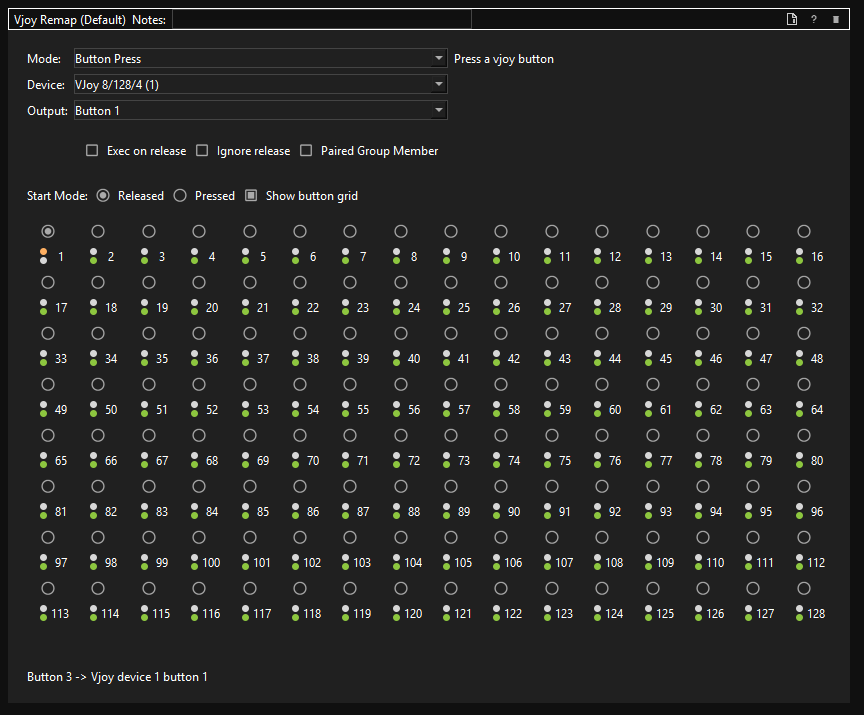

This is the most common action in GremlinEx and lets you map an input (linear or momentary) to a VJOY device.

This action replaces the legacy remap option.  In GremlinEx, this action is the main way to send output to a VJOY device. 

Some of the features of vjoy remap:

- map an input axis to a vjoy axis
- apply an output curve to the vjoy axis based on input
- scale or apply a range to the vjoy axis based on input
- merge the output axis value with one or more input axes using add, substract, multiply, average.
- map an input button to a vjoy button
- map an input hat to a button or a hat
- synchonize the input value to the output on profile start or pick a default value.
- force a button pressed
- force a button release
- toggle a button
- increase and decrease an output vjoy axis using two momentary inputs using a table of values
- convert an axis value to a button
- view which buttons are in-use profile wise

### Gated Axis

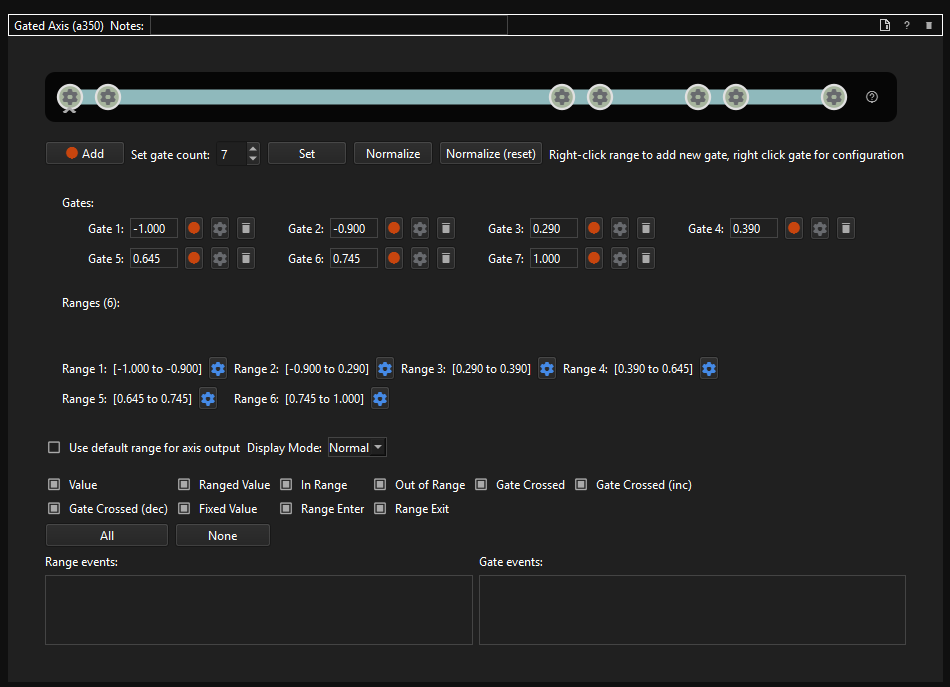

This action lets you split an input axis and define what should happen when

- a range is entered or exited
- a specific point on the axis is crossed

Up to 20 gates or crossing points can be defined (19 ranges). It is possible for ranges to send a fixed value or rescale/change the value of the output.
This container was specifically created for output needs that have "gates", such as throttles used in some simulators.

### Mode Switch

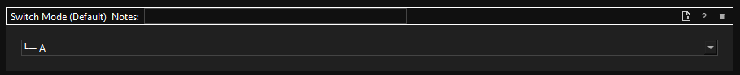

This action lets you change a profile mode at runtime based on an input trigger.

### Temporary Mode Switch

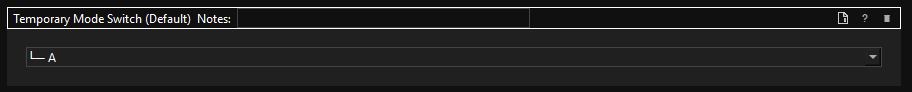

This action lets you change the profile mode temporarily while the input is pressed.

### Cycle Modes

This action lets you cycle modes with each press.

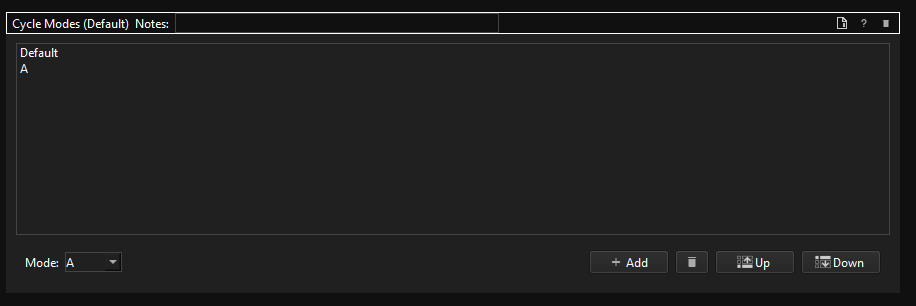

### Map to Mouse Ex

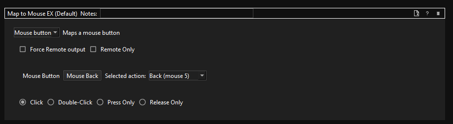

This action lets you send a mouse button/wheel or mouse position change to the output.

### Map to Gamepad

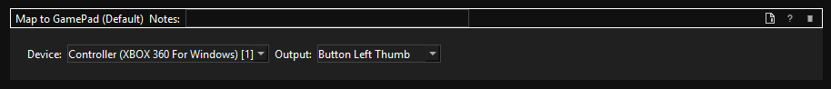

This action maps to a Gamepad (VIGEM) output.

### Map to SimConnect

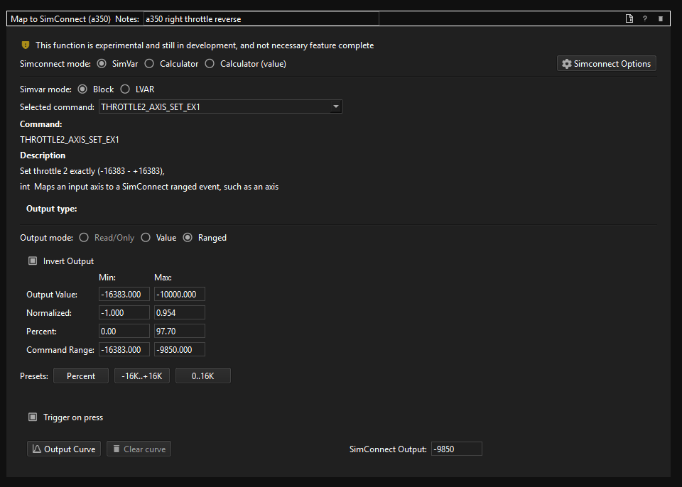

This action lets you send a SimConnect command to Microsoft Flight Simulator via the SimConnect SDK.   This bypasses the need to map any controls inside Microsoft Flight Simulator, and sends the data direct to the simulator to control aircrafts.  This way you completely bypass the MSFS control mapper and send control data directly to the sim, and the add-on.

This includes sending calculation and expressions via the GremlinEX WASM module to read or modify internal simulator parameters defined by addons that are not exposed by the SimConnect API.  In this example, execute the "(>K:AP_MASTER)" internal command.

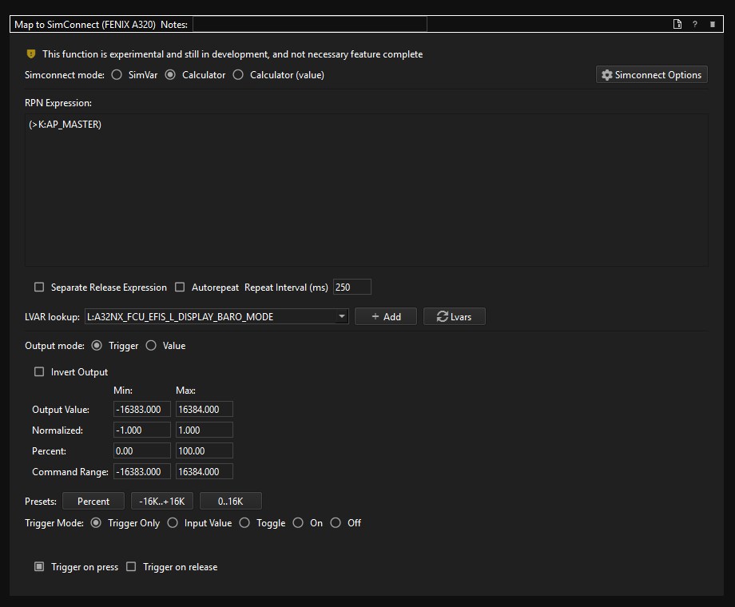

Using the SimConnect mapper from sim variables to calculator expressions requires knowledge of the [Microsoft Flight Simulator SDK](https://docs.flightsimulator.com/html/Programming_Tools/SimConnect/SimConnect_SDK.htm).  

The recommended setup is to have a single profile for Microsoft Flight Simulator, and have a mode for each aircraft type, and under that if needed, a mode for each subtype/variant.  Recommendations including having a setup for Boeing, Airbus, single prop, dual prop, single turboprop and dual turboprop, and quad engine as the base.  The Simconnect options page in GremlinEx while the sim is running will pull the current aircraft and let you associate a mode with that aircraft.  If you find the aircraft uses the default mode, it means it's being reported as a new type and likely needs to be associated with a profile mode for that type.

For aircraft with detents, such as for spoiler or throttles, use the Gated Axis as it was designed precisely for this complicated need and in conjunction with other mapping features make mapping complex throttle assignments relatively easy.

It is also recommended to use calculator expressions as much as a possible due to the capabilities to access add-on variables that are not in SimConnect.  A [guide to calculator expressions can be found here](https://hubhop.mobiflight.com/presets/) with examples for commond add-ons.  All these work as-is in GremlinEx and allow you to access variables defined by each add-on.  

SimConnect itself is a bit of an arcane art due to the historically poor documentation, lack of examples and errors / ommissions which combined with bugs make controlling MSFS via SimConnect an interesting challenge, however one miles better than using the built-in MSFS control mapper.  A number of add-ons also define variables that are not part of the base simulator, so are not exposed by the SimConnect SDK.  The only way to set them is to use calculator expressions, and consult the add-on manual and the MSFS user commmunity for what the variables are.

I often use the built-in debug tools in MSFS to determine what variable to set or what the values should be, including the SimConnect inspector and the example Simvars explorer that comes as a sample project to compile with the Simconnect SDK.

Another avanced used of Simconnect is to have a user plugin capture sim state, for example parking brakes, and update a glass surface widget with the state. This can be done via a custom plugin in GremlinEx using the existing event model and API fro Simconnect via Simconnect Manager, an internal control class in GremlinEx.

### Map to OSC

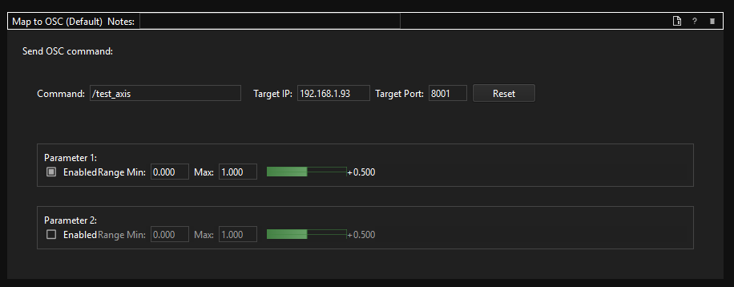

This action lets you send an OSC message to the network.

### Text to Speech

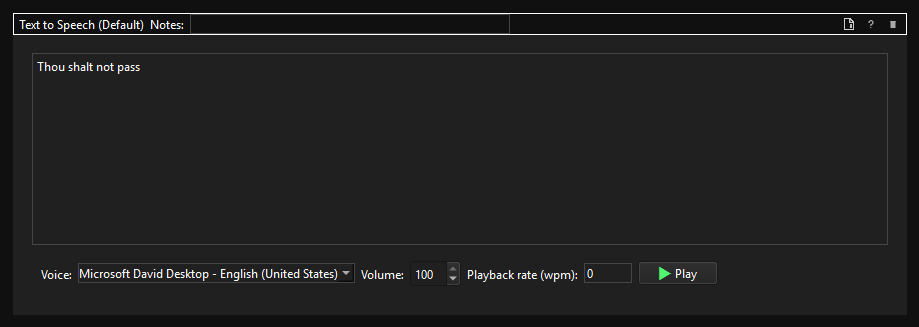

This action lets you send an audio prompt via TTS (text to speech).

### Map to State

This action lets you set or clear a state defined in the profile.  States are defined in the state device tab.

If a state's value is changed and that state is used in an expression in another state, that state is also updated.

### Map to Octavi IFR1

This action sends output to the Octavie IFR 1 to control LEDs and modes.

### Macro

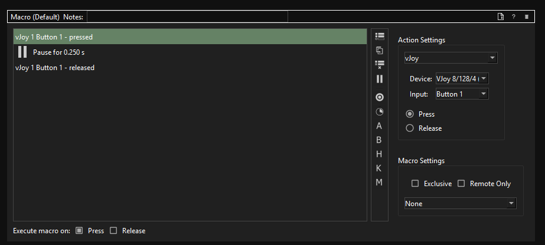

This action lets you send complex sequences of outputs (joystick, keyboard, mouse) complete with timing and delay controls and separate make/break actions for buttons.

### Play Sound

This action lets you play a sound file located on disk.  As of m76T110, the playback device can be selected.  Clicking the default button will select the default Windows device.

As of m76T111, the action includes a number of additional features:

- Ability to playback multiple sounds concurrently
- Ability to trigger the same sound multiple times via repeated triggers
- Playback is non-blocking (the profile continues to run)
- Ability to change timing on how the sample is played back
- Ability to loop the sample multiple times (default count is one)
- Ability to randomize playback by selecting a sound to play from a list of files in a folder.

 The play sound action also has the ability to use AI if CoquiTTS if available.  This feature is not available with the packaged distribution as the AI model cannot be packaged.

It is recommended to use an online text to speech model to create an audio file from text, as this will likely provide the best experience.  The desired output format is a WAV file, although MP3 can also be used.  MP3 playback is not recommended as it introduces latency and takes longer to process over the WAV file format, which is why WAV is recommended for game output use-cases.

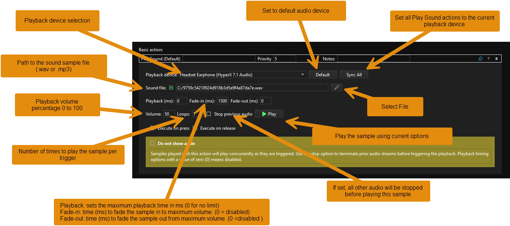

If control-click is used on the default button, the default device is set for all instances of Play Sound in the profile.

The default playback device is the Windows default playback device at the time the action is created.

Volume can be adjusted from 0 to 100 percent.  The play button will play the audio with the currently selected options.

The action supports .WAV files, and .MP3 files.  Note that playback of .MP3 may not work on all systems due to the need for CODECs to be installed.  .WAV format is recommended.

### Trigger (Joystick)

(requires m76T103 or later)

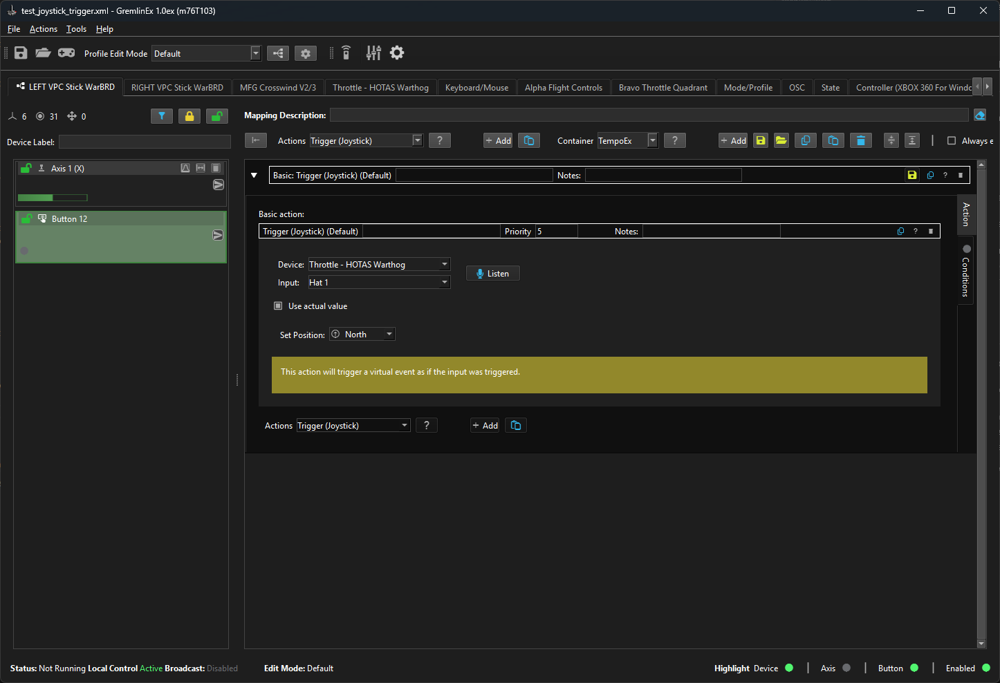

This action is a loopback action that allows one device input (axis, button or hat) to trigger an input on the same or another device called the target device, as if the target had generated that trigger.  The action lets you select the target joystick like device.

Based on the selection, the action will present the ability to set an axis value if the output is an axis.  For buttons, the ability to press or release a button are available.  For hats, the position of the hat can be selected.

A special mode, called actual, will use the actual input value (axis, button or hat) and use that value to trigger the output.  If the input is an axis, it will send the input axis value to the output.  If the input is a button, it will send both press and release triggers to the output based on the state of the input button.  For hats, it will synchronize the input hat with the output hat position.

Additionally, if a button is mapped to a hat output, an input press will set the hat value to the position listed in the action, and the release will set the hat to the center position.

It is not possible to map an axis input to a button or a hat and a warning will be displayed for this particular combination.

Examples of how this action can be used:

- to use an axis on one device and duplicate this axis on another axis on a different device.
- to press a button on one device and duplicate this button state on another button on another device.
- at runtime, to trigger mappings on one device from another device.
- to set the value of an axis on another device by pressing a button.

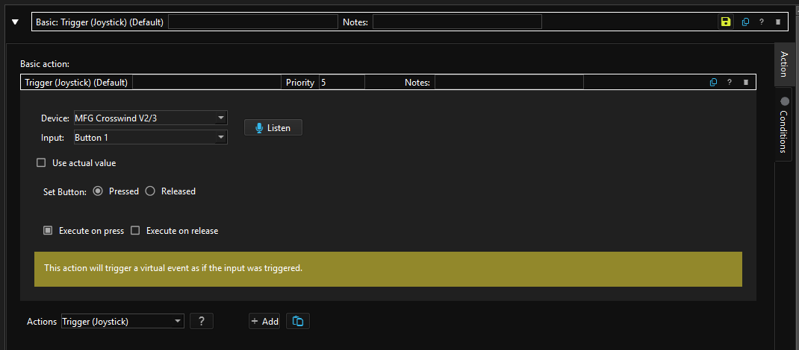

## Map to keyboard/Mouse EX action

This is identical to the base keyboard mapper but adds a few functions I thought would be handy.

The updated keyboard mapper adds separate press (make), release (break) functionality so keys can stay pressed, or just released separately.

It also adds a delay (pulse) function to hold a key down for a preset period of time (default is 250 milliseconds or 1/4 of a second) which is the typical game "detect" range as some games cannot detect key presses under 250ms in my experience.

The make/break/pulse behavior applies to all keys in the action, and the keys are released in the reverse order they were pressed.

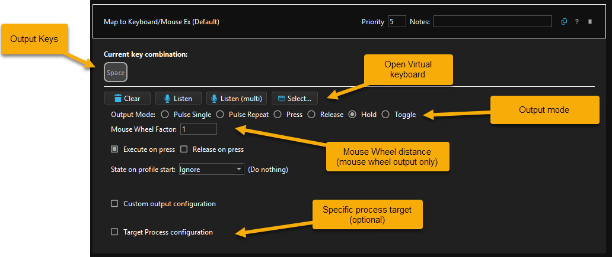

### Output modes

| Output modes | Description |
| --- | --- |
| Pulse Single | Presses the latched keys, waits for the specified time, release the latched keys. |
| Pulse Repeat | Same as pulse single, but auto-repeats while the input is triggered.  The interval between pulses can be specified. |
| Press | Presses the keys |
| Release | Releases the keys |
| Hold | Keeps the keys pressed while the input is triggered.  When the input is no longer triggered, the keys are released.  This is the default mode. |
| Toggle | If the keys are released, they are pressed, and if they are pressed, they are released. |

### Special keys

This action supports the output of non-standard keys, such as F13 to F24 and media keys.  The action also supports mouse buttons 1 to 5 and vertical/horizontal wheel buttons for convenience to avoid having to use a dedicated mouse action for sequences like "left-shift + mouse button 1" or "right-alt + wheel up".

### Wheel factor

For mouse wheel output, the wheel factor determines the distance of the wheel travel.  The default is 1, the smallest possible travel distance, and the number acts like a multiplier (factor).  So for a 3x wheel travel, you would enter a 3.  The default is 1.

### Key order

If state keys are part of the selected key sequence (state keys are left-shift, right-shift, left-alt, right-alt, left-control, right control) - the state keys will be pressed first and released last.  Other keys will be pressed in the order selected.

### Listen option

While the virtual keyboard is recommended to select keys as it lets you pick a specific order, you can also have the action listen to key presses to record them (single or multiple).

### Virtual keyboard

This action provides a visual keyboard to select one or more keys from.

The virtual keyboard is sometimes the only way to specify extended keys such as F13 to F24, audio keys.

The virtual keyboard in GremlinEx includes special keys, such as F13 to F24 and media control keys.  The virtual keyboard also includes mouse button and mouse wheel for convenience to make them behave like keys.

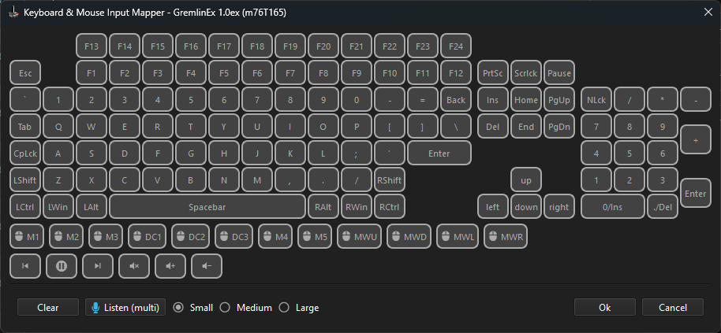

### Sync mode

As of m76T117, the action can synchronize with the mapped input.  If the input the action is mapped to is triggered at profile start (for example, a hardware switch is in the on position), the mapped keys / mouse buttons will be set to match the state of the input when the profile starts.  This mode is designed to keep the profile in synchronized with hardware input panels in simpits.

### Latching

The map to keyboard/mouse Ex action can send very complex and unusual keys and mouse buttons, including keys that are not typically available on a regular keyboard like the F13 to F24 function keys.   The action can also combine unusual "latched" sequences such as pressing more than multiple keys and mouse buttons at once.

### Numlock behavior

The keyboard behavior is hard-coded in the hardware to send duplicative scan codes depending on the state of the numlock key.  To avoid issues, GremlinEx automatically turns off numlock (if it was on) while the profile is running to ensure that the keyboard sends the correct and predictable scan codes.  This can be a challenge in some situations but was necessary to ensure the keyboard mapper sends consistent keystrokes and mouse buttons when the hardware, depending on the state of numlock, sends duplicate scan codes based on its mode.   This ensures that numeric keypad keystrokes all show up as numeric keypad.

### Target process

The default keyboard output behavior in Windows is to send keys to the process that has the focus, known as the active window or the active process.  Other processes called background processes may not see the keys.  To this end, the keyboard action has a way to specifically target a process at runtime if you run into a situation where this is the case.  The target process can be specified by its executable, or its runtime name (including a partial match).  GremlinEx will search for the process at profile start and output keys to that specific process if target mode is enabled and the process is found.  If the process is not found, an error message will be output to the log file and no keys will be output.

## Map to State Action

This feature is only available in 1.0ex m74 and above.  For more information on states, consult the [state device section](usage.md#states) of the documentation.

The map to state action manipulates a state when it's triggered.  This action lets you select the state to act on, and what should happen to the state value:

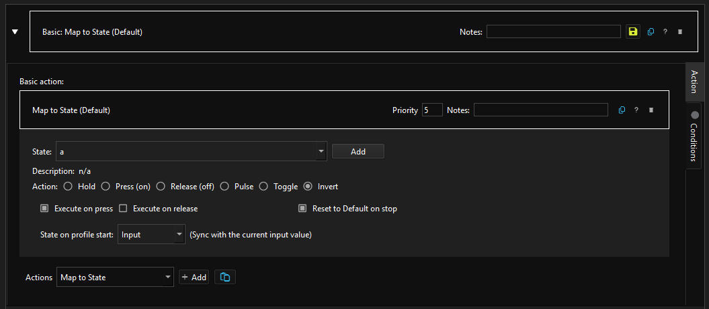

### Operation modes

| Operation | Description |
| ----------- | ----------- |
| Hold | The state turns on while the input is pressed and held pressed, and turns off when the input is released |
| Press (On) | Turns the state on |
| Release (Off) | Turns the state off |
| Pulse | Toggles the state, waits delay milliseconds, and restores the previous state.  Can optionally repeat the pulse while the input is held. |
| Toggle | Toggles the state.  If it was off, turns it on, if it was on, turns it off |
| Invert | Turns the state on if the input is released, and off if the input is pressed |

### New state

A new state can be created directly from the action by pressing the add button.

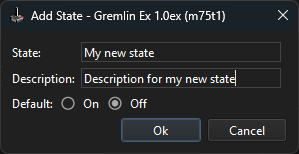

### Input synchronization

The action can synchronize the state value on profile start with the input.  This ensures the state value is set to the value matching the input's state on start.  This is helpful to match hardware panel switch positions for example.

## Map to mouse EX action

This plugin is identical to the Map to Mouse plugin but adds a wiggle function, easy execute on release and button hold functionality. When wiggle is enabled, the mouse will move slightly by itself every 10 to 40 seconds and move back.  It will do that until wiggle mode is turned off.  
  
The purpose of wiggle is to keep an application alive.   Wiggle is turned on/off separately for remote/local clients.

| Command      | Description |
| ----------- | ----------- |
| Mouse Button | Outputs one of the mouse buttons |
| Mouse Axis | Moves the mouse |
| Wiggle Enable (local) | Jolts the mouse every few seconds |
| Wiggle Disable (local) | Stops the mouse wiggling if it was turned on. |
| Wiggle Enable (remote) | Jolts the mouse every few seconds on remote clients |
| Wiggle Disable (remote) | Stops the mouse wiggling if it was turned on for remote clients |