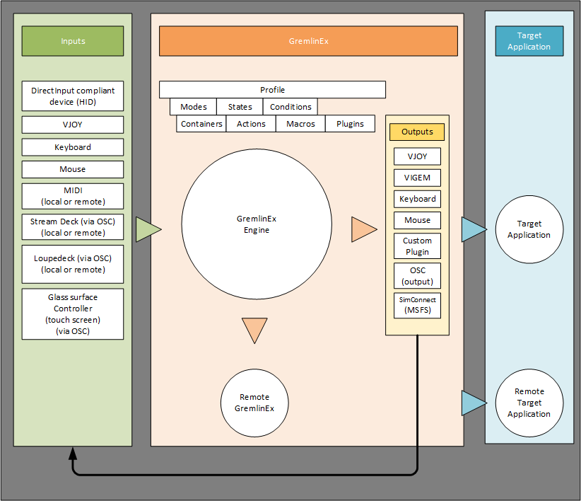

# Introduction

(this documentation is a work in progress)

## What is GremlinEx?

GremlinEx is a universal game/simpit controller integrator: it allows you to take input hardware devices from different manufacturers connected to a local machine, or those connected on a remote machine, such as joysticks, panels,  and HID game controllers, Audio-Visual hardware and software that supports OSC (Open Source Control), MIDI, keyboard and mouse inputs and map them to virtual outputs like VJOY, or keyboard or mouse output, and send that to a game or another process.  GremlinEx maps this input to a simplified and consolidated set of outputs, and it is vendor agnostic.   GremlinEx also has the ability to directly send data to Microsoft Flight Simulator via the SimConnect API.

Gremlin supports glass surfaces (touch screens), hardware panels like StreamDeck, and even MIDI control panels and works well with tools like Bitfocus Companion and Open Stage Control.

The audience for GremlinEx is anyone looking to easily integrate multiple hardware input devices from joysticks to control panels and map it to a game without having to use proprietary vendor software.  GremlinEx includes a rich set of mapping tools for the transformations, from joystick curve editing to conditional output, modes and management of profiles.

A more detailed look at features supported by GremlinEx can be found in the [overview section](overview.md) of the documentation.

GremlinEx is independent from any controller software.  It does not require you to run any specific software from a hardware manufacturer to "map" the device.  So long as the device shows up on Windows as an HID device with axes and buttons, GremlinEx will let you map this input.  It is vendor agnostic and relies on standard APIs that are not vendor specific. GremlinEx works with any HID compliant controller device, so supports any device up to eight (8) axes, up to a hundred and twenty eight (128) buttons, and up to four (4) hats.

There is no limit to the number of input devices GremlinEx supports.

Some of these inputs can be virtual, so GremlinEx can also accept inputs from VJOY while sending outputs to VJOY so long as the input device is not the same as the output device to avoid a loop.

GremlinEx can accomplish very sophisticated condition based routing based on one or more concurrent inputs using conditions and states.

GremlinEx supports the Open Sound Control (OSC) protocol which allows it to receive or send OSC messages to/from suitable devices.  This capability allows GremlinEx to process inputs from touch screen surfaces and hardware panels connected to devices on the network, including the local machine.  GremlinEx can also send data back to these devices to update their configuration, for example, selecting pages to display based on the active profile or mode loaded in GremlinEx.

GremlinxEx (as of M76) supports templates: individual mappings can be saved to template files.  These templates can then be loaded into another input, profile, or shared. Templates have no input information - only mappings.

GremlinEx supports custom Python user scripts for complete programmatic control over the mapping if the built-in capabilities are insufficient or impractical.

## General Architecture

GremlinEx takes inputs from multiple sources, local and network, performs the transformations and mappings specififed in the profile based on the current profile options, container and action configurations, and sends the output as required.

There should be no expectation that a single input always results in a single output. A single input can produce multiple outputs, and multiple inputs can provide a single output.  It's also possible that no output is produced if the input(s) should be ignored based on the particular context.

## Installation

GremlinEx comes as a zip file in the [release section of GitHub](https://github.com/muchimi/JoystickGremlinEx/releases) that contains all you need.

The contents of the zip file should be extracted to a folder that is not a system folder such as "Program Files" or "Windows".

The recommendation is to install GremlinEx in its own folder, like "GremlinEx" and if you will use multiple versions, it's recommended you also name the folder after the version.  This is automatic if you extract the zip File using tools like 7Zip or Nanazip as the folder will be the same name as the zip file.  This enables you to have multiple versions installed.

The master repository can be found here on GitHub: [https://github.com/muchimi/JoystickGremlinEx
](https://github.com/muchimi/JoystickGremlinEx).

### Required additional tools

GremlinEx works with a number of tools to function as a device integrator, such as VJOY.   Some tools are mandatory (VJOY), others are not (VIGEM, Bitfocus) but recommended.

Please see the [resources section](resources.md) for a list of required and optional tools.

### Optional WASM module

The Microsoft Flight Simulator SimConnect module in GremlinEx requires the installation of the WASM module in the MSFS community folder.  This module is what provides GremlinEx with the ability to execute calculator code in MSFS and thus read/write variables and simulator controls not otherwise exposed by the SimConnect SDK (as of this writing).

### Running from source

While GremlinEx releases are provided as self-contained Python packages, you can run GremlinEx directly from source code, especially if you would like to contribute or just see how GremlinEx does what it does.  The recommended environment is [Visual Studio Code](https://code.visualstudio.com/).  When running in this mode, it is up to you to setup the environment and pre-requisites manually.  The GremlinEx project on GitHub includes a Python requirements file listing dependencies.  This is an advanced topic and requires a strong familiarity with Python development, working with Python and Python libraries, installing and configuring these environments, interfacing with C++, using the QT graphical environment, and working with low level hardware and network protocols. Also of note is the dependencies will vary with new releases as the project matures.

### OSC configuration

OSC (Open Sound Control) is a very important feature support in GremlinEx that allows it to communicate hardware panels like Elgato Streamdeck via [Bitfocus Companion](https://bitfocus.io/companion).  The feature also provides support for glass surfaces (touch screens) via tools like [Open Stage Control](https://openstagecontrol.ammd.net/).  While supported in the box, it does require some ports to be specified.

Please see the [OSC configuration section](usage.md#osc-device-open-sound-control) for OSC specific setup to enable this feature.  

### Virus False positives

Unfortunately, some older anti-virus and anti-malware programs may flag GremlinEx (and any Python packaged applications) incorrectly, known as a false-positive.  See more on the topic and options in [this section of the documentation](usage.md#antivirus-false-positives).  It should be noted that most malware and anti-virus tools correctly handle the false-positive.

## Resources and help

&nbsp;Please join our  [GremlinEx Discord](https://discord.gg/pNadcReth9) server!

## History

GremlinEx is based on a fork from the 2019 [Joystick Gremlin by Whitemagic](https://whitemagic.github.io/JoystickGremlin/).  GremlinEx builds on that excellent software and its concepts, and incorporates notable modifications and enhancements:

- x64 bit support and current Python environments/libraries
- remote control of GremlinEx instances
- Built-in state machine with user defined states, including support for boolean state expressions and state triggered mappings
- Built-in support for the [OSC](https://en.wikipedia.org/wiki/Open_Sound_Control) protocol and [MIDI](https://en.wikipedia.org/wiki/MIDI) devices.
- Streamdeck, Loupedeck and other panel two way control.  To simplify and greatly enhance capabilities, highly recommended via [Bitfocus Companion](https://bitfocus.io/companion)) to simplify the setup with GremlinEx
- Support for custom glass surface controller support (touch screen use-case)
- Built in-support for Microsoft Flight Simulator 2020 and 2024 control via the SimConnect SDK including a custom WASM module for calculator expressions and access to custom sim variables
- Advanced containers and actions included.
- High performance runtime execution graph engine (starting with m73)
- Advanced latched keyboard and mouse inputs
- Support for extended keys including F13 to F24 and media keys
- Selectable voice and playback speed for text to speech prompts
- Modern user interface with dark UI theme support

While GremlinEx is based on Joystick Gremlin, it's important to note they are not the same software, certainly not internally, but also from the standpoint of behaviors.  GremlinEx is heavily event based, has a completely different execution engine.  While legacy profiles may load in GremlinEx, complete compatibility is not assured.

GremlinEx makes an attempt to keep with the philosophy and concepts of the original project as much as possible, and I am grateful to WhiteMagic and his excellent work on Joystick Gremlin and for the inspiration. Joystick Gremlin remains one of the best mapping utilities I have ever seen or used in decades of simpit simulation.  The architecture is elegant and served as a launchpad for GremlinEx.

GremlinEx is in active development and thus may include bugs and issues refered to as dragons.  Rather than releasing new features and fixes sporadically, I have adopted an open development model where pre-releases are posted to the dev branch for you to use as the features and fixes are implemented.  Some are more bleeding edge than others.

I am a firm believer that open development outweighs the drawbacks, it encourages feedback and input and participation from the community. I appreciate the patience as not everything will work in every pre-release patch as expected, that is part of the process.
  
