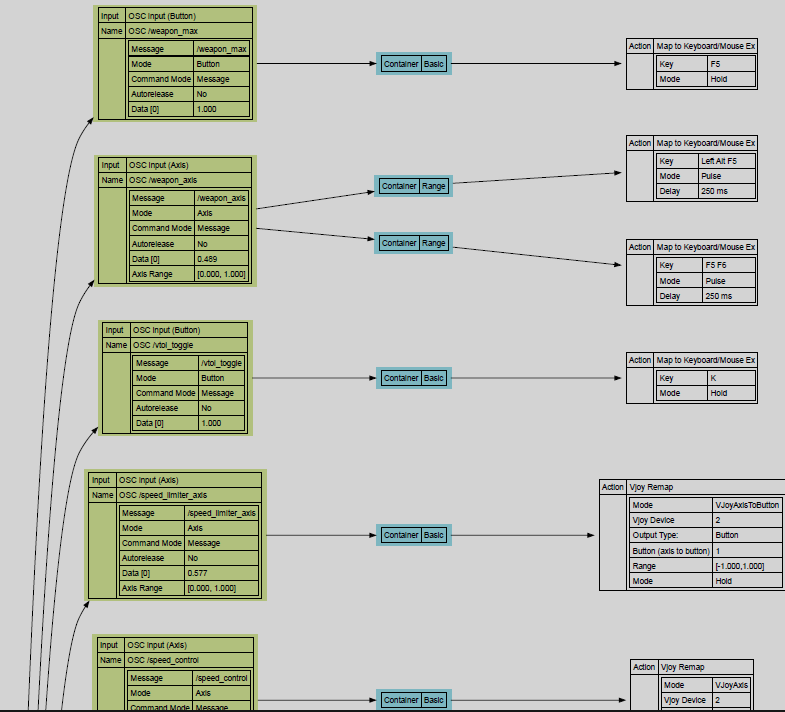

# GremlinEx Overview

GremlinEx or GEX is a universal controller integrator: it allows you to take input from multiple hardware devices from different manufacturers connected to a local machine, or a remote machine, such as joysticks and HID controllers, OSC (Open Source Control), MIDI, Keyboard and mouse inputs and map them to virtual outputs like VJOY, or keyboard or mouse output, and send that to a game or another process.

GremlinEx is oriented towards simpits and hardware vendor integration, without the need to run individual vendor's software.  

The integration piece comes from the ability to combine inputs together into a logical output via a set of filters and transformations, and output this to applications running on the same system.

## Key Features: What can GremlinEx do?

This is a summary of some of the feature set in GremlinEx.

### Mapping and transforms

GEX takes input such physical (hardware) USB connected joysticks, gamepads, keyboard, mouse, and other specialized input devices like state and OSC network messages, and lets you apply a mapping, also known as a transform, to each input.  GEX supports mapping of buttons, axes, sliders, hats, or more complex inputs such as latched keystrokes (one or more keypress combination), and other input such as MIDI or OSC input (described below).

The mapping process can have logic applied to it, such as conditions, so that the mapping can be conditional on a specific context being true.  This can be "is this button also pressed", "is this axis value in this range", "are these keys also pressed", "is this state off", all in various combinations.  Conditions work across all inputs so one input can be used to manage the mapping of another device.

Axis (linear) input can be curved and calibrated.  In fact, multiple curves can be applied, and the curves can be conditional as well.  For example, you can invert an axis but only if a condition is true, and when the condition is false, the axis will not be inverted.

GremlinEx handles multiple inputs and outputs concurrently.  Routing can change mappings based on conditions, modes and states, and this can be changed dynamically on the fly.

As of M76T68, GEX supports using vJoy as an input and output device simultaneously.  This enables scenarios where an input in GremlinEx triggers map to a vJoy device, and when that vJoy device changes, it triggers an input back into GremlinEx to trigger more actions.  This can create loops, so care should be excercised to not build a loop regardless of the sequence of events.  GremlinEx does not check for loops as they are too expensive performance wise to detect and guard against at runtime.

### Agreggation of multiple devices

GremlinEx is designed to simplify mapping for a game or application so that the application has much fewer devices to map.  The first major benefit is to reduce the number of input devices, as many titles only "see" a few joysticks, and if you have a simpit, you could have left, right, center controllers all connected at the same time, and you may use some of them, or all of them, to map to the same input.  This can be very difficult to do in some games.

GremlinEx is vendor agnostic so any mapping software that is proprietary to a particular manufacturer does not need to be used in most cases.  GremlinEx will use the raw device capabilities as seen by Windows, so as long as the device shows in Windows without software as a game controller, GremlinEx can create mappings for it.

GremlinEx can combine inputs from multiple types of devices:  GremlinEx lets you merge data from different devices (such as axes on two or more controllers), or use controller button and axis values as conditions to decide if other output should go through or not.

### Dynamic routing

Because GremlinEx has conditions and modes and states, you can "route" the input to different outputs, as well as modify the output in a dynamic way. You can take a single input and map it to different outputs depending on what you need.  So a toe brake on a rudder can become an accelerator or brake pedal for a vehicle on the ground, or an up/down strafe if you are in a spaceship, or plain toe brakes if you are in an airplane with differential left and right brakes.   You can have a button that is normally your primary trigger button control different weapon groups depending on the mode GremlinEx is in.  An axis can inverted dynamically, or different response curves applied to control, for example sensitivity.

### VJoy output

The main purpose of GremlinEx is to map inputs from various devices to VJoy virtual joystick devices.  The idea is while the actual joystick hardware connected to the machine is hidden from an application or game via HidHide, the application or game can then map its inputs to the virtual VJoy devices.  This allows much simpler mapping in a game when multiple hardware devices are available, as well as very complex mapping scenarios using conditions, modes, combination of inputs, tracking of state applied to the logic controlling the VJoy devices.   This feature, when combined with mouse and keyboard management done by GremlinEx allows for a highly customized experience with application and game control.

### VJoy as input

GremlinEx supports concurrently VJoy as an output device, as well as VJoy as an input device in the same profile.  When a VJoy device is configured as an input, it will add a new VJoy device to the list of input devices that can be mapped to in GremlinEx. When the VJoy button, hat or axis is set, either by another GremlinEx mapping, or a third party application, the input will trigger and GremlinEx will generate output based on the mappings for that input.

By design a mapping that triggers a VJoy output will also trigger that VJoy's input, if mapped and enabled, from the same profile.  This allows VJoy to be used as a bank of axes, hats and buttons for multiple parts of a profile to interact with.  A common scenario is to setup extra VJoy devices to increase the number of buttons, hats and axes GremlinEx can use to keep track of states without having to use custom plugins, or the GremlinEx state machine.

 It is generally discouraged to use the same VJOY device both as input and output in the same profile due to API limitations that can lead to race conditions, execution loops and deadlocks where VJOY devices could become "locked".  This is because the VJOY software is designed for it to be used per process as either input or output, not both (while possible as we work around this in GEX).  VJOY as input is meant to be used as a way to capture VJOY input data set from a different process (application).  It is supported in GEX, but has caveats that need to be considered when designing the profile to avoid these issues.

 VJOY input devices tend to create a significant number of inputs that GEX needs to track - up to 140 inputs per VJOY device used as input.  This can degrade user interface (UI) performance and increase the memory footprint at design time because of the need to visualize and track all these inputs.  Use the input filtering option available as of m76T115 to reduce the number of inputs visible in VJOY devices to keep the input count to a reasonable level.  The impact level is based on hardware capabilities, and the total number of inputs managed by GEX.  It is usually not an issue until you start getting into 400 to 500 inputs GEX has to track at the same time at edit time.  This does not impact runtime performance at all.  If you start noticing edit time performance degradation, it is likely due to the number of inputs and filtering should be used to keep that to a reasonable level.

### VJoy manual control

GremlinEx's Input Viewer, as of m76T95, can be used to manually set buttons, hats and axes on any VJoy device interactively via the Input Viewer.  This can be helpful to assist with profile design and testing.

### In-game mapper augmentation

GremlinEx can achieve very complex mappings that are not supported by a game.  It can take complicated inputs (such as from multiple controllers) and map it to something the game does support, and the game does not need to be aware of these inputs, as it will not see them.  The game will only see a supported command.

For example, you can combine inputs such as a keyboard key in combination with a joystick button and map that to a unique function in the game, even if the buit-in game mapper does not support these kinds of cross-hardware combinations.

### Easy mapping to game defaults

Certain titles have less than ideal mappings, for example, not supporting DirectInput joysticks but having support for a console game controller.   GremlinEx can bridge this gap by producing output the game expects, even if the game doesn't support specific inputs that GremlinEx supports.

It is generally recommended to use GremlinEx to map to default settings in a game, which avoids having to change mappings in the game itself.  This can greatly simplify game mapping for simulators in particular.

### Input and output from/to glass surface panels (touchscreens)

GremlinEx map input from/to glass surfaces (touch screens) and hardware panels like Streamdeck using the OSC protocol using open source software.  Using OSC open source software like Open Stage Control, you can design custom glass surface input screens and map them over the network to GremlinEx.   GremlinEx supports both message triggers, and axis including multi-axis data inboud from a glass surface, such as a slider or an XY pad.  

#### Networked devices support

GremlinEx has a built-in capabilityu to use controllers attached to one computer to control another and deliver the output to a game over the local network.

#### Direct support for Microsoft Flight Simulator

GremlinEx has built-in support to directly control Microsoft Flight Simulator without using the internal MSFS mapper.  It uses the SimConnect interface to do this, and a custom WASM module to access internal variables not supported via SimConnect (as of this writing).

### Profiles

In GremlinEx, a set of device mappings is saved as a profile.  The profile contains all the configuration and mapping information from an input to an output.  Profiles are usually associated with a particular target application.  GremlinEx has a mapping feature that lets you attach a profile to one or more Windows processes.  GremlinEx can switch to the associated profile when the process becomes active automatically.

Profiles are saved as XML files.  Because they contain specific hardware information that is unique to the machine, profiles cannot usually be shared from one  machine to the other.  GremlinEx does include some simple mapping when you attempt to load data for a device it cannot find.  In this case the profile will load and show devices it cannot find as disconnected.  Their mappings can be copied to devices that do exist.

Important: device IDs can often change in Windows when new firmware is applied to a device, or the device is connected to a different port.  The same device connected to different machines will typically have a different ID specific to that machine as well.  

For this reason it is highly recommended to minimize connecting/disconnecting hardware devices, to avoid potential ID changes as these can be quite time consuming to resolve.

Note: GremlinEx uses the ID of the hardware, not the index of order of appearance so the order the devices appear in Windows is not relevant to GremlinEx's operation.

### Joystick and game controller integration

GremlinEx accepts inputs from any number of HID game devices and maps this input, apply a number of transformations and filters, and creates output virtual joystick (Vjoy) device, a virtual gamepad controller (via Vigem), keyboard and mouse output, OSC network messages and others.  GremlinEx supports input from Arduino and Rasberry Pi when those devices are in HID "game controller" mode. 

GremlinEx supports HID devices that report as game devices, and the supported inputs for each includes linear input (axis), momentary input (button) and four or eight way hats.  HID devices under Windows are limited to 8 axes, 128 buttons and four hats per device.

GremlinEx also has a loopback mode where VJOY devices can be used as inputs.  In this mode, GremlinEx will not be able to map outputs to the same input as that would create a loop.  This feature is intended for other software that also uses VJOY to provide input to GremlinEx.

### HIDHide support

GremlinEx is designed to function with [HIDHide](resources.md#hidhide).  HID Hide enables "hiding" of HID inputs that could conflict in a game with the mapping done by GremlinEx when detecting inputs. Many games also only support a finite number of HID devices, and many cannot handle more than three.  

HIDHide solves both these problems: the idea is to "hide" the raw hardware inputs used by GremlinEx from the game so they are only visible to GremlinEx.  This way, the game only sees the GremlinEx output devices (VJOY and VIGEM) when doing the in-game mapping, and does not see the devices actually connected to the machine.  There are thus no conflicts and no confusion with the in-game mapper as to "which device am I reading from".

It is essential to have the GremlinEx executable white listed in HIDHide so it sees the raw hardware devices.

### Joystick curves

GremlinEx can apply linear, cubic and bezier curves to an input to modify the response.  Such curves are usually called response curves or sensitivity curves.  Multiple curves can be applied to the same input, for example, a curve on the input itself, and a curve on the outputs.  Curves applied to outputs are only applied to a particular mapping.  Curves can be manipulated, and GremlinEx supports presets, both built-in and custom user.

It generally is not appropriate to apply two response curves on the mapping side as that can lead to undesirable output values, so while it's possible, ensure the applied curves do not inadvertently produce undesirable data.

While curves can be applied as a standalone mapping, it is recommended to apply curves directly to the vjoy remap action.  One reason: this curve is applied to the merged axes.  Execution at runtime is also faster as it avoids a step.

### Joystick calibration

GremlinEx can apply calibrations to noisy joystick inputs to dampen the input received.  The calibration can automatically detect the range of inputs and normalize it to min/max values, and adjust the center position as well.  Calibrations apply to the device, and thus to all profiles.

Rare: If you need to apply different calibrations to each device on a per profile basis, please use the response curve ex action.

### Axis gating and processing

GremlinEx supports several axis splitting tools, including the advanced Gated Axis that introduces the notion of gates (fixed points on an axis) and the ranges between them.  Gates and ranges have their own trigger points.  Gated axis is aware of when a gate is crossed, the direction the crossing happened, and if the current position is entering or exiting a range, outside a range, or within a range.

GremlinEx can trigger separate mappings (actions) when the input axis crosses a gate or is within a range.

Because each gate or range has its own separate triggers, it allows for very detailed and customized control of mappings at specific points, or within ranges of the axis or slider.

#### Gated Axis Examples

- to implement gates on an axis like on aircraft throttles, such as the F16, A10, Airbus throttle or a turboprop aircraft for flight simulation and helicopter collectives, and thrust reverse mapping.
- to trigger different output based on the direction of travel when the input crosses a particular point.
- to implement multiple response curves on the same axis by section.
- to split an axis into several non linear ranges, each with its own output curve, scale, direction, including no output/deadzones.
- to trigger outputs based on the direction of travel on the input, so a trigger passing through a point going up can be different from a trigger of the same point going down.
- to scale output within a range
- to setup deadzones or fixed value zones within an axis (no output or fixed output while in range)
- to support gated hardware or physical detents on input hardware that does not trigger inputs at these locations
- to implement virtual hardware detents if the hardware does not support physical detents

### Axis merging

GremlinEx's vjoy mapper can merge multiple input axes (two or more) from the same or different devices.  Each merge can apply a specific calculation such as min, max, average and sum operations to the merged data.  Scaling of one axis with another is also supported.

A use-case for this feature is the need to combine two inputs into a single output, such as brake pedal toe-brakes to a single linear axis (used in Star Citizen staffe for example).

Another use case is to scale one axis with another.

### Integrates with Elgato (R) Streamdeck, LoupeDeck and any support panels by BitFocus Companion

GremlinEx integrates with any control surface supported by [BitFocus Companion](https://bitfocus.io/companion) via the OSC protocol.  This is a two way communication so GremlinEx can accept OSC messages triggered by Bitfocus Companion, and send messages back to BitFocus Companion to update the panels.  With this integration, it is possible for GrmelinEx to accept input, and send data back to hardware panels connected locally and on the network.

Examples of this include:

- call up pages on Streamdeck or Loupedeck on profile load or mode activation
- map rotary encoders from Streamdek or Loupedeck
- map buttons and sliders to GremlinEx as input
- modify panel buttons or messages from GremlinEx
- use Bitfocus Companion and GremlinEx only (no need for custom software from each vendor specific to their panel and worry about protocols or plugins).

Click [here to see the extensive list of supported hardware devices](https://bitfocus.io/connections) through Bitfocus Companion. 

### Supports glass surface input from touch screens, tablets and phones

GremlinEx uses the OSC protocol to get input and send data back to glass surfaces via applications such as [Open Stage Control (open source)](https://openstagecontrol.ammd.net/), [Hexler Touch/OSC (payware)](https://hexler.net/touchosc) and [OSC/Pilot (payware)](https://oscpilot.com/).  These applications let you design any control surface on a touch panel, including buttons, knobs, faders, XY pads.

The recommended application for Windows touch screens is Open Stage Control: it is open source and it supports javascript scripting, CSS based graphics and animations including strips, and custom CSS based widgets.  Open Stage Control is currently supported on some flavors of Linux as well.

The recommended application for iOS and Android is Touch/OSC, althoug as of this writing, Touch/OSC is incapable of using images but has good scripting via LUA.
OSC/Pilot supports graphics and works on iOS as well. OSC/Pilot as of this writing does not support scripting.

This enables any networked touch screen to be used with GremlinEx as a two-way control surface.

Note: Windows is currently not able to support input from a touch screen without changing the focus to the touch screen window away from the game, which can cause some challenges with process focus and window pops and input capture, even on multiple monitors.  To use a touch screen, it's recommended to run the touch screen from a separate network device.  Because OSC is a network protocol, GremlinEx can easily communicate with these tools on different devices on the network.

### Supports MIDI inputs

GremlinEx can accept input from older MIDI controllers.  These controllers like the Korg Mini include buttons and faders that can be used to map to a game.  Many MIDI control surfaces, while using an older protocol, can still be effective in a simpit due to the number of knobs, faders and buttons typically available on a MIDI controller.  It's also possible to network MIDI via [RTP-MIDI](https://www.tobias-erichsen.de/software/rtpmidi.html).

To use local MIDI devices, a [MIDI loopback tool](https://www.tobias-erichsen.de/software/loopmidi.html) will typically be needed to make the necessary ports available.  

### State machine

GremlinEx implements a state machine.  A state is a binary entity that has either an on/pressed state, or an off/released state.  A state can be seen as a virtual button, or a boolean (on/off) variable inside a profile.

States can be set or cleared via any GremlinEx input using the Map to State action.

The value of a state can also be defined using other states using boolean expressions.  In this mode, a state gets its value from a computation of the dependent states in the expression.  This value is updated whenevever one of the states in the expression changes values. 

States look like input buttons to containers and actions, so any mapping that can be attached to a button can be attached to a state as well.  

States can also be used as conditions.

States are mode agnostic - so they exist all the time in a profile, and can be accessed by any mode, or set by any mode.

This feature allows simple, yet interesting grammar based control schemes, such as conditions and compound mappings.  States generally simplify complex mapping scenarios.

States can be set from any input via the "map to state" action or from a macro.

States auto-update if the state is an expression and a dependent state changes.

States trigger both a press and release event, so to actions look like any joystick button and no different from pressing and releasing a physical button.

Because there is no limit to the number of states a profile can have, states can be also viewed as virtual button pads.

#### Examples of state usage

- A state can be set by multiple inputs, enabling shared used of mappings between devices.  This avoids having a copy of the same mapping for differentt inputs, and reduces the maintenance load if the mapping needs to change.
- States can be used as a condition that itself is based on multiple other states using the expression capability.
- Setup a simple [state machine grammar](https://en.wikipedia.org/wiki/Finite-state_machine) implementation
- States can often replace modes, or be used as sub-modes within a mode.
- States replace the need to use VJOY as input which is far more performing and flexible than using VJOY as both output and input into a profile to add virtual buttons.

### Modes

Modes represent a set of mappings in a profile.  A profile has at least one mode, called the default mode, and appropriately named "Default". Modes contain a set of mappings across all devices, except for states, as states are profile wide and work in any mode.  If two modes are created, say A and B, mappings in B can be different from A, essentially having a duplicate set of modes.  A practical example of this is for a Flight Simulator, you can have a mode per aircraft type, each with different input mappings suitable for that aircraft, so for example, using a side stick for an Airbus or a fighter jet, and a yoke for a Boeing or general aviation aicraft.  Or you can have a mode for driving, a mode for first person, and a mode for flying.

Modes can be toggled from inputs, and modes can also be cycled temporarily or in sequence in round-robin fashion.

Modes are hiarchical as well.  A mode can have multiple child modes and each mode can have a parent mode. Because each mode has its own set of mappings, the way modes work is that if a child mode has no mappings defined, it inherits the mappings of the parent mode.  If a mode does define a mapping, and that is also defined in the parent, the child mapping overrides the parent.

When a profile starts, GremlinEx can trigger a mode change to the startup mode defined in the profile configuration as the startup profile.

Modes also have a pair of triggers associated with them, so a mode can trigger mappings on mode entry, or mode exit.  This can be used for example to reset values.  These are set in the Mode/Profile tab.

A profile must have one mode defined at all times.

### Remote control

GremlinEx can control another GremlinEx instance running on the local network.  This is useful if you have HID devices on one machine, but need to send that output to another machine on the network.  GremlinEx sends the same output to network clients, and buttons can be mapped to enable or disable the feature on the fly.

This particular feature is used to use inputs from one machine to control outputs on another on the fly.  This was created specifically to support simpits with multiple computers accepting inputs either for performance reasons, hardware needs, or for convenience.  This is a good use of older hardware as well.

### Conditions

Conditions can be applied to filter output based on state and input button/axis values.  Conditions can be based on specific input ranges or pressed/released state, and can also be based on a state value.  Conditions must be met for a trigger to execute a mapping.

Conditions can be applied to a container, or a single action.  Conditions are cummulative, meaning that each mapping can have one or more conditions applied.

### Support of complex latching of keyboard triggers

GremlinEx can trigger on multiple key combinations, including unusual ones. It is possible to setup a trigger that requires five keys to be pressed at the same time. Any key and mouse input can be used in the latching trigger.

### Support of atypical keys

GremlinEx supports input/output of atypical keys such as media controls and F13 to F24.   GremlinEx also treats mouse output as a key, which is helpful for some scenarios. The keyboard mapper can output any mouse button and wheel output (mouse motion is also supported via the mouse mapper if mouse motion is needed).

GremlinEx also has for each output the notion of a press (make) and release (break).

### Pulse function

Most momentary outputs like joystick buttons, key and mouse buttons, and SimConnect have a pulse mechanism.  The pulse allows GremlinEx to send repeated outputs while the input is triggered, and stop when the input is released.
Some outputs have a pulse duration (how long the pulse is - or the time between a press/release cycle triggered by the pulse), and a pulse interval, which is the time between pulses.
Some outputs can only be momentary (example, SimConnect), and thus only have a pulse interval value to set.

### Macros

GremlinEx supports macros in a couple of ways.  The first is the macro mapper, which allows for delays, keyboard, mouse and joystick output to occur in sequence whenever an input is triggered.
The other is the sequential container which allows for actions that are not directly supported by the macro. 

In both cases, the order of output is always top to bottom, so the execution order is predictable.

### Rich set of mapping actions and containers

GremlinEx has a rich set of mapping actions aimed at simulation and game output.    GremlinEx can merge multiple input axis values from multiple inputs to derive a single axis value, or supports breaking up input axis with stepped and gated triggers on specific points or ranges.   Containers group mappings for additional functionality.  GremlinEx supports macros.

For example, a button can be used to trigger a complex macro, set a value on a joystick, say something with Text To Speech (TTS), change a profile mode, or sends keystrokes to an application.

An axis can map to an axis, or can be setup to trigger specific actions based on the position of the axis and the direction of travel.

### Custom plugins (advanced)

GremlinEx exposes much of its internal API to custom Python based modules that can be attached to profiles.  User plugins are attached to a profile, and are loaded dynamically when the profile starts.  User plugins can be used to further provide complete control of mappings and output using the full Python language.  Gremlin defines a number of decorators to make programming simpler, however GremlinEx also exposes its event system to plugins, so plugins can respond to events just like internal GremlinEx components can.

Plugins can be used to set LEDs, or do complex logic that would be difficult to do with states and conditions alone.

User-defined mapping plugins and containers can also be created and installed into GremlinEx.  These need to meet specific requirements and allow custom expansion of GremlinEx capabilities.  Most containers and actions in GremlinEx are implemented using these plugins.

### Visualization

As of m76T85, GremlinEx can create a graphical view of a profile leveraging the open source [GraphViz library](https://graphviz.org/).  This creates a PDF or SVG visual graph of the profile (PDF is recommended)

## Supported environments

GremlinEx supports Windows x64.   The [resource section](resources.md) covers the recommended versions and software.

## Installation

GremlinEx comes as a pre-packaged Python 3.x executable.  There is no need to install Python or dependent libraries as all the needed files are included in the package.

### Microsoft Flight Simulator SimConnect SDK support

GremlinEx comes with a WASM module for Microsoft Flight Simulator that must be placed in the community folder.  This module enables GremlinEx to send calculator expressions to the simulator to control aircraft and systems not available yet via the SimConnect SDK.

GremlinEx was tested with MSFS 2024 including all current beta versions.

### VJoy support

GremlinEx was tested with VJOY 2.9.1 64bit.  There are several releases of VJOY however however 2.9.1 is the one tested and verified to function with Windows 11.  

GremlinEx does not currently support force feedback inputs, nor output via VJOY.

GremlinEx supports up to 8 axes, 128 buttons and four 8-way hats on each VJOY devices.

It is recommended to have no more than three or four output VJOY devices, the primary reason being that many games only understand the first three HID devices.

All defined VJOY devices must have a unique combination of axis, button or hat counts.  This is how these devices are differentiated as different devices as they all have the same name as currently defined in the device driver.  GremlinEx will throw an error if two VJOY devices have identical numbers of axis, buttons and hats.   The suggested method is to remove a button, so the first can be setup with 128 buttons, the second 127, and the third 126, etc...   Another popular method is to change the number of hats per device.

## General structure of GremlinEx

GremlinEx is written almost entirely in Python 3.1x, with a pair of exceptions: the Python to DirectInput interface is in C++ and the WASM module for Microsoft Flight Simulator is also in C++ as it is a module loaded by MSFS.  All are open source on GitHub, and some are either direct forks or inspired by existing open source samples:

- [GremlinEx](https://github.com/muchimi/JoystickGremlinEx)
- [DILL module](https://github.com/muchimi/dinput)
- [WASM module for MSFS](https://github.com/muchimi/JoystickGremlinBridge)

All come pre-packaged for convenience of intallation to avoid having to install anything.  All requirements however can be compiled from source if needed.  Visual Studio is required for the C++ interfaces.  The recommended environment for Python is Visual Studio Code.

The general distribution includes a zip file to extract to a folder, recommend to avoid system folders and instead pick a root folder on a drive somewhere on the system.

### Profiles and data files

Profiles are stored in XML format in the general user profile folder, called Joystick Gremlin Ex.  The location of the user data folder is part of the Windows configuration.   This folder is created automatically if it does not exist.

Optionally GrmelinEx can create folders for each version of GremlinEx to avoid in debugging as some patches do change XML profile structures making them incompatible with a prior release.  GremlinEx does minimize this by usually ignoring extra data or having suitable defaults for data found to be missing due to an added feature. In general, versioning of the user data folder for GremlinEx is not necessary, so the option is off by default.

GremlinEx also uses this data folder to store its options as a JSON file, as well as calibration data if provided.

### Inputs

An input in GremlinEx is either a hardware input (from a connected device like a joystick or throttle for example), a keyboard/mouse input ("when I press these keys or these mouse buttons I want this to happen..."), OSC input to accept inbound OSC messages, MIDI messages for MIDI input messages, and States for mappings that shouldl trigger when a state changes.

There are two types of inputs:  

- linear (such as an axis)
- momentary (such as a button, including hats)

### Mappings

A mapping is a set of containers and actions attached to an input. A mapping includes at least one container, the simplest one called the basic container.  The type of containers and actions available depend on the input type.  So actions for an axis are different from actions for a button.

Containers contain one or more actions.  Some containers add functionality to actions, such as chain or sequence, or long/short press functionality.

Some actions, like Gated Axis, also have containers.

Actions are the actual items that produce output.

Note: it is usually the case that multiple combinations of containers and actions can get to the same result.  There is no method better than the other.  The key is to pick a combination that works for you.  It is also the case that while many actions are similar (they may even be called the same except for an "ex" for "extended functionality"), that some may be better than others.

If you have a mapping questions such as "How do I do this", please ask the question in the [binding discussion forum on Discord](https://discord.com/channels/1279461873317707827/1342271810338553896).

### Templates

GremlinEx lets you save mappings to a template file, which only contains the mapping configuration and does not have any input information.  Theses are XML files, like profiles, that can be used to store specific setups and re-use them across multipel profiles by loading them from the file into the mapping.

Templates are also a good way to share profile setups with others as mappings don't require any input data.  They only require that a mapping for a button is attached to a button type input, and an axis type mapping is attached to an axis input to avoid errors.

### Hardware Inputs

GremlinEx listens to local hardware devices using thw Windows DirectInput API which is part of DirectX.  This APi sees game controllers attached to the machine that report as game controllers.  Of importance here is GremlinEx typically does not use the VJOY interface to read VJOY data, but the DirectInput.  There are some exceptions as there are a couple of places where GremlinEx will validate the VJOY data directly via the VJOY API.

GremlinEx listens to keyboard and mouse input via the Windows API.

Custom plugins can read data using the GremlinEx or Python APIs.

HIDHide should be configured to white list the GremlinEx process so GremlinEx can "see" the raw hardware hidden from games.

### Hardware Output

GremlinEx sends VJOY (virtual joystick) and VIGEM (virtual game controller) via their respective APIs.

GremlinEx sends keyboard and mouse output via the Windows API.

Custom plugins can send data using the GremlinEx or Python APIs.

### Network

#### OSC traffic

GremlinEx listens to and transmits OSC traffic via UDP ports per the OSC protocol specifications.  GremlinEx will decode OSC packets and interprets them based on the data they contain, including a command, and any parameters sent with this command.  This supports Bitfocus Companion data, as well as glass surfaces.

It is important that ports are open via the Windows firewall (this should be automatic on first run or port changes as Windows will prompt to "allow this traffic") .

Also important is the ports to send and receive must be different, and must match across OSC applications.

GremlinEx supports the complete OSC protocol so can read/write OSC messages including string, integer and floating point parameters.  It's important that GremlinEx and the other end "speak" the same command, which is beyond the scope of this document.

While GremlinEx can send OSC data with no parameters, it was discovered that the OSC layer in Bitfocus Companion does require a parameter even if the command does not use one.  The value is ignored on the Bitfocus end but it doesn't function without it.

#### GremlinEx traffic

GremlinEx sends UDP traffic over a broadcast UDP which is not routable (by design). This avoids UDP packets sent by GremlinEx to be transmitted outside the local network.  This requires its own port.

### MIDI input

GremlinEx uses the MIDO Python libray to handle MIDI 

### Graphical interface

GremlinEx uses the QT library for the user interface.  Specifically is uses the Pyside 6 library for QT.  QT is quite elaborate as a user interface library, however has a pair of limitations encountered "the hard way" due to the highly dependent nature of GremlinEx to asynchronous inputs and multi-threaded approaches: the first has to do with QT Events that, currently, do not scale particularly well in performance tests to handle non UI related events. The other has to do with QT having its own garbage collection mechanism in C++ to manage its memory allocation which is entirely separate from Python's Pyside implementation.  As a result, the experience has been that both memory managers/garbage collectors often gets out of sync, even with references enforced on the Python side, the primary issue being the C++ side removes objects still referenced by Python: this has led through GremlinEx's development to numerous bugs and issues ranging from hard exceptions, to race conditions, to memory allocation and unexpected null references.

Both are mitigated by not using the QT Event model.  The second directly leverages the Shiboken API to validate the state of C++ objects on the QT side in case they are no longer valid, but still valid on the Python side.

## General architecture and profile setup

GremlinEx, handles multiple asynchonous concurrent events from hardware and the user interface, and is completely internally event driven and is a multithreaded application.  GremlinEx can process hundreds of messages every  few seconds, especially as linear input is prolific and can send hundreds of events in a very short amount of time.

### Triggers

GremlinEx has the concept of triggers.   A trigger is an event that occurs whenever an input changes.  For linear inputs (axis or fader), the trigger is whenever the input sends a new value.  For buttons (or states), there are two triggers possible, one on press, one on release.

Some triggers are press only, for example, most rotary encoders and indeed some three way switches only send a "press" but no "release.  GremlinEx has a mechanism to automatically configure a release, called an auto-release, if the situation calls for it.  This is because most mappings require both a press and a release, so a "fake" release is created if the situation demands it.  This makes rotary encoders function like normal buttons.

Action mappings and containers are generally aware of two triggers for momentary inputs.  As such, most provide the ability to do different things if the input is pressed, or released.  Most actions can execute only when the input is released.  

So some actions can be set to respond only on an input press, and others only on an input release.  Some do both and automatically generate a release depending on the input and required behavior.

Some actions or containers can consume the event and not pass it along.  This is for example the case for condition evaluations, and mode hierarchy processing.

### General execution logic

GremlinEx differs significantly from the original Joystick Gremlin project in its execution method.  When a profile starts, GremlinEx builds a precompiled execution graph (known as a DAG - directed acyclic graph), that includes all possible event paths for each possible event, condition, device used and mapping.  Each node in the tree keep stores the data and logic needed to evaluate a go/no go or execute decision without the need to search for data, and nodes are duplicated for speed where required if branching is involved.  The DAG is constructed so the execution path includes part of the path all dependencies.  This allows for very quick evaluations at each level of the tree is a dependency to the next level, so short-cut evaluations become possible as if a node fails the "go/no-go" test, the rest of the path in that branch is just ignored and the event is passed on to to the next branch that hasn't been evaluated yet.

The tree also uses priorities of each mapping to establish the execution order.  For example, if a curve is applied to an input, that curve node is executed first so dependent mappings get the curve values, even if the curve node appears after the mappings.  The priority is hard coded in each plugin.

When an input arrives in the form of an event, it is fed to the tree recursively to all paths until one of four things happen:

- the tree evaluation for that node/level is a "no-go", so consumes the event (example a False condition) in which case subsequent child actions are just skipped and never get evaluated (shortcut evaluation).
- the evaluation is a decision node and receives a "go" - it moves along to each child in the path for further evaluation
- the evaluation is an execution node and "triggers" the mapping - it is consumed but results in one or more executed actions.
- the event is ignored completely (the event doesn't match anything the profile cares about - and that decision is made close to the root of the tree to avoid evaluating leaf nodes)

Executed actions can trigger their own events as a result of being executed, and each generated event gets fed back into the tree for evaluation as it if was a standard input.  This is used, for example, for auto-releases and to trigger multiple virtual inputs (so one event can end up creating multiple other events).  This is also what enables GremlinEx to implement a state machine, as the execution handles "real hardware" and "virtual hardware" or events exactly the same way.

This architecture is a loose implementation of the shortest path algorithm - meaning that events are executed as fast as possible in a branch relevant to that event and any dependencies with as few decision points as possible.  The execution tree is pre-built at profile start and includes all possible paths an event can take, based on the profile configuration.

GremlinEx supplements the execution graph by using pre-compiled lookup tables extensively to rapidly locate necessary information rather than have to go hunt for it at runtime.  Most data searches are expensive to do at runtime, especially with large profiles or profiles with many states and conditions.  The lookup tables become extremely important at runtime to access references to various information the runtime environment needs, and the concept, as with the execution tree, is to build once, use many times.

This also explains why GremlinEx uses a lot of GUIDs (globally unique identifiers) to represent all logical items in a profile, from an input to an event to a container to an action to a device.  These IDs are used as an index in the lookup data.

As a result, most processing of events in GremlinEx is measured in milliseconds, including complex ones like Gated Axis, and the execution speed is usually not dependent on the complexity of the profile.  Most events are processed in under 10 milliseconds (speed of course is dependent on the hardware used) and the number of execution nodes evaluated is usually quite small as events are discarded as quickly as possible.

## Security related concerns

First of, as this has been asked, GremlinEx is NOT:

- a keylogger
- a virus or malware

First, you tell GremlinEx what you want it to do, by itself GremlinEx does nothing.  You control the input and the output.  GremlinEx does not by itself record keys unless you tell it to listen to input, and you decide what it does with that data.

Any security concerns can be alleviated by reviewing the open source code and compiling/running the code for yourself directly from Python.  This does require the installation of a Python environment, as well as the installation via PIP of all the dependencies (requirements.txt file is provided for this purpose).  This documentation will not go into how to setup a Python environment as this is outside of the scope of GremlinEx and a software development topic.  GremlinEx releases come as pre-pacakged, easy to use and ready to use executables that includes all dependencies and ready to go.

The virus reference comes from the unfortunate mishandling of PyInstaller packaged Python executables (resulting in an .EXE from a python script) by some antivirus solutions.  This, as far as I can tell, still hasn't been fixed after years (decades?) by some "legacy" anti-malware software which is disconcerting. The issue is widely documented and discussed (do a web seach on PyInstaller and virus false-positive) and indeed resolved by most anti-virus providers.

GremlinEx passes the VirusTotal checks, and the Microsoft Defender checks, and is not responsible for false-positives.  This said, if you have any concerns, please be sure to run the software as packaged through multiple scanners and consult with a security specialist.

It should be noted that Gremlinex at its core is a (large) python script.  The compiled version is through Python features and the Pyinstaller library which are both Python features and not related to GremlinEx.

As noted, GremlinEx is open source, it was writen with the best of intentions to solve common simpit problems, it is very security conscious and is an open book for this reason.

### UAC (user access control) and firewall considerations

Windows 11 can cause some issues if GremlinEx is located in one of the system protected folders like "Program Files".  Recommendation: use a folder "GremlinEx" to unzip the files to, that folder should not be in "Program Files" or "Windows" or any of the protected system folders.

GremlinEx sends keyboard and mouse commands you map via the Windows API to other processes.  While in most cases it is not necessary to run GremlinEx as an administrator, some group policies and Windows configurations may prevent this output to go to other processes.  This is not an issue with GremlinEx but a feature of the Windows API GremlinEx uses.  This is not normally a requirement in testing.  However it can also materialize itself with using tools like HIDHide, ViGEM and VJOY for the same reason, depending on what group policies and account restrictions are setup on your particular system.   Most home users do not have this issue provided that you are allowed to install software and configure ports.  Some enterprise users may run into this issue depending on the settings setup by their IT department.

When GremlinEx attempts to open a port, Windows will prompt the first time to allow this, and allow GremlinEx to communicate on the network.  This is automatic and should be accepted or GremlinEx will not be able to communicate with OSC, BitFocus or other GremlinEx instances.

### General support

Please consult the Discord server for community help and discussions on everything GremlinEx related.

Things will go sideways.  That is the nature of the simpit experience.  If a bug or issue is encountered, please file a GitHub issue and take screenshots and describe the issue as best as you can.  "It doesn't work" is usually not very helpful

You can also post constructive commends on issues encountered [Discord testing and bug discussion forum](https://discord.com/channels/1279461873317707827/1341211588404842547).

GremlinEx is complex, and bugs may come up especially with test releases.  Be ready to provide screenshots, the log file with some verbosity settings enabled, and describe, as best as able, a way to reproduce the issue.  There are some issues that are specific to a hardware device that may be more difficult to reproduce, and the majority of bugs are not random.

GremlinEx is a tool designed to solve problems, not create them, and know it's created as a hobby from a single dev passionate about simpits and hardware mapping - representing hundreds of development hours built on prior project work from others that also took hundreds of hours.  I will make all attempts to resolve the issue or suggest a workaround as able.  Please be nice, courteous and be patient with issues as they occur.  Some may be quick to resolve, some may not.

Many of the features in GremlinEx come from my own experience with a wide variety of tools in this space used over the years, and from ideas from the community "I wish it did...".

I hope you enjoy this tool as much as I enjoy making it.

Muchimi