# GremlinEx feature usage guide

## User Interface Overview

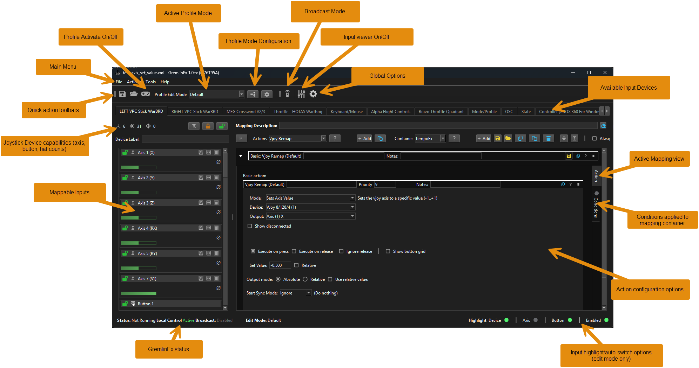

### Menu

The menu offers typical options to create, save or load a profile, access tools and options available in GremlinEx.  

### Toolbar

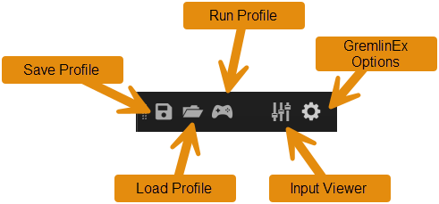

The quick action toolbar below the menu offers buttons to quickly save, load or run a profile.  Quick actions also includes the input viewer dialog, which shows "live" inputs, and quick access to GremlinEx's options.

### Edit mode

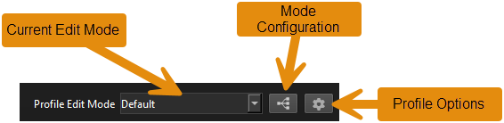

To the right of the toolbar, a drop down with the current edit mode for the active profile is displayed, which lets you change the active edit mode.  It also includes a button to bring up the mode options for the profile to edit/change available modes and their relationships, as well as profile options.

### Device list

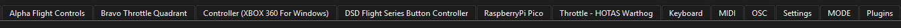

The top of the user interface below the toolbar is the device list, shown as a list of tabs.  The list shows all detected devices, as well as special devices (like OSC), keyboard, modes, and some general options to setup user plugins and profile options.

Click on a tab to select the device as the active device.  You can also use the mouse wheel to scroll the tabs left or right which will also select a new device tab.

#### Physical Joystick devices

Joystick devices and "console" game controllers will appear with ther DirectInput name, one per tab.  Clicking on each tab will bring up a list of device inputs (axis, button and hat) in the left panel.  Any mapped action will appear on the right panel.

#### Virtual (VJOY) Joystick devices

Virtual VJOY devices will also appear as a tab if they are set in input mode (enabled in the settings tab).  GremlinEx allows VJOY devices to be used both as input and output concurrently.
GremlinEx names the VJOY devices using their axis/button/hat count and the VJOY device number (1 to 16).

As each VJOY device must be different from the other when configured in the VJOY software, each name will be different because each device will have at least a different axis, button or hat count.

#### Special devices

Special devices in GremlinEx are non-joystick devices, or configuration devices.

| Device     | Description |
| ----------- | ----------- |
| Keyboard/Mouse   | This device is for keyboard and mouse mappings - |
| Mode/Profile   | This device allows you to map actions on mode and profile change (entering or exiting a profile mode, or on profile start/stop) -  |
| OSC   | This device allows you to map inbound OSC messages (two way communication supported via map to OSC action) -  |
| MIDI   | This device allows you to map inbound MIDI messages - |
| States   | This device allows you to define and map GremlinEx -  |
| Octavi IFR1  | This device allows you to map inputs from the Octavi IFR1 (two way supported via map to IFR1 action) -  |
| Settings   | This device opens profile options specific to input settings - |
| Plugins   | This device allows you to add user plugins to the profile - plugins are loaded whenever the profile start and are written in Python - see the plugin documentation for details |

Note that the MIDI and OSC tabs only appear if MIDI and OSC are enabled in options (this is by default enabled).

#### Disconnected devices

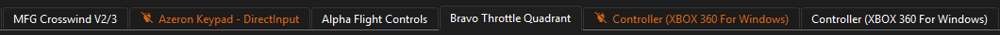

If a device was saved to a profile, the profile is loaded, and the device is no longer detected, GremlinEx will indicate the device is not currently available with a disconnected flag as shown above.  The device can be reconnected by plugging it back in, or deleted via the context (right click) menu.  Disconnected devices are normal when opening a profile created on a different machine as device hardware IDs will be different.

It is possible for the disconnected device to have the same name of a current device if the device has a different hardware ID from what is currently detected.

#### Tip: copy mapping from one device to the other

You can copy all mappings from a disconnected device to another connected device using the right-click context menu.  This is helpful if you changed devices but wish to copy the mappings from one to enother.  GremlinEx will copy one to one inputs that are in the disconnected device, and also found in the target device.

You can also save mappings to a template, and load that template back into another device, which is similar although this lets you create templates persisted to a disk file for later use in other profiles.

### Input area

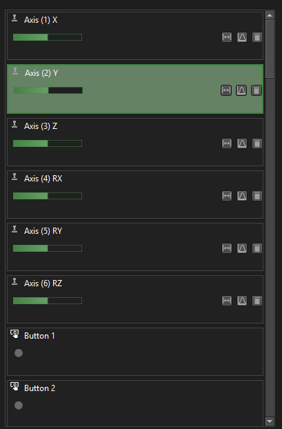

The left of the user interface (UI) is the input area.  It shows a list of available inputs on the currently selected device.

### Input lock/unlock

Each input can be locked, which prevents inadvertent editing of its mappings.

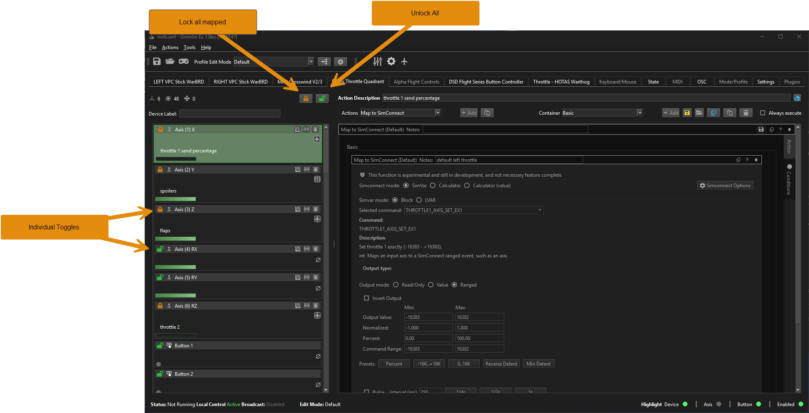

### Linear inputs

Linear inputs indicate an axis type input is detected.   The input can change values.  Examples of linear inputs are a joystick axis, a slider, a fader, or rotary knob.

Linear inputs that have multiple axes, such as an XY pad, will show as one input per axis.

#### Linear input repeaters

GremlinEx can display a repeater bar graph that shows the current state of the input, and in some cases, transformations applied to that input.  This lets you visualize in real-time the inputs.

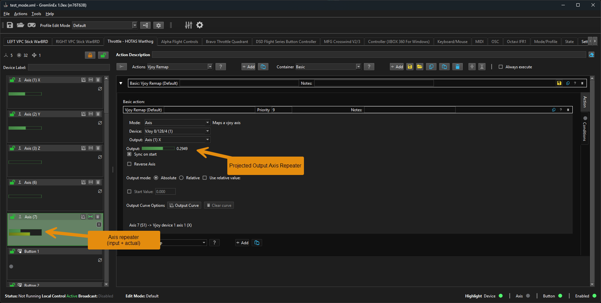

### Momentary inputs

A momentary input is an input that typically has two states - pressed or released such as a key or a button.   A momentary input can also be held in which case it will keep its pressed state until it is released. 

Encoders are also typically momentary but they have multiple positions.  In GremlinEx, an encoder will typically show as two inputs, one to increase, one to decrease.

### Hats

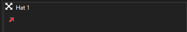

Hats are a special type of momentary input.  GremlinEx supports eight (8) positions per hat (north, north-east, east, south-east, south, south-west, west and north-west).  The center position is the released state for a hat.
A hat with a push (or pull) function will show as a separate momentary input for the function.

### Keyboard

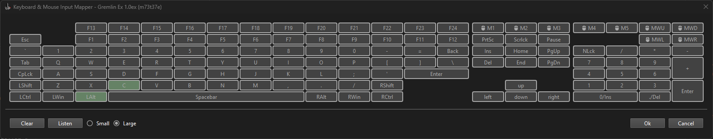

The keyboard is a momentary input with a key either pressed or released (known as a key make or a key break).  In the above example, the key sequence alt-c is selected.

### Mouse

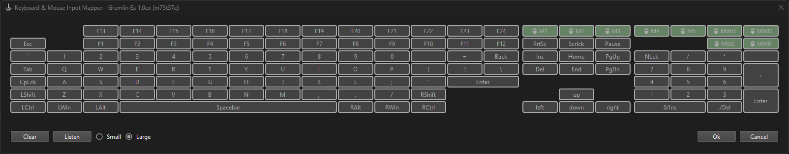

In GremlinEx, mouse inputs are available through the keyboard/mouse device.  GremlinEx supports all five mouse buttons, and adds four more for wheel up/down and wheel left/right respectively.  The left button is mouse 1, the right button is mouse 2, the middle button is mouse 3.  Buttons 4 and 5 are sometimes known as the forward and back buttons on the mouse.

### Available inputs

For controller devices, such as a hardware joystick connected to the computer or VJOY virtual controllers, the list of inputs is defined by the controller and cannot be changed.  The list is defined by the controller.

For configurable devices, such as OSC and the keyboard, the inputs must be user configured and can be added, edited or removed.

## Mapping area

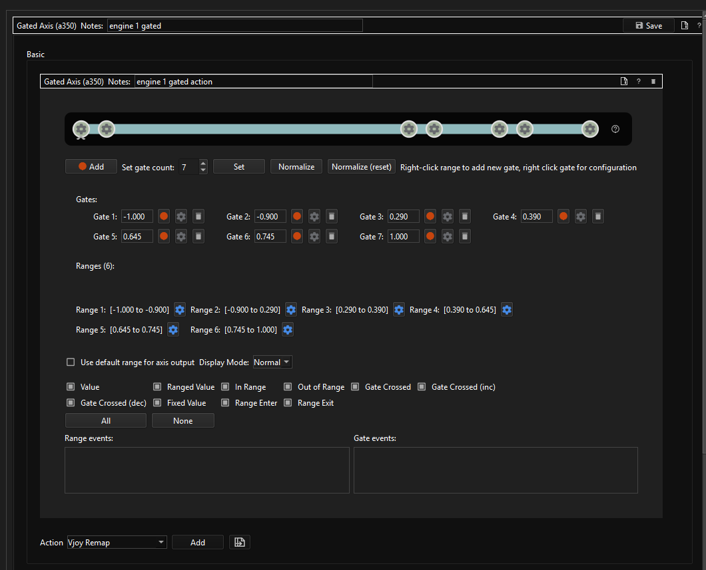

The right of the user interface (UI) is the mapping area.  It shows a list of configured mappings for a given input.  GremlinEx organizes mappings using containers and actions.  A mapping will include at least one container, and the container in turn contains one or more actions.  The container type and action type determine what GremlinEx outputs when the input is triggered.

Containers and actions mapped to an input will appear in this area.  In this case, we have a gated axis action mapped to an axis input.

## Profiles

All mappings in GremlinEx are stored in a profile in XML format.  Profiles are stored in %user_profile%/Joystick Gremlin Ex.

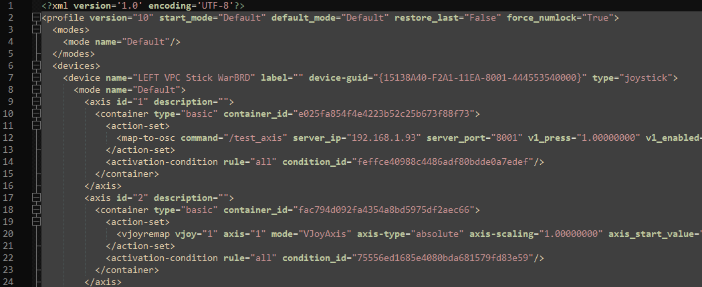

The profile contains the mapping information and is stored as an XML file.  The profile contains all devices, modes, profile options and mappings for each input.  GremlinEx will not save unmapped devices or inputs to conserve space and speed up the profile load time.

The profile contents can be view in any text editor.  While possible, it is not recommended to manually edit the XML file outside of GremlinEx. If editing manually, please observe that:

- GremlinEx can fail if it encounters invalid XML data as a result of an edit.
- Most entities in the profile have a unique ID that cannot be duplicated.  Every entity added manually must have its own unique ID.  IDs are not random - they are GUIDs (globally unique identifiers) to ensure they are unique.
- Some of these entities keep references to other entities by ID so linkage can easily be broken with cut/paste in the XML
- GremlinEx may change the XMl format depending on versions although it is designed to load older versions and "add" the new information if needed when saving.
- Unexpected errors in the XML may crash GremlinEx on load

### Saving a profile

Saving a profile saves (persists) the profile data to a file.  Very few actions in GremlinEx are saved automatically so it's a good idea to save often when you make modifications.

When saving a profile, if a prior profile by that name exists, GremlinEx will make an automatic backup of that profile and keep a number of copies (sequentially numbered).  How many is configured in options and defaults to five (5).  After the number of backups is exceeded, the oldest is deleted.  Profiles are also backed up by version, so each version of GremlinEx has its own backup folder.  This is a safety mechanism in case a new version of GremlinEx introduces profile file format changes (or dragons) that an earlier version may not be able to read.

### Loading a profile

GremlinEx offers a list of recent profiles used to load, listed in order of last use, in the file/open recent option.

When loading a profile, if GremlinEx detects changes were made to the current profile, it will prompt you to save the changes first.   Loading a profile does a reset of all inputs and GremlinEx will attempt to reload the exact device and input that was selected the last time the profile was loaded.

Load times are typically speedy, however large profiles with lots of modes and inputs may take some time to load because of the internal processing that happens.

### Deleting a profile

GremlinEx does not offer in the UI the option to delete a profile.  To remove a profile, you can open File Eplorer to the GremlinEx storage folder via the menu (Actions/Open GremlinEx folder) and delete the file manually.

## Templates

Templates holding setting for containers and actions can be saved to disk as template (XML) file.  The file only contains container and action information.  Templates do not have any input configuration in them.  Templates can then be loaded to another input, or profile, to build a library of mappings.  This is particularly useful for mappings that have OSC or MSFS data as these can get time consuming to setup, although templates can also be seen as a persistent copy/paste of containers and actions.   A benefit of templates is they are input agnostic, although care should be used to ensure that a template for a button isn't loaded into a linear (axis) input, and vice versa as that could cause errors or warnings.

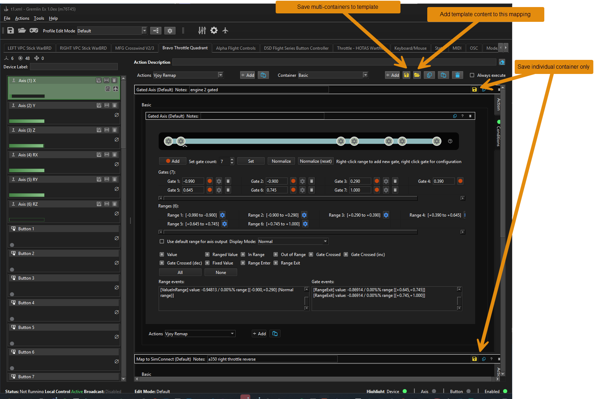

## Devices

A device is a physical or virtual controller recognized by GremlinEx as an input controler. Examples of devices are joysticks and panels connected to the computer, or a virtual device, such as an OSC input message or a virtual joystick (VJOY).

GremlinEx will list the devices it finds at the top of the user interface in a series of tabs.

Devices that are referenced in a profile but not currently avaialble will show in a warning color with a disconnected icon next to them.  This means device information was read from a saved profile, but the device is not currently visible to GremlinEx.

This can happen if the device is disconnected, or when importing a profile from another machine that had different device identifiers so GremlinEx cannot find them on the current machine.

### Physical (HID) controllers

A physical device is a controller currently attached to the computer and that has buttons, axes, or hats in any combination.  Such devices are usually connected via USB.

Based on the DirectInput specification, controllers can have up to eight (8) axes/sliders, up to 128 buttons and up to four (4) hats.

The device will only show if it is an HID compliant game controller - so joysticks, console game controllers, and devices using Arduino or Rasberry Pi (setup as HID controllers) will be displayed.  HID devices that are not reporting as an HID controller and thus not visible to DirectInput will not be visible in GremlinEx.

GremlinEx will only work with controllers that report through DirectInput (so not the XBox API for example).  All controllers compatible with PC will show in DirectInput.  All controllers compatible with XBox will not show, unless they run in PC/Windows compatibility mode.

### Virtual controllers

A virtual controller is a software controller that exists at the hardware driver level.  VJOY is one such example of a virtual joystick driver, with up to sixteen (16) virtual devices that can be configured in VJOY provided each is different from the other in terms of axis, hat or button count.  Another example is VIGEM, a virtual x-box 360 controller that is similar to VJOY but for a game (console) controller.

### Keyboard and mouse

GremlinEx will display a special keyboard device that groups the functionality of a keyboard and mouse.  Note that mouse axis input (mouse movement) is not currently supported as input (it is supported as output).

### OSC and MIDI devices

GremlinEx will display a device for processing OSC and MIDI messages sent to the local machine.  The messages can originate locally or from a remote machine.

While MIDI and OSC are protocols associated with musical instruments, they are also sophisticated stage controllers with touch-screen surfaces or physical sliders, dials, button and touch pads.   GremlinEx can use signals from these devices to control a game.

### State device

Starting with 1.0ex m74, GremlinEx supports user-defined  [states](usage.md#states).  A state is an internal entity that only exists in memory at runtime.  States have a unique, case sensitive, name.  States have an on/off behavior (also known as pressed/released or true/false) that can be set or read by profiles at runtime.  States can be used to implement a [state machine](https://en.wikipedia.org/wiki/Finite-state_machine) in a profile, and behave like virtual on/off or boolean switches.  They are either set/on/true or unset/off/false.  States initialize to a default starting value when a profile starts.  States can then be changed at runtime by the [map to state](usage.md#map-to-state) action anywhere in the profile, via a [macro](#macro), or by a user plugin via the StateData() API.  States can be read as a condition (state condition) that performs a check on the state to see if the conditioned container or action should execute or not.  States are also mappaple via the state device tab, so a state can trigger a set of actions when their value changes.

Currently states are either pressed (on/true) or released (off/false) and function like a virtual joystick button.  When a state has mapping, the actions and containers mapped to it will see the input as a joystick button, so all containers/actions able to use momentary inputs can be mapped to a state.

States are read by [conditions](#conditions) and specifically the [state condition](#state-condition).

In GremlinEx, states can be mapped via the State Device, the "map to state" action is used to clear, set, toggle or pulse a state, and the state condition is used to determine, based on state, if a container or action should execute or not.

### Octavi IFR1 device

The Octavi IFR1 device is supported by GremlinEx directly at the HID layer.  The device offers a number of button actions and functions in GremlinEx like a joystick.  The companion  action lets GremlinEx set state and LEDs on the Octavi.

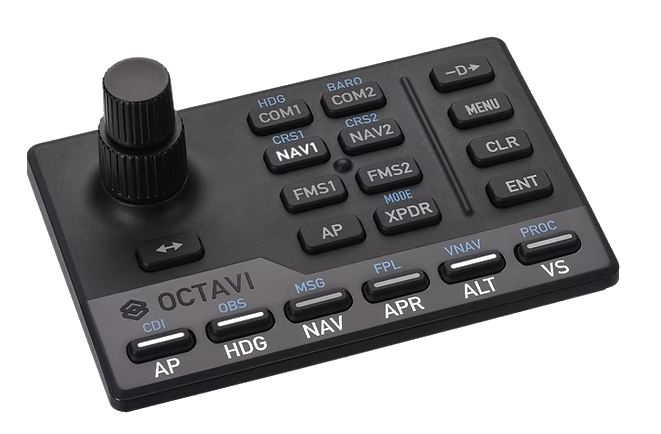

### Reordering of devices

Microsoft Windows does not currently offer a way to set the order of devices connected to a computer, and furthermore, this order may change depending on connections/disconnections, reboot status, and the order of detection by the operating system.  To this end, GremlinEx offers a way to manually re-order devices as displayed in GremlinEx for convenience via drag and drop of the device tabs.   The order only exists within GremlinEx and it does not change the device order in the operating system.

## Inputs

An input is a source trigger definition.  When you press a button on a controller, move an axis, or press a key or click a mouse button, all these are input source triggers that can be mapped to a series of actions.

Some hardware devices have a fixed set of inputs defined at the hardware (firmware) level.  Some controllers can change that information with their own programming, but for the purpose of GremlinEx, physical hardware defines a fixed number of axes, buttons and hats it can use for mapping.

### Examples of physical inputs

Inputs can be a button on a joystick, and axis or slider on a joystick, a pressed key on the keyboard.

### Examples of virtual inputs

A virtual input does not come from a physical device.  It typically comes from receiving a network message (such as OSC or MIDI), or from a software virtual device like VJOY used as input.   Virtual devices are not "real", but they function nontheless the same way as physical inputs do.

Virtual inputs have to be configured in GremlinEx, so you need to tell GremlinEx what to listen for.  For example, which OSC message to listen to, and what should the message parameters be.

Another input may be a complex key combination to trigger on, such as left-control, left-shift, A and CAPS-LOCK pressed concurrently.  Unlike the "traditional" keyboard combinations, GremlinEx can latch multiple keyboard inputs together and require all of them to be pressed concurrently to trigger, so quad key combinations and up are completely feasible (although perhaps not practical).

### Input Widget

The input widget corresponds to an input for the device currently selected. For controllers, GremlinEx displays "live" inputs (when the option is enabled, which it is by default).  The repeaters will show the current axis or button state for controllers.

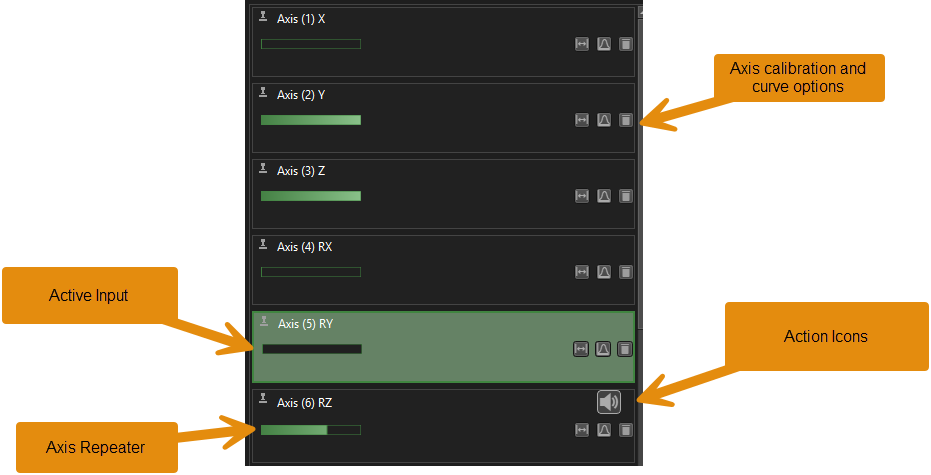

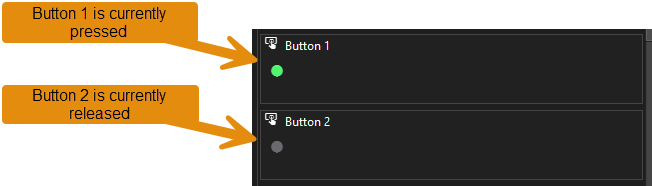

Input widgets will show an icon for each action map found in the containers attached to the input for a quick visual review of all actions mapped to the input.  

Input widgets will also have a calibration button to calibrate the input axis (global), or for setting up a curve for the input.

If the input can be configured, for example, OSC or Keyboard devices, a configuration button is also visible.

In the example below, two keystrokes are defined as input. Alt-C and F5.  While Alt-C is not selected, the icon in the input widget indicates it is mapped to button #1.  The input box for F5 shows that it has two actions, button #1 and another joystick action.  

Because the action is complex, it won't show the details but from the action configuration we can see it's setup to toggle button #2 whenever the F5 key is pressed, and to pulse button #1.

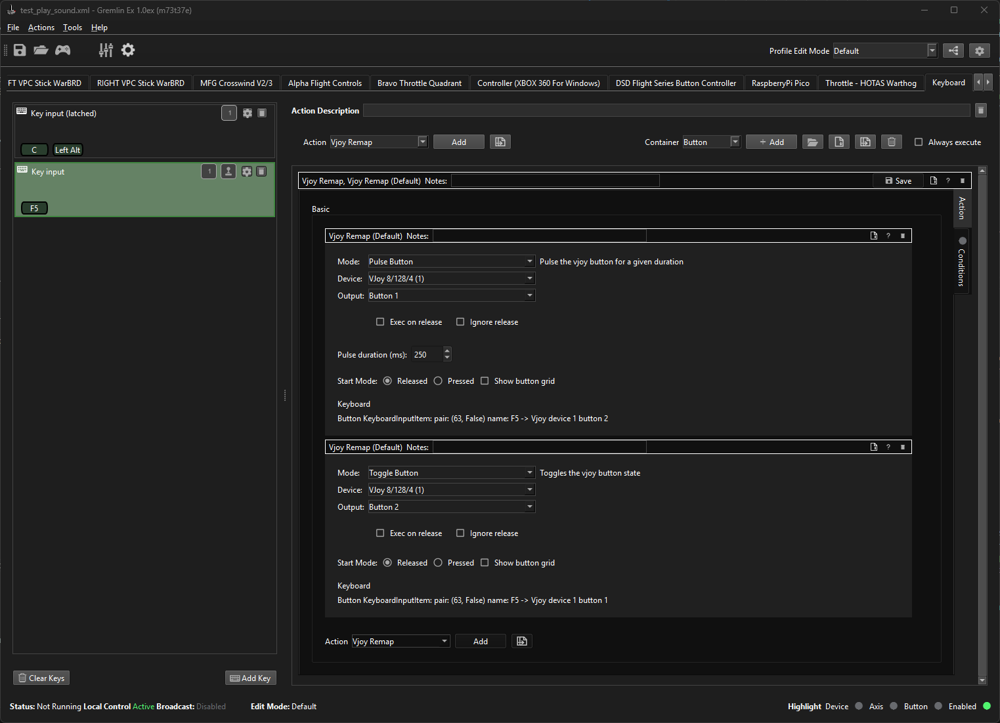

The bottom of the input panel has two buttons, one to add a new input, one to remove it.   These buttons are only displayed on inputs that are configurable, such as the Keyboard, OSC, or MIDI devices.

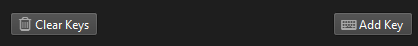

### Special Mode inputs

The Mode device is a special device that defines two fixed inputs. These are triggered whenever a mode is activated, or deactivated.

In the example below, whenever the "Default" mode is activated, the F18 key will be sent.

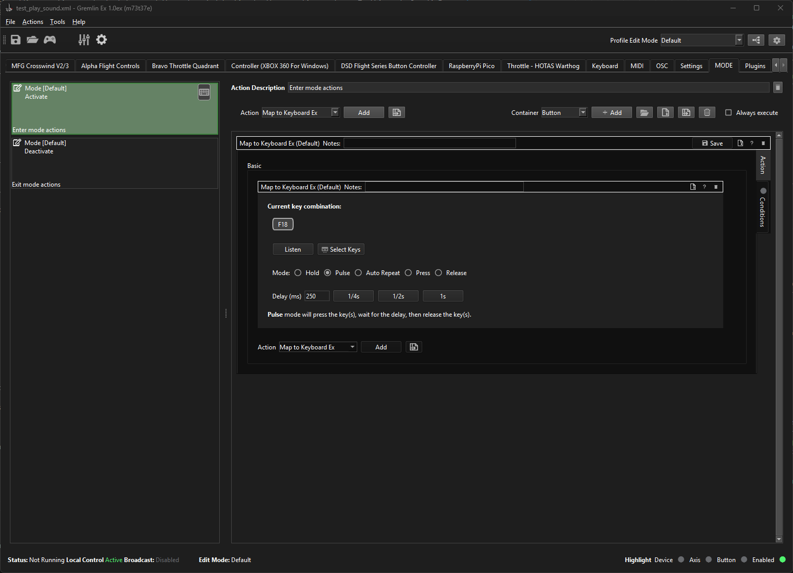

## Automatic input selection

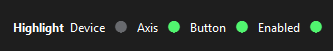

Depending on the number of axes and buttons a particular device has, it's not always clear which axis or button it is.  To this end, GremlinEx has a feature to automatically select the input when you move an axis or press a button.  This works for controllers only (so not for keyboard or mouse inputs).

There are four options:

- Disabled: automatic highlighting is turned off.
- Button: automatic highlighting switches to the pressed button.
- Axis: automatic highlighting switches to the moved axis.
- Device: automatic highlighting switches the device.  

These options are also available in the Gremlin options panel.

It it not advised to have the axis or device modes enabled if you have a noisy input as the UI will constantly thrash because it will detect constant inputs.

## Containers

The container holds one or more actions.  There are multiple container types available.  All actions in a container are executed when an input trigger occurs, subject to the options and the capabilities of the container and the action that modify the behavior.

### Basic

The basic container is the most used and the default container.  It is a simple container with one or more actions in it.

### TempoEx

This container has two content areas.  One for short press actions, one for long press actions.

### Chain

This container lets you chain actions.  Whenever the input is triggered, the chain will increment the index and move to the next block of actions index, and loop around when it runs out of blocks to execute.  This is used for round-robin type mappings when you need a sequence of things to happen for each trigger.

### Sequence

This container is a bit like a high level macro, and runs all the actions in the sequence they appear.

### Smart Toggle

This container is used to toggle outputs based on short of long presses.  Used to toggle "hold"/"sticky" outputs.

### Button

This container has a set of actions that execute on input press, and another set on input release, in the same container.

### Range

THis container performs certain actions when the input value is in a certain range

## Actions

Actions are added to a container.  They perform the actual mapping of the input.  

### Action priority

Certain actions execute last (such as a mode change).  Actions have an internal priority that determines when an action runs.  In most cases, actions are executed top down (in the order they appear), however some actions like a mode change are executed last, and actions that change the input value like applying a curve will execute first.

### Vjoy Remap

This is the most common action in GremlinEx and lets you map an input (linear or momentary) to a VJOY device.

This action replaces the legacy remap option.  In GremlinEx, this action is the main way to send output to a VJOY device. 

Some of the features of vjoy remap:
- map an input axis to a vjoy axis
- apply an output curve to the vjoy axis based on input
- scale or apply a range to the vjoy axis based on input
- merge the output axis value with one or more input axes using add, substract, multiply, average.
- map an input button to a vjoy button
- map an input hat to a button or a hat
- synchonize the input value to the output on profile start or pick a default value.
- force a button pressed
- force a button release
- toggle a button
- convert an axis value to a button
- view which buttons are in-use profile wise

### Gated Axis

This action lets you split an input axis and define what should happen when

- a range is entered or exited
- a specific point on the axis is crossed

Up to 20 gates or crossing points can be defined (19 ranges). It is possible for ranges to send a fixed value or rescale/change the value of the output.
This container was specifically created for output needs that have "gates", such as throttles used in some simulators.

### Mode Switch

This action lets you change a profile mode at runtime based on an input trigger.

### Temporary Mode Switch

This action lets you change the profile mode temporarily while the input is pressed.

### Cycle Modes

This action lets you cycle modes with each press.

### Map to Keyboard Ex

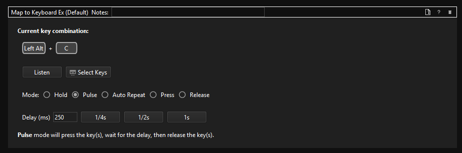

This action lets you send a keyboard or mouse button/wheel click to the output.

### Map to Mouse Ex

This action lets you send a mouse button/wheel or mouse position change to the output.

### Map to Gamepad

This action maps to a Gamepad (VIGEM) output.

### Map to SimConnect

This action lets you send a SimConnect command to Microsoft Flight Simulator via the SimConnect SDK.   This bypasses the need to map any controls inside Microsoft Flight Simulator, and sends the data direct to the simulator to control aircrafts.  This way you completely bypass the MSFS control mapper and send control data directly to the sim, and the add-on.

This includes sending calculation and expressions via the GremlinEX WASM module to read or modify internal simulator parameters defined by addons that are not exposed by the SimConnect API.  In this example, execute the "(>K:AP_MASTER)" internal command.

Using the SimConnect mapper from sim variables to calculator expressions requires knowledge of the [Microsoft Flight Simulator SDK](https://docs.flightsimulator.com/html/Programming_Tools/SimConnect/SimConnect_SDK.htm).  

The recommended setup is to have a single profile for Microsoft Flight Simulator, and have a mode for each aircraft type, and under that if needed, a mode for each subtype/variant.  Recommendations including having a setup for Boeing, Airbus, single prop, dual prop, single turboprop and dual turboprop, and quad engine as the base.  The Simconnect options page in GremlinEx while the sim is running will pull the current aircraft and let you associate a mode with that aircraft.  If you find the aircraft uses the default mode, it means it's being reported as a new type and likely needs to be associated with a profile mode for that type.

For aircraft with detents, such as for spoiler or throttles, use the Gated Axis as it was designed precisely for this complicated need and in conjunction with other mapping features make mapping complex throttle assignments relatively easy.

It is also recommended to use calculator expressions as much as a possible due to the capabilities to access add-on variables that are not in SimConnect.  A [guide to calculator expressions can be found here](https://hubhop.mobiflight.com/presets/) with examples for commond add-ons.  All these work as-is in GremlinEx and allow you to access variables defined by each add-on.  

SimConnect itself is a bit of an arcane art due to the historically poor documentation, lack of examples and errors / ommissions which combined with bugs make controlling MSFS via SimConnect an interesting challenge, however one miles better than using the built-in MSFS control mapper.  A number of add-ons also define variables that are not part of the base simulator, so are not exposed by the SimConnect SDK.  The only way to set them is to use calculator expressions, and consult the add-on manual and the MSFS user commmunity for what the variables are.

I often use the built-in debug tools in MSFS to determine what variable to set or what the values should be, including the SimConnect inspector and the example Simvars explorer that comes as a sample project to compile with the Simconnect SDK.

Another avanced used of Simconnect is to have a user plugin capture sim state, for example parking brakes, and update a glass surface widget with the state. This can be done via a custom plugin in GremlinEx using the existing event model and API fro Simconnect via Simconnect Manager, an internal control class in GremlinEx.

### Map to OSC

This action lets you send an OSC message to the network.

### Text to Speech

This action lets you send an audio prompt via TTS (text to speech).

### Map to State

This action lets you set or clear a state defined in the profile.  States are defined in the state device tab.

If a state's value is changed and that state is used in an expression in another state, that state is also updated.

### Map to Octavi IFR1

This action sends output to the Octavie IFR 1 to control LEDs and modes.

### Macro

This action lets you send complex sequences of outputs (joystick, keyboard, mouse) complete with timing and delay controls and separate make/break actions for buttons.

### Play Sound

This action lets you play a sound file located on disk.

## Conditions

GremlinEx can apply conditions to triggers to modify what should happen when an input trigger happens. 

Conditions can be used to:

- only trigger a mapping if another condition is true (or false), such as an key or button is pressed, released, or another axis is within a certain range.
- trigger on release only
- turn on or off certain activations at the container level or the individual action level.

Conditions apply to containers or actions or both concurrently.

Conditions are cummulative and apply in the order of evaluation, so conditions on containers are evaluated before conditions on actions.

### List of currently supported conditions:

| Condition      | Description |
| ----------- | ----------- |
| vJoy condition | This condition checks for a vJoy (virtual joystick) state, such as an axis in a given range, hat or button pressed or released.|
| Joystick condition | This condition checks for a joystick or controller input state, such as an axis in a given range, hat or button pressed or released. |
| Keyboard (mouse) condition | This condition checks for keyboard and mouse states. |
| State condition | This condition checks for a state value. |
| Mode condition | This condition checks for a particular profile mode being active (or inactive). |

### Virtual Button

When mapping a momentary action to an axis, the virtual button tab usually becomes availble to define a range on the axis where the condition is active.
In the example below, the action is enabled when the input axis is between -0.0965 and +0.324.

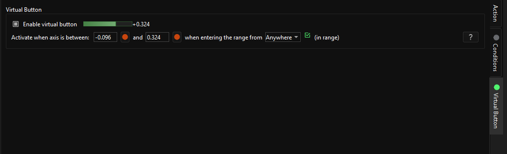

### Condition tab

The condition tab on a container (appears below the action tab) is used to configure conditions on the container for its activation. Conditions are cummulative.

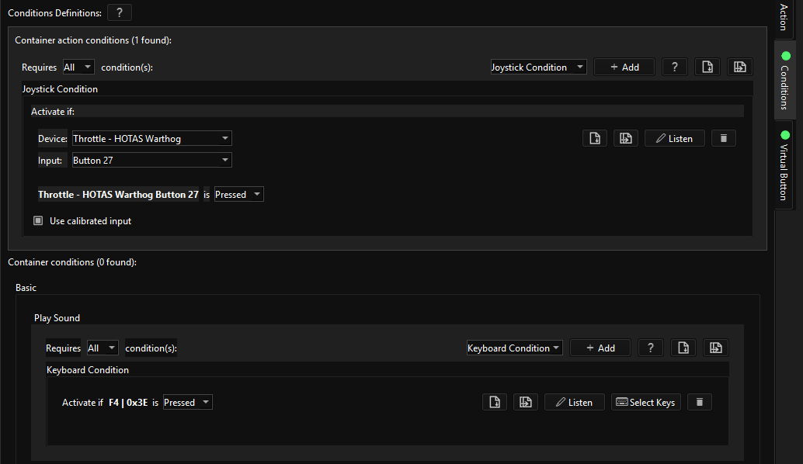

#### Container conditions

Container conditions apply to the whole container.  In the example below, button 27 on the HOTAS Warthog device must be pressed for the condition to pass on all actions in the container.

#### Action conditions

Action conditions only apply to a specific condition.  In this case, the play sound action will only be active if the F4 key is pressed.  Because the play action is also subject to the container condition, both conditions must be true for the sound to play.  Because the container is mapped to an axis, and a virtual button is defined, not only do the action and container conditions be true, the axis must also be in the correct range.

## Automatic Input detection

GremlinEx can usually detect at edit time and auto-highlight hardware joystick input devices by clicking a button or moving an axis on them.   This eliminates the guesswork on how the hardware maps to buttons or axes, and what the state of the input is.

Automatic detection is only active when a profile is not running.

When in this mode, GremlinEx will attempt to display the correct input - I say attempt because it can get confused sometimes with multiple active concurrent inputs.

The default behavior is it waits for an axis or a button to be activated before displaying anything, so the initial load up UI may not reflect the input until it's touched again.

GremlinEx has a built in protection against multiple inputs, but will display the last detected input if multiple inputs were sent.

There are three options that control this behavior in the GremlinEx options panel:

| Option      | Description |
| ----------- | ----------- |
| Highlight currently used input (axis + button) | Will switch focus to the input device for axis or button changes - this can make it difficult to just pick a button|
| Highlight currently used buttons | Detects button changes only (axis movement is ignored but can be overriden - see below (this is recommended) |
| Highlight swaps device tabs | Changes input tabs automatically (this is a recommended) |

As of 13.40.14ex, GremlinEx also has an option to display input repeaters as well for all joystick hardware inputs showing live axis position as well as button state.

As of 13.40.16ex, GremlinEx has an input options bar at the bottom right of the main window to easily toggle highlighting options without going to the options dialog or using the hotkeys.

## Button detect only overrides

A pair of modifiers can be used to modify how input is detected.  

| Option      | Description |
| ----------- | ----------- |
| Left shift | If you hold the left shift key, GremlinEx will track axes instead of just buttons regardless of the options selected .|
| Left control | If you hold the left control key, GremlinEx will only track axes  regardless of the options selected .|

Recommend that you set the default behavior is to track buttons only as it's very easy to trigger an axis by pressing a button because many hardware devices are very sensitive. Use the  left shift or control key to modify that behavior on the fly.

Note that whatever is first detected will go to that item (axis or button) if nothing is selected.  This is on purpose to pick a starting point.

Holding the left-shift key down when in button detect mode temporarily enables axis detection as well as button detection.  This is the same as the first option in the table above.

Holding the left-shift key and the left-control key when in button detect mode temporarily enables exclusive axis detection and ignores button presses.  This is helpful when you have a hardware axis that also has detents along the way that send button inputs.  In this mode, these buttons will be ignored.

## Remote control feature

GremlinEx adds a feature to link multiple GremlinEx instances running on separate computers.  This is helpful to share a single set of controls and a single profile on a master machine to one or more client machines on the local network.

The use-case for this need came up in a couple of scenarios in my own setup:  I wanted to be able to share my hardware panels and input controllers with another machine without having to duplicate them.

Events sent over the network include all GremlinEX output functions:
- VJOY joystick axis events (when an axis is moved)
- VJOY joystick button events
- keyboard output events (press/release keys including extended keys)
- mouse output events (pres/release mice button 1 to 5, mouse wheel events, and mouse motion events)
- Gremlin macro outputs

By output events, we mean that inputs into GremlinEx are not broadcast to clients, only events that GremlinEx outputs are synchronized with clients.  

To use the remote control features, it is intended you use the new plugins VjoyRemap and MapToMouseEx

### Master machine setup

The master machine is the machine responsible for broadcasting control events to clients on the local network.  Thus it will typically be the primary system with all the physical hardware managed by GremlinEx.

The broadcast machine or master system will have the broadcast option enabled and an available UDP port setup (default 6012).  When the broadcast feature is enabled, GremlinEx will broadcast all output events.

Important: to broadcast, the option must be enabled in the checkbox, and the GremlinEx profile must also have enabled the broadcast functionality on.  This is needed because when GremlinEx first starts, it defauts to local control only.

Profile commands can be mapped via the VjoyRemap plugin to control whether GemlinEx sends outputs to the local (internal) or clients, or both concurrently.

While more than one master machine can broadcast, it's recommended to only have one.  Multiple machines will allow more than one machine to send broadcast commands to clients for unique setup needs.

The enable speech checkbox can be selected for GremlinEx to send a verbal mode change event whenever local/remote mode control is changed in case the GremlinEx window is not visible.

GremlinEx shows what output mode is active in the status bar.

GremlinEx options setup for a broadcast machine:

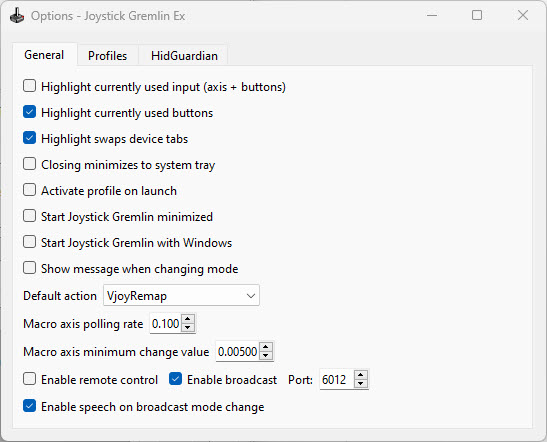

#### Local mode

In this mode, GremlinEx sends VJOY, keyboard and mouse events to the local machine.

The status bar displays

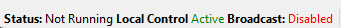

#### Broadcast mode

In this mode, GremlinEx sends VJOY, keyboard and mouse events to clients on the network.    The clients must have the remote control checkbox enabled, match the port number, and have a profile running (empty profile is fine) to respond to the broadcast events.

The status bar displays

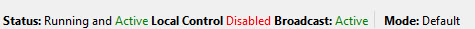

#### Concurrent mode

GremlinEx can send to the local and remote clients at the same time (concurrent mode) by sending the Concurrent command. 

### Client machine setup

Each GremlinEx client needs to have the remote control option enabled in options to be able to receive events from the master machine.   The master machine must also be setup to broadcast these events.

The client must be in run mode to accept broadcast events, and the profile can be empty.  No profile needs to be loaded on the client when the client is in remote control mode.

Clients will only output to VJOY outputs that match the master.  So if the client has the same setup for VJOY (number of VJOY devices, button counts and hat counts) as the master machine, all VJOY events will be synchronized with the master machine.   This is the recommended setup.   

Clients will ignore events for devices that do not exist on the client (such as an invalid VJOY device number, or an invalid button for that defined device).

GremlinEx options setup for a client:

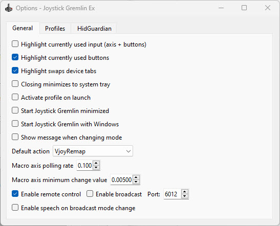

The enable remote control checkbox is checked, and the port (default 6012) must match the broadcast machine's port.

## Master remote control functions

Local and broadcast (sending output to remote GremlinEx instances on network machines) control can be enabled or disabled via GremlinEx commands bound to a joystick button (or in script).

Commands are available in the VjoyRemap plugin when bound to a joystick button and available from the drop down of actions for that button.

## Profile mapping

GremlinEx has multiple options to automate the loading and activation of profiles based on what process has the current focus (meaning, the active window).

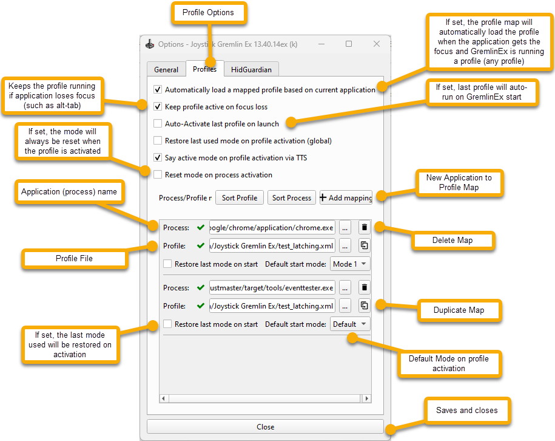

### Automatic activation

If a process (.exe) is mapped to a specific profile (.xml), GremlinEx can automatically load this profile when the process has the focus at runtime.  This only works when a GremlinEx is in "run" mode - so a profile was loaded and activated.

If configured, GremlinEx will load the mapped profile corresponding to the process (.exe) automatically in the background.  Depending on the complexity of the profile, GremlinEx may take a few seconds to become active as it loads the process and activates it.

The automatic load occurs whenever GremlinEx detects a process focus change.

### Keep profile active when focus is lost

This mode is used to ensure GremlinEx keeps the profile running even if the process it is mapped to no longer has the primary focus.   This happens, for example when you alt-tab, or when you activate another window.  The recommendation is to leave this option enabled.

### Profile start and stop event mappings

Starting with m76T40, it is possible in the *Mode/Profile* device tab to define actions that will execute either on profile start, along with actions to trigger on profile stop.  These will execute on every profile start or stop and can be used to initialize outputs.

For example, it is possible to send an OSC command to OSC based control panels on the network or the local machine to call up a particular configuration.

Actions mapped to profile start and stop will behave as a joystick button with a press and release.  The delay between press and release is defined in options as the default auto-release delay, and defaults to 250 milliseconds.

### Mode selection

When automatic profile load is enabled, GremlinEx has the option to override the default "startup" mode of a profile.  This is by default, the top level mode.  There are two options of interest:

- Activate a default mode when the profile is activated (this is the normal mode)
- Activate the last mode used when the profile was last activated (this is the alternate mode).  If this is enabled, the default mode setting is ignored.  The first mode used will be the default mode if the mode has not been changed before.

In addition to this, the profile itself provides actions that can switch modes.

### Mode change event mappings

The *Mode/Profile* device tab lets you define actions to occur when a mode is entered or exited.   This includes when the default mode is activated on profile start.

There is one set of mappings possible for each defined mode.  

Actions mapped to mode start and stop will behave as a joystick button with a press and release.  The delay between press and release is defined in options as the default auto-release delay, and defaults to 250 milliseconds.

Note: if you delete a mode, any associated mappings linked to mode enter/exit will be deleted.

### Profile device substitution and input order

Windows is notorious for changing the order of gaming controllers and to this end, GremlinEx does not use the sequence of controllers.  GremlinEx tracks input controllers by their hardware ID, a "guid" or globally unique identifier that includes the manufacturer hardware code, and unique to a device.   This approach avoids the device re-order issue, but walks right into, what happens when the hardware ID changes?

The hardware ID is saved with a profile, and mappings are tied to that hardware ID.

On occasion, hardware IDs for HID devices can change as reported by Windows.  This can happen when:

- the input is programmable and lets you change the hardware ID (example, Arduino, Rasberry Pi custom hardware controllers)
- the manufacturer provides a firmware update changing the input ID
- the input is wireless and the ID resets on device reconnect
- two inputs have the same ID (example, plugging in two identical joysticks), and the hardware driver assigns a new ID - which is usually a sequence.

### Substitution

To help with situations where the hardware ID must be changed, while it's always possible to manually edit the profile XML with a text editor such as Notepad++, GremlinEx as of 13.40.14ex includes a small substitution dialog that lets you swap out device IDs.  This is accessible by right-clicking on a device tab and selecting device substitutions, or from the tools menu.

### Caveats with profile automation

GremlinEx only has information about which process has the focus from the operating system, and the configuration options. As such, it is completely possible that you will experience conflicts if you have programmed these in, or constant loading/reloading, frequently changing process and otherwise attempting to break the detection logic.  One reason for this is large profiles take a while to load and if the target process is changed while a load is in motion, it may trigger a delay and GremlinEx may not immediately respond to changes

Recommended configurations to avoid:

- have two (or more) processes running concurrently with each associated with an automatic load profile and constantly changing focus between them rapidly. This will cause a profile reload/reset and new mode activation whenever the focus changes.  Some optimizations were made to the profile load - caching is planned for a future release to avoid load delays.

- attach a profile to a non-game process, such as a background process.

The recommended approach is to only execute one mapped process at a time, and to ensure the profile remains active when the process loses focus, such as when alt-tab or switch to another window on multi-monitor setups.  Automatic profile loading is also not recommended while you are designing a profile.  Only automate profiles that are not being actively edited/modified to avoid Gremlin activating the profile while you are editing it.

## Caveats with loading to the prior mode

Loading the prior mode may not necessarily be expected, as it will vary with the last known used mode.   This can be confusing and unexpected, but it can be helped by ensuring that you tell GremlinEx to say what mode it's in whenever a profile starts.

## Copy/Paste operations

Starting with GremlinEx 13.40.13ex, copy/paste operations are supported on actions and containers.

To copy an action or container, click the copy button in the title bar.

To paste and action or container, click on the paste button next to the add action or add container.

Pasting is not possible if the container or action is not permitted for the type of input being mapped.

You can persist a copy operation between GremlinEx sessions by checking the option in the options dialog.  This will save the data to the profile folder, and it will be available at the next session.

If the persist option is not checked, GremlinEx will use whatever data is in the Windows clipboard from the last copy operation in GremlinEx.

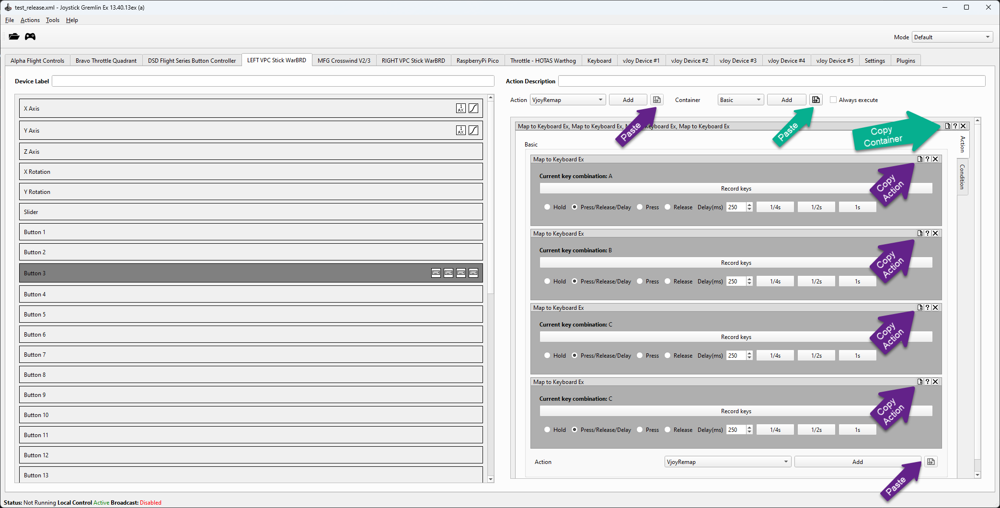

## Devices

### HID devices

GremlinEx will show all detected game controllers in tabs located at the top of the UI.  These are the raw input devices, either buttons, hats or axes.

### Device change detection

(New as of 13.40.14ex as of m22)

GremlinEx will detect a connect/disconnect of direct input devices (devices the DirectInput API monitors).

A device connect/disconnect by default forces a profile restart, unless the "ignore device change at runtime" option is selected (enabled by default).

If the option is enabled, a device change will be ignored if a profile is active to avoid distrupting the profile.  Disconnected devices will no longer provide input.  In this mode, if the device reconnects, the reconnect will also be ignored except that GremlinEx will start processing the direct input events again, so long as the device previously disconnected is the same (and has the same hardware ID) of the reconnected device.  This feature is designed to help with devices that go to sleep (disconnect) and then wake up (reconnect). If a device change is detected while a profile is running, the UI will only update/refresh with the new device when the profile stops.  A profile change at runtime (based on options) will load the detected device list at the time it was loaded.  This also means, since changes are ignored, that if a device is not visible at the time the profile loads, the device will never be visible while the profile is running in this mode.  **Devices must be visible at profile start to be enabled**.  If they connect later, they will not be usable.

If the option is disabled, a device change will force a profile stop (or restart depending of options).  This is typically not the desired behavior but is provided as an option.

When a profile is not running, the UI will always update when a device change is detected and the device tabs will update.

### Avoiding device detection and sleep issues

#### Make sure all devices are awake and visible at profile start
The best practice to avoid device issues is to make sure that all the devices you intend to use in a profile are all awake and connected (thus detectable) before the profile starts.

#### Sleeping devices after startup
While it's okay for a device to disconnect/sleep and then reconnect/wake up if it has been previously detected at startup time, and the "ignore device change at runtime" option is enabled.

#### Undetected devices may not be available after startup

A device that is not detected when a profile starts will typically not be usable unless the profile is reloaded, so ensure the devices are visible and active at startup time.

#### Runtime device changes create a dragon rich environment

In general it is not recommended for devices to change while a profile or game is running as that tends to create a dragon rich environment that is best avoided whenever possible.

There are always going to be a edge cases because all hardware and configurations are different.  GremlinEx will do its best to handle dynamic changes but there is only so much safeguarding and edge case handling that is a reasonable expectation.

## Joystick (axis) device

GremlinEx can map detected joystick devices to actions.  New with 13.40.15ex is the ability to apply a response curve the input directly before the value is processed by a mapping action.

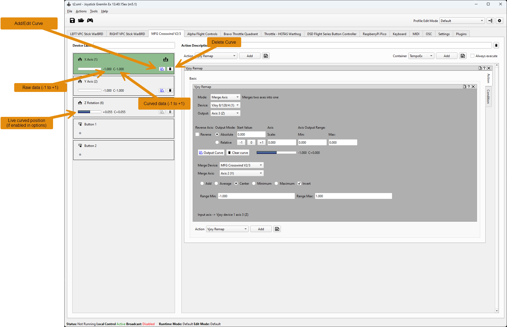

If no curve is provided, the input is used as is, matching the behavior of prior releases for GremlinEx.  

If a curve is provided, the input value will be modified based on the provided curve before being sent to a mapping action.

Curves are mode specific so each mode can have its own input response curve.

The curve button is used to add, or edit an existing curve.  It will show blue if a curve is already defined.

The delete curve button is used to remove a curve.  A confirmation box will be displayed.

### Axis Calibration

The purpose of calibration is to filter and re-scale input data before it is further processed by GremlinEx by curves or action.  The available filters enable you to:

- Tell GremlinEx if the axis has a center detent or not.  Center detents means the input axis usually is held at a center position in normal use.  This is different from a slider axis which is typically only linear and has a minimum/maximum only.
- Tell GremlinEx if the input should be inverted (reversed).  This feature flips the direction of travel and is hardware dependent. Note that if you need to invert an axis only for a specific profile specific, use the inversion setting with a curve input or response curve setting, or at the action level in Map to Vjoy as the inversion setting in the calibration dialog is global, thus applies to all profiles.
- If you have a noisy (usually potentiometer based) input, ability to set input deadzones.  Deadzone identify areas of flutter, or noisy input, where the input sends data even if it's not moving, or sends a range of data that varies at the extremity of travel or while in the center position. Inputs that use optical or hall effect sensors to detect motion usually do not need this.

Starting with GremlinEx 13.40.16, calibration is done individually for each input axis as needed.

The calibration button shows in the input axis toolbar for axis devices only as indicated below.

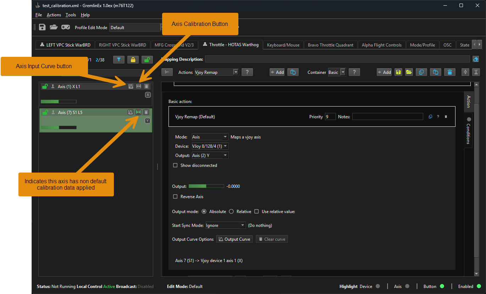

The calibration button brings up a dialog to setup calibration for that specific input, which will be listed at the top of the dialog.

When you exit the dialog, the settings are automatically saved and applied. Internally, GremlinEx saves the calibration data to an XML file located in the user profile folder.

If you had a prior calibration profile setup for an input, GremlinEx will attempt to load that data into the dialog, however you should always check the data as imported and to set other options as well.

If GremlinEx detects calibration data for an input that is different from the default (unfiltered) state, the button will be blue indicating a filter is being applied.

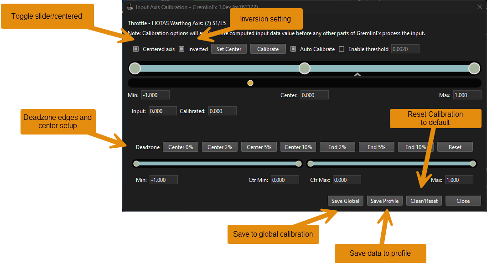

#### Global scope

Any calibration options apply to the input globally across all profiles.  GremlinEx provides alternative ways, at the profile level, to setup deadzones and inversion and response curve that are profile specific.  The global calibration makes particular sense with noisy inputs so that can be setup once for each hardware input without having to repeat the configuration for each profile.

Understanding the processing order is important to diagnose unexpected behaviors, or to craft the profile in a way to achieve the desired behavior. 

The GremlinEx processing order is listed here in the order of execution:

- Global scope
	- Raw input (as provided via the DirectX layer)
	- Calibration (if any)
- Profile scope
	- Input curve (if any)
	- Containers (most are pass-through)
		- Actions
			+ Curved response 
			+ Individual actions
		- Output

Each stage of processing is optional and only applies if present/setup. Understanding the order of processing is important.
	
Every stage of processing applies to the steps below it.  So an inversion setting in calibration will apply to all downstream processing steps, but an inversion setting in an action will only apply to that action and will be stored as a profile setting.

#### Range and accuracy

The range of all inputs is normalized -1.0 to +1.0 throughout GremlinEx regardless of the hardware's input range.

The DirectX standard provides 65,536 values (16 bit) for any input, which are normalized to -1.0 to +1.0.

Internally GremlinEx use floating point numbers that far exceed the 16 bit resolution, although it will display three decimal points by default which is usually sufficient for simulation, game or music purposes.  The displayed value is lower resolution than the internal value so no data loss will be experienced.

#### Live feedback

As you setup calibration data and change options, the changes you make will be reflected live when you move the input so you can instantly see the impact of your calibration to make sure it provides the expected behavior.

The output visualization is below the main calibration bar, and a numeric value repeater is also provided for the exact numerical value computed by the calibration logic.

#### Centering

By default, all inputs are considered centered.  GremlinEx does not know if the input is centered or not, so you need to tell it.  This is because hardware comes with different capabilities and the notion of "centered" is really up to you. It is true that some hardware does report the type, however in my experience, it's up to you to determine how you want to use that input, as it is context specific.  You can have a centered slider if that is what you need for your particular context, and you can remove the center position from a centered input if that is your use-case.

#### Inversion

The inversion setting is a global setting that inverts the input.  This is helpful in some scenarios and is really hardware and context dependent.  For example you may have a control panel that you have mounted upside down, or the hardware naturally reports feedback inverted and you need it to always be reversed.  Inversion does not scale input, it only flips the direction of travel.

#### Calibration limits

The two extremities, left and right in the dialog, determine the maximum (minimum) absolute travel direction of the input axis.  This primarily applies to potentiometer based input axis that may report a range of different values when the input travels to its stops.   The calibrate button resets the left and right nodes to the center position and you can then move the input to its maxium and minimum position to set the limits automatically.  All inputs in GremlinEx are normalized to -1.0 to 1.0 so the limits will appear as a floating point value.

If you have an input that is inconsistent, set the limit to a value that will filter out this inconsistency so you end up with a reliable signal.

You do not need to press the calibrate button to set the limits, they will always move to the minimum/maximum but they will not move "back", meaning that if the values change, it will take the smaller value (minimum side) or larger value (maximum side) so the calibration button just resets the values to 0.0 for convenience.

The minimum and maximum can be set manually via the input boxes.

Once set, the calibration minimum/maximum will scale the input value to -1.0 and +1.0 based on what you have set.  The calibrated value that is computed will be displayed in the output repeater below the calibration bar, and also in the calibrated value repeater for the numeric value output.

#### Calibration center

This only applies to centered axis input.  The option will not be visible if the axis is not setup as centered.

The calibration center is provided to set the middle point in the input range that corresponds to the normal center position of the input.  For some devices, this is not necessarily the midpoint value, which is why this is provided in case the hardware is offset.  This happens mostly with non optical or magnetic (hall effect) sensors.

In most cases, this center calibration value should be 0.0, the midpoint between -1.0 and +1.0.

As with the rest of the calibration dialog, the setting is global and will apply to all profiles

You can set the value by pressing the Set Center button while the physical input is in the center position.  It doesn't have to be exact as usually if you need to change the center position, you also need to provide a center deadzone range as it's unlikely the input will always return to that exact position if you need an offset in the first place.

As with the range calibration, you can also manually set this value in the input box.

#### Reset

The reset button resets calibration values to default as a convenience. It will not reset deadzones or the centering setting.

#### Deadzones

Deadzones setup in the calibration window are global, and apply to all profiles regardless of any other deadzones setup down the line via curves or mapped actions.

GremlinEx currently provides three (3) deadzones.  There is one for each extremity of travel.  The third is for centered inputs (it has no meaning if the input is not centered, or continuous).

The purpose of the deadzone is to filter out noisy input towards the extremities or the center.  While the input is in the range specified by the deadzone, it will always report a single value, -1, 0, or +1, for minimum, center and maximum.

The bottom of the dialog is used to define the deadzones.

The values can be set by dragging the knobs or setting an input value.

If the input is centered, the deadzone for the center will not be displayed in the dialog.

The center deadzone has two values, for the low end of the center and the high end of the center.

Extremities only have one value.

The live repeater will instantly display the impact of the applied deadzone so you can visualize the value and tweak the deadzone as desired without having to run a profile.

### Calibration Tips

Calibration is global, so lets you define setting that apply to all profiles at once.  The main one there will probably be the inversion setting.

Calibration and deadzones usually only apply to devices that tend to have noisy inputs, but you can also use the calibration data to "scale" the input globally.

For example, by shifting the center point to an offset, you can scale the response of an input's lower and upper half easily.  A use case for this may be a throttle input for a space game, or for reversers:  You may want a more sensitive upper range value than you want for the lower range so you have more forward resolution than you do going back.  

You can also match the center position to the physical detent position of your input if it has one, as those may not be the exact center as the input reports.

### Curve Editor

The curve editor dialog is used to add or edit a curve when applied to an input, the VJoy Remap action, or the standalone Response Curve Ex action.   The legacy curve mapper does not use this new editor to maintain compatibility with earlier profiles.

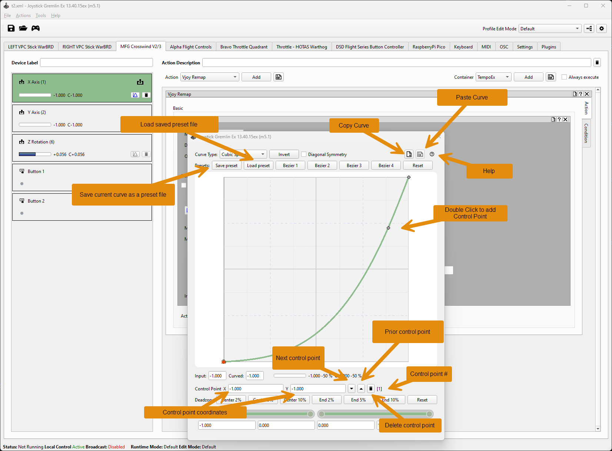

Remember to save the profile after closing the dialog to preserve the data into  a profile.

As with other data items in GremlinEx, curves are applied to a specific mode, so each mode can have its own set of response curves, or no response curves.

### Curve types

GremlinEx supports two types of curves.  The cubic spline curve is a typical cubic response curve, and the bezier curve is similar but uses control handles to determine the shape of the curve going through each control point.

#### Coordinate system

A curve in GremlinEx takes the input along the X axis, and converts it to the output along the Y axis.

The coordinate space is -1.0 to +1.0 in both X and Y, which matches the GremlinEx axis range, and the VJOY axis range.  Note that this range is different from the DirectInput range.   All actions and plugins will use the -1.0 to +1.0 range if the input is an axis regardless of type.

The center of the graph corresponds to 0,0.

#### Control Points

A curve must have at least two control points for input positions -1.0 and +1.0.  These points cannot be removed.  However their Y value can be changed.

You can add a control point by double clicking anywhere on the curve.

You can move a control point by selecting it with the mouse, or with the control point selector buttons.  The control point will be shown in red.

 and left-dragging it with the mouse, or by changing the selected control point's coordinates in the input boxes for very precise positioning.   The coordinates can also be changed when the mouse hovers over the input using the wheel, and if shift is held while the wheel is moved, this toggles between coarse/fine modes.

A control point can be deleted by selecting it, then clicking the delete button.  Again the points at -1.0 and +1.0 in X (input) cannot be deleted.

In general you should use the least number of control points that yield the desired result. 

#### Live input

The curve dialog will show a tracker where the current input is located, and will move along the curve based on the live position of the input axis.  The tracker is only visible if trackers are enabled in options to show live inputs in the UI.

When live input is enabled, the dialog editor also shows the current value, and the computed output value live.

#### Curve presets

GremlinEx has pre-defined presets for common types of bezier curves, and also has the ability to save any curve as a preset in its own file.  The file is saved as an XML file in the same folder as the profiles.

The save preset button saves the current curve configuration to a preset file.  The load preset button loads a previously saved preset into the curve editor.  This method is helpful to save favorite curve profiles so they can easily be used across different profiles.

#### Curve copy/paste

GremlinEx lets you copy the current curve data to the clipboard, and paste it to a curve editor later.

#### Symmetry mode

GremlinEx can use symmetry mode in which case points left of center will be mirrored to the right of center.  In this mode, a center point is added to the curve if it doesn't exist.

#### Inversion

The invert button reverses the curve in the Y axis.

#### Deadzones

Deadzones control if output is generated based on the input value.  This is helpful if you have a noisy input (such as an older style potentiometer based input) or to prevent a response within a range (usually this is used with rudder pedals towards the center).

Newer input devices have made this feature a bit obsolete because HAL effect sensors typically do not produce noisy inputs, and it really depends on the type of device as well - rudder pedals are probably the most prone to this and thus where deadzones apply the most.

Deadzones can also be used to suppress a portion of an input altogether, such as a half axis if such a functionality is needed.

The two sliders at the bottom of the dialog control three deadzones:

	-1.0 deadzone (from the low end of the range)
	+1.0 deadzone (from the high end of the range)
	-0.0 deadzone (left of center)
	+0.0 deadzone (right of center)
	
A deadzone defines a part of the curve in the center or extremities that will not respond to inputs while the input is in that deadzone range.

A number of convenience deadzone preset buttons are at the bottom of the dialog to set various typical deazones.  The reset button removes all deadzones.

#### Curve processing order

Curves can be applied to input joystick axes, to the vjoy mapper action, and the standalone response curve ex action.    The legacy response curve can also be used but will not have all the features in the updated curve editor.

Curves stack, meaning that if more than one curve is defined on an input, the value will be cumulative, which may not be completely helpful but can be in some use-cases.

The curve on the input axis is applied first, followed by the curve dedicated plugins (in the order in which they appear but before other actions), and finally the curves defined in the actual action itself.

## Keyboard/Mouse device

GremlinEx has an updated special Keyboard device that allows you to map keyboard and mouse button as inputs to trigger actions and containers. 

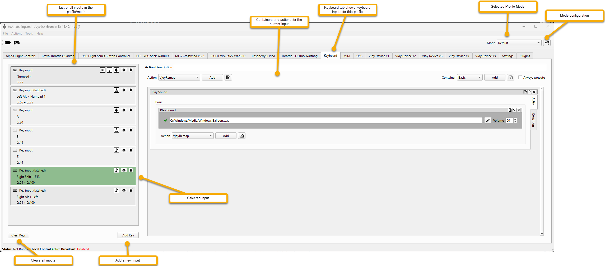

GremlinEx allows you to map unusual function keys F13 to F24 and any QWERTY keyboard layouts (no support for other layouts as of yet), as well as mouse input buttons including mouse wheel actions. 

#### Keyboard inputs

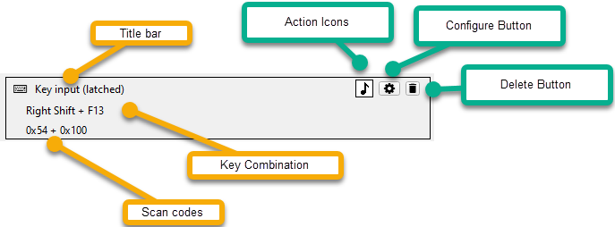

Keyboard inputs, as with joystick inputs are shown on the left panel in GremlinEx in the keyboard tab.  Inputs can be added, removed and edited (configured).  If an input is removed, it will remove any associated mappings.  A confirmation box will pop up if an input with content will be deleted.

Use the action and container copy/paste feature to duplicate actions between inputs.

#### Scan Codes

Gremlin Ex has an option to display keyboard scan codes that will be heard by GremlinEx to help troubleshoot the more complex key latching use cases.  The scan codes are the keyboard scan codes in hexadecimal that will be listened to to trigger this action.  The "_EX" means the scan code is extended.  This list is important because GremlinEx will only be able to trigger the actions if it "hears" these scan codes in pressed state at the same time.  

Many keys are special - such as the Right Alt key or the numpad keys. For example, the numpad numbers change scan codes based on the state of the numlock key and shift states.

### Numlock state

The keyboard's numlock state alters the hardware codes sent by the numeric keypad (numpad) keys and can in fact caused the keyboard to return the same low level key presses for different physical keys. This happens for example with arrow keys. When this happens, there is no current way in the low level API used to tell which key was pressed because the codes are the same at the hardware level. Because this is usually enabled by the numlock state, Gremlin Ex offers an option as of 13.40.14ex to turn off numlock if it was on when a profile starts.

This does not eliminate the problem entirely as there are still certain key combinations that will report duplicated keys at the hardware level, without GremlinEx able to tell the difference between keys.

If a key combination is not detected, you can use a keyboard scanner to see if the key windows sees is different from what you expect.  There is an option in GremlinEx to display the key scan codes corresponding to a particular key combination, and the keyboard must be able to produce these codes for GremlinEx to act on them.

A free utility to view keyboard scan codes is available [here](https://dennisbabkin.com/kbdkeyinfo)

### Virtual Keyboard

For input simplicity, GremlinEx now uses a virtual keyboard to show which keys are used for the input selected.  It is still possible to listen to keys using the listen button (currently this will only capture keys, mouse buttons will be ignored).

!virtual keyboard](assets/virtual_keyboard.png)

Currently only US layout (QWERTY) is supported for visualization. GremlinEx uses scan-codes (physical keys) on the keyboard so what the key actually says doesn't matter and is only for visualization purposes. I do plan to add localization in a future release so the keys show the correct key name for the current keyboard layout in use.

#### Selecting a key

Click on a key to select it.  More than one key can be selected in most modes. When configuring an input and more than one key is selected, GremlinEx will only trigger the container/actions if all the keys are pressed concurrently.

#### Shift state

If you hold the shift key, keys that can be shifted will show their character.

#### Select single

You can select a single key by holding the control key down.  This will clear any other selection.

#### Selected keys

Each selected key shows highlighted in the virtual keyboard.

#### Listen button

The listen button allows you to type the keys you'd like to select.  This has a limitation in that it will only "hear" the keys that can be pressed.  Listen mode replaces the current selection.

#### Pass-through

Keys uses as inputs into GremlinEx are not captured, meaning that all applications will receive the same keys that GremlinEx sees.

There are no guardrails provided - and GremlinEx does not prevent the output application from seeing the keys and buttons pressed to trigger a GremlinEx action.  When mapping to a game use care to employ key combinations that make sense and do not conflict with one another.

### Special considerations

Some actions, like mouse wheel presses, do not have a release associated with them (there is no event fired to "stop" the mouse wheel).  When mapping to an output, be aware that the output should be pulsed or otherwise handled if you expect such triggers to be momentary.  For example, if mapping a wheel event to a joystick button, use the pulse mode unless you want the button to stay pressed.

Another potential gotcha is to create a loop, wherein the output of an action creates a trigger for an output.

There are no guardrails to encourage flexibility however it is imperative to use this capability with care to avoid odd behaviors.

## MIDI device

GremlinEx, as of 13.40.14ex, can map MIDI messages and use those to trigger actions.

MIDI is a music oriented protocol to facilitate the exchange of music information between MIDI devices.  These devices can be hardware or software devices.

Unlike hardware devices, MIDI inputs must be user defined and added to tell GremlinEx what to listen to.  Because MIDI can be cryptic, the configuration dialog allows you to listen to MIDI data and automatically program what it "hears" as an input using the listen buttons.  Inputs can also be manually setup if needed.

Gremlin categorizes MIDI messages in that it doesn't look at the value data in the MIDI input stream - rather it looks at the port, the channel, the command, and any specific command data, such as the note number or the controller number.

Gremlin will thus, on purpose, not distinguish between two notes if the velocity is the only thing that changes.  Rather, the MIDI value is passed along to the actions as the value parameter, which enables mapping to joystick values easily (see the trigger mode section below)

### MIDI inputs

All MIDI inputs are supported including SysEx messages.  The general process is to add a new input to GremlinEx in the MIDI device tab which will appear on the left.  The input can be configured by click on the cog wheel.

Inputs can be deleted via the trashcan icon, or all inputs cleared via the clear all button.  Use with causion as if you get past the confirmation box, there is no undo and all the container data will be gone unless you previously copied it to the clipboard.  Confirmation boxes only show up if you have a container defined for an input.

### MIDI trigger modes

The input has three trigger modes for each MIDI input that alter how the MIDI data is processed by GremlinEx.

| Mode      | Description |
| ----------- | ----------- |
| Change      | Triggers whenever the MIDI value for the current command changes |
| Button      | Triggers a press event if the first argument is in the top half of the MIDI command range, usually 63 to 127.  The trigger value will be shown.   |
| Axis        | The input is placed in axis mode, which enables the vjoy-remap container in axis input mode. The range of the MIDI command value is used, so velocity for a note, value for a CC, etc... |

### Changing modes

If an input already has mapping containers attached, GremlinEx will prevent switching from an axis mode to a button/change mode and vice versa.  This is because containers and actions, when added to an input, are tailored to the type of input it is, and it's not possible to change it after the fact to avoid mapping problems and odd behaviors.

### MIDI conflicts

MIDI input conflicts are possible and stem from the ability to map MIDI messages via different inputs that map to the same or similar message.   GremlinEx will scan existing mappings to avoid this as much as possible, however it is not foolproof as there are ways to configure MIDI messages in such a way conflicts may not be detected.

### MIDI ports

GremlinEx listens to all MIDI ports concurrently so multiple MIDI ports can be used at the same time.  GremlinEx will scan for available ports.

If a port goes away after you've configured an input on that port, that port becomes invalid and will not be used for output.  GremlinEx will not delete that input however, but GremlinEx will display a warning on each invalid input.

### Network MIDI

While outside of the scope of this document and GremlinEx, you can easily network MIDI events using [rtpMidi](https://www.tobias-erichsen.de/software/rtpmidi.html).  Another utility that is useful is [loopMidi](https://www.tobias-erichsen.de/software/loopmidi.html). These utilities let you map MIDI input from a device attached to another computer via the network and send that data to the GremlinEx machine.   We won't go into details on how to set that up, but the idea is that a MIDI device sends output to a port, and rtpMidi allows that port data to be transferred to the GremlinEx machine.  GremlinEx will be able to use that input to trigger events.

**important**  GremlinEx will not listen to MIDI data via the remote control feature.  The remote control feature is only for output mapping, not for input.  Use the utilities above to network MIDI traffic which is outside the scope of GremlinEx.

### Using MIDI from touch surfaces

The MIDI input feature in GremlinEx is designed to work hand in hand with "glass" input surfaces like Hexler's TouchOSC or OSCPilot, or any software based control surface that sends MIDI data.

In TouchOSC's case, if you use the button mode in Gremlin to map a particular command, GremlinEx will press the button while the "glass" button is pressed, and automatically release it when the "glass" button is released.

Similarly, "glass" faders and rotary controls can be mapped using GremlinEx's MIDI axis mode.  Other modes can of course be used if the idea is to trigger an action if a specific range of values are reached.

### MIDI controllers

GremlinEx will see any MIDI message so long as the controller shows up as a MIDI port on the machine running GremlinEx (which can be a networked virtual port via rtpMidi).  GremlinEx was tested with hardware from MidiPlus, Arturia, and software controllers like Hexler TouchOSC.  It will also work with any software that outputs MIDI data.

### MIDI troubleshooting

The majority of issues will come from messages not being recognized by GremlinEx because the input configuration is causing it to filter (skip) that message.  To this end, Gremlin will tell you what it's listening to.

There are some tools that let you visualize what MIDI messages the computer is receiving such as [MidiOx](http://www.midiox.com/), and older but tried and true MIDI diagnostics tool, or something like [Hexler Protokol](https://hexler.net/protokol).  Both utilities are free.  It's always a good idea to verify the MIDI signaling is functional outside of GremlinEx to verify the machine is seeing messages.  If GremlinEx cannot "listen" to a message via the listen buttons, it cannot see it.

## OSC device (Open Sound Control)

GremlinEx, as of 13.40.14ex, can map OSC (Open Sound control) protocol messages as input and use those to trigger actions.  OSC is a network protocol over UDP used to exchange information between AV (audio visual) control panels, studio equipment and related software.  In GremlinEx's context, OSC is used to get input from control panels and touch surfaces that support the OSC protocol, including faders/knobs, buttons/switches, rotary encoders and sliders, all of which are very useful to use as  game input.  GremlinEx can receive and send OSC messages.  OSC is generally much easier to setup and program than MIDI as it supports text commands and multiple parameters, including floating point and integer values.  For more information on the open sound control protocol, visit [OpenSoundControl.org](https://OpenSoundControl.org).

Examples of what can be achieved using OSC:

- Receive input and control [Bitfocus Companion](https://bitfocus.io/companion) which enables GremlinEx to use input from hardware panels like [Elgato StreamDeck](https://www.elgato.com/us/en/p/stream-deck), [LoupeDeck](https://loupedeck.com) panels, and other studio control hardware.
- Receive input and control touch surfaces through [Open Stage Control](https://openstagecontrol.ammd.net/), [Hexler Touch/OSC](https://hexler.net/touchosc) or [OSC/Pilot](https://oscpilot.com/), which gives GremlinEx the ability to get input from a tablet, phone or touchscreen.
- Supports these devices over the network so devices do not need to be physically connected to the GremlinEx machine.

Unlike joystick devices and most hardwired HID inputs, OSC inputs must be user defined and added to tell GremlinEx what to listen to. GremlinEx supports any OSC message, although in the current version, limits are imposed on parameter types for ease of processing/mapping to a VJOY device:

OSC messages must consist of a text part, example  /this_is_my_test_fader followed by a numeric value (float or int).   Extra parameters are currently ignored, but can be provided without error.

Important: all OSC commands must start with a forward slash or they will be ignored.  OSC commands also accept one or two numeric parameters, floating point or integer.  It is customary for faders and axes to use a value of 0.0 to 1.0 for a range of values, and for momentary buttons to use a value of 1.0 when pressed, and 0.0 when released.

OSC messages that do not include parameters can be treated as an input trigger (press) if the option is selected in the OSC input configuration box.  In this mode, GremlinEx will automatically issue an internal release trigger after the set delay has lapsed.  This is often necessary because many actions in GremlinEx require both a press and release triggers, although that depends on the desired behavior. 

The general case for switches or buttons on panels is for the OSC device to send two messages to GremlinEx.  The message should have a single numeric parameter (others are ignored).  The parameter is decoded as a release for a value of zero (0), and a press for any value not zero (!= 0).  To make things consistent with most OSC control tablets, the convention is to use a value of 1.0 for button presses, and 0.0 for button releases. Note that GremlinEx will use the first parameter either as an integer or a floating point value, either will work.  

The general case for rotary encoders is different as these typically can only send rotation pulses, and no release.  For these inputs, configure GremlinEx to auto-trigger the release using the "trigger on press" checkbox and set the delay in milliseconds.  The delay is the time between the OSC message is received, and the internal release is triggered.  Most games require at least 100ms to capture the input, many require 250ms.  This varies with the game however testing most games prefer 250ms which is why the default is set at 250ms (quarter second).

### OSC ports

OSC is a protocol running over UDP, so requires not only an IP address but a port port to listen to, or send to OSC messages.  GremlinEx includes an internal OSC server to listen to incoming OSC traffic.  The default GremlinEx server (listen) port is 8000.  GremlinEx usually uses port 8001 for sending.

Network devices should send OSC traffic to GremlinEx using the IP address of the machine running GremlinEx and the GremlinEx server port (8000 by default).  Do not use the loopback IP address (127.0.0.1) - use the assigned IP address.  For dual homed machines (machines with more than one network interface), ensure you use the primary IP address.

When sending OSC data from GremlinEx using the *map to OSC" or "map to OSC ex" actions, be sure to also specify the IP address and listen port of the receiving panel.

GremlinEx can send itself messages, in which case the OSC packet will be internally bridged and will not go over UDP.  This enables hardware connected to GremlinEx to send OSC messages to itself, or the network devices.

The port can be configured by your OSC utility, just make sure GremlinEx listens on the correct port for messages.  The output port is not used by GremlinEx currently except to configure the OSC client. The output port is always 1 above the input port, so 8001 if the default 8000 input port is used. If you are using a firewall, make sure the port is configured to receive.

The GremlinEx OSC server port is configured in options.  GremlinEx uses by default the current non-loopback IP of the machine. Currently, that IP cannot be localhost (127.0.0.1), it may work in some configurations however it may not.  This makes sense because any OSC input device will typically run on a separate host, and thus the GremlinEx machine needs to have network connectivity.

### OSC port configuration

Ports should be used to avoid conflicts with each other.  Recommend defaults are:

- port 8000 to send data to GremlinEx
- port 8001 to receive data from GremlinEx
- Gremlin server port: 8000
- Gremlin OSC map send to port: 8001
- Bitfocus server admin port (web server): 8010

Example for GremlinEx running on the same machine as Bitfocus, and Open Stage Control running on a different network machine:

|Item to configure|Role|IP|Port|Description|
|-----|----|----|----|----|
|Bitfocus web server|admin|GremlinEx IP|8010|Admin web site|
|Bitfocus OSC generic module|send|GremlinEx IP|8000|Send to GremlinEx|
|Bitfocus OSC generic module|listen|GremlinEx IP|8001|Listen to GremlinEx|
|Open Stage control|send|GremlinEx IP|8000|Send to GremlinEx|
|Open Stage control|listen|Open Stage IP|8001|Listen to GremlinEx|
|GremlinEx (OSC configuration)|listen|GremlinEx IP|8000|Listen to Open Stage or Bitfocus|
|GremlinEx (map to OSC)|send|Open Stage IP|8001|Send to Open Stage|
|GremlinEx (map to OSC)|send|GremlinEx IP|8001|Send to Bitfocus|

GremlinEx IP = primary IP address of the computer running GremlinEx and Bitfocus (do not use localhost or 127.0.0.1)

Open Stage IP = primary IP address of the computer running Open Stage Control attached to a touch screen.

### OSC related firewall rules

In Windows 11, the Windows Firewall will automatically configure itself when GremlinEx attempts to open the port, and prompt to allow this traffic the first time. This prompt wil typically appear for each new port used. However this behavior varies with different configuration and policy settings in Windows.  A firewall rule may needed to be setup to allow UDP traffic on the ports used for OSC traffic.  If the firewall is not configured, the OSC traffic is not allowed to communicate so the packets will not transmit and GremlinEx will not be able to receive or send OSC data over that port.   The same is true of any OSC device in that ports must be opened and allowed to communicate.

### OSC test tool

Hexler provides a free analysis tool for OSC packets:  [Hexler Protokol](https://hexler.net/protokol)

### OSC inputs

All OSC inputs must be unique or a warning will be triggered in the UI.  An input maps to a specific message type.  In the current release, OSC inputs support the following input modes:

#### OSC Trigger modes

| Mode      | Description |
| ----------- | ----------- |
| Change      | Triggers whenever the value changes |
| Button      | Triggers a press event if the first argument is non-zero, and a released event when the first argument is zero.  For singleton commands with no parameters, such as for rotary encoders, use the *trigger on message* option so have GremlinEx issue an autorelease.  Note that a release is not always needed but most actions in GremlinEx expect a trigger on press followed by a release at some point.  |
| Axis        | The input is placed in axis mode, which enables the vjoy-remap container in axis input mode. A range value can be provided that tells GremlinEx the input range, it can map it to the VJOY range of -1 to +1.  The default is 0 to 1. |

| Command Mode      | Description |
| ----------- | ----------- |
| Message      | The input uses the message (string) part of the OSC message as the input identifier  |

| Message + Data     | The input uses the complete message as the input identifier, including any arguments.    |

The recommendation is to keep it to Message mode as it makes OSC programming much simpler.

A typical OSC command will thus be /my_command_1, number  where number is:

| Value of first argument    | Description |
| ----------- | ----------- |
| range min to range max (usually 0 to 1)    | Axis mapping -1 to +1 |
| zero    | Button release |
| non-zero    | Button press |

### OSC Message Requirements

GremlinEx can accept any OSC message, with or without parameters.

| Example OSC Message  | Parameter | GremlinEx OSC Input Mode | Description |
| ----------- | ----------- | ----------- | ----------- |
| /set_speed  | 0.0 to 1.0   | Axis |  Axis mapping -1 to +1 |
| /toggle_lights  | 0 or 1   | Button | Trigger a momentary input with 1 being the press event, and 0 being the release event.  Any non zero value will be considered to be a "press". |
| /toggle_gear  | none   | Button | Requires autorelease enabled. Trigger a "press" when the message is received.  GremlinEx automatically generates a "release" event after the delay has lapsed. |
| /flight/trim_set  | 0.0 to 1.0   | Axis |  Axis mapping -1 to +1 |

Messages must start with a forward slash.

A message can be interpreted as an axis if the first parameter provided is a floating point value, usually 0.0 (min) to 1.0 (max) which matches most OSC control surface defaults for faders and sliders.

Messages for button control should also have a numeric parameter.  A value of 0.0 (or 0 for integer data) means released.  A non-zero value means pressed.

If a message has no parameters, and the OSC input in GremlinEx can be setup to auto-release on message receipt.  In this situation, GremlinEx treats the receipt of the message as a "press" trigger for the button, and it will automatically generate a "release" trigger after a delay has lapsed.  This enables GremlinEx to use OSC input with no parameters.

If the message has no parameters, a global option can be set in OSC options to automatically consider all messages with no parameters as trigger buttons, without the need to enable the autorelease mode on the button.

Warnings will be placed in the log file if an OSC message arrives that is not suitable for the current GremlinEx input configuration and options selected.  For example, an input set to Axis mode when the message has no parameters.  In these situations, GremlinEx will just issue a warning in the log file and ignore the input.

### OSC Mode Considerations

| GremlinEx OSC input mode    | Description |
| ----------- | ----------- |
| Axis    | The input will look like an axis to actions and containers with an input range of -1.0 to +1.0.  The first argument in the received OSC message be in a range 0.0 to 1.0. |
| Button | The input will look like a button to actions and containers.  The first argument (integer or floating point) should be 0 for "released", and non zero for "pressed". |
| Button (autorelease) | The input will look like a button to actions and containers. GremlinEx will issue a "press" even on message receipt, and generate an automatic "release" when the delay has lapsed. |

## States

Starting with 1.0ex m74, GremlinEx includes a state machine.  States are used in multiple use-cases to solve simple to complex mapping scenarios.  For example states can help with latching, triggering the same mapping from multiple inputs, and conditional mapping based on boolean logic on multiple states without having to revert to a custom user plugin.

### What is a state?

A state is an internal entity that only exists in memory at runtime.  States have a unique, case sensitive, name.  States have an on/off behavior (also known as pressed/released or true/false) that can be set or read by profiles at runtime.  States can be used to implement a [state machine](https://en.wikipedia.org/wiki/Finite-state_machine) in a profile, and behave like virtual on/off or boolean switches.  They are either set/on/true or unset/off/false.  States initialize to a default starting value when a profile starts.  States can then be changed at runtime by the [map to state](usage.md#map-to-state) action anywhere in the profile, via a [macro](#macro), or by a user plugin via the StateData() API.  States can be read as a condition (state condition) that performs a check on the state to see if the conditioned container or action should execute or not.  States are also mappaple via the state device tab, so a state can trigger a set of actions when their value changes.

Attributes of a state:

- States are stored in a profile and specific to that profile.
- States are defined in the state device tab.
- States can only have an on or off value.
- States have no mode.  Mappings attached to states scope to the entire profile regardless of the current execution mode.
- States (like buttons) trigger whenever their value is changed.  A set (on) value will include a "press" action.  A clear (off) value will trigger a "release" action.
- States can be defined using boolean expressions using other states.  If a state in the expression changes values, the expression is re-evaluated.

Remember to save the profile if you have created states as they are only saved upon profile save.

### State mappings

Any action that can be mapped to a joystick button can be mapped to a state.  Linear (axis) inputs are not supported because states only have two values (on or off).

### Default value

When a state is defined, it can be given, at profile start, an or or off value.  When the profile starts, the state wil be initialized to this value.

Note: As of m76T40, a state can also be set using the new profile start/stop mappings in the Mode/Profile device via the *map to state* actions.

### Setting a state

GremlinEx can manipulate states at runtime using the *map to state* action or in a macro.   These actions let you set (turn on) or clear (turn off) a state.

### State expressions

States can be defined as a boolean expression from other states.  In this case, the state is not directly set by an action.  Instead, whenever a state value referenced in the expression changes, the expression will be re-evaluated and the new state derived.

At profile start, the value of the expression is evaluated based on the start value of dependent states.

### Supported boolean expressions

GremlinEx supports standard boolean operators.  In the table below, 0 represents the cleared (off) state or FALSE value. 1 represents the set (on) state or TRUE value.

| Operator    | Description | Values | | | | Comment | 
| ----------- | ----------- | ------ |------ |------ |------ |------ |
| AND  | boolean AND | 0 and 0 = 0 | 1 and 0 = 0 | 0 and 1 = 0 | 1 and 1 = 1 | Both values must be true
| OR | boolean OR | 0 or 0 = 0 | 1 or 0 = 1 | 0 or 1 = 1 | 1 or 1 = 1 | One value must be true
| NOT | boolean NOT (unary) | not 0 = 1 | not 1 = 0 |  | | Flips the value
| XOR | boolean XOR | 0 xor 0 = 0 | 1 xor 0 = 1 | 0 xor 1 = 1 | 1 xor 1 = 0 | True if values are different

### Evaluation order

NOT takes precedence as a unary operator over all other operators.
AND takes precedence over OR.
Parenthesis can be used to change the evaluation order.

### Example of state expressions

Using A, B, C, D as unary states we can define:

A = 1 B = 0 C = 1 and D = 0

| Expression    | Result | Explanation
| ----------- | ----------- | -- |
| not A  | 0 | inverse of A |
| A or B  | 1 | either a or b, true because A is 1 |
| not (A or B)  | 0 | inverse of (A or B)|
| B or D  | 0 | either b or d, false because both B and D are 0 |
| A and B or C  | 1 | true because what is evaluated in (A and B) or C, or 0 or 1 = 1
| A and (B or C) | 1 | true because the parenthesis causes B or C to be evaluated first, 1 or 1 = 1
| A xor B | 1 | true because A and B are different
| A xor C | 0 | false because A and C are the same
| A xor (B or C) | 0 | false because both values evaluate to the same (A) and (B or C)
| A or B or C and D | 1 | true, C and D is evaluated first, so 0, however the overall expression is true because A = 1

Note that expressions, like states, are not case sensitive.

### Interacting with states

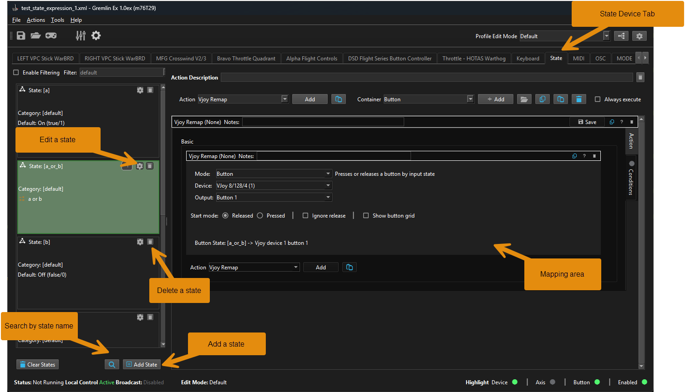

### State Gotchas

States are designed to be flexible.  As a result of this flexibility, it is possible using expressions to create loops.

Example:

State A is defined as not B.

State B is defined as not A.

This (simple) example creates a loop because both definitions reference each other.  GremlinEx includes a circuit breaker when evaluating expressions however it is not able to catch all situations.

Don't create loops!

### Creating a state

States are added to a profile via the special State Device.  Click on the add button.

#### Editor - regular state

A regular state is not based on an expression.  It only defines a start value when the profile is executed.

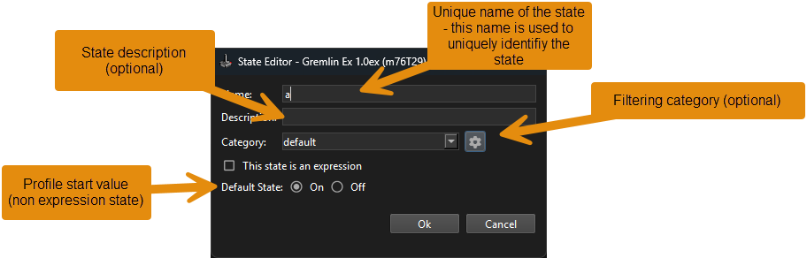

#### Editor - expression state

An expression state is based on other states using a boolean expression.  The state is automatically computed when one of states in the expression changes.

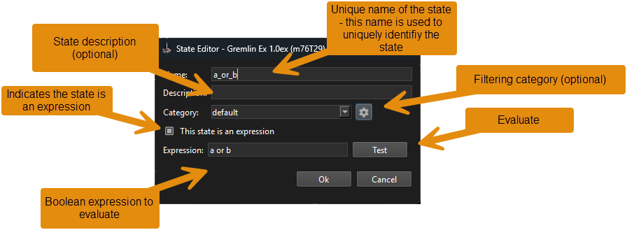

### State names

States must have a unique name in a given profile.

Names may not include any spaces.  Separate words using the underscore character.

Names are not case sensitive (so my_State is the same as my_state).

States are tracked internally by ID (as of m76T28) so a name change will also update all expressions automatically.  

### Deleting a state

Deleting a state will not delete a state if it's referenced in an expression.  The state will automatically be recreated if it is in an expression and it does not exist.

Note that this could create a challenging situation if the state deleted is itself an expression.

Be sure to delete all references first.

### State visualization

The input viewer includes a state repeater that can be used to visualize states as they change.

### State use-case scenarios

When would you use a state?

#### State as a condition

Because a state is like a virtual button, it can immediately used instead of any button condition.  However because a state can be setup as an expression using other states, it can also be used for complex latching situations when a trigger should only execute if several things are true, or only if some of them at true, or inverting that test using the NOT operator.

An example would be the need to trigger a joystick button but only if two physical inputs are pressed.  In this example, we'd create two states, A and B with a default value of off.
We would define a third state, called a_or_b, defined as:

     A or B

This will evaluate to True if either V1 or V2 are held.

For each physical input, we will add a map to state action to set the state to on whenever the button is pressed:

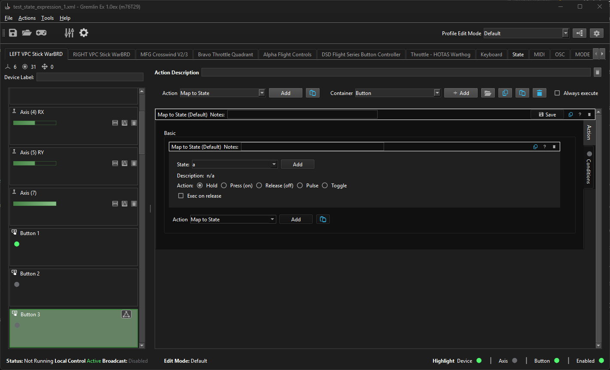

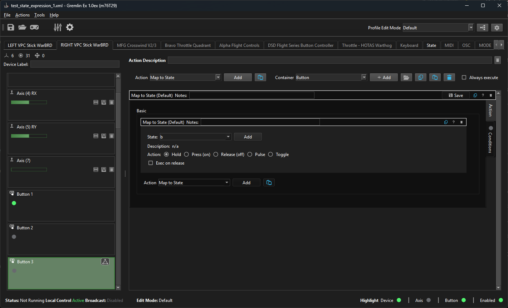

Note the use of the hold option, which means the state will be on when the button is pressed, and off when the button is released.

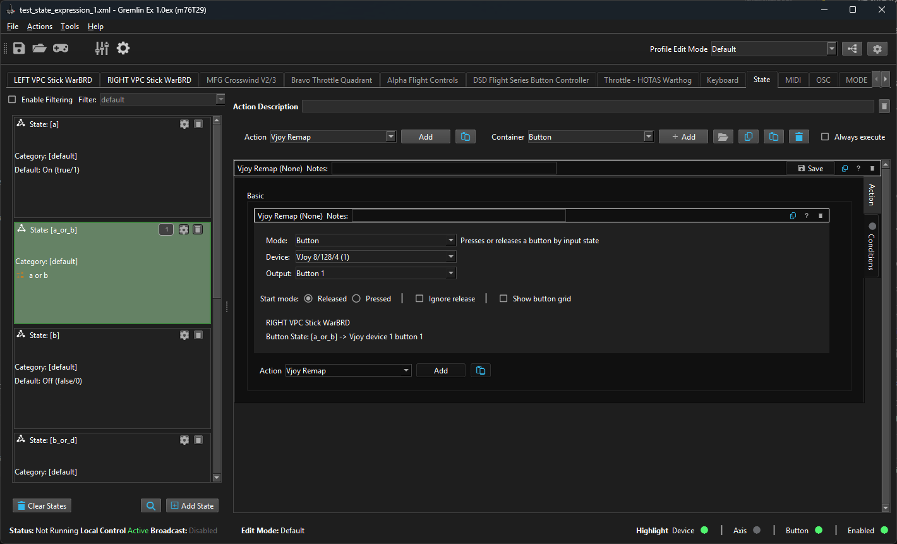

At profile runtime, VJOY device 1 button 1 will be triggered whenever either button is pressed/held on the two inputs.  This can also be used to map the same action to more than one input, so that to change the mapping of the output, it only needs to be changed in the state, not for each inputs.  This is a simple use-case but can be made much more complex with more elaborate boolean expressions.   For example, an expression of

    C and (A or B)

would introduce a latching, which means state C (however triggered) would also need to be true for the mapping to trigger.

### Profile Settings

Profile settings is a tab that lets you configure various profile options.

- select which VJOY device can be used as an input device
- set default values for VJOY axes
- select the default profile start mode
- set the default macro execution delay between steps

Note: Profile modes are defined in the .

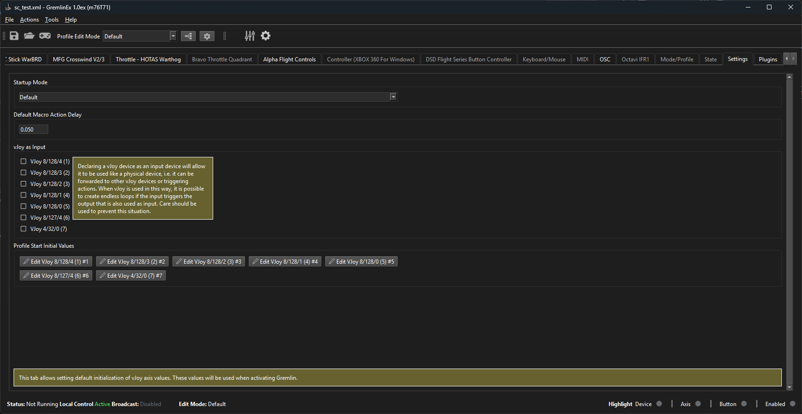

### Changing modes on existing mappings

If an input already has mapping containers attached, GremlinEx will prevent switching from an axis mode to a button/change mode and vice versa.  This is because containers and actions, when added to an input, are tailored to the type of input it is, and it's not possible to change it after the fact to avoid mapping problems and odd behaviors.

## Gamepad (X-Box controller)

As of 13.40.15ex, GremlinEx supports the VIGEM virtual X-Box 360 controller output.  Up to four (4) devices can be configured for output.

| Output | Description |
| ----------- | ----------- |
| Left stick X | (axis) outputs left stick, X axis |
| Left stick Y | (axis) outputs left stick, Y axis |
| Right stick X | (axis) outputs right stick, X axis |
| Right stick Y | (axis) outputs right stick, Y axis |
| Left trigger | (slider) outputs left trigger slider |
| Right trigger | (slider) outputs right trigger slider |
| Left thumb | (button) outputs the left thumb button (usually left stick push)  |
| Right thumb | (button) outputs left thumb button (usually left stick push)  |
| A,B,X,Y | (button) outputs the A/B/X/Y buttons |
| Left/Right shoulder | (button) outputs the left and right bump buttons |
| Guide/Start/Back | (button) outputs the guide, start and back buttons |

### Requirements

The VIGEM Bus must be installed - this is what provides the virtual gamepad controllers similar to what VJoy does, but for game controllers.

VIGEM bus can be found at https://github.com/nefarius/ViGEmBus. While the driver is no longer updated, it is a signed driver under 64 bit Windows 10 and 11.  The driver, once installed, will show under Device Manager/System Devices as "Nefarius Virtual Gamepad Emulation Bus".

Once installed, GremlinEx will automatically detect the VIGEM Bus driver, and will create a single device to start (unless this was previously changed in options).  The necessary DLL is included with GremlinEx and loaded automatically, no additional Python library is needed.  To detect the new virtual gamepad support, GremlinEx will need to be restarted.

IMPORTANT: no device will show in control panel or HIDHide until GremlinEx runs, as GremlinEx creates the device at runtime.  GremlinEX creates the devices when it starts, and removes them when it exists, regardless of what profile is running or not.

### HIDHide interaction

There is nothing special to do with HIDHide.  Because GremlinEx creates the virtual gamepad devices at runtime, they are visible to the game automatically by default, even if other devices are hidden.   

The devices will go away when GremlinEx is not running.

### Number of devices and device lifecycle

GremlinEX supports up to four virtual X-box controllers. The number of devices created  is configured in the options dialog, which can be set from 0 to 4.  0 means no device output. 

GremlinEx will create the devices when it runs (no profile needs to be active).  The devices will go away when GremlinEx exits.

VIGEM devices will not show in GremlinEx's device bar because there are no configuration items to set so while the devices exist, they are not displayed.

### Mapping to a gamepad device

Mapping to a gamepad is via the **map to gamepad** action.  The action is no different from mapping to Vjoy and functions the same way.

The action supports either joystick, hat, or any momentary input.  The action will only show mappings suitable for the input selected, so it will show gamepad axes if the input is a linear input, and button type mappings if not.

It is possible to curve an axis input into the gamepad and reverse its input via the response curve action if needed.

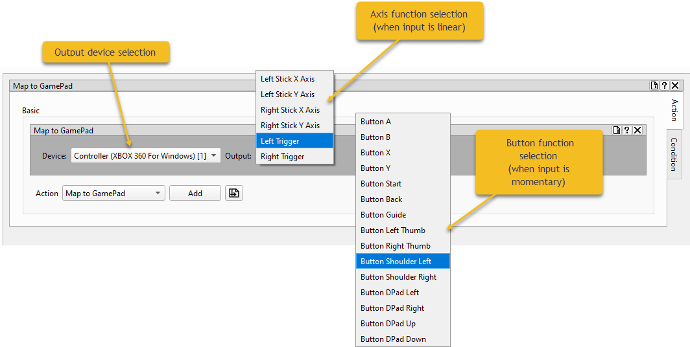

### Gamepad input

Unlike VJOY, GremlinEx does not currently support a virtual gamepad used as input.  However a hardware gamepad (such as an X-Box One controller for example) will show up in GremlinEx as a regular joystick input in the device tabs and can be mapped like any other Joystick controller.

## Profile

A profile holds a mapping of inputs to action. 

### Profile association

A profile can be associated with an executable in options, and GremlinEx can automatically switch to that profile when the associated process receives the focus.  By default this is not enabled as loading processes automatically can create a bit of lag while the process is loaded, especially if a large / complex profile, but the feature is available.   The other recommendation is to not automate this while setting up or tweaking a profile to simplify the editing process especially if you constantly switch focus between processes.

### Profile modes

A profile can have multiple modes.  A mode is a set of unique mappings, specific to that mode.   The default mode being called "Default" and is the starting mode.  Modes are not necessary.  They are provided for more complex mapping scenarios.

#### Mode background

It's important to understand what modes do as it will impact mapping behaviors.  Every mapping (container/action) is attached to a specific input (device and input within that device) as well as its mode.

If the mode changes, a new mappings set is activated and replaces the mapping set from a different mode.

If an action starts in one mode, results in a mode change, any other callbacks by this action may not execute correctly as the mapping has changed while executing.

#### Default mode

Every blank profile starts with the default mode, named "Default".  The name of the profile can be changed if needed.

Every profile must have at least one mode.

Additional modes are optional.

#### Nesting modes

Modes can be nested, meaning that a mode can itself contain other modes.  A child node inherits actions from a parent mode if the child mode does not define these inputs.  This means that the actions mapped to the parent mode (or its parent and so one) cascade into a sub mode if that device/input is not mapped.  GremlinEx will walk the chain up to find the first mapped action for that input, and execute it if it finds it.

If this behavior is not desired, the mode can also be a mode without a parent, in which case it will be a standalone mode without inheritance.

#### Mode addition/removal

Modes can be added or deleted.  Deletions can cause a loss of data as mappings are attached not only to an input, but a specific mode, so avoid deleting modes.

The last mode cannot be deleted.  A profile must have at least one mode defined.

#### Mode/Profile device

A special mode device, appearing as the *Mode/Profile* tab defines a pair of virtual buttons triggered by GremlinEx on mode change.

One triggers when the mode is entered.  The other triggers when the mode is exited (meaning, the before the new mode that was selected is activated).

Both inputs function as buttons, so containers and actions that support buttons can be mapped to these special inputs.

The mode enter and mode exit virtual buttons are unique to each mode, so each can have a different set (or none).

The mode enter trigger will also trigger on profile start for the mode selected as the default startup mode.  The trigger will happen after any settings on the settings options are applied.

#### Mode enter / exit use-cases

Examples of how mode entry/exit mapping can help solve common mapping problems, because they always execute regardless of physical input state.

- every mode can initialize a known setup as actions like Map to Vjoy can set specific values on axes or activate/deactivate buttons.  If the device enabling is turned on in options, the Control action can also enable/disable specific inputs.
- Text to speech will correctly execute on mode change.  Note however that the special variable ${current_mode} will reflect the current mode, which may not be the mode the trigger is defined in because of how the wiring works.  
- Mode exit can be used to "clean up" or reset a state when the mode changes to a different mode, or execute actions to re-enable a device for example.

## General mapping process

GremlinEx shows near the top of the UI a tabbed list of all detected HID hardware, including non-hardware input items like MIDI and OSC which also function as inputs.

For complex profiles, the first order of business is typically to setup the modes for the profile if you have complex mappings to do, typically if you need to have multiple mappings for the same inputs - this can be for example a "flight" vs a "walking" mode, or a "turret" mode vs a "cockpit" mode.  You create modes in the mode configuration dialog.   There is however no requirement to do modes first as modes can be added later if need be.

Select the editing mode at the top right of the UI from the drop down which will select the profile mode being edited.  All mappings will be attached to this mapping.  

Mappings for another mode will not be displayed from another mode.

The general idea is you will select one of the input tabs, selecting the hardware or virtual input device.  GremlinEx will show the detected inputs for the selected device.  If the device is a keyboard or MIDI or OSC, the input will also need to be defined.  Joystick inputs will show detected axes and buttons and hats for that input as they are reported by the hardware.

VJOY devices can also be used as input devices if so configured in the settings tab. VJOY devices cannot be used in GremlinEx concurrently for input and output.  

Once you have selected the input (or created one) on the left side of the UI, you can add one or more containers to that input.  

Remember to save changes via the save button as profile changes are not saved automatically.   The profile is saved to an XML file in the default Gremlin Ex user folder.  The folder can be opened directly in Windows Explorer from the file menu so it's easier to locate.

It's possible to manually edit the XML file if you'd like, however if you do, make a backup of the original XML file in case an error occurs.

## User plugins

User plugins are Python files that can be attached to a profile via the settings tab.  Python programming opens the door to very complex scenarios not easily achievable via the built-in container and action types, and recommended for advanced users only.  However user plugins are often the fastest and easiest way (depending on your perspective) to achieve very complex logical mappings in GremlinEx.

Note: plugins are reloaded every time a profile starts which allows for fast bug fixing.  Exceptions will be output to the dialog.   However if the plugin references other modules, these may not be reloaded until GremlinEx is completely reloaded due to the way Python bindings work.   GremlinEx has no control over this.

## Containers

Containers contain actions.  Containers are attached to an input selected on the left of the UI

## Actions

Actions are added to containers for each input type. In GremlinEx, some actions are compound actions, meaning, they create their own inputs based on the input they receive, so these actions can have their own containers.  An example of this is the Gated Axis action - which can trigger additional actions based on the position of an input axis.

Actions are aware of the type of input they are being attached to, and not all actions support all input types.  Some actions work only with joystick axis input (example, Gated Axis) while others only work with button or keyboard inputs (example, mode switch).

### Action priorities

Some actions are special - meaning - they need to occur after other prior actions in the execution sequence for a given input.   The priority is currently hardcoded in each action plugin which will be fine for all the provided actions.  For example, a joystick axis mapping action must occur after a response curve action (that changes the input to a new value), and a mode switch action occurs after all other actions.

### General Action Types

The default set of actions for GremlinEx grows all the time but includes in general:

- Map to VJOY Joystick (Ex version recommended)
- Map to Keyboard (Ex version recommended) - the EX version does both keyboard and mouse combination (complex input trigger like holding 4 keys down concurrently to trigger) mappings and supports special output keys like F13 to F24)
- Map to Mouse (EX version recommended)
- Text to speech (converts text to speech)
- Play sound (plays a sound clip)
- Change profile mode
- Change profile mode temporarily (while input is pressed)
- Cycle profile mode (advance in sequence)
- Gated Axis (lets you defined arbitrary action points based on input position)
- Response curve (curves the input axis so it's not linear)
- SimConnect (for MSFS output)
- Macro (combination of various actions)
- Pause/resume profile actions

## Profile edit time vs runtime behavior

When the profile is activated (either manually or automatically by process for example) changes the behavior of GremlinEx.

### Edit time

GremlinEx, as of 13.40.14ex includes a hardware repeater directly into the UI to visualize the input state at design time.  This is true for axes and buttons (not hats presently).

### Run time

When a profile runs, GremlinEx will stop updating the majority of the UI for performance reasons, especially for things like mode changes and repeating input. It is thus completely possible for the run time mode to not be displayed in the UI when a profile is running - this is normal.  

However the status bar (bottom left) will always reflect the active run modes of GremlinEx including the remote/local state and active run time profile mode and the toolbar (top left) will always reflect the run mode (green when active).

## Profile map visualization

GremlinEx has a dialog visualizer to show, in text form, the current mappings and modes for the profile.  This text can be copied to the clipboard and pasted as plain text.

## VJoyRemap action 

This mapper is an enhancement to the default remap action. The main enhancements are to show a visual representation of all buttons used, support remote control, eliminate the need to setup many conditions, and to support one-click typical mapping needs directly from the UI.

The VjoyRemap commands are:

| Command      | Description |
| ----------- | ----------- |
| Set Remote Control Only      | Enables broadcast mode and disables local output mode.  In this mode, GremlinEx only sends output to network clients.       |
| Set Local Control Only  | Enables local mode and disables broadcast mode.  In this mode, GremlinEx only sends output to the local machine.         |
| Enable Remote Control      | Enables broadcast mode. This activates broadcast mode regardless of the local output setting. |
| Disable Remote Control      | Disables broadcast mode. This disables broadcast mode regardless of the local output setting. |
| Enable Local Control      | Enables local mode. This activates local output mode regardless of the broadcast output setting. |
| Disable Local Control      | Disables local mode. This disables local output mode regardless of the broadcast output setting. |
| Enable Concurrent Local + Remote Control      | Enables both local and broadcast modes. GremlinEx output goes to both local and remote machines at the same time. |
| Toggle Control      | Inverts current output settings for both local and broadcast controls, whatever they are. |

The commands are only available to button bindings at this time.

### VJoyRemap button press actions

| Command      | Description |
| ----------- | ----------- |
| Button Press     | Outputs a single button to the given VJOY device.  The exec on release option sends the output when the physical button is released.  Start mode sets the output status on profile start.   |
| Button Release | Releases a single button on the given VJOY device.  This is the opposite of press.  This is usually not required but is helpful in some scenarios such as using the tempo container or toggle behaviors.  |
| Pulse     | Outputs a single button to the given VJOY device momentarily.  The default pulse duration is 250 milliseconds, which can be adjusted.  The exec on release option sends the output when the physical button is released.  Start mode sets the output status on profile start.   |
| Toggle     | Toggles (flips) the button output on the given VJOY device. If it was on, it's off, if it was off, it toggles on.  Useful for on/off type activites.    |
| Invert Axis     |  Inverts the specified output axis on the VJOY device.  This flips the direction of output of the axis on the fly by mapping it to a button.  This is specific to games that map the same axis but they are inverted (example in Star Citizen is ship throttle vs vehicle throttle).  When mapped to a physical switch on the throttle, converts from ship mode to vehicle mode for the throttle.  |
| Set Axis Value     | Sets the axis value on the given VJOY axis to a specific value between -1 (min) and +1 (max).  This is useful for detent programming.  |
| Set Axis Range     | Modifies the output range of an axis in VJOY.  The output will be calibrated to the new min/max and has convenience buttons to set half ranges. Use-case: increase sensitivity of physical axis, such as, for landing or roll. |
| Enable remote pairing | When set, the button output locally will also be output remotely regardless of the control mode |
| Disable remote pairing | Turns off remote pairing mode

### VJoyRemap axis mapping actions

| Command      | Description | |
| ----------- | ----------- | ----------- |
| Axis     | Maps source axis to a VJOY output axis. Options:    | |
| | Reverse | Inverts the output of the axis |
| | Absolute | The value of the output matches the raw input value  |
| | Relative | The value of the output is relative to the raw input value |
| | Start Value | The default axis position on profile start |
| | Scale | Scaling factor applied to the raw input.  Use case: increase sensitivity. |
| | Min/Max Range | Sets the default output min/max range.  The raw input is calibrated to only output between the two values (scale is computed automatically) |

### VJoyRemap relative mode

In relative mode when the input is also an axis, the value of the offset depends on the deviation of the input.  An input of 0 (center) means no deviation.
The offset applied is scaled based on the deviation, so maximum deviation of the input is the full offset value.

### Merge operations

When the input is an axis, Vjoy Remap has a merge axis mode that enables merging of two or more axes into an output value.

A merge operation always has at least one merged axis.  It is possible to add more merge axes as needed for more complicated merge scenarios and a cumulative effect.  The merge is applied top to bottom, so the prior merge step output becomes the input to the next merge operation in sequence.

Each merge axis can be selected by selecting the axis from the drop downs, or you can click the listen button to have GremlinEx select the axis that moved.

The merged axis cannot be the same as the input axis.

A merge operation should only be applied to one of the components of the merge.

| Merge operation      | Description |
| ----------- | ----------- |
| Add | The axis is added to the prior value. |
| Average | The value of the merged axis is averaged with the prior value. |
| Center | The value of the merged axis represents half of the output value, and the prior value is the other half.  This is used to combined two axes into a single centered axis such as for toe-brakes. |
| Minimum | The smallest value of the merged axis and the prior value is the output value |
| Maximum | The largest value of the merged axis and the prior value is the output value |
| Scale | The merged axis value acts is a scale multiplier on the other axis.  The scale applied is 0 to 100%.  Output range -1 to +1.  |
| Scale Half | The merged axis value acts is a scale multiplier on the other axis however only uses half the range.  If the merged axis is centered, the scale is 0%.  Output range -1 to +1. |
| Scale (centered)| The merged axis value acts is a scale multiplier on the other axis.  The scale applied is 0 to 100%. |
| Scale Half (centered)| The merged axis value acts is a scale multiplier on the other axis however only uses half the range.  If the merged axis is centered, the scale is 0%.  Moving the merged axis up or down sales +- 100%. |
| Trim | The merged axis adds a positive or negative trim, using a full axis range of the merge axis. |
| Trim (centered) | The merged axis adds a positive or negative trim, using the half axis range of the merge axis. |

Each merge step can be inverted.

Each merge step can have its own curve applied to the merge axis.  The curve is applied to the merge axis first, then used in the computation of the merge.  This can be used for interesting effects such as reducing the range of the merged axis, which is helpful to control min and max scaling, and also to control sensitivity.

### Axis to Buttons

In this mode, the input axis can be split up into ranges each triggering a button when the range is entered.  For more complicated scenarios and sophisticated axis range slicing, use .

&nbsp;

| Command      | Description |
| ----------- | ----------- |
| Axis To Button     | Maps a raw input range to a specific button.  While the raw input is in that range, the button will be output.  Combine multiples of those to create more than one trigger.  Use-case: detent programming based on axis position.  | |

## Gated axis action

This plugin is an experimental axis input filtering plugin.  It splits an input axis into ranges.  A range is separated by two gates, and the number of gates that are defined determines how many ranges are created.

The inspiration for this action comes from the need to more easily map complex gated axis inputs to outputs, and very specifically to tackle space sims, commercial airliner, turboprop and helicopter throttle mappings in simulators. 

The default action is configured with two gates at min/max and a single range in the middle.

The gated axis allows you to map one or more actions when the input value crosses a gate - a specific point on the axis.  The gates axis also allows you to map one or more actions when the input enters, exits or is within a range.

The gated axis action can only be associated with an axis hardware input and cannot be associated with buttons or hats.  It expects a linear input.

### Gates

A gate is a point along the input axis with a specific floating point value in the range -1 to +1.  

Up to 20 gates can be defined.

A gate can be added to the action by right clicking anywhere on a range, or adding a gate manually.

Gates can be moved by the mouse, or by clicking the record button which will move the gate to the live input position (the black marker on the display), or the value can be manually input.  The mouse wheel over the gate position number will also increment or decrement the gate's position.

### Gate mappings

The gate mapping configuration window is access by clicking on the gate's configure button, or right clicking a gate.

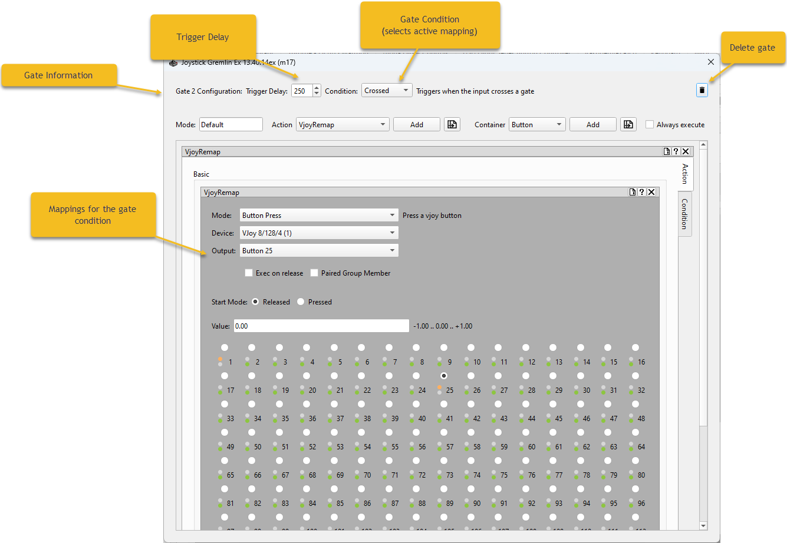

Each gate condition has its own set of mappings.   Mappings will see the gate as a momentary (button) input so only actions suitable for a button will be available for selection.

| Condition      | Description |
| ----------- | ----------- |
| Cross | The gate will trigger whenever the input crosses the gate |
| Cross (inc) | The gate will trigger if the gate is crossed from left to right, or in increasing value |
| Cross (dec) | The gate will trigger if the gate is crossed from right to left, or decreasing value |

### Gate Delay

The delay is a value in milliseconds that determines how much time elapses between a press and release action.  Internally a gate will mimic a button press, so will send two specific events to sub-actions on a gate, a press action, followed by a release action.  Setting this to zero means the two are instant.  The default value is 250 milliseconds (1/4 second) which is enough time for most games to capture the input, either a keyboard press or a button press.

### Ranges

A range is defined by two gates.  The number of available ranges depends on the number of gates, and the size of each range depends on the position of the two gates representing the lower and upper end of the range.   Ranges are automatically computed based on gates, and adjust whenever a gate is moved.

Ranges cannot overlap.

### Default range

If individual range mappings are not needed, a default range corresponding to the entire input axis is defined.  A checkbox toggles this mode on/off.

### Range mapping

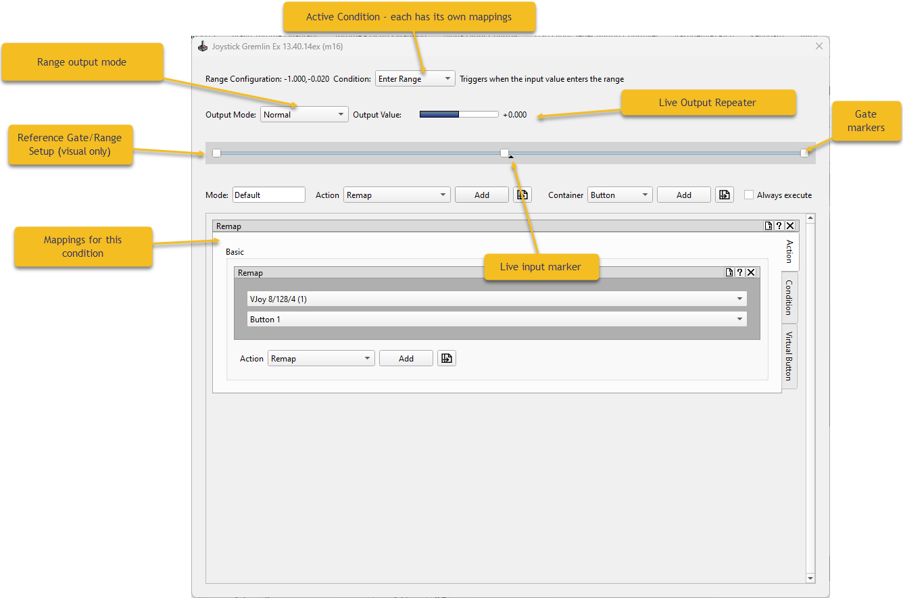

A range lets you map actions whenever the input enters a range, exits a range, or is within a range.  Each as its own set of mappings.

Actions mapped to a range will see it as a joystick axis input.

| Condition      | Description |
| ----------- | ----------- |
| Enter Range | This will trigger whenever the input value enters the range.  This triggers once every time the input enters the range.  |
| Exit Range | This will trigger whenever the input value exits the range. If the range is a boundary range (at minimum or maximum of the input range), it will still trigger.  This triggers once every time the input exits the range. |
| In Range | This will trigger whenever the input changes within the range.  This is useful to send axis data out based on the position inside a range.  This triggers on any input change. |
| Outsie of Range | This will trigger whenever the input changes and is not in this range. This triggers on any input change. |

### Range output mode

Ranges have multiple output modes that affect the output value sent to mappings.

| Mode      | Description |
| ----------- | ----------- |
| Normal | The value is output as is (this is the default) - this is also known as the pass-through mode.  |
| Output Fixed Value | Mappings get a fixed value whenever the range condition is triggered. This is helpful to freeze the output to a fixed value.  |
| Ranged | The value is scaled to the range's defined minimum and maximum. By default the minimum and maximum match the bounding gate positions, but this can be changed to any valid value to scale the output.  |
| Filtered (no output) | No value is output in this mode. Use this to suppress output when the input is in a given range. |
| Rebased | This is similar to ranged mode, and the bounds are set to -1 to +1 so each range acts as a full output axis. |

Whenever you add or remove gates, ranges are added or removed as well.  It is recommended you don't configure ranges until you have the number of gates finalized to avoid inadvertently loosing configured actions because a range was deleted as you removed a gate.  GremlinEx will confirm deletions.

### Default range

The default range is a special range that is used for how the gated output should behave when the input is not in configured range.   A configured range is a range that has actions and modes defined. The default range is used when a range exists, but is not configured to do something special.

You can use the default range to your advantage by only configuring special ranges in the input axis - and let the default range handle what happens when the input is not in the special ranges you've defined.

### Use-cases and scenarios

The gated axis plugin can be useful for a number of scenarios where more sophistication is needed on input axis data.

The plugin can be used for complex axis to button mapping, for establishing complex setups for latched output, for scaling purposes, to suppress output for some input values, allows for stepped throttle settings, and allow for different scale and sensitivity (curves) based on input positions.

Examples for ranges include mapping beta-range for turbo props simulations, trigger fuel cutoff at the bottom of a range, thrust reverser toggle, introduce dead zones along the axis, or split a single axis into multiple axes.

Examples for gates include triggering a mode or setting up a state based on how a gate is crossed (directional) as well as bi-directional.

## Map to mouse EX action

This plugin is identical to the Map to Mouse plugin but adds a wiggle function, easy execute on release and button hold functionality. When wiggle is enabled, the mouse will move slightly by itself every 10 to 40 seconds and move back.  It will do that until wiggle mode is turned off.  
  
The purpose of wiggle is to keep an application alive.   Wiggle is turned on/off separately for remote/local clients.

| Command      | Description |
| ----------- | ----------- |
| Mouse Button | Outputs one of the mouse buttons |
| Mouse Axis | Moves the mouse |
| Wiggle Enable (local) | Jolts the mouse every few seconds  |
| Wiggle Disable (local) | Stops the mouse wiggling if it was turned on.  |
| Wiggle Enable (remote) | Jolts the mouse every few seconds on remote clients  |
| Wiggle Disable (remote) | Stops the mouse wiggling if it was turned on for remote clients  |

Mouse commands can forced to be sent to remote hosts only, or to send them concurrently to the remote host regardless of the remote control state.

## Map to keyboard EX action

This is identical to the base keyboard mapper but adds a few functions I thought would be handy.

The updated keyboard mapper adds separate press (make), release (break) functionality so keys can stay pressed, or just released separately.

It also adds a delay (pulse) function to hold a key down for a preset period of time (default is 250 milliseconds or 1/4 of a second which is the typical game "detect" range as some games cannot detect key presses under 250ms in my experience.

The make/break/pulse behavior applies to all keys in the action, and the keys are released in the reverse order they were pressed.

### Output modes

| Mode     | Description |
| ----------- | ----------- |
| Hold | Keys will be pressed while the input is active, and released when the input is not.  The meaning of active depends on the input type.  For example, keys will be pressed while a joystick button is held down and will release when the button is released.  The input does not auto-repeat in this mode - only one make/break is sent for each latched key. |
| Pulse | This mode triggers a press action, waits the pulse delay, and releases the keys.  This happens regardless of the input state.  If the input is pressed again while the pulse delay has not elapsed, the pulse is restarted.  In this mode, the keys are always released after the pulse delay.   Keep the pulse delay at or above 200ms as most game loops will fail to capture key presses under 200ms. |
| Auto Repeat | This mode is similar to pulse mode, except the pulse will repeat while the input is held.  The interval specifies the time between pulses.  Set to 0 for no delay, keeping again in mind that most game loops will not detect key presses if they occur within 200ms of each other.|
| Press | This mode triggers a press only (a "make" in keyboard hardware parlance).  This mode does not release the keys so it's expected at some point, the profile will release the keys.  Dragons: when used to send mouse clicks - it will keep the mouse pressed until the release which can cause behavior issues in the operating system.  Use with caution and only paired with a release mapping somewhere in the profile. Usually you can manually press the keys or the mouse to "undo" a press, provided that input is available (example F13 would not be).|
| Release | Ths mode triggers a release only (a "break" in keyboard hardware parlance).  This is the companion action to the press mode. |

### Latching

This action can send very complex and unusual keys and mouse buttons, including keys that are not typically available on a regular keyboard like the F13 to F24 function keys.   The action can also combine unusual "latched" sequences such as pressing more than multiple keys and mouse buttons at once.

### Numlock behavior

The keyboard behavior is hard-coded in the hardware to send duplicative scan codes depending on the state of the numlock key.  To avoid issues, GremlinEx automatically turns off numlock (if it was on) while the profile is running to ensure that the keyboard sends the correct and predictable scan codes.  This can be a challenge in some situations but was necessary to ensure the keyboard mapper sends consistent keystrokes and mouse buttons when the hardware, depending on the state of numlock, sends duplicate scan codes based on its mode.   This ensures that numeric keypad keystrokes all show up as numeric keypad.

### Dragons

This action is an experimental feature.

Make sure that if you use a press action, there is a companion release action somewhere.  If that doesn't happen, you can press the key on your keyboard and it will release the key.

When a key is pulsed, the release will occur regardless of input state or conditions.

## Merged Axis action

This action is similar to the profile wide merged-axis functionality via the menu, with some key differences:

- the action can be added to any joystick axis input
- the action only sends its output to sub-actions it defines
- the action includes an option to invert the output

### Lower and upper inputs

The action lets you select two input operators from the list of axis input (physical or virtual) to participate in the merge operation.  While the same operator can be selected for both upper and lower entries, in this case nothing will happen but it does let you define sub-actions unique for that input if needed, which can be of use in some use-cases.

The inputs can be associated with the hardware input mapping this action, however this is not a requirement.   The hardware input in this case is used as a placeholder to add a merge action to the profile, the only requirement is the action has to be added to an axis input.  The input of that hardware is not used in the merge operation unless the input specified in the action happens to be the same as the hardware input the action is mapped to.

### Operations

| Operation      | Description |
| ----------- | ----------- |
| Sum | The two axis inputs are added and clamped to -1.0 to +1.0 range |
| Minimum | The smallest of the two inputs is output |
| Maximum | The largest of the two inputs is output |
| Average | The average value is used as the output - this is typically used to combine two axes into one for brake pedals for example  |

### Invert

The checkbox inverts the computed output.

### Output

The output helps visualize the computed output while the profile is not running the computed output based on the live input.  When the profile starts, the updates are disabled.  The updates will resume when the profile is stopped.

### Action configuration

The button opens a dialog showing the list of sub-containers and sub-actions that will receive the merged axis information and process it for mapping.

The actions defined in this dialog are only executed for this action and will not be visible to other actions defined in the profile.

Each merge axis action contains its own sets of sub-containers/sub-actions.

## Simconnect (MSFS)

GremlinEx uses Simconnect to interface with Microsoft Flight Simulator(R) 2020 and 2024.  Simconnect is the API provided by Microsoft/Asobo to interact with the simulator. GremlinEx implements a two-way interface to Simconnect, and provides one action that can be used to map a hardware input to a simulator control or axis via Simconnect.  The two-way functionality is accessible via user plugins if needed, and internally used to detect the active aircraft to handle profile mode changes based on the aicraft type.

### Concept

The GremlinEx concept for working with MSFS is to setup a (single) profile for MSFS that contains as the default mode all generic mappings for controls that are commmon to every aircraft aircraft (example, a gear handle, pause/unpause, lights).  The profile can then have a submode for each mapping specific to an aicraft (example, throttles or condition levers).  This allows a single profile to be used for all aircraft and have different configurations for each, such as curves, gates, and simvars specific to the aircraft being flown.

GremlinEx provides an automatic mechanism to switch profile modes for each aircraft based on what it has detected is the active aircraft.  This is dynamic so when a new aicraft is loaded, the mode, if defined in options, will be activated if it exists in the profile.

As of this version, GremlinEx must run on the same computer running MSFS.  This is a MSFS requirement.

### WASM module

GremlinEx includes a custom MSFS WASM module written in C++ that gives GremlinEx the ability to use gauge API (WASM) expressions, get a list of simulator variables defined by add-ons, and get values from internal variables via SimConnect.  This functionality gives GremlinEx the ability to control add-on cockpits that are not controllable with the base SimConnect API functionality. This functionality does not currently exist in the current SimConnect SDK.

The module must be installed in the Community folder in MSFS.  The location of the Community folder varies with the version of MSFS and the method of purchase.  Here is [a helpful article](https://flightsim.to/help/microsoft-flight-simulator/locating-the-community-folder-of-microsoft-flight-simulator) on how to locate this folder on FlightSim.to.

The WASM module is included in GremlinEx as a zip file containing a single folder called **gremlinex-module**.  To install the module, ensure MSFS is not running, and they just copy the folder ** gremlinex-module** in its entirety the Community folder.  Restart the simulator.

### Configuration

The Simconnect configuration is accessible via the tools menu, or via the configuration button on the action itself.

The configuration dialog can automatically scan the community folder for the list of locally installed aircraft (add-ons).  With MSFS 2024, some aicraft can be streamed and they are stored encrypted locally on the computer so GremlinEx.  Those will need to be manually entered in the configuration dialog as GremlinEx cannot detect those automatically.

If you would like to use the mode mapping feature, you will need to make sure there is an entry for each aircraft variant as reported by the sim to a profile mode.  If no entry exist, the default mode will be used.

The configuration, if MSFS is running, can show you the active aircraft detected at the top of the window.

### Map to Simconnect Action

The map to simconnect action lets you map a simvar or event to the simulator. GremlinEx supports simple triggers (send a command to the simulator), send a fixed value (usually for events that require an on or off status, or a specific value), and a ranged output, usually for throttles, flaps, condition levers (any axis type).

GremlinEx uses a normalized axis range of -1 to +1 for the input, and this gets mapped to the range used by the simvar.

Important: Simconnect can have numerous entries for the same function (example, throttles), and not all aircraft respond to these entries.  Consult the documentation of the specific aircraft, especially third party add-ons, for the specific Simconnect variables they use as input.

### General flow and connectivity

It's recommended that you run MSFS first before you activate a GremlinEx profile: GremlinEx will immediately attempt to connect to MSFS via Simconnect when the profile starts, or when in the configuration window.   GremlinEx will enter a retry mode if it cannot connect, and eventually give up. To re-attempt the connection, you will need to stop the profile, and start it again, or close the configuration dialog and open it again.

Attempts can time-out and fail for many reasons, first and foremost is that Simconnect is not available immediately when MSFS runs.  It can take several minutes after the simulator is started before Simconnect is available.  A rule of thumb is that Simconnect is only available when the simulator's interface is available and loading has completed. MSFS can take a very long time to load.

For the automatic mode switching to happen, two requirements must be met: 
(1) an entry (case insensitive) must exist in the configuration dialog that maps the specific aircraft variant to a mode you wish to use.  The aircraft variant name is unique across all aircraft in the simulator and is specified by the add-on's configuration and is unique for each variant.  That name can be very cryptic.
(2) a corresponding mode must exist in the profile.   The mode can be anything you want, and indeed, can be re-used by multiple aircraft where it makes sense.

In the GremlinEx configuration options, you can enable verbose Simconnect mode that will add detailed entries in the log file of the interactions with Simconnect - including status, what aircraft is detected and when it is detected, and data GremlinEx is sending via Simconnect.

### Tips

The log file (with verbose Simconnect mode enabled) will record detailed entries of any problems or errors, such as connectivity errors and data sent/received.

The main issue is usually that the profile is activated and Simconnect is not available.  This can be easily fixed by stopping the profile, waiting for MSFS's user interface to be active, and then start the profile.

The other issue is that the data sent to MSFS isn't used by the aircraft being flown, or the data is out of range/invalid.

The mode lock features in GremlinEx's Simconnect options will freeze the mode to a specific mapping and will disable any mode change (switch mode, cycle mode) in GremlinEx to prevent inadvertent mode changes.

## Range container

The range container is a container designed to break up an axis input ranges into  one or more actions tied to a particular range.  While something like this can be done with conditions, the range container is much easier to setup than using conditions. 

The idea of a range container is to setup a range of axis values that will trigger one or more actions.   As many actions as needed can be added.  An example of this is mapping a flaps axis to distinct keys, or setting up button presses based on the value of an input axis, which is helpful for example, for throttle setups on some flight simulators to setup detents.

The range container has a minimum and a maximum and each boundary and be included or excluded to define the range.

There is a convenience button that will create automatic ranges to an axis: you specify how many axis "brackets" you need, and you can give it a default action.  This will create range containers for the axis automatically and compute the correct bracket values for the count provided.

The Add button adds containers.  The add and replace button replaces all the range containers with the new range value (use with care as it will blitz any prior range containers).

The range container is designed to work with joystick buttons or the enhanced keyboard mapper (map to keyboard ex)

### Ranges

All joystick axis values in GremlinEx are -1.0 to +1.0 regardless of the device, with 0.0 being the center position.

#### Include/exclude flag

Each bracket can include or exclude the value.  Think of it as greater than, versus greater or equal to.   This is use to include or exclude the boundary value when GremlinEx is determining if the action should trigger or not.

#### Symmetry

The symmetry option applies the opposite bracket as the trigger.  So if the bracket is (0.9 to 1.0), in symmetry mode the bracket (-1, -0.9) will also trigger if the axis is in that range.

#### Latching

The range container is latched - meaning that this special container is aware of other range containers in the execution graph.  The latching is automatic and ensures that when the axis is moved to a different position, prior active ranges reset so can re-trigger when the axis moves into their range again, so the container has to be aware of other ranges.

#### Dragons

This container is an experimental feature.

The range mapper is not designed to work with the default keyboard mapper as that will cause stuck keys, because of how the default keyboard mapper works when conditions are not used.  Use the enhanced keyboard mapper.

The latching feature (awareness of other range containers) may introduce some strange behaviors and applies to all ranges attached to a single axis, so it's not aware of nesting for example.  The latching applies to all ranges in the mapping tree regardless of their level.

## Button Container

This experimental container simplifies the mapping of actions when an input button is pressed or released.  While this can be done with conditions, this is a simpler and easier way to map a button to a set of actions when a button is pressed or released.

### Usage tips

This container is best used to handle an on/off function (the input only triggers when in one of two possible positions), or a three way function (the input triggers in two out of three positions - the middle position usually being the one that doesn't trigger)

### Pressed block

In this section, add the container or actions you want to execute on button press.  Leave blank for no action.

### Release block

In this section, add the container of actions you want to execute on button release.  Leave blank for no action.

## TempoEx Container (tempo with chain)

This experimental container combines the Tempo and Chain containers together.  The container has two main sections, a short press action set, and a long press action set.  The delay box indicates how long the (real) button has to be held before selecting either a short or long set.

Each action set contains one or more chain groups.

Each chain group contains one or more actions.  A group will execute all the actions in that group.

Chaining means that at every short press, or long press, the container will sequence through the chain groups for that action set in round robin fashion.

The chaining behavior can be prevented if needed (although that's really the point of the container).

The chain delay is included although it will conflict with long press.  I may remove it later because the value may be limited in most use-cases that would benefit from this container.

Within each action set, the chain group entries can be re-ordered, or can be removed.

## Sequence Container

This container executes all contained actions in sequence, similar to a macro.  The difference between this container and others is the order of execution is guaranteed in step order, and each action runs in sequence rather than in parallel.

This container has several features not found in a macro:

- all action types suitable for momentary input can be used, such as OSC.
- steps can themselves contain macros if needed.
- wiggle mode can be used to randomize the execution of the container
- each step can contain more than one action.

### Wiggle mode

When Wiggle mode is enabled, this container can randomize the execution of actions it contains. 

In wiggle mode, the container will continue executing actions while the input is pressed, and stop when the input is released.  This makes it particularly suitable to usage by a state, or when mapped to a physical toggle switch on a hardware input.

The pause between steps can be randomized between a minimum delay, and a maximum delay.

If step randomization is enabled, the next step to execute will also be randomized.  If disabled, the step sequence is observed.

Actions execute in the order they are listed and they can be re-ordered if needed.

The purpose of this container is to add macro-like functionality using mappings instead of the macro action itself.

## Map to State

This feature is only available in 1.0ex m74 and above.  For more information on states, consult the [state device section](#states) of the documentation.

The map to state action manipulates a state when it's triggered.  This action lets you select the state to act on, and what should happen to the state value:

| Operation      | Description |
| ----------- | ----------- |
| Press (On) | Turns the state on |
| Release (Off) | Turns the state off |
| Pulse | Inverts the state, waits delay milliseconds, and restores the previous state |
| Toggle | Toggles the state.  If it was off, turns it on, if it was on, turns it off |

A new state can be created directly from the action by pressing the add button.

## State Device

The state device is a special virtual device that lets you add, remove or edit states available in a profile.  Each state can also be mapped to, which will cause the containers/actions to execute when the state changes.  This is optional because the other way to use states is as conditions so not all states need to map to actions.

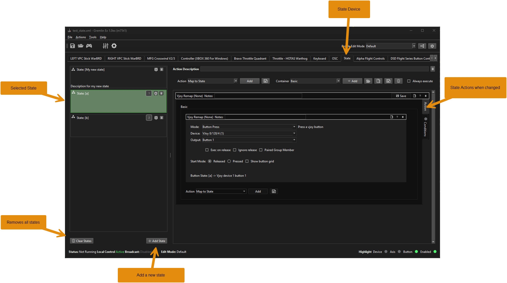

A state has a unique, case sensitive name.  It also has an optional description to help document what the state does.

States have to be unique.  No two states with the same name (case sensitive) can exist at the same time.

States are unique to a profile.   They are not shared with other profiles, so each profile needs to define its own set of states.

States are not mode specific.  States are global to a profile regardless of mode, and this is by design to allow states to be accessible from any mode.  You can absolutely use states specific to modes, in which case you would use different states named differently that you only use in specific modes.  How you use states is completely up to the logic behavior you want to achieve.

States can only have an on (pressed) or off (released) value.

Whenever a state changes, if it is mapped to containers/actions, these will execute and look to the mapped containers/actions as a joystick button (pressed or released).  Important: when a state changes, the events are queued immediately when the change occurs, to ensure that any actions execute on state change.

Warning: By design, there are no guardrails with states, so loops are possible, and this is usually not a desired outcome as it will result in endless looping in some situations.  While some state machine designs must allow loops, but it could result in an endless loop if A toggles B, B toggles C, C toggles A.  This is allowed for the time being.  As of this writing, this is a concious design decision to allow this as the runtime performance impact and logic required to catch these would be a negative impact, so use states with loops in mind to avoid this situation currently.  If you do enter into a loop inadvertently, depending on the loop, the profile would need to be stopped.  In some cases, a hard process kill via task manager may be needed.

## State Condition

The state condition is used to apply conditional execution on a container or action based on the current value of a state.  The condition will prompt for the name of the state, and whether the condition should be pressed or released.

## Profile visualization

GremlinEx can create a directed graph in PDF or SVG formats of a profile, provided that you have the open source [GraphViz library](https://graphviz.org/) installed.   Graphviz will be configured and executed by GremlinEx to produce the relevant files.

The visualizer dialog is accessible from the Tools menu under Tools/Profile Visualization.

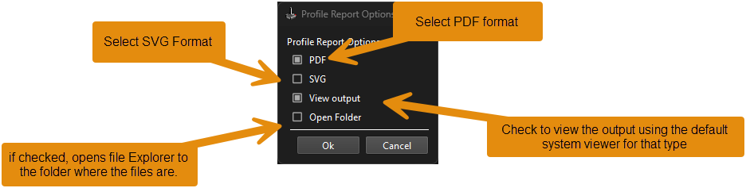

WARNING: generated SVG files can be quite large (several megabytes) compared to a PDF file.

GremlinEx currently does not do any pagination of a profile.  This can be done if needed with an external application.  The purpose of the PDF is not to print, but to visualize the profile graph on a screen using a viewer can can be zoomed in and moved to any location.

## User Scripts (plugins)

GremlinEx uses Python decorators to facilitate custom scripting and control from Python.

### @gremlin.input_devices.gremlin_start

Called when a profile is started - lets a script to initialization when a profile starts to run

### @gremlin.input_devices.gremlin_stop

Called when a profile is stopped - lets a script cleanup when the profile stops running

### @gremlin.input_devices.gremlin_mode

Called when the mode is changed (use def mode_change(mode) - mode will be a string) - lets a script get a notification when there is a profile mode change somewhere in GremlinEx.

### @gremlin.input_devices.gremlin_state

Called when the state information is changed (local, remote or broadcast mode). The event properties is_local, is_remote and is_broadcast are flags that contain the current state of GremlinEx.

## Recipes

### One way or two way switch to two way switch / three way switch

Some hardware controllers only have a trigger on one (two) positions out of two (three).  Usually the center doesn't have a button mapped.  

In GremlinEx VjoyRemap a button trigger can easily be output for each position of a switch by adding a release mapping to the hardware positions that do trigger on.  The trigger occurs then when the switch leaves the position and turns off.

One responds to button presses on the raw hardware, the other responds to a button release on the raw hardware.

| Mapping     | Description |
| ----------- | ----------- |
| Send VJOY output   | Sends a button press to VJOY device and button when the position of the button is active.      |
| Send VJOY output (on release)   | Sends a button press to VJOY device and button when the position of the button is no longer active.  The checkbox "execute on release" is selected in this case.  |

The equivalent pulse commands can be send to send a momentary pulse rather than having the button on all the time if that is needed.

### Long/short press - buttons or keyboard

You'll use the tempo container sets up two action blocks, one for short press, the other for long press.  The tempo container lets you select a long press delay, so if the input is held long enough, the long action is triggered.

The relevant behaviors of the Vjoyremap action are Button Press, Button Release and Toggle.

Note: this applies to keyboard actions as well, and you can just as easily use this for keyboard presses using the enhanced keyboard action's ability to separate out key presses from key releases.

#### To setup concurrent button presses (hold the short press while long press is active)

In this scenario, both outputs will be active if the input button is held long enough to trigger the long press.

The vjoyremap action in the short action block should be set to *button press*.  The vjoyremap action in the long action block should also be set to *button press*.  The resulting behavior is the short and long buttons will both be pressed if the input button is held long enough, and both will release when the input is released.

| Mapping     | Description |
| ----------- | ----------- |
| Short action block   | VjoyRemap set to *button press* and/or MaptoKeyboardEx set to "press" for the output on short hold      |
| Long action block   | VjoyRemap set to *button press* and/or MaptoKeyboardEx set to "press" for the output on long hold |

#### To setup a latched short, then long button press with only one button active

In this scenario, either short or long will be active if the input button is held long enough to trigger the long action.  If you hold the input long enough, the short button will release, and the long button will stay pressed as long as you hold the input.  Only one button will be output at a time.

Add a vjoyremap in the short action block set to *button press*.

Add two vjoyremaps in the long action block.  The first will map to the long press output button and the mode is set to *button press*.

The second vjoyremap will be set to *button release* and map to the same output button in the short action block. 

| Mapping     | Description |
| ----------- | ----------- |
| Short action block   | VjoyRemap set to *button press* and/or MaptoKeyboardEx set to "press" for the output on short hold      |
| Long action block   | VjoyRemap #1 set to *button press* and/or MaptoKeyboardEx set to "press" for the output on long hold |
| Long action block   | VjoyRemap #2 set to *button release* and/or MaptoKeyboardEx set to *release* to release the short press action |

## Scripting logic

Any logic that depends on reading more than one hardware value is best done as a plugin.  Plugins are Python files "attached" to a GremlinEx profile and the script enhancements make it possible to run a function when a hardware event occurs.

### Attaching a function to a hardware event

You use a Python decorator to map a function to a hardware event.  The decorator starts with the @ sign and tells GremlinEx what hardware and input you are mapping to.

GremlinEx adds a Script Generator button to the Device Information dialog that copies all current hardware device names, IDs and automatically creates decorators out of them that can be pasted directly into a Python script file.

## Antivirus False Positives

GremlinEx uses a well known Python library called [PyInstaller](https://pyinstaller.org/en/stable/) to create an EXE from the Python source.  Unfortunately some antivirus solutions have been known to flag such executables as potentially harmful.

There is no known solution as the false positive, if it occurs, is unfortunate yet common to python solutions using PyInstaller (Google it) and must be fixed by the scanning software provider.  The issue is one of false detection and is not caused by GremlinEx.

### Options

- You can run it through [www.virustotal.com](https://www.virustotal.com/gui/home/upload) and it will tell you how many malware solutions detect the false positive.
- You can run the code directly from the Python source

You can build the executable yourself using the deploy.bat file in the source folder which is the mechanism I use to build the EXE from source. Unfortunately this doesn't seem to fix the issue for many people even if you are the one building on your own computer.

### Workarounds

If the false-positive is reported by your scanning solution, consult the recommendations on the PyInstaller project pages.  Common suggestions:

- make an exception and mark the GremlinEx .exe as an exception to the scanning (whitelist)
- change your antivirus solution to one that does not have erroneous false-positives
- contact your provider and report the false positive

Some have suggested the code should be signed which could alleviate the issue. However I point out this utility is open source and provided to you free.  Its packaging is provided as a convenience.  The work is the product of hundreds of development hours, and I am not currently in a position to incur a recurring expense to code sign a free tool in the hope it bypasses the rare false-positive detection, and code signing is not a guarantee.  Given the available options and the rarity of the detection, please consider using one of the options above, or just do not use GremlinEx.

## Runnin GremlinEx from source

### Environment

GremlinEx is designed to run from [Visual Studio Code](https://code.visualstudio.com/).

### Python requirements

GremlinEx is curently built on Python x64 3.13 or above.   Additional dependencies are listed in the requirements.txt file.

### Primary entry point

The file joystick_gremlin.py is the primary script to execute from Python or Visual Studio Code.  

### Debug mode caveats

Please note that when running GremlinEx from script with a debugger attached, the low level mouse hooks are automatically disabled to prevent interfering with the debugger.

## Location of key files

GremlinEx expects all content file to be in the following folder:  %user_profile%/Joystick Gremlin Ex

### Log file

The primary GremlinEx log file is called system.log, which clears at every start.   The level of debug data is directly controlled by the verbosity options in GremlinEx options.   Warning that selecting most verbosity settings other than the default may result is extremely large log data to be written to the file, and it may significantly impede performance and in particular, mapping response time when a profile is activate.  The purpose of the various verbosity settings is to help diagnose specific behaviors with GremlinEx.

The log file will be requested if an issue occurs.

### Profile files

All profile files are saved to XML, and profile options, if relevant, are saved to the same file as the profile but with a JSON extension.

#### Backups

GremlinEx will make an automatic backup of a profile when it is changed.  The backup is sequential, stored in the backup folder, and is specific to the version of GremlinEx.  This is provided in case a profile is corrupted.

### Configuration files

GremlinEx stores its configuration to a file called config.json.   There is not need to manually edit this file as editing it may cause GremlinEx to not load correctly, or not load at all.   If you have a problem with GremlinEx and you think it is related to a configuration setting, make a backup of the config file and delete it so a fresh file is recreated with all defaults on startup.

## Limitations

GremlinEx is generally only limited by creativity, memory and disk space.  There are no set limits to how complex a profile can be, or how many input devices can be mapped, or how many OSC messages can be listenned to.

GremlinEx uses a different architecture and logic model from the original Joystick Gremlin 2019 implementation.  GremlinEx's architecture will remain performant regardless of the complexity of a profile because the core execution engine uses an execution graph model to determine how triggers are handled which has a linear O(n) model for execution, meaning it is not dependant on the complexity for input mappings.

This said, performance will be impacted by the complexity of the mapped output and number of conditions that need to be evaluated, although in practice there is no perceptible difference.  

GremlinEx is heavily dependent on the Python environment as well as the QT library so is subject to the constraints and performance models associated with executing these enviroments.  However there are no known limitations at this time.

